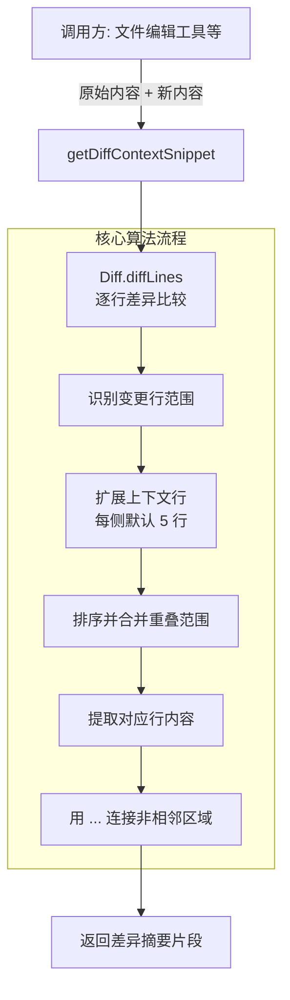

# diff-utils.ts

## 概述

`diff-utils.ts` 是 Gemini CLI 核心工具包中的**差异对比工具函数库**。它提供了一个核心函数 `getDiffContextSnippet`，用于对比两段文本的差异，并生成包含上下文行数的差异摘要片段。该函数的主要应用场景是在文件编辑工具返回结果时，向 LLM 或用户展示修改前后的变化区域（而不是完整的文件内容），从而节省上下文窗口空间并提高可读性。

文件路径：`packages/core/src/tools/diff-utils.ts`

## 架构图（Mermaid）



## 核心组件

### `getDiffContextSnippet` 函数

```typescript
export function getDiffContextSnippet(
  originalContent: string,
  newContent: string,
  contextLines = 5,
): string
```

#### 参数

| 参数 | 类型 | 默认值 | 说明 |
|------|------|--------|------|
| `originalContent` | `string` | - | 原始文本内容（修改前） |
| `newContent` | `string` | - | 新文本内容（修改后） |
| `contextLines` | `number` | `5` | 变更区域每侧显示的上下文行数 |

#### 返回值

`string` -- 包含变更区域及其上下文的差异摘要片段。非相邻变更区域之间用 `...` 分隔。

#### 算法流程详解

**第一步：边界检查**

```typescript
if (!originalContent) {
  return newContent;
}
```
如果原始内容为空（空字符串、`null`、`undefined`），说明这是新创建的文件，直接返回完整的新内容。

**第二步：逐行差异比较**

```typescript
const changes = Diff.diffLines(originalContent, newContent);
```
使用 `diff` 库的 `diffLines` 方法对两段文本进行逐行比较，得到变更列表。每个变更对象包含：
- `added`: 是否为新增行
- `removed`: 是否为删除行
- `count`: 涉及的行数
- 两者都为 false 则是未变更行

**第三步：收集变更行范围**

遍历变更列表，维护 `newLineIdx`（新内容中的行索引计数器），收集所有变更区域在新内容中的行范围（`start` 到 `end`）：
- **新增行**（`added`）：范围为 `[newLineIdx, newLineIdx + count)`，然后推进索引
- **删除行**（`removed`）：范围为 `[newLineIdx, newLineIdx)`（空范围，但标记了删除发生的位置），不推进索引
- **未变更行**：仅推进索引

如果没有任何变更范围（两段文本完全相同），直接返回完整的新内容。

**第四步：扩展上下文范围**

```typescript
const expandedRanges = ranges.map((r) => ({
  start: Math.max(0, r.start - contextLines),
  end: Math.min(newLines.length, r.end + contextLines),
}));
```
将每个变更范围向两侧扩展 `contextLines` 行（默认 5 行），并确保不越界（`start >= 0`，`end <= newLines.length`）。

**第五步：排序并合并重叠范围**

```typescript
expandedRanges.sort((a, b) => a.start - b.start);
```
先按起始行排序，然后遍历合并重叠或相邻的范围。合并逻辑：如果下一个范围的 `start` 不超过当前范围的 `end`，则将它们合并为一个范围（取两者 `end` 的最大值）。

**第六步：生成输出**

遍历合并后的范围，提取对应行内容。如果当前范围的起始位置与上一个范围的结束位置之间有间隔，插入 `...` 省略号。最后，如果最后一个范围未覆盖到文件末尾，也追加 `...`。

#### 输出示例

假设一个 20 行的文件，第 10 行被修改，`contextLines = 2`，输出格式为：

```
...
第 8 行内容
第 9 行内容
第 10 行新内容
第 11 行内容
第 12 行内容
...
```

如果有多处不相邻的修改：

```
...
修改区域 1 及上下文
...
修改区域 2 及上下文
...
```

## 依赖关系

### 内部依赖

无。此文件不依赖项目内任何其他模块。

### 外部依赖

| 包名 | 导入内容 | 用途 |
|------|----------|------|
| `diff` | `* as Diff` | JavaScript 文本差异比较库。本文件使用其 `diffLines` 方法进行逐行文本比较。这是 npm 上广泛使用的 diff 库（[kddnewton/diff](https://github.com/kddnewton/diff) 或 [jsdiff](https://github.com/kpdecker/jsdiff)）。 |

## 关键实现细节

1. **基于新内容的行索引**：整个算法以新内容（`newContent`）为参照系。变更范围记录的是新内容中的行号。这意味着最终输出的摘要展示的是修改后的文件内容（包含上下文），而非传统的 `+/-` 格式 diff。

2. **删除行的处理**：删除行在新内容中没有对应行，因此其范围是一个空范围 `{ start: newLineIdx, end: newLineIdx }`。虽然范围本身为空，但经过上下文扩展后，仍然会包含删除位置周围的上下文行，使用户能够定位到删除发生的位置。

3. **范围合并优化**：如果两处修改很近（间距小于 `2 * contextLines`），它们的上下文范围会重叠，合并后作为一个连续区域输出。这避免了在相邻修改之间出现不必要的 `...` 分隔符。

4. **`...` 省略符号**：使用三个点 `...` 作为省略标记，出现在摘要的开头（如果第一个变更不在文件头部）、中间（不相邻的变更区域之间）和结尾（如果最后一个变更不在文件末尾）。

5. **空原始内容的快速路径**：当 `originalContent` 为假值时直接返回完整新内容，这处理了新文件创建的场景，因为新文件没有"原始版本"可以对比。

6. **无变更的处理**：如果 `diffLines` 认为两段内容完全相同（`ranges.length === 0`），则返回完整的新内容。这是一种安全回退，确保即使在极端情况下也能返回有意义的输出。

7. **`change.count` 的空值保护**：使用 `change.count ?? 0` 处理 `count` 可能为 `undefined` 的情况，这是对 `diff` 库类型定义的防御性编程。
