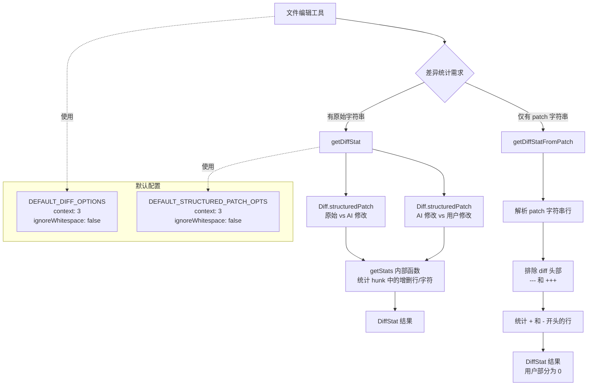

# diffOptions.ts

## 概述

`diffOptions.ts` 是 Gemini CLI 核心工具包中的**差异统计与配置模块**。它提供了差异比较的默认选项配置，以及两个用于计算差异统计信息（`DiffStat`）的函数。该模块的核心功能是量化文件修改的规模（新增/删除的行数和字符数），同时区分模型（AI）提出的修改和用户手动修改的部分，为工具系统提供精确的修改指标数据。

该文件导出了以下内容：
- `DEFAULT_DIFF_OPTIONS`：差异比较的默认配置选项
- `getDiffStat` 函数：基于原始字符串计算三方差异统计
- `getDiffStatFromPatch` 函数：从已有的 unified diff 补丁字符串中提取差异统计

文件路径：`packages/core/src/tools/diffOptions.ts`

## 架构图（Mermaid）



## 核心组件

### 1. `DEFAULT_STRUCTURED_PATCH_OPTS`（内部常量）

```typescript
const DEFAULT_STRUCTURED_PATCH_OPTS: Diff.StructuredPatchOptionsNonabortable = {
  context: 3,
  ignoreWhitespace: false,
};
```

| 属性 | 值 | 说明 |
|------|-----|------|
| `context` | `3` | 在 diff hunk 中，变更行两侧显示 3 行上下文 |
| `ignoreWhitespace` | `false` | 不忽略空白字符差异，空白变化也会被统计 |

此常量为模块内部使用（未导出），仅被 `getDiffStat` 函数调用。

### 2. `DEFAULT_DIFF_OPTIONS`（导出常量）

```typescript
export const DEFAULT_DIFF_OPTIONS: Diff.CreatePatchOptionsNonabortable = {
  context: 3,
  ignoreWhitespace: false,
};
```

| 属性 | 值 | 说明 |
|------|-----|------|
| `context` | `3` | diff 输出中变更行两侧的上下文行数 |
| `ignoreWhitespace` | `false` | 不忽略空白字符差异 |

此常量被导出，供其他模块在创建 unified diff patch 字符串时使用（与 `Diff.createPatch` 配合）。

### 3. `getDiffStat` 函数

```typescript
export function getDiffStat(
  fileName: string,
  oldStr: string,
  aiStr: string,
  userStr: string,
): DiffStat
```

#### 参数

| 参数 | 类型 | 说明 |
|------|------|------|
| `fileName` | `string` | 文件名，用于生成 patch 的头部信息 |
| `oldStr` | `string` | 原始文件内容（修改前的版本） |
| `aiStr` | `string` | AI 模型提出的修改版本 |
| `userStr` | `string` | 用户最终确认/修改后的版本 |

#### 返回值

`DiffStat` -- 包含模型修改和用户修改的详细统计数据。

#### 内部逻辑

此函数执行两次差异比较，构成一个**三方 diff**：

1. **模型 diff**（`oldStr` vs `aiStr`）：比较原始内容与 AI 模型提出的修改，标头为 `Current` vs `Proposed`。统计 AI 模型新增/删除的行数和字符数。

2. **用户 diff**（`aiStr` vs `userStr`）：比较 AI 修改版本与用户最终版本，标头为 `Proposed` vs `User`。统计用户在 AI 修改基础上进一步修改的行数和字符数。

**内部 `getStats` 函数**：

```typescript
const getStats = (patch: Diff.StructuredPatch) => { ... }
```

遍历结构化 patch 的所有 hunk 和行，统计：
- 以 `+` 开头的行 -> `addedLines++`，`addedChars += line.length - 1`（减 1 是去掉行首的 `+` 符号）
- 以 `-` 开头的行 -> `removedLines++`，`removedChars += line.length - 1`（减 1 是去掉行首的 `-` 符号）

### 4. `getDiffStatFromPatch` 函数

```typescript
export function getDiffStatFromPatch(patch: string): DiffStat
```

#### 参数

| 参数 | 类型 | 说明 |
|------|------|------|
| `patch` | `string` | unified diff 格式的补丁字符串 |

#### 返回值

`DiffStat` -- 统计结果。用户部分（`user_*`）全部为 0，因为此函数仅处理单一 patch。

#### 内部逻辑

直接解析 unified diff 格式的字符串，逐行分析：
- 以 `+` 开头**但不以** `+++` 开头的行 -> 新增行（排除 diff 头部 `+++ b/filename`）
- 以 `-` 开头**但不以** `---` 开头的行 -> 删除行（排除 diff 头部 `--- a/filename`）

此函数专为以下场景设计：当操作被拒绝或出错时，原始字符串可能已不可用，但 patch 字符串仍然存在，此时可以从 patch 中重建统计信息。

## 依赖关系

### 内部依赖

| 模块路径 | 导入内容 | 用途 |
|----------|----------|------|
| `./tools.js` | `DiffStat`（类型） | 差异统计结果的类型定义，包含 model 和 user 两组增删行数/字符数 |

### 外部依赖

| 包名 | 导入内容 | 用途 |
|------|----------|------|
| `diff` | `* as Diff` | JavaScript 文本差异比较库。本文件使用 `structuredPatch` 方法生成结构化的 diff 数据。类型 `StructuredPatchOptionsNonabortable`、`CreatePatchOptionsNonabortable`、`StructuredPatch`、`StructuredPatchHunk` 也来自此库。 |

## 关键实现细节

1. **三方 diff 设计**：`getDiffStat` 的核心设计理念是区分"AI 做了什么修改"和"用户在 AI 基础上又改了什么"。这一设计支持了 Gemini CLI 的交互式编辑流程：AI 提出修改 -> 用户审阅并可能调整 -> 系统记录两方各自的贡献。

2. **字符数统计的 `-1` 处理**：在统计 `addedChars` 和 `removedChars` 时，对每行长度减 1，这是因为 diff 格式中每行开头有一个 `+` 或 `-` 标记字符，不属于实际文件内容。

3. **两种统计入口**：
   - `getDiffStat`：适用于正常流程，三段原始字符串都可用
   - `getDiffStatFromPatch`：适用于异常/回退场景，仅有 patch 字符串可用。此时用户修改部分全部置零，因为无法从单一 patch 中推断用户的二次修改。

4. **Diff 头部过滤**：`getDiffStatFromPatch` 特别处理了 `---` 和 `+++` 开头的 diff 头部行，确保它们不被错误地计入增删统计。这是解析 unified diff 格式时的常见陷阱。

5. **上下文行数为 3**：默认上下文行数 `context: 3` 是 unified diff 的行业标准（与 `git diff` 的默认值一致）。这提供了足够的上下文来理解变更，同时保持 patch 的紧凑性。

6. **不忽略空白**：`ignoreWhitespace: false` 意味着缩进变化、行尾空格等空白差异也会被记录在统计中。这是一个保守的选择，确保所有文本变化都被追踪，适合代码编辑场景（因为缩进在代码中通常有语义意义）。

7. **`Nonabortable` 类型变体**：选项类型使用 `*Nonabortable` 后缀版本（如 `StructuredPatchOptionsNonabortable`），表明这些 diff 操作不支持中途取消。这是 `diff` 库提供的两种操作模式之一（另一种是可取消的 `Abortable` 版本）。

8. **`DiffStat` 数据结构**：返回的统计对象包含 8 个字段，分为两组：
   - `model_*` 前缀：AI 模型的修改统计
   - `user_*` 前缀：用户的修改统计
   - 每组各 4 个指标：`added_lines`、`removed_lines`、`added_chars`、`removed_chars`
