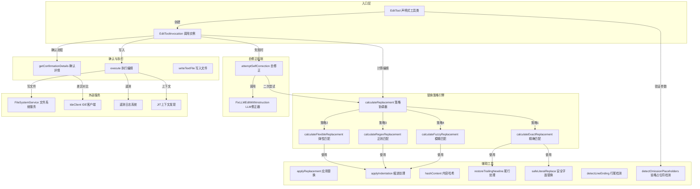

# edit.ts

## 概述

`edit.ts` 是 Gemini CLI 核心工具集中的 **文件编辑工具**，位于 `packages/core/src/tools/edit.ts`。它实现了一套完整的文本替换引擎，允许 LLM（大语言模型）通过指定"旧文本"和"新文本"来精确修改文件内容。该工具是 Gemini CLI 中最复杂、最关键的工具之一，支持四种渐进式匹配策略（精确匹配、弹性匹配、正则匹配、模糊匹配），并具备 LLM 自修正能力，确保编辑操作的高成功率。

该工具同时支持：
- 创建新文件（`old_string` 为空时）
- 修改已有文件（替换指定内容）
- 单次/多次替换（通过 `allow_multiple` 参数控制）
- 计划模式（Plan Mode）下的安全编辑
- IDE 集成的差异对比确认
- 用户手动修改编辑内容后的追踪

## 架构图（Mermaid）



## 核心组件

### 1. EditTool 类（声明式工具类）

```typescript
export class EditTool
  extends BaseDeclarativeTool<EditToolParams, ToolResult>
  implements ModifiableDeclarativeTool<EditToolParams>
```

**职责**：
- 作为编辑工具的声明式外壳，注册工具名称、描述、参数模式
- 实现 `ModifiableDeclarativeTool` 接口，支持用户手动修改编辑内容
- 参数验证（`validateToolParamValues`）：检查 `file_path` 非空、路径访问权限、`new_string` 中是否含有省略占位符
- 提供 `getModifyContext()` 方法，允许调度器获取当前内容、提议内容并创建更新参数

**关键属性**：
- `Name`：静态属性，值为 `EDIT_TOOL_NAME`
- `Kind.Edit`：工具类型标记

### 2. EditToolInvocation 类（工具调用实例）

```typescript
class EditToolInvocation
  extends BaseToolInvocation<EditToolParams, ToolResult>
  implements ToolInvocation<EditToolParams, ToolResult>
```

**职责**：
- 管理单次编辑调用的完整生命周期
- 路径解析：支持绝对路径、相对路径自动校正、计划模式路径映射
- 计算编辑结果（`calculateEdit`）
- 生成确认详情（`getConfirmationDetails`）
- 执行编辑写入（`execute`）
- 自修正机制（`attemptSelfCorrection`）

**构造函数路径解析逻辑**：
1. 计划模式：将文件写入 `plansDir` 下
2. 相对路径：先尝试 `correctPath` 校正，失败则基于 `targetDir` 解析
3. 绝对路径：直接使用

### 3. EditToolParams 接口

```typescript
export interface EditToolParams {
  file_path: string;       // 要修改的文件路径
  old_string: string;      // 要替换的旧文本
  new_string: string;      // 替换后的新文本
  allow_multiple?: boolean; // 是否允许多次替换（默认 false）
  instruction?: string;    // 编辑指令说明
  modified_by_user?: boolean;   // 是否经用户手动修改
  ai_proposed_content?: string; // AI 最初提议的内容
}
```

### 4. 替换策略引擎

`calculateReplacement` 函数是策略协调器，按优先级依次尝试四种策略：

#### 策略 1：精确匹配（Exact）
```typescript
async function calculateExactReplacement(context): Promise<ReplacementResult | null>
```
- 直接使用 `String.split().length - 1` 计算出现次数
- 使用 `safeLiteralReplace` 进行安全替换（处理 `$` 等特殊字符）
- 如果 `allow_multiple` 为 false 且出现次数 > 1，返回错误结果（不执行替换）

#### 策略 2：弹性匹配（Flexible）
```typescript
async function calculateFlexibleReplacement(context): Promise<ReplacementResult | null>
```
- 按行分割源代码和搜索字符串
- 每行 `trim()` 后进行比较，忽略前导/尾部空白
- 匹配成功后，检测首行缩进并应用到替换文本
- 使用滑动窗口逐行扫描

#### 策略 3：正则匹配（Regex）
```typescript
async function calculateRegexReplacement(context): Promise<ReplacementResult | null>
```
- 将搜索字符串按分隔符（`():[]{}<>=`）分割
- 对每个 token 进行正则转义
- 用 `\s*` 连接所有 token，构建弹性正则表达式
- 支持多行模式（`m` 标志），捕获行首缩进

#### 策略 4：模糊匹配（Fuzzy）
```typescript
async function calculateFuzzyReplacement(config, context): Promise<ReplacementResult | null>
```
- 使用 Levenshtein 编辑距离算法
- 阈值：`FUZZY_MATCH_THRESHOLD = 0.1`（允许最多 10% 的加权差异）
- 空白差异惩罚因子：`WHITESPACE_PENALTY_FACTOR = 0.1`（空白差异成本仅为字符差异的 10%）
- 最短搜索字符串要求：至少 10 字符
- 性能保护：`sourceLines.length * old_string.length^2 <= 4e8`
- 分层评分：先计算原始距离 `d_raw`，再计算去空白距离 `d_norm`，加权组合
- 贪心选择非重叠最佳匹配
- 从下往上替换以保持索引有效性

### 5. 自修正机制（Self-Correction）

```typescript
private async attemptSelfCorrection(params, currentContent, initialError, abortSignal, originalLineEnding): Promise<CalculatedEdit>
```

当所有策略均无法匹配时的智能恢复机制：
1. 使用 SHA256 哈希检测文件是否在编辑期间被外部修改
2. 调用 `FixLLMEditWithInstruction` 将编辑参数发送给 LLM 进行修正
3. LLM 可能判定"无需更改"（`noChangesRequired`）
4. 使用修正后的参数再次尝试 `calculateReplacement`
5. 通过遥测系统记录修正成功/失败事件

### 6. 辅助函数

| 函数名 | 功能 |
|--------|------|
| `applyReplacement` | 应用简单替换逻辑，处理新文件和已有文件两种情况 |
| `hashContent` | 生成内容的 SHA256 哈希，用于变更检测 |
| `restoreTrailingNewline` | 保持原始文件的尾行换行符状态 |
| `escapeRegex` | 转义正则表达式特殊字符 |
| `applyIndentation` | 保持相对缩进的同时应用目标缩进 |
| `stripWhitespace` | 去除所有空白字符（用于模糊匹配评分） |
| `getErrorReplaceResult` | 根据替换结果生成错误信息 |
| `getFuzzyMatchFeedback` | 生成模糊匹配的反馈信息（含行号范围） |
| `isEditToolParams` | 类型守卫函数，验证参数结构 |

## 依赖关系

### 内部依赖

| 模块路径 | 导入内容 | 用途 |
|----------|----------|------|
| `./tools.js` | `BaseDeclarativeTool`, `BaseToolInvocation`, `Kind`, 多个类型 | 工具基类和类型定义 |
| `../policy/utils.js` | `buildFilePathArgsPattern` | 构建策略更新的文件路径模式 |
| `../confirmation-bus/message-bus.js` | `MessageBus` | 消息总线（确认交互） |
| `./tool-error.js` | `ToolErrorType` | 错误类型枚举 |
| `../utils/paths.js` | `makeRelative`, `shortenPath` | 路径格式化工具 |
| `../utils/errors.js` | `isNodeError` | Node 错误类型判断 |
| `../utils/pathCorrector.js` | `correctPath` | 路径自动校正 |
| `../config/config.js` | `Config` | 全局配置类型 |
| `../scheduler/types.js` | `CoreToolCallStatus` | 调度器状态类型 |
| `./diffOptions.js` | `DEFAULT_DIFF_OPTIONS`, `getDiffStat` | 差异显示选项和统计 |
| `./diff-utils.js` | `getDiffContextSnippet` | 获取差异上下文片段 |
| `./modifiable-tool.js` | `ModifiableDeclarativeTool`, `ModifyContext` | 可修改工具接口 |
| `../ide/ide-client.js` | `IdeClient` | IDE 集成客户端 |
| `../utils/llm-edit-fixer.js` | `FixLLMEditWithInstruction` | LLM 编辑修正器 |
| `../utils/textUtils.js` | `safeLiteralReplace`, `detectLineEnding` | 文本安全替换和行尾检测 |
| `../telemetry/types.js` | `EditStrategyEvent`, `EditCorrectionEvent` | 遥测事件类型 |
| `../telemetry/loggers.js` | `logEditStrategy`, `logEditCorrectionEvent` | 遥测日志记录 |
| `./tool-names.js` | `EDIT_TOOL_NAME`, `READ_FILE_TOOL_NAME`, `EDIT_DISPLAY_NAME` | 工具名称常量 |
| `../utils/debugLogger.js` | `debugLogger` | 调试日志器 |
| `./definitions/coreTools.js` | `EDIT_DEFINITION` | 编辑工具定义 |
| `./definitions/resolver.js` | `resolveToolDeclaration` | 工具声明解析器 |
| `./omissionPlaceholderDetector.js` | `detectOmissionPlaceholders` | 省略占位符检测 |
| `./jit-context.js` | `discoverJitContext`, `appendJitContext` | JIT 上下文发现与附加 |

### 外部依赖

| 包名 | 用途 |
|------|------|
| `node:fs/promises` | 文件系统异步操作（目录创建、存在性检查） |
| `node:path` | 路径解析与处理 |
| `node:os` | 获取操作系统行尾符 (`os.EOL`) |
| `node:crypto` | SHA256 哈希计算 |
| `diff` | 生成 unified diff 补丁（`Diff.createPatch`） |
| `fast-levenshtein` | 计算编辑距离（模糊匹配核心算法） |

## 关键实现细节

### 1. 四级渐进式匹配策略

替换引擎按精确度从高到低依次尝试四种策略。这种设计确保了：
- **优先使用最精确的匹配**（避免误替换）
- **逐步放宽约束**，提高编辑成功率
- 每种策略都记录遥测事件，用于分析策略使用分布

策略选择流程：
```
精确匹配 -> 弹性匹配(忽略缩进) -> 正则匹配(Token化) -> 模糊匹配(Levenshtein)
```

### 2. 模糊匹配的性能保护

模糊匹配使用 Levenshtein 编辑距离，计算复杂度为 O(L^2)。为防止大文件导致性能问题：
- 设置复杂度上限：`sourceLines.length * old_string.length^2 <= 4e8`
- 搜索字符串最短 10 字符
- 使用长度启发式优化：先比较窗口长度差异，快速跳过不可能匹配的窗口

### 3. 行尾符保持机制

该工具在整个编辑流程中保持原始文件的行尾符风格：
1. 读取时检测原始行尾符（CRLF 或 LF）
2. 内部统一转换为 LF 进行处理
3. 写入时根据原始行尾符或操作系统默认值恢复
4. `restoreTrailingNewline` 确保文件尾部换行符状态一致

### 4. LLM 自修正机制

当所有匹配策略失败时：
1. 通过 SHA256 哈希检测文件是否被外部修改（避免覆盖他人更改）
2. 将编辑指令、旧/新字符串、错误信息和文件内容发送给 LLM
3. LLM 返回修正后的 search/replace 参数
4. 使用修正参数再次运行完整的匹配策略链
5. 可通过 `config.getDisableLLMCorrection()` 禁用此机制

### 5. 省略占位符检测

在参数验证阶段，工具会检测 `new_string` 中是否包含省略占位符（如 `"rest of methods ..."`）。如果 `new_string` 中存在而 `old_string` 中不存在的占位符，则拒绝执行编辑，防止 LLM 偷懒省略代码。

### 6. 计划模式支持

当 `config.isPlanMode()` 为 true 时，编辑不会修改实际文件，而是将内容写入 `plansDir` 目录下的同名文件。这允许用户在不影响实际代码的情况下审查 LLM 的编辑计划。

### 7. IDE 差异对比集成

在确认流程中（`getConfirmationDetails`），如果检测到 IDE 模式且差异功能已启用：
- 调用 `IdeClient.openDiff()` 在 IDE 中打开差异视图
- 用户可在 IDE 中直接修改提议内容
- 修改后的内容通过 `onConfirm` 回调更新参数

### 8. JIT 上下文附加

编辑成功后，工具会通过 `discoverJitContext` 查找编辑文件路径下的子目录上下文信息，并将其附加到返回给 LLM 的消息中。这为后续的 LLM 交互提供了额外的项目结构信息。

### 9. 缩进智能保持

`applyIndentation` 函数在弹性/正则/模糊匹配中被使用：
- 以匹配块首行的缩进作为参考
- 计算替换文本各行相对于首行的缩进偏移
- 将目标缩进 + 相对偏移应用到每行
- 空行保持为空（不添加缩进）

### 10. 导出 API

| 导出名 | 类型 | 用途 |
|--------|------|------|
| `applyReplacement` | 函数 | 应用简单文本替换 |
| `calculateReplacement` | 函数 | 执行完整的多策略替换计算 |
| `getErrorReplaceResult` | 函数 | 生成替换错误结果 |
| `EditToolParams` | 接口 | 编辑工具参数类型 |
| `isEditToolParams` | 函数 | 参数类型守卫 |
| `EditTool` | 类 | 编辑工具主类 |
