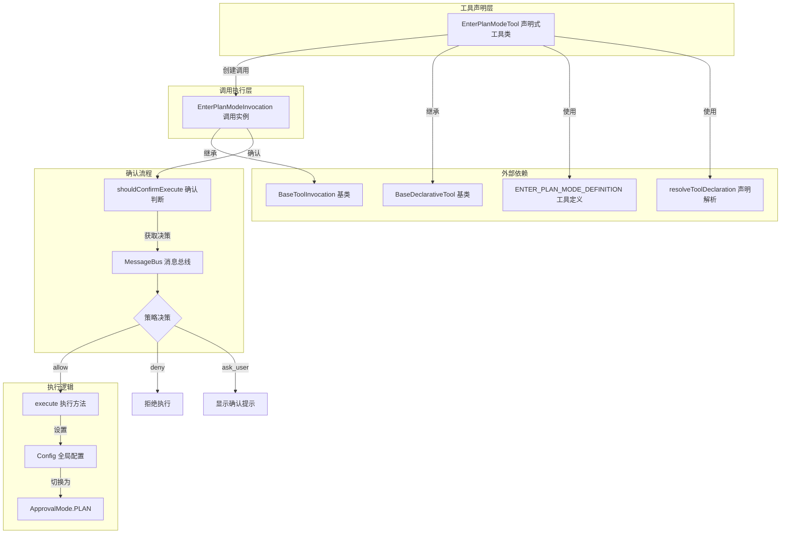

# enter-plan-mode.ts

## 概述

`enter-plan-mode.ts` 是 Gemini CLI 核心工具集中的 **进入计划模式工具**，位于 `packages/core/src/tools/enter-plan-mode.ts`。该工具允许 LLM 代理主动将自身切换到"计划模式"（Plan Mode），在此模式下代理被限制为只使用只读工具，不会对文件系统进行任何实际修改。这是一种安全机制，用于在执行高风险操作前让代理先规划方案、收集信息，确保用户可以审查计划后再决定是否执行。

该工具的核心特点：
- 轻量级工具，逻辑简洁
- 支持用户确认流程（可取消）
- 通过修改全局配置中的 `ApprovalMode` 来切换模式
- 支持可选的 `reason` 参数说明进入计划模式的原因

## 架构图（Mermaid）



## 核心组件

### 1. EnterPlanModeParams 接口

```typescript
export interface EnterPlanModeParams {
  reason?: string;
}
```

工具参数接口，仅包含一个可选字段：
- `reason`：说明进入计划模式的原因，会在返回显示和描述中使用

### 2. EnterPlanModeTool 类（声明式工具类）

```typescript
export class EnterPlanModeTool extends BaseDeclarativeTool<
  EnterPlanModeParams,
  ToolResult
>
```

**职责**：
- 注册工具名称为 `ENTER_PLAN_MODE_TOOL_NAME`
- 工具类型为 `Kind.Plan`
- 描述和参数模式来自 `ENTER_PLAN_MODE_DEFINITION`
- 通过 `createInvocation` 工厂方法创建调用实例
- 通过 `getSchema` 支持按模型 ID 解析工具声明

**构造函数参数**：
| 参数 | 类型 | 说明 |
|------|------|------|
| `config` | `Config` | 全局配置对象，用于传递给调用实例 |
| `messageBus` | `MessageBus` | 消息总线，用于确认交互 |

### 3. EnterPlanModeInvocation 类（调用实例）

```typescript
export class EnterPlanModeInvocation extends BaseToolInvocation<
  EnterPlanModeParams,
  ToolResult
>
```

**职责**：
- 管理单次"进入计划模式"操作的完整生命周期
- 实现确认流程和执行逻辑

**关键属性**：
- `confirmationOutcome`：记录用户在确认对话框中的选择结果（确认/取消）

#### 3.1 `getDescription()` 方法

返回工具描述，优先使用 `params.reason`，若未提供则默认返回 `'Initiating Plan Mode'`。

#### 3.2 `shouldConfirmExecute()` 方法

```typescript
override async shouldConfirmExecute(abortSignal: AbortSignal): Promise<ToolInfoConfirmationDetails | false>
```

确认执行的三级决策流程：

1. **`allow`**：策略直接允许，返回 `false`（无需确认）
2. **`deny`**：策略拒绝，抛出错误终止执行
3. **`ask_user`**：需要用户确认，返回 `ToolInfoConfirmationDetails` 对象：
   - `type`: `'info'`
   - `title`: `'Enter Plan Mode'`
   - `prompt`: 提示用户此操作将限制代理为只读工具
   - `onConfirm`: 回调函数，记录用户的确认/取消决定

#### 3.3 `execute()` 方法

```typescript
async execute(_signal: AbortSignal): Promise<ToolResult>
```

执行逻辑：

1. 如果用户取消了确认（`ToolConfirmationOutcome.Cancel`），返回取消消息
2. 否则调用 `config.setApprovalMode(ApprovalMode.PLAN)` 将全局审批模式设为计划模式
3. 返回成功消息：
   - `llmContent`：`'Switching to Plan mode.'`（发送给 LLM）
   - `returnDisplay`：包含原因的显示文本（展示给用户）

## 依赖关系

### 内部依赖

| 模块路径 | 导入内容 | 用途 |
|----------|----------|------|
| `./tools.js` | `BaseDeclarativeTool`, `BaseToolInvocation`, `ToolResult`, `Kind`, `ToolInfoConfirmationDetails`, `ToolConfirmationOutcome` | 工具基类、结果类型、确认类型 |
| `../confirmation-bus/message-bus.js` | `MessageBus` | 消息总线，用于策略决策和用户交互 |
| `../config/config.js` | `Config` | 全局配置对象 |
| `./tool-names.js` | `ENTER_PLAN_MODE_TOOL_NAME` | 工具名称常量 |
| `../policy/types.js` | `ApprovalMode` | 审批模式枚举，其中 `ApprovalMode.PLAN` 表示计划模式 |
| `./definitions/coreTools.js` | `ENTER_PLAN_MODE_DEFINITION` | 工具定义（描述、参数模式等） |
| `./definitions/resolver.js` | `resolveToolDeclaration` | 按模型解析工具声明 |

### 外部依赖

无外部第三方依赖。该工具仅使用内部模块。

## 关键实现细节

### 1. 计划模式的本质

计划模式通过 `config.setApprovalMode(ApprovalMode.PLAN)` 实现。设置后：
- 代理被限制为只能使用只读工具（如文件读取、搜索等）
- 编辑工具（如 `edit`）在计划模式下会将修改写入 `plansDir` 而非实际文件
- 其他写入类工具将被阻止执行

### 2. 三级策略决策机制

`shouldConfirmExecute` 方法通过 `getMessageBusDecision` 从消息总线获取策略决策：
- **`allow`**：自动执行，通常在用户已配置为自动批准计划模式切换时生效
- **`deny`**：直接拒绝，通常在安全策略禁止模式切换时生效
- **`ask_user`**：交互式确认，向用户展示提示信息并等待响应

### 3. 确认结果的延迟使用

`shouldConfirmExecute` 中通过 `onConfirm` 回调将用户决策保存到 `confirmationOutcome` 实例变量。这个值在后续的 `execute` 方法中被读取，决定是否真正执行模式切换。这种设计将确认逻辑和执行逻辑解耦。

### 4. 策略更新的集中处理

代码注释表明"Policy updates are now handled centrally by the scheduler"，即策略更新不再由工具自身处理，而是由调度器统一管理。这是一个架构优化，避免了各工具各自维护策略状态的复杂性。

### 5. 与 ExitPlanMode 的对称设计

`EnterPlanModeTool` 与 `ExitPlanModeTool` 形成对称的配对设计：
- 进入计划模式：`ApprovalMode.PLAN`
- 退出计划模式：恢复到之前的审批模式
- 两者共享相似的确认流程和执行结构
