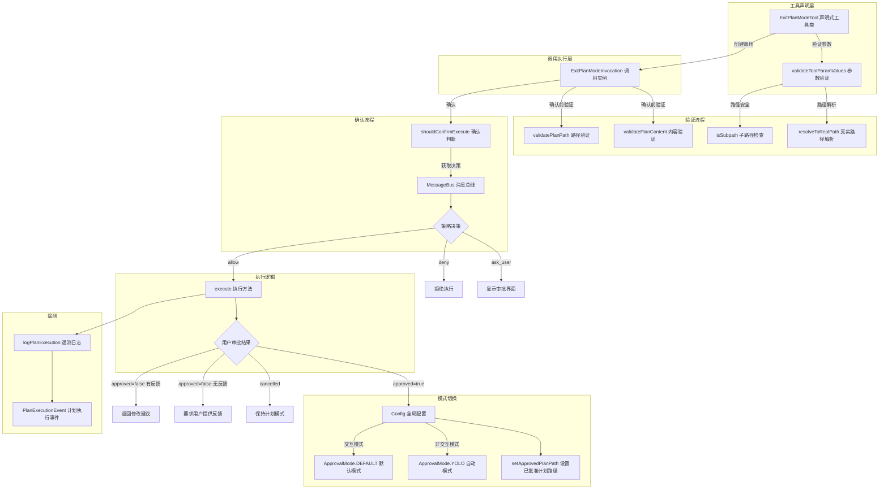

# exit-plan-mode.ts

## 概述

`exit-plan-mode.ts` 是 Gemini CLI 核心工具集中的 **退出计划模式工具**，位于 `packages/core/src/tools/exit-plan-mode.ts`。它与 `enter-plan-mode.ts` 形成配对，负责将代理从计划模式（Plan Mode）切换回正常执行模式。但与进入计划模式不同，退出计划模式涉及更复杂的逻辑：需要验证计划文件的有效性、支持用户审批/拒绝/反馈流程，并根据审批结果选择不同的执行模式。

该工具的核心特点：
- 必须提供 `plan_filename` 参数，指定计划文件
- 执行前验证计划文件路径安全性（防止路径遍历攻击）和内容有效性
- 支持三种审批结果：批准（切换到正常模式）、拒绝（含反馈）、取消
- 批准后可选择不同的 `ApprovalMode`（默认模式或 YOLO 模式）
- 记录计划执行遥测事件

## 架构图（Mermaid）



## 核心组件

### 1. ExitPlanModeParams 接口

```typescript
export interface ExitPlanModeParams {
  plan_filename: string;
}
```

工具参数接口，包含一个必选字段：
- `plan_filename`：计划文件的文件名（不是完整路径，仅文件名部分）

### 2. ExitPlanModeTool 类（声明式工具类）

```typescript
export class ExitPlanModeTool extends BaseDeclarativeTool<
  ExitPlanModeParams,
  ToolResult
>
```

**职责**：
- 注册工具名称为 `EXIT_PLAN_MODE_TOOL_NAME`
- 工具类型为 `Kind.Plan`
- 参数验证：确保路径安全性
- 创建调用实例
- 按模型解析工具声明

#### `validateToolParamValues` 方法

```typescript
protected override validateToolParamValues(params: ExitPlanModeParams): string | null
```

验证逻辑：
1. 检查 `plan_filename` 非空
2. 使用 `path.basename()` 提取安全文件名（防止路径遍历）
3. 解析 `plansDir` 的真实路径
4. 拼接并解析计划文件的真实路径
5. 使用 `isSubpath()` 确保计划文件在指定的计划目录内

### 3. ExitPlanModeInvocation 类（调用实例）

```typescript
export class ExitPlanModeInvocation extends BaseToolInvocation<
  ExitPlanModeParams,
  ToolResult
>
```

**关键属性**：
| 属性 | 类型 | 说明 |
|------|------|------|
| `confirmationOutcome` | `ToolConfirmationOutcome \| null` | 用户确认结果 |
| `approvalPayload` | `ToolExitPlanModeConfirmationPayload \| null` | 审批负载（含批准状态、模式、反馈） |
| `planValidationError` | `string \| null` | 计划验证错误信息 |

#### 3.1 `shouldConfirmExecute()` 方法

```typescript
override async shouldConfirmExecute(abortSignal: AbortSignal): Promise<ToolExitPlanModeConfirmationDetails | false>
```

该方法执行多步验证和决策：

1. **路径验证**：调用 `validatePlanPath()` 验证计划文件路径
2. **内容验证**：调用 `validatePlanContent()` 验证计划文件内容
3. **策略决策**：
   - `deny`：抛出错误
   - `allow`：自动设置批准结果，审批模式由 `getAllowApprovalMode()` 决定
   - `ask_user`：返回 `ToolExitPlanModeConfirmationDetails`，含：
     - `type`: `'exit_plan_mode'`
     - `title`: `'Plan Approval'`
     - `planPath`: 已解析的计划文件路径
     - `onConfirm`: 回调，接收 `outcome` 和可选 `payload`

#### 3.2 `execute()` 方法

```typescript
async execute(_signal: AbortSignal): Promise<ToolResult>
```

执行逻辑按优先级处理多种情况：

1. **计划验证错误**：返回错误信息，不执行
2. **用户取消**：返回取消消息，保持计划模式
3. **用户批准**（`payload.approved === true`）：
   - 确定新的审批模式（不能是 `PLAN`，否则抛出异常）
   - 调用 `config.setApprovalMode(newMode)` 切换模式
   - 调用 `config.setApprovedPlanPath()` 记录已批准的计划路径
   - 记录遥测事件
   - 返回退出消息和计划路径，指示 LLM 按计划执行
4. **用户拒绝**（`payload.approved === false`）：
   - **有反馈**：返回反馈内容，指示 LLM 修改计划
   - **无反馈**：要求 LLM 向用户询问具体反馈

#### 3.3 `getAllowApprovalMode()` 私有方法

```typescript
private getAllowApprovalMode(): ApprovalMode
```

根据运行环境确定退出计划模式后的审批模式：
- **非交互模式**（如 CI/CD）：返回 `ApprovalMode.YOLO`，允许自动执行
- **交互模式**：返回 `ApprovalMode.DEFAULT`，需要正常的用户确认

#### 3.4 `getResolvedPlanPath()` 私有方法

使用 `path.basename()` 安全提取文件名，再与 `plansDir` 拼接，防止路径遍历。

## 依赖关系

### 内部依赖

| 模块路径 | 导入内容 | 用途 |
|----------|----------|------|
| `./tools.js` | `BaseDeclarativeTool`, `BaseToolInvocation`, `Kind`, `ToolConfirmationOutcome`, `ToolConfirmationPayload`, `ToolExitPlanModeConfirmationDetails`, `ToolExitPlanModeConfirmationPayload`, `ToolResult` | 工具基类和类型定义 |
| `../confirmation-bus/message-bus.js` | `MessageBus` | 消息总线 |
| `../config/config.js` | `Config` | 全局配置 |
| `./tool-names.js` | `EXIT_PLAN_MODE_TOOL_NAME` | 工具名称常量 |
| `../utils/planUtils.js` | `validatePlanPath`, `validatePlanContent` | 计划文件路径和内容验证 |
| `../policy/types.js` | `ApprovalMode` | 审批模式枚举 |
| `../utils/paths.js` | `resolveToRealPath`, `isSubpath` | 路径解析和子路径检测 |
| `../telemetry/loggers.js` | `logPlanExecution` | 遥测日志记录 |
| `../telemetry/types.js` | `PlanExecutionEvent` | 遥测事件类型 |
| `./definitions/coreTools.js` | `getExitPlanModeDefinition` | 工具定义获取函数 |
| `./definitions/resolver.js` | `resolveToolDeclaration` | 工具声明解析器 |
| `../utils/approvalModeUtils.js` | `getPlanModeExitMessage` | 获取退出计划模式消息 |

### 外部依赖

| 包名 | 用途 |
|------|------|
| `node:path` | 路径操作（`basename`, `join`） |

## 关键实现细节

### 1. 路径安全防护

工具在两个层面进行路径安全检查：
- **参数验证层**（`validateToolParamValues`）：使用 `path.basename()` 去除路径中的目录部分，使用 `resolveToRealPath` 解析符号链接后用 `isSubpath` 确认在 `plansDir` 内
- **确认层**（`shouldConfirmExecute`）：调用 `validatePlanPath` 进行更详细的路径验证

这种双重验证确保即使 LLM 试图传入恶意路径（如 `../../etc/passwd`），也无法突破计划目录的沙箱。

### 2. 审批负载机制

`ToolExitPlanModeConfirmationPayload` 是一个丰富的审批负载结构，包含：
- `approved: boolean`：是否批准计划
- `approvalMode?: ApprovalMode`：批准后切换到哪种执行模式
- `feedback?: string`：拒绝时的用户反馈

这种设计允许用户在一个交互步骤中完成"审批+模式选择"或"拒绝+反馈"的复合操作。

### 3. 非交互环境的特殊处理

`getAllowApprovalMode()` 对非交互环境（如 CI/CD 管道、自动化脚本）做了特殊适配：
- 非交互模式下退出计划模式后直接进入 YOLO 模式，无需用户干预
- 交互模式下退出后进入默认模式，确保后续操作仍有用户确认

### 4. 防止循环模式切换

`execute()` 方法中对新模式做了安全检查：
```typescript
if (newMode === ApprovalMode.PLAN) {
  throw new Error(`Unexpected approval mode: ${newMode}`);
}
```
确保退出计划模式后不会意外重新进入计划模式。

### 5. 计划的生命周期管理

退出计划模式时：
1. 调用 `config.setApprovedPlanPath(resolvedPlanPath)` 记录已批准的计划路径
2. LLM 收到的消息明确指示"Read and follow the plan strictly during implementation"
3. 这使得 LLM 在后续执行中有一个明确的计划参考文件

### 6. 遥测追踪

每次成功退出计划模式时，都会通过 `logPlanExecution` 记录 `PlanExecutionEvent`，包含退出后的审批模式。这有助于分析用户使用计划模式的行为模式和偏好。

### 7. 拒绝与反馈循环

当用户拒绝计划时，工具不会退出计划模式，而是：
- 将用户反馈传递给 LLM
- LLM 继续在计划模式中修改计划
- 修改完成后再次调用此工具请求审批
- 形成"规划-审批-修改-再审批"的迭代循环
