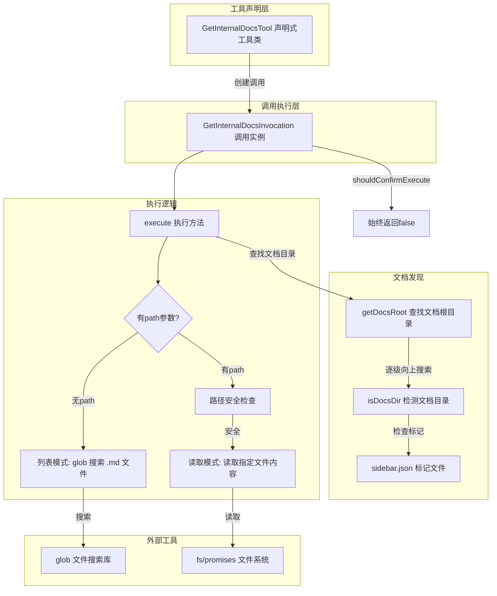

# get-internal-docs.ts

## 概述

`get-internal-docs.ts` 是 Gemini CLI 核心工具集中的 **内部文档访问工具**，位于 `packages/core/src/tools/get-internal-docs.ts`。该工具允许 LLM 代理访问 Gemini CLI 项目自身的内部文档，具备两种操作模式：

1. **列表模式**：不提供 `path` 参数时，返回所有可用文档文件的路径列表
2. **读取模式**：提供 `path` 参数时，返回指定文档文件的完整内容

这是一个只读工具（类型为 `Kind.Think`），无需用户确认即可执行。它使 LLM 能够在交互过程中自主查阅项目文档，获取关于 CLI 命令、配置选项、API 接口等方面的权威信息，从而提供更准确的帮助和代码建议。

## 架构图（Mermaid）



## 核心组件

### 1. GetInternalDocsParams 接口

```typescript
export interface GetInternalDocsParams {
  path?: string;
}
```

工具参数接口，仅包含一个可选字段：
- `path`：文档文件的相对路径（如 `'cli/commands.md'`）。省略时工具返回所有可用文档的路径列表。

### 2. `getDocsRoot()` 辅助函数

```typescript
async function getDocsRoot(): Promise<string>
```

**职责**：查找 Gemini CLI 文档目录的绝对路径。

**查找算法**：
1. 获取当前源文件的路径（通过 `import.meta.url`）
2. 从当前文件所在目录开始，逐级向上遍历
3. 在每一级目录中，检查是否存在 `docs` 子目录
4. 通过 `isDocsDir` 函数验证候选目录：
   - 必须是目录（不是文件）
   - 必须包含 `sidebar.json` 标记文件
5. 找到第一个有效的文档目录即返回
6. 如果遍历到根目录仍未找到，抛出错误

**设计考量**：使用 `sidebar.json` 作为文档目录的"指纹"文件，确保找到的是正确的文档目录而不是任意的 `docs` 文件夹。

### 3. GetInternalDocsInvocation 类（调用实例）

```typescript
class GetInternalDocsInvocation extends BaseToolInvocation<
  GetInternalDocsParams,
  ToolResult
>
```

**注意**：该类未导出（`class` 前无 `export`），仅在模块内部使用。

#### 3.1 `shouldConfirmExecute()` 方法

```typescript
override async shouldConfirmExecute(_abortSignal: AbortSignal): Promise<ToolCallConfirmationDetails | false> {
  return false;
}
```

始终返回 `false`，表示该工具不需要用户确认。作为只读文档访问工具，不存在安全风险。

#### 3.2 `getDescription()` 方法

根据参数返回不同的描述：
- 有 `path`：`'Reading internal documentation: ${path}'`
- 无 `path`：`'Listing all available internal documentation.'`

#### 3.3 `execute()` 方法

```typescript
async execute(_signal: AbortSignal): Promise<ToolResult>
```

执行逻辑：

**列表模式**（无 `path`）：
1. 获取文档根目录
2. 使用 `glob('**/*.md')` 递归搜索所有 Markdown 文件
3. 排序后格式化为列表返回
4. `llmContent` 包含完整文件列表
5. `returnDisplay` 显示找到的文件数量

**读取模式**（有 `path`）：
1. 获取文档根目录
2. 使用 `path.resolve()` 解析完整路径
3. **安全检查**：验证解析后的路径仍在文档根目录内（防止路径遍历）
4. 读取文件内容并返回
5. `llmContent` 包含文件的完整文本内容
6. `returnDisplay` 显示成功消息

**错误处理**：
- 所有错误统一捕获，返回错误信息
- 错误类型标记为 `ToolErrorType.EXECUTION_FAILED`

### 4. GetInternalDocsTool 类（声明式工具类）

```typescript
export class GetInternalDocsTool extends BaseDeclarativeTool<
  GetInternalDocsParams,
  ToolResult
>
```

**职责**：
- 注册工具名称为 `GET_INTERNAL_DOCS_TOOL_NAME`
- 显示名称为 `'GetInternalDocs'`
- 工具类型为 `Kind.Think`（思考类/只读类工具）
- 输出格式为 Markdown（`isOutputMarkdown = true`）
- 不支持输出更新（`canUpdateOutput = false`）

**构造函数特点**：
- 仅需要 `messageBus` 参数，不需要 `Config`（因为不涉及文件修改或项目目录操作）

## 依赖关系

### 内部依赖

| 模块路径 | 导入内容 | 用途 |
|----------|----------|------|
| `./tools.js` | `BaseDeclarativeTool`, `BaseToolInvocation`, `Kind`, `ToolInvocation`, `ToolResult`, `ToolCallConfirmationDetails` | 工具基类和类型定义 |
| `./tool-names.js` | `GET_INTERNAL_DOCS_TOOL_NAME` | 工具名称常量 |
| `../confirmation-bus/message-bus.js` | `MessageBus` | 消息总线 |
| `./tool-error.js` | `ToolErrorType` | 错误类型枚举 |
| `./definitions/coreTools.js` | `GET_INTERNAL_DOCS_DEFINITION` | 工具定义（描述、参数模式） |
| `./definitions/resolver.js` | `resolveToolDeclaration` | 工具声明解析器 |

### 外部依赖

| 包名 | 用途 |
|------|------|
| `node:fs/promises` | 文件系统异步操作（读取文件、检查文件/目录状态） |
| `node:path` | 路径操作（`dirname`, `join`, `resolve`） |
| `node:url` | `fileURLToPath` 将 `import.meta.url` 转换为文件路径 |
| `glob` | 递归搜索匹配 `**/*.md` 模式的文件 |

## 关键实现细节

### 1. 文档目录的动态发现

`getDocsRoot()` 不依赖硬编码路径或配置，而是从当前源文件位置开始向上遍历目录树。这种设计确保了：
- 工具在不同的安装位置（npm 全局、本地开发、打包后）都能正确找到文档
- 不依赖环境变量或配置文件
- 即使项目结构发生变化，只要 `docs/sidebar.json` 标记文件存在即可

### 2. 路径遍历防护

在读取模式中，工具使用经典的路径遍历防护模式：
```typescript
const resolvedPath = path.resolve(docsRoot, this.params.path);
if (!resolvedPath.startsWith(docsRoot)) {
  throw new Error('Access denied: Requested path is outside the documentation directory.');
}
```
这防止了 LLM 通过传入 `../../etc/passwd` 等路径访问文档目录之外的文件。

### 3. 无需确认的设计

该工具覆写了 `shouldConfirmExecute` 方法始终返回 `false`，因为：
- 它是只读工具，不修改任何文件
- 访问范围严格限制在文档目录内
- 属于 `Kind.Think` 类型，是安全的信息获取操作

### 4. 双模式设计

通过一个可选的 `path` 参数巧妙地支持了两种操作模式：
- LLM 可以先不带参数调用获取目录列表，了解有哪些可用文档
- 然后根据列表选择感兴趣的文档路径进行读取
- 这种"浏览-选择"的两步流程对 LLM 非常友好

### 5. POSIX 路径一致性

在 glob 搜索中使用 `{ posix: true }` 选项，确保返回的文件路径使用正斜杠 (`/`)，无论操作系统是什么。这使得：
- LLM 接收到的路径格式一致
- LLM 在后续调用中可以直接使用返回的路径

### 6. `sidebar.json` 标记文件

使用 `sidebar.json` 作为文档目录的标识文件是一个巧妙的设计：
- `sidebar.json` 通常是文档站点（如 Docusaurus）的导航配置文件
- 它的存在既能标识正确的文档目录，又本身就是文档结构的元数据
- 避免了需要额外创建特殊标记文件

### 7. 不依赖 Config 对象

与大多数其他工具不同，`GetInternalDocsTool` 的构造函数不需要 `Config` 对象。这是因为：
- 文档目录的位置通过文件系统遍历动态发现
- 不涉及项目目录、工作区权限等配置相关的概念
- 文档访问是全局性的，不受项目配置影响
