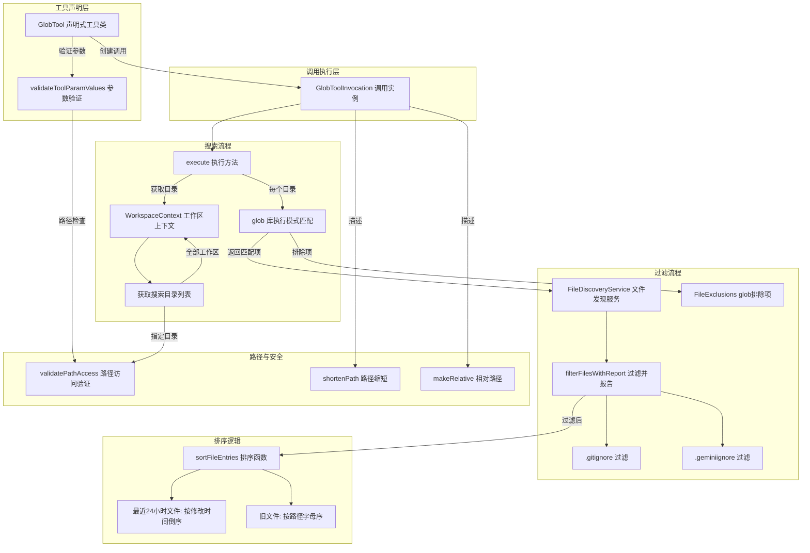

# glob.ts

## 概述

`glob.ts` 是 Gemini CLI 核心工具集中的 **文件搜索工具**，位于 `packages/core/src/tools/glob.ts`。该工具允许 LLM 代理使用 glob 模式（如 `**/*.ts`、`src/**/*.json`）在工作区中搜索匹配的文件。它是代理进行代码探索、文件发现和项目结构了解的基础能力。

该工具的核心特点：
- 支持标准 glob 模式匹配（通配符、递归搜索等）
- 支持多工作区目录搜索
- 智能排序：最近修改的文件（24 小时内）优先显示
- 遵守 `.gitignore` 和 `.geminiignore` 过滤规则
- 支持大小写敏感/不敏感搜索
- 工作区路径安全验证
- 类型为 `Kind.Search`，属于搜索类工具

## 架构图（Mermaid）



## 核心组件

### 1. GlobPath 接口

```typescript
export interface GlobPath {
  fullpath(): string;
  mtimeMs?: number;
}
```

为 `glob` 库返回的 `Path` 对象提供的简化接口（便于测试 mock）：
- `fullpath()`：返回文件的完整绝对路径
- `mtimeMs`：文件最后修改时间的毫秒时间戳（可选）

### 2. `sortFileEntries` 函数

```typescript
export function sortFileEntries(
  entries: GlobPath[],
  nowTimestamp: number,
  recencyThresholdMs: number,
): GlobPath[]
```

**职责**：对文件条目进行智能排序。

**排序规则**：
1. **最近文件**（修改时间在 `recencyThresholdMs` 阈值内）排在前面，按修改时间从新到旧排列
2. **旧文件**排在后面，按完整路径字母顺序排列
3. 两个最近文件之间：比较 `mtimeMs`，越新越靠前
4. 一个最近一个旧：最近的始终靠前
5. 两个旧文件之间：按路径字母排序（`localeCompare`）

**设计考量**：最近修改的文件通常是开发者正在关注的文件，优先展示可以提高 LLM 的上下文相关性。

### 3. GlobToolParams 接口

```typescript
export interface GlobToolParams {
  pattern: string;           // glob 匹配模式（必填）
  dir_path?: string;         // 搜索目录（可选，默认当前目录）
  case_sensitive?: boolean;  // 是否大小写敏感（可选，默认 false）
  respect_git_ignore?: boolean;    // 是否遵守 .gitignore（可选，默认 true）
  respect_gemini_ignore?: boolean; // 是否遵守 .geminiignore（可选，默认 true）
}
```

各参数详细说明：

| 参数 | 类型 | 默认值 | 说明 |
|------|------|--------|------|
| `pattern` | `string` | (必填) | glob 模式，如 `**/*.ts`、`src/components/*.tsx` |
| `dir_path` | `string?` | 当前目录 | 搜索起始目录，相对于项目目标目录解析 |
| `case_sensitive` | `boolean?` | `false` | 默认不区分大小写 |
| `respect_git_ignore` | `boolean?` | `true` | 是否过滤 `.gitignore` 中的文件 |
| `respect_gemini_ignore` | `boolean?` | `true` | 是否过滤 `.geminiignore` 中的文件 |

### 4. GlobToolInvocation 类（调用实例）

```typescript
class GlobToolInvocation extends BaseToolInvocation<GlobToolParams, ToolResult>
```

**注意**：该类未导出，仅在模块内部使用。

#### 4.1 `getDescription()` 方法

返回搜索描述：
- 基础格式：`'${pattern}'`
- 指定目录时追加：`within ${shortenPath(relativePath)}`

#### 4.2 `getPolicyUpdateOptions()` 方法

返回策略更新选项，使用 `buildPatternArgsPattern` 基于搜索模式构建策略匹配模式。这允许用户为特定模式的 glob 搜索设置"始终允许"策略。

#### 4.3 `execute()` 方法

```typescript
async execute(signal: AbortSignal): Promise<ToolResult>
```

这是工具的核心执行逻辑，完整流程如下：

**第一阶段：确定搜索目录**
1. 获取工作区上下文和工作区目录列表
2. 如果指定了 `dir_path`：
   - 解析为绝对路径
   - 验证路径在工作区内（`validatePathAccess`）
   - 使用单个目录作为搜索范围
3. 如果未指定 `dir_path`：
   - 使用所有工作区目录作为搜索范围

**第二阶段：执行 glob 搜索**
对每个搜索目录：
1. 检查模式是否匹配现有完整路径（如果是，转义模式以进行字面匹配）
2. 调用 `glob` 库执行搜索，选项包括：
   - `withFileTypes: true`：返回 Path 对象（含 `fullpath()` 和 `mtimeMs`）
   - `nodir: true`：仅匹配文件，不匹配目录
   - `stat: true`：获取文件元数据（修改时间等）
   - `nocase: !case_sensitive`：大小写控制
   - `dot: true`：包含以 `.` 开头的隐藏文件
   - `ignore`：使用配置的文件排除规则
   - `follow: false`：不跟随符号链接
   - `signal`：支持中止信号

**第三阶段：文件过滤**
1. 将所有匹配项转换为相对路径
2. 通过 `fileDiscovery.filterFilesWithReport` 进行过滤：
   - 根据参数或配置决定是否遵守 `.gitignore`
   - 根据参数或配置决定是否遵守 `.geminiignore`
3. 将过滤后的路径转回绝对路径，与原始条目匹配

**第四阶段：排序与返回**
1. 使用 `sortFileEntries` 按修改时间和字母顺序排序
2. 构建结果消息，包含：
   - 匹配文件数量
   - 搜索范围描述
   - 被忽略的文件数量（如果有）
   - 按排序顺序排列的文件路径列表

### 5. GlobTool 类（声明式工具类）

```typescript
export class GlobTool extends BaseDeclarativeTool<GlobToolParams, ToolResult>
```

**职责**：
- 注册工具名称为 `GLOB_TOOL_NAME`
- 显示名称为 `GLOB_DISPLAY_NAME`
- 工具类型为 `Kind.Search`
- 参数验证和调用实例创建

#### `validateToolParamValues` 方法

验证逻辑（按顺序）：
1. 解析搜索目录为绝对路径
2. 验证路径在工作区内（`validatePathAccess` + `'read'`）
3. 检查搜索目录是否存在
4. 检查搜索路径是否为目录（非文件）
5. 检查 `pattern` 参数非空且为字符串

## 依赖关系

### 内部依赖

| 模块路径 | 导入内容 | 用途 |
|----------|----------|------|
| `./tools.js` | `BaseDeclarativeTool`, `BaseToolInvocation`, `Kind`, `ToolInvocation`, `ToolResult`, `PolicyUpdateOptions`, `ToolConfirmationOutcome` | 工具基类和类型 |
| `../utils/paths.js` | `shortenPath`, `makeRelative` | 路径格式化 |
| `../config/config.js` | `Config` | 全局配置 |
| `../config/constants.js` | `DEFAULT_FILE_FILTERING_OPTIONS` | 默认文件过滤选项 |
| `./tool-error.js` | `ToolErrorType` | 错误类型枚举 |
| `./tool-names.js` | `GLOB_TOOL_NAME`, `GLOB_DISPLAY_NAME` | 工具名称常量 |
| `../policy/utils.js` | `buildPatternArgsPattern` | 构建策略匹配模式 |
| `../utils/errors.js` | `getErrorMessage` | 错误消息提取 |
| `../utils/debugLogger.js` | `debugLogger` | 调试日志 |
| `./definitions/coreTools.js` | `GLOB_DEFINITION` | 工具定义 |
| `./definitions/resolver.js` | `resolveToolDeclaration` | 工具声明解析 |

### 外部依赖

| 包名 | 用途 |
|------|------|
| `node:fs` | 同步文件系统操作（`existsSync`、`statSync`） |
| `node:path` | 路径操作（`resolve`、`join`、`relative`） |
| `glob` | `glob` 函数执行模式匹配搜索，`escape` 函数转义 glob 特殊字符 |

## 关键实现细节

### 1. 多工作区目录支持

工具通过 `WorkspaceContext.getDirectories()` 获取所有工作区目录列表。当用户不指定 `dir_path` 时，搜索会覆盖所有工作区目录。这使得在多根工作区（multi-root workspace）环境中也能正常工作。

### 2. 智能排序策略

`sortFileEntries` 函数实现了一种"最近优先+字母兜底"的混合排序：
- **最近阈值**：默认 24 小时（`oneDayInMs = 24 * 60 * 60 * 1000`）
- **设计动机**：LLM 代理在工作时，最近修改的文件通常最相关。将这些文件排在最前面，使 LLM 更容易关注到活跃的代码文件
- **性能考量**：不进行额外的文件系统调用，利用 glob 的 `stat: true` 选项在搜索时就获取修改时间

### 3. 模式转义机制

```typescript
const fullPath = path.join(searchDir, pattern);
if (fs.existsSync(fullPath)) {
  pattern = escape(pattern);
}
```

当模式字符串恰好匹配一个实际存在的文件路径时，使用 `escape()` 转义 glob 特殊字符。这确保了当用户传入一个实际文件路径（如 `src/[utils]/helper.ts`）时，方括号不会被当作 glob 字符集处理，而是作为字面路径匹配。

### 4. 三层过滤机制

文件搜索结果经过三层过滤：
1. **glob 内建排除**（`ignore`）：通过 `config.getFileExclusions().getGlobExcludes()` 获取的排除模式
2. **.gitignore 过滤**：由 `FileDiscoveryService.filterFilesWithReport` 处理
3. **.geminiignore 过滤**：同样由 `filterFilesWithReport` 处理

过滤选项的优先级：参数指定 > 配置文件指定 > 默认值（`DEFAULT_FILE_FILTERING_OPTIONS`）

### 5. 过滤报告

`filterFilesWithReport` 返回 `filteredPaths`（通过过滤的文件）和 `ignoredCount`（被忽略的文件数）。被忽略的文件数会体现在结果消息中，让 LLM 知道有些文件被过滤掉了，以便在需要时调整搜索策略（如设置 `respect_git_ignore: false`）。

### 6. AbortSignal 支持

glob 搜索通过 `signal` 参数支持中止操作。当用户取消请求或超时时，搜索操作可以被安全中断，而不会留下悬挂的文件系统操作。

### 7. 符号链接安全

glob 搜索使用 `follow: false` 选项，不跟随符号链接。这防止了：
- 通过符号链接逃出工作区沙箱
- 循环符号链接导致的无限递归
- 意外访问工作区外的文件系统

### 8. 隐藏文件包含

使用 `dot: true` 选项，搜索包含以 `.` 开头的隐藏文件（如 `.env`、`.gitignore`、`.eslintrc`）。这确保 LLM 能够发现项目中的配置文件和元数据文件。

### 9. 导出 API

| 导出名 | 类型 | 用途 |
|--------|------|------|
| `GlobPath` | 接口 | glob 路径对象接口（用于测试） |
| `sortFileEntries` | 函数 | 文件条目排序（用于测试和复用） |
| `GlobToolParams` | 接口 | 工具参数类型 |
| `GlobTool` | 类 | 文件搜索工具主类 |
