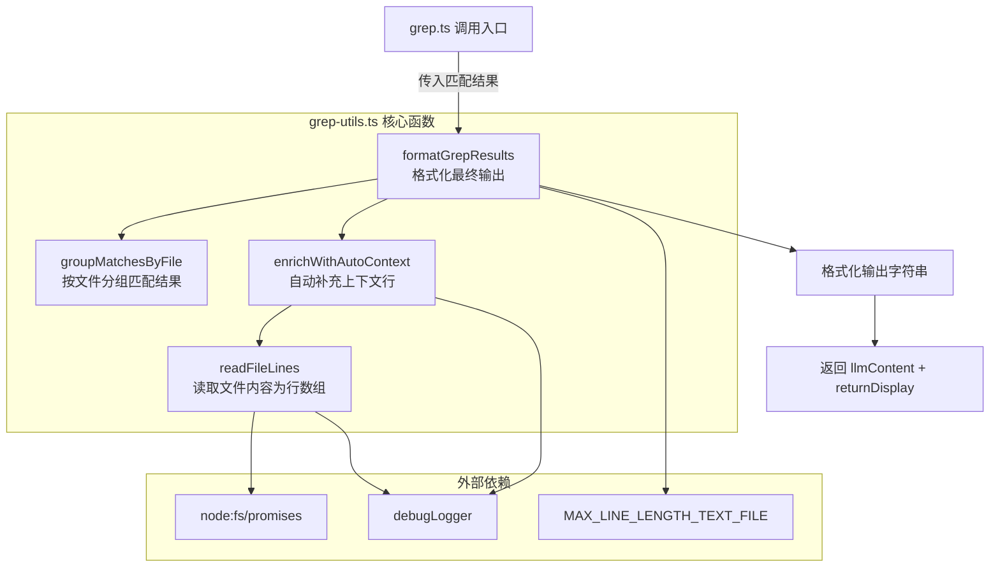

# grep-utils.ts

## 概述

`grep-utils.ts` 是 Gemini CLI 核心工具包中 `grep` 功能的工具函数模块。它提供了 grep 搜索结果的**分组**、**文件读取**、**自动上下文补充**和**格式化输出**等能力。该模块的核心设计目标是在搜索结果较少时，自动为匹配行附加上下文（surrounding context），从而减少 LLM Agent 额外读取文件的轮次，据注释描述该优化在 SWEBench 基准测试中减少了约 10% 的 Agent 交互轮次。

## 架构图（Mermaid）



## 核心组件

### 1. `GrepMatch` 接口

定义单个 grep 匹配结果的数据结构：

| 字段 | 类型 | 说明 |
|------|------|------|
| `filePath` | `string` | 相对文件路径（用于显示） |
| `absolutePath` | `string` | 绝对文件路径（用于读取文件） |
| `lineNumber` | `number` | 匹配所在行号 |
| `line` | `string` | 匹配行的内容文本 |
| `isContext` | `boolean?` | 可选，标记该行是否为上下文行（非直接匹配行） |

### 2. `groupMatchesByFile(allMatches: GrepMatch[])`

**功能**：将扁平的匹配结果数组按 `filePath` 分组为 `Record<string, GrepMatch[]>`，每个文件组内按行号升序排序。

**实现细节**：
- 遍历所有匹配结果，以 `filePath` 为键构建分组字典
- 对每个分组执行行号升序排序
- 返回 `{ [filePath]: GrepMatch[] }` 结构

### 3. `readFileLines(absolutePath: string)`

**功能**：异步读取指定文件全部内容，按行分割后返回字符串数组。

**实现细节**：
- 使用 `fsPromises.readFile` 以 UTF-8 编码读取文件
- 支持 `\r\n` 和 `\n` 两种换行符（`/\r?\n/`）
- 读取失败时通过 `debugLogger.warn` 记录警告，返回 `null`（不抛出异常）

### 4. `enrichWithAutoContext(matchesByFile, matchCount, params)`

**功能**：当匹配结果数量在 1~3 之间、且用户没有手动指定上下文参数时，自动为每个匹配行添加周围的上下文行。

**触发条件**（全部需满足）：
- `matchCount` 在 `[1, 3]` 范围内
- `names_only` 为 falsy
- `context`、`before`、`after` 参数均未定义

**上下文行数策略**：
| 匹配数 | 上下文行数（上下各） |
|--------|---------------------|
| 1 | 50 行 |
| 2-3 | 15 行 |

**实现细节**：
- 对每个文件调用 `readFileLines` 获取文件全部行
- 使用 `seenLines` Set 去重，防止多个匹配的上下文区间重叠时产生重复行
- 将原始匹配行标记为 `isContext: false`，上下文行标记为 `isContext: true`
- 如果一行既是某个匹配的上下文又是另一个匹配的直接命中行，则优先标记为非上下文（`isContext: false`）
- 最终结果按行号排序后直接替换回 `matchesByFile` 中（就地修改）

### 5. `formatGrepResults(allMatches, params, searchLocationDescription, totalMaxMatches)`

**功能**：将 grep 匹配结果格式化为供 LLM 消费的文本内容，并返回简短的显示摘要。

**返回值**：
```typescript
{ llmContent: string; returnDisplay: string }
```

**处理流程**：
1. 无匹配时返回 "No matches found" 提示
2. 调用 `groupMatchesByFile` 分组
3. 统计实际匹配数（排除上下文行）
4. 调用 `enrichWithAutoContext` 自动补充上下文
5. 判断是否截断（`matchCount >= totalMaxMatches`）
6. 根据 `names_only` 决定输出格式：
   - **仅文件名模式**：输出匹配的文件路径列表
   - **完整模式**：输出每个文件的匹配行及上下文，格式为 `L{行号}: {内容}`（匹配行用 `:`，上下文行用 `-`）
7. 超长行截断：使用 `Array.from()` 按 Unicode 字素（grapheme）计算长度，超过 `MAX_LINE_LENGTH_TEXT_FILE` 时截断并追加 `... [truncated]`

**输出格式示例**：
```
Found 2 matches for pattern "TODO" in /src:
---
File: src/main.ts
L10: // TODO: fix this
L11- function doSomething() {
---
File: src/utils.ts
L5: // TODO: refactor
---
```

## 依赖关系

### 内部依赖

| 模块 | 导入内容 | 用途 |
|------|----------|------|
| `../utils/debugLogger.js` | `debugLogger` | 调试日志记录，文件读取失败时输出警告 |
| `../utils/constants.js` | `MAX_LINE_LENGTH_TEXT_FILE` | 单行最大长度常量，超长行截断阈值 |

### 外部依赖

| 模块 | 导入内容 | 用途 |
|------|----------|------|
| `node:fs/promises` | `fsPromises`（默认导入） | 异步文件读取（`readFile`） |

## 关键实现细节

1. **自动上下文优化**：这是该模块最核心的设计亮点。当 grep 命中结果很少（1-3 个）时，自动读取文件并附加上下文行，使 LLM 无需再额外调用 `read_file` 工具。这是一种**预取优化**（prefetch optimization），以少量额外 I/O 换取减少 Agent 交互轮次。

2. **Unicode 安全截断**：在格式化输出时使用 `Array.from(lineContent)` 将字符串按 Unicode 字素分割，确保 emoji 或多字节字符不会被截断为乱码。

3. **就地修改模式**：`enrichWithAutoContext` 直接修改传入的 `matchesByFile` 字典（副作用函数），而非返回新对象。这是为了避免大量数据的拷贝开销。

4. **上下文行去重机制**：使用 `seenLines` Set 确保当多个匹配行的上下文区间有重叠时，每一行只出现一次。同时通过回溯查找确保直接匹配行的 `isContext` 标记始终为 `false`。

5. **错误容忍设计**：`readFileLines` 在文件不可读时返回 `null` 而非抛出异常，`enrichWithAutoContext` 在获取到 `null` 时静默跳过该文件，确保整个 grep 流程不会因单个文件读取失败而中断。

6. **截断判定逻辑**：使用 `matchCount >= totalMaxMatches` 判断结果是否被截断，并在输出文本中标注 `(results limited to N matches for performance)`，提示 LLM 可能需要缩小搜索范围。
