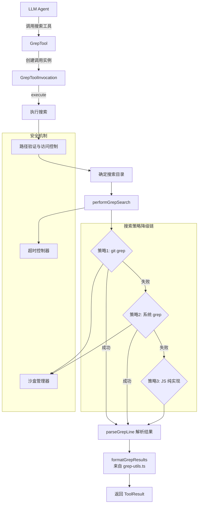

# grep.ts

## 概述

`grep.ts` 是 Gemini CLI 的核心文本搜索工具实现，为 LLM Agent 提供在代码库中按正则表达式搜索文件内容的能力。该工具采用**三级降级搜索策略**：优先使用 `git grep`（最快，利用 Git 索引），失败则降级为系统 `grep`，最后降级为纯 JavaScript 实现（跨平台兼容）。工具支持文件过滤、排除模式、每文件匹配限制、总匹配数限制等参数，并内置超时保护和沙盒安全机制。

## 架构图（Mermaid）

## 核心组件

### 1. `GrepToolParams` 接口

工具的输入参数定义：

| 参数 | 类型 | 必填 | 默认值 | 说明 |
|------|------|------|--------|------|
| `pattern` | `string` | 是 | - | 正则表达式搜索模式 |
| `dir_path` | `string` | 否 | 当前目录 | 搜索目录路径 |
| `include_pattern` | `string` | 否 | - | 文件包含模式（如 `*.ts`） |
| `exclude_pattern` | `string` | 否 | - | 正则排除模式，过滤匹配行 |
| `names_only` | `boolean` | 否 | false | 仅返回文件路径 |
| `max_matches_per_file` | `number` | 否 | - | 每文件最大匹配数 |
| `total_max_matches` | `number` | 否 | 100（`DEFAULT_TOTAL_MAX_MATCHES`） | 总最大匹配数 |

### 2. `GrepToolInvocation` 类

继承自 `BaseToolInvocation<GrepToolParams, ToolResult>`，封装单次 grep 调用的完整生命周期。

#### 核心方法

##### `execute(signal: AbortSignal): Promise<ToolResult>`

主执行流程：

1. **路径解析与验证**：将 `dir_path` 解析为绝对路径，验证路径存在性、是否为目录、是否在工作区内
2. **确定搜索目录**：未指定路径时搜索所有工作区目录，指定路径时仅搜索该目录
3. **超时控制**：创建 `AbortController`，设置 `DEFAULT_SEARCH_TIMEOUT_MS` 超时，并与外部 `signal` 链接
4. **逐目录搜索**：遍历搜索目录，调用 `performGrepSearch`，跟踪剩余匹配配额
5. **多目录路径前缀**：多目录搜索时，为每个匹配结果的 `filePath` 添加目录名前缀
6. **格式化结果**：调用 `formatGrepResults` 生成 LLM 可读的输出

##### `performGrepSearch(options): Promise<GrepMatch[]>`

三级降级搜索策略的核心实现：

**策略 1 - git grep**：
- 前置条件：路径是 Git 仓库且 `git` 命令可用
- 参数：`--untracked`（包含未跟踪文件）、`-n`（行号）、`-E`（扩展正则）、`--ignore-case`
- 使用 `execStreaming` 流式读取输出，逐行解析
- 支持 `--max-count`（每文件限制）和文件过滤

**策略 2 - 系统 grep**：
- 前置条件：系统有 `grep` 命令
- 参数：`-r`（递归）、`-n`（行号）、`-H`（显示文件名）、`-E`（扩展正则）、`-I`（忽略二进制）
- 从 `FileExclusions` 提取 glob 排除模式，转换为 `--exclude-dir` 参数
- 同样流式处理输出

**策略 3 - 纯 JavaScript**：
- 使用 `globStream` 流式遍历文件
- 对每个文件读取内容并逐行正则匹配
- 应用 `FileExclusions` 的 ignore 规则
- 完全跨平台，无外部命令依赖

三种策略共享的特性：
- 排除模式过滤（`excludeRegex`）
- 匹配数限制（`maxMatches` 和 `max_matches_per_file`）
- 路径遍历安全检查（阻止 `../` 逃逸）

##### `parseGrepLine(line: string, basePath: string): GrepMatch | null`

解析 grep 命令输出行，格式为 `filePath:lineNumber:lineContent`：
- 使用正则 `/^(.+?):(\d+):(.*)$/` 提取文件路径、行号、行内容
- 安全验证：确保解析出的路径不会逃逸到 `basePath` 之外
- 返回标准化的 `GrepMatch` 对象

##### `isCommandAvailable(command: string): Promise<boolean>`

检测系统命令是否可用：
- Windows 使用 `where`，Unix 使用 `command -v`
- 支持沙盒管理器包装命令
- 静默处理所有错误，返回 `false`

##### `getDescription(): string`

生成人类可读的工具调用描述，用于 UI 显示。包含搜索模式、文件过滤、搜索路径等信息。

### 3. `GrepTool` 类

继承自 `BaseDeclarativeTool<GrepToolParams, ToolResult>`，是注册到工具系统的声明式工具定义。

| 属性/方法 | 说明 |
|-----------|------|
| `Name` | 静态属性，值为 `GREP_TOOL_NAME` |
| `constructor` | 注册工具名 `SearchText`、描述、分类 `Kind.Search`、参数 schema |
| `validateToolParamValues` | 参数验证：正则合法性、排除正则合法性、数值范围、路径访问权限 |
| `createInvocation` | 工厂方法，创建 `GrepToolInvocation` 实例 |
| `getSchema` | 根据模型 ID 解析工具声明（可能不同模型有不同 schema） |

## 依赖关系

### 内部依赖

| 模块 | 导入内容 | 用途 |
|------|----------|------|
| `./grep-utils.js` | `GrepMatch`, `formatGrepResults` | 匹配结果接口和格式化函数 |
| `./tools.js` | `BaseDeclarativeTool`, `BaseToolInvocation`, `Kind`, 类型定义 | 工具基类和类型系统 |
| `./constants.js` | `DEFAULT_TOTAL_MAX_MATCHES`, `DEFAULT_SEARCH_TIMEOUT_MS` | 默认配置常量 |
| `./tool-error.js` | `ToolErrorType` | 错误类型枚举 |
| `./tool-names.js` | `GREP_TOOL_NAME` | 工具名常量 |
| `./definitions/coreTools.js` | `GREP_DEFINITION` | Grep 工具的声明定义 |
| `./definitions/resolver.js` | `resolveToolDeclaration` | 按模型解析工具 schema |
| `../utils/shell-utils.js` | `execStreaming` | 流式执行外部命令 |
| `../utils/paths.js` | `makeRelative`, `shortenPath` | 路径显示格式化 |
| `../utils/errors.js` | `getErrorMessage`, `isNodeError` | 错误处理工具 |
| `../utils/gitUtils.js` | `isGitRepository` | 检测目录是否为 Git 仓库 |
| `../utils/debugLogger.js` | `debugLogger` | 调试日志 |
| `../utils/ignorePatterns.js` | `FileExclusions`（类型） | 文件排除模式 |
| `../config/config.js` | `Config`（类型） | 配置对象 |
| `../confirmation-bus/message-bus.js` | `MessageBus`（类型） | 消息总线 |
| `../policy/utils.js` | `buildPatternArgsPattern` | 策略模式匹配 |

### 外部依赖

| 模块 | 导入内容 | 用途 |
|------|----------|------|
| `node:fs` | `fs` | 同步文件系统操作（`statSync`） |
| `node:fs/promises` | `fsPromises` | 异步文件读取（JS fallback） |
| `node:path` | `path` | 路径操作 |
| `node:child_process` | `spawn` | 子进程创建（命令可用性检测） |
| `glob` | `globStream` | 文件模式匹配流（JS fallback 策略） |

## 关键实现细节

1. **三级降级搜索策略**：这是该模块的核心架构决策。`git grep` 最快（利用 Git 索引和 packed objects），但需要 Git 环境；系统 `grep` 是通用的高性能方案；纯 JavaScript 保证在任何 Node.js 环境下都能工作。每级失败时静默降级，对调用方透明。

2. **流式处理**：三种策略都采用流式处理（`execStreaming` 生成器或 `globStream`），避免将大量输出一次性加载到内存。配合 `maxMatches` 限制，可以在达到配额后立即停止处理。

3. **超时保护**：使用 `AbortController` 实现双层取消机制——外部信号（用户取消）和内部超时（`DEFAULT_SEARCH_TIMEOUT_MS`），两者任一触发都会中止搜索。`finally` 块确保清理超时定时器和事件监听。

4. **沙盒安全**：通过 `sandboxManager` 包装外部命令执行，在沙盒环境中运行 `git grep` 和系统 `grep`，防止命令注入等安全风险。

5. **路径遍历防护**：`parseGrepLine` 和 JS fallback 中都对解析出的文件路径进行安全检查，确保路径不会通过 `../` 逃逸到搜索目录之外。`execute` 方法中还通过 `config.validatePathAccess` 验证路径是否在允许的工作区范围内。

6. **排除模式的双重机制**：
   - `include_pattern`：glob 模式，传递给底层搜索命令过滤文件
   - `exclude_pattern`：正则表达式，在应用层过滤匹配行内容（所有策略共享）

7. **多工作区目录支持**：当未指定 `dir_path` 时，工具会搜索所有工作区目录（通过 `workspaceContext.getDirectories()`），并在多目录场景下为结果添加目录名前缀以区分来源。

8. **策略更新支持**：`getPolicyUpdateOptions` 方法通过 `buildPatternArgsPattern` 将搜索模式转换为策略模式，支持后续的权限策略自动更新。

9. **参数验证的双重校验**：`GrepTool.validateToolParamValues` 在工具层做参数合法性检查（正则语法、数值范围、路径存在性），`GrepToolInvocation.execute` 在执行层再做路径访问验证，形成双保险。
