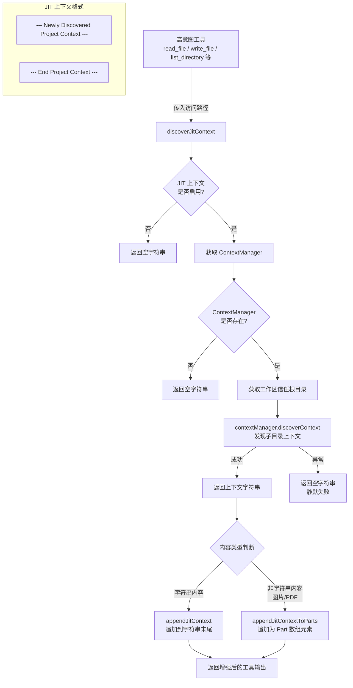

# jit-context.ts

## 概述

`jit-context.ts` 实现了 Gemini CLI 的**即时上下文发现**（JIT, Just-In-Time Context）机制。当 LLM Agent 通过"高意图工具"（如 `read_file`、`list_directory`、`write_file`、`replace`、`read_many_files`）访问某个文件或目录时，该模块会**动态发现并加载**该路径所在子目录中的 `GEMINI.md` 上下文文件，将其内容附加到工具的输出中返回给 LLM。这使得 Agent 能够在深入代码子目录时自动获取项目特定的上下文知识，而无需预先加载所有上下文文件。

该模块遵循**补充性原则**：JIT 上下文的发现和加载失败不会影响工具的主要操作，所有异常都被静默处理。

## 架构图（Mermaid）



## 核心组件

### 1. `discoverJitContext(config, accessedPath)`

**功能**：异步发现给定路径的 JIT 子目录上下文。

**参数**：
| 参数 | 类型 | 说明 |
|------|------|------|
| `config` | `Config` | 运行时配置对象 |
| `accessedPath` | `string` | 被工具访问的绝对路径 |

**返回值**：`Promise<string>` -- 发现的上下文内容，或空字符串。

**执行流程**：
1. 检查 JIT 上下文是否启用（`config.isJitContextEnabled()`），未启用则返回空
2. 获取 `ContextManager` 实例，不存在则返回空
3. 获取工作区所有信任根目录（`trustedRoots`）
4. 调用 `contextManager.discoverContext(accessedPath, trustedRoots)` 执行实际发现
5. 任何异常均被 catch 并返回空字符串（补充性原则）

### 2. `JIT_CONTEXT_PREFIX` / `JIT_CONTEXT_SUFFIX` 常量

定义 JIT 上下文在工具输出中的分隔格式：

```
--- Newly Discovered Project Context ---
[上下文内容]
--- End Project Context ---
```

这些分隔符帮助 LLM 识别工具输出中的项目上下文部分，与工具的主要输出内容区分开来。

### 3. `appendJitContext(llmContent, jitContext)`

**功能**：将 JIT 上下文追加到字符串类型的工具输出末尾。

**参数**：
| 参数 | 类型 | 说明 |
|------|------|------|
| `llmContent` | `string` | 工具的原始输出内容 |
| `jitContext` | `string` | 发现的 JIT 上下文 |

**行为**：
- 如果 `jitContext` 为空（falsy），直接返回原内容不做修改
- 否则将上下文用 `JIT_CONTEXT_PREFIX` 和 `JIT_CONTEXT_SUFFIX` 包裹后追加到内容末尾

### 4. `appendJitContextToParts(llmContent, jitContext)`

**功能**：将 JIT 上下文追加到非字符串类型（如图片、PDF）的工具输出中。

**参数**：
| 参数 | 类型 | 说明 |
|------|------|------|
| `llmContent` | `PartListUnion` | 原始 Part 内容（Google GenAI SDK 类型） |
| `jitContext` | `string` | 发现的 JIT 上下文 |

**行为**：
- 创建包含 JIT 上下文文本的 `Part` 对象
- 将原内容标准化为数组（如果不是数组则包装为单元素数组）
- 返回原内容数组与 JIT Part 的合并数组

## 依赖关系

### 内部依赖

| 模块 | 导入内容 | 用途 |
|------|----------|------|
| `../config/config.js` | `Config`（类型） | 运行时配置，提供 JIT 启用状态、ContextManager、工作区目录等 |

### 外部依赖

| 模块 | 导入内容 | 用途 |
|------|----------|------|
| `@google/genai` | `Part`, `PartListUnion`, `PartUnion`（类型） | Google GenAI SDK 的内容类型定义，用于处理多模态输出 |

## 关键实现细节

1. **补充性设计原则**：JIT 上下文被设计为完全**非关键路径**（non-critical path）。三个 guard clause（JIT 未启用、无 ContextManager、异常）都返回空字符串而非抛出错误。这确保了即使上下文加载出现任何问题，工具的主要功能（读文件、写文件等）不受影响。

2. **信任根目录机制**：`discoverContext` 接收 `trustedRoots` 参数，限制上下文文件的发现范围仅在工作区目录内。这是一个安全措施，防止通过路径操纵加载工作区外的上下文文件。

3. **多模态输出支持**：`appendJitContextToParts` 的存在表明工具系统支持多模态输出（如图片分析工具）。JIT 上下文以独立的 `text` Part 追加到 Part 数组末尾，与图片等非文本 Part 并存。

4. **延迟加载策略**：JIT 的核心思想是"用到时才加载"。相比在对话开始时加载所有子目录的 `GEMINI.md` 文件，JIT 只在 Agent 实际访问某个目录时才加载对应的上下文，既节省了 token 消耗，又确保了上下文的相关性。

5. **明确的分隔符格式**：使用 `--- Newly Discovered Project Context ---` 和 `--- End Project Context ---` 作为分隔符，采用 Markdown 水平线风格。这种格式既方便 LLM 解析识别上下文边界，也便于人类在调试时阅读。

6. **可选性 API 设计**：`config.isJitContextEnabled?.()` 使用了可选链调用，表明 `isJitContextEnabled` 方法本身在某些 Config 实现中可能不存在，增强了向后兼容性。
