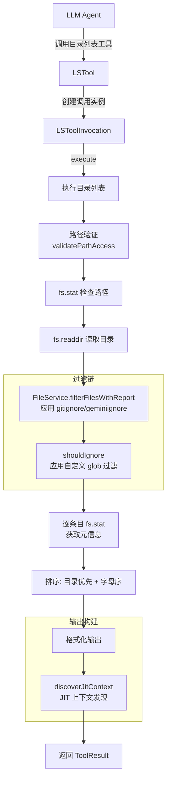

# ls.ts

## 概述

`ls.ts` 实现了 Gemini CLI 的目录列表工具（`list_directory`），为 LLM Agent 提供浏览文件系统目录结构的能力。该工具支持 `.gitignore` 和 `.geminiignore` 文件过滤、自定义 glob 忽略模式、文件元信息展示（大小、是否为目录），并集成了 JIT（Just-In-Time）上下文发现机制，在列出目录内容的同时自动加载子目录的 `GEMINI.md` 上下文。输出格式对 LLM 友好，目录优先排列，文件附带字节大小。

## 架构图（Mermaid）

## 核心组件

### 1. `LSToolParams` 接口

工具输入参数定义：

| 参数 | 类型 | 必填 | 默认值 | 说明 |
|------|------|------|--------|------|
| `dir_path` | `string` | 是 | - | 要列出的目录绝对路径 |
| `ignore` | `string[]` | 否 | - | 自定义 glob 忽略模式数组 |
| `file_filtering_options` | `object` | 否 | 配置默认值 | 文件过滤选项 |
| `file_filtering_options.respect_git_ignore` | `boolean` | 否 | true | 是否尊重 `.gitignore` |
| `file_filtering_options.respect_gemini_ignore` | `boolean` | 否 | true | 是否尊重 `.geminiignore` |

### 2. `FileEntry` 接口

目录条目的数据结构：

| 字段 | 类型 | 说明 |
|------|------|------|
| `name` | `string` | 文件或目录名称 |
| `path` | `string` | 绝对路径 |
| `isDirectory` | `boolean` | 是否为目录 |
| `size` | `number` | 文件字节大小（目录为 0） |
| `modifiedTime` | `Date` | 最后修改时间 |

### 3. `LSToolInvocation` 类

继承自 `BaseToolInvocation<LSToolParams, ToolResult>`，封装单次目录列表操作。

#### 核心方法

##### `execute(_signal: AbortSignal): Promise<ToolResult>`

主执行流程：

1. **路径解析**：将 `dir_path` 相对于 `targetDir` 解析为绝对路径
2. **访问验证**：调用 `config.validatePathAccess` 确保路径在工作区内
3. **路径检查**：
   - `fs.stat` 确认路径存在
   - 确认是目录（非文件）
4. **读取目录**：`fs.readdir` 获取目录下所有条目名
5. **空目录处理**：空目录直接返回 "Directory is empty" 提示
6. **文件过滤**（两层过滤）：
   - **第一层**：通过 `FileService.filterFilesWithReport` 应用 `.gitignore` 和 `.geminiignore` 规则，返回过滤后的路径和被忽略的数量
   - **第二层**：通过 `shouldIgnore` 方法应用用户自定义的 glob 忽略模式
7. **获取元信息**：对每个过滤后的条目调用 `fs.stat` 获取类型、大小、修改时间
8. **排序**：目录排在文件前面，同类型内按名称字母序排列
9. **格式化输出**：
   - 目录格式：`[DIR] dirname`
   - 文件格式：`filename (size bytes)`
10. **JIT 上下文**：调用 `discoverJitContext` 发现子目录上下文，非空则通过 `appendJitContext` 追加到输出
11. **忽略计数**：如有被忽略的条目，在输出末尾标注 `(N ignored)`

##### `shouldIgnore(filename: string, patterns?: string[]): boolean`

自定义 glob 模式匹配：
- 将 glob 模式转换为正则表达式：`*` -> `.*`，`?` -> `.`，特殊字符转义
- 逐模式检查，任一匹配即返回 `true`

##### `getDescription(): string`

返回人类可读的操作描述，使用相对路径和缩短路径显示。

##### `errorResult(llmContent, returnDisplay, type): ToolResult`

统一的错误结果构造辅助方法。

### 4. `LSTool` 类

继承自 `BaseDeclarativeTool<LSToolParams, ToolResult>`，注册为声明式工具。

| 属性/方法 | 说明 |
|-----------|------|
| `Name` | 静态属性，值为 `LS_TOOL_NAME` |
| `constructor` | 注册显示名 `ReadFolder`、分类 `Kind.Search` |
| `validateToolParamValues` | 参数验证：仅验证路径访问权限 |
| `createInvocation` | 工厂方法，创建 `LSToolInvocation` 实例 |
| `getSchema` | 按模型 ID 解析工具声明 |

## 依赖关系

### 内部依赖

| 模块 | 导入内容 | 用途 |
|------|----------|------|
| `./tools.js` | `BaseDeclarativeTool`, `BaseToolInvocation`, `Kind`, 类型定义 | 工具基类和类型系统 |
| `./tool-error.js` | `ToolErrorType` | 错误类型枚举 |
| `./tool-names.js` | `LS_TOOL_NAME` | 工具名常量 |
| `./definitions/coreTools.js` | `LS_DEFINITION` | LS 工具的声明定义 |
| `./definitions/resolver.js` | `resolveToolDeclaration` | 按模型解析工具 schema |
| `./jit-context.js` | `discoverJitContext`, `appendJitContext` | JIT 上下文发现和追加 |
| `../utils/paths.js` | `makeRelative`, `shortenPath` | 路径显示格式化 |
| `../utils/debugLogger.js` | `debugLogger` | 调试日志 |
| `../config/config.js` | `Config`（类型） | 配置对象 |
| `../config/constants.js` | `DEFAULT_FILE_FILTERING_OPTIONS` | 默认文件过滤选项 |
| `../confirmation-bus/message-bus.js` | `MessageBus`（类型） | 消息总线 |
| `../policy/utils.js` | `buildDirPathArgsPattern` | 策略模式匹配 |

### 外部依赖

| 模块 | 导入内容 | 用途 |
|------|----------|------|
| `node:fs/promises` | `fs` | 异步文件系统操作（`stat`、`readdir`） |
| `node:path` | `path` | 路径操作 |

## 关键实现细节

1. **两层过滤机制**：文件过滤分为两个阶段。第一层是通过 `FileService.filterFilesWithReport` 应用项目级的 `.gitignore` 和 `.geminiignore` 规则，这是一个集中化的过滤服务。第二层是 `shouldIgnore` 方法应用用户在工具调用参数中传入的临时 glob 模式。两层过滤分工明确——项目级规则 vs 调用级规则。

2. **过滤选项的三级优先级**：`.gitignore`/`.geminiignore` 的启用状态采用三级 fallback：
   - 第一优先：工具调用参数 `file_filtering_options`
   - 第二优先：全局配置 `config.getFileFilteringOptions()`
   - 第三优先：硬编码默认值 `DEFAULT_FILE_FILTERING_OPTIONS`

3. **LLM 友好的输出格式**：目录用 `[DIR]` 前缀标记，文件附带字节大小。这种格式比 Unix `ls` 输出更容易被 LLM 解析，避免了权限位、所有者等对 LLM 无用的信息。

4. **JIT 上下文集成**：作为"高意图工具"之一，LS 工具在完成目录列表后自动发现并附加子目录的 `GEMINI.md` 上下文。这意味着当 Agent 浏览到一个新子目录时，会自动获得该子目录的项目说明。

5. **容错的逐条目 stat**：对每个文件条目单独 `fs.stat`，单个条目失败（如权限问题、竞态条件下文件被删除）仅记录调试日志，不影响其他条目的列出。

6. **排序策略**：目录优先、文件其次，同类型内字母序排列。这种排序使 LLM 能快速识别目录结构，先看到子目录再看到文件。

7. **忽略计数报告**：通过 `filterFilesWithReport` 返回的 `ignoredCount`，在输出末尾标注被忽略的条目数量，让 LLM 知道目录中有被过滤掉的内容，在需要时可以调整过滤选项重新查看。

8. **glob 到正则的简易转换**：`shouldIgnore` 中的 glob 转正则实现是简化版本，仅处理 `*` 和 `?` 通配符。不支持 `**`（递归目录）、`{a,b}`（分组）等复杂 glob 语法。这足以满足文件名级别的过滤需求（因为 LS 只列出单层目录）。
