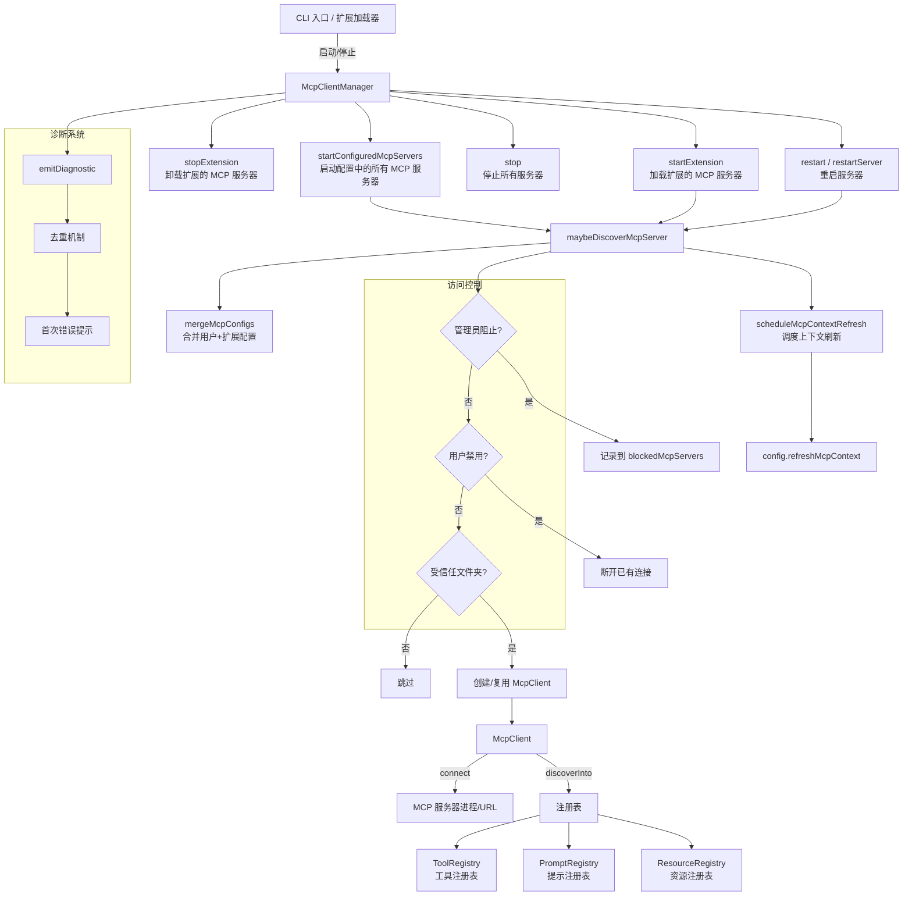

# mcp-client-manager.ts

## 概述

`mcp-client-manager.ts` 实现了 Gemini CLI 的 **MCP（Model Context Protocol）客户端管理器**，负责管理多个 MCP 服务器的完整生命周期。MCP 是一种允许 LLM 工具通过标准化协议与外部服务通信的机制，每个 MCP 服务器可以提供一组工具、提示（prompts）和资源（resources）。

该管理器的核心职责包括：
- **连接管理**：启动、停止、重启单个或全部 MCP 服务器连接
- **工具发现**：连接到 MCP 服务器后发现其提供的工具，并注册到工具注册表
- **配置合并**：处理来自用户配置和扩展（extensions）的 MCP 服务器配置的合并与冲突
- **访问控制**：支持管理员级别的服务器允许/阻止列表、用户级别的启用/禁用
- **扩展支持**：管理 Gemini CLI 扩展中定义的 MCP 服务器的加载和卸载
- **诊断系统**：智能的 MCP 诊断消息去重和分级显示

## 架构图（Mermaid）

## 核心组件

### 1. `McpClientManager` 类

管理器的核心类，维护所有 MCP 客户端连接和服务器配置的状态。

#### 内部状态

| 字段 | 类型 | 说明 |
|------|------|------|
| `clients` | `Map<string, McpClient>` | 活跃的 MCP 客户端映射（键为配置哈希） |
| `allServerConfigs` | `Map<string, MCPServerConfig>` | 所有已知的服务器配置（含禁用的） |
| `clientVersion` | `string` | 客户端版本号 |
| `cliConfig` | `Config` | CLI 全局配置 |
| `discoveryPromise` | `Promise<void> \| undefined` | 当前正在进行的发现操作 |
| `discoveryState` | `MCPDiscoveryState` | 发现状态机（NOT_STARTED / IN_PROGRESS / COMPLETED） |
| `eventEmitter` | `EventEmitter` | 事件发射器，通知 UI 更新 |
| `pendingRefreshPromise` | `Promise<void> \| null` | 待执行的上下文刷新 |
| `blockedMcpServers` | `Array<{name, extensionName}>` | 被管理员阻止的服务器列表 |
| `mainToolRegistry` | `ToolRegistry` | 主工具注册表 |
| `mainPromptRegistry` | `PromptRegistry` | 主提示注册表 |
| `mainResourceRegistry` | `ResourceRegistry` | 主资源注册表 |
| `userInteractedWithMcp` | `boolean` | 用户是否在本次会话中与 MCP 交互过 |
| `shownDiagnostics` | `Map<string, 'silent' \| 'verbose'>` | 已显示的诊断消息去重表 |
| `hintShown` | `boolean` | MCP 错误提示是否已显示 |
| `lastErrors` | `Map<string, string>` | 每个服务器的最后一条错误消息 |

#### 核心方法

##### `startConfiguredMcpServers(): Promise<void>`

启动配置文件中定义的所有 MCP 服务器：
1. 检查受信任文件夹
2. 从配置获取 MCP 服务器列表并填充命令
3. 并行调用 `maybeDiscoverMcpServer` 连接和发现每个服务器
4. 处理所有服务器被跳过的边缘情况（手动将状态设为 COMPLETED）
5. 调度 MCP 上下文刷新

##### `maybeDiscoverMcpServer(name, config, registries?): Promise<void>`

核心的服务器发现和连接方法，包含复杂的状态管理和访问控制：

1. **配置合并**：检查是否已有同名配置，有则调用 `mergeMcpConfigs` 合并
2. **冲突检测**：如果两个不同扩展注册了同名服务器，跳过后来者
3. **热重载**：检测配置变更，对同名但配置不同的服务器执行断开旧连接再重连
4. **访问控制链**：
   - 管理员阻止列表（`isBlockedBySettings`）
   - 用户禁用（`isDisabledByUser`）
   - 受信任文件夹检查
   - 扩展激活状态检查
5. **客户端创建/复用**：创建新 `McpClient` 或复用已有实例
6. **连接与发现**：调用 `client.connect()` 和 `client.discoverInto()` 完成工具注册
7. **Promise 链管理**：将发现操作链入 `discoveryPromise` 保证顺序执行

##### `mergeMcpConfigs(base, override): MCPServerConfig`

安全的配置合并策略：
- **includeTools（允许列表）**：取交集，确保最严格策略生效。双方都提供时取交集；仅一方提供则用该方
- **excludeTools（阻止列表）**：取并集，任一方阻止的工具都被阻止
- **env（环境变量）**：对象合并，override 覆盖 base 的同名键
- **标量属性**：override 覆盖 base

##### `startExtension(extension) / stopExtension(extension)`

扩展生命周期管理：
- **startExtension**：并行连接扩展定义的所有 MCP 服务器，然后刷新上下文
- **stopExtension**：断开属于该扩展的所有 MCP 客户端，从配置和阻止列表中移除，然后刷新上下文

##### `restart() / restartServer(name)`

重启支持：
- **restart**：断开所有客户端，然后重新发现所有已知配置的服务器
- **restartServer**：断开并重新发现指定名称的单个服务器

##### `stop(): Promise<void>`

应用退出时的清理方法：并行断开所有客户端，清空 `clients` 映射。

##### `scheduleMcpContextRefresh(): Promise<void>`

智能的上下文刷新调度器，实现**尾部合并**（trailing coalescing）：
1. 如果正在刷新，记录待执行标志后返回
2. 如果已有待执行的刷新，合并到现有请求
3. 执行循环：刷新 -> 检查是否有新请求 -> 有则等 300ms 合并突发请求后再次刷新
4. 确保 `finally` 块重置状态

##### `emitDiagnostic(severity, message, error?, serverName?)`

诊断消息发射，带智能去重：
- 记录错误/警告到 `lastErrors`
- 根据用户是否与 MCP 交互过决定显示模式：
  - **已交互（verbose）**：直接发射反馈事件（除非已以 verbose 模式显示过）
  - **未交互（silent）**：仅记录到调试日志；首次错误时显示一个简洁提示 "Run /mcp list for status."

##### `getClientKey(name, config): string`

生成客户端唯一标识：对服务器名称、配置（排除 extension 对象本身）和扩展 ID 进行 SHA-256 哈希。用于检测配置变更和客户端去重。

#### 辅助方法

| 方法 | 说明 |
|------|------|
| `setMainRegistries(registries)` | 设置主注册表（工具、提示、资源） |
| `setUserInteractedWithMcp()` | 标记用户已与 MCP 交互 |
| `getLastError(serverName)` | 获取指定服务器的最后错误 |
| `getBlockedMcpServers()` | 获取被阻止的服务器列表 |
| `getClient(serverName)` | 按名称获取客户端实例 |
| `removeRegistries(registries)` | 从所有客户端移除注册表 |
| `getDiscoveryState()` | 获取当前发现状态 |
| `getMcpServers()` | 获取所有服务器配置（含禁用的） |
| `getMcpInstructions()` | 汇总所有已连接服务器的指令文本 |
| `getMcpServerCount()` | 获取活跃客户端数量 |

### 2. 访问控制方法

##### `isBlockedBySettings(name): boolean`

管理员级别的访问控制：
- 如果设置了允许列表（allowlist），服务器名必须在列表中
- 如果设置了阻止列表（blocklist），服务器名不能在列表中
- 两者可同时生效

##### `isDisabledByUser(name): Promise<boolean>`

用户级别的启用/禁用：
- 检查会话级禁用（`isSessionDisabled`）
- 检查文件级启用（`isFileEnabled`）

## 依赖关系

### 内部依赖

| 模块 | 导入内容 | 用途 |
|------|----------|------|
| `./mcp-client.js` | `McpClient`, `MCPDiscoveryState`, `MCPServerStatus`, `populateMcpServerCommand` | MCP 客户端实例、状态枚举、命令填充 |
| `./tool-registry.js` | `ToolRegistry`（类型） | 工具注册表 |
| `../config/config.js` | `Config`, `GeminiCLIExtension`, `MCPServerConfig`（类型） | 配置和扩展类型 |
| `../utils/errors.js` | `getErrorMessage`, `isAuthenticationError` | 错误处理工具 |
| `../utils/events.js` | `coreEvents` | 核心事件系统 |
| `../utils/debugLogger.js` | `debugLogger` | 调试日志 |
| `../policy/stable-stringify.js` | `stableStringify` | 确定性 JSON 序列化（用于哈希生成） |
| `../prompts/prompt-registry.js` | `PromptRegistry`（类型） | 提示注册表 |
| `../resources/resource-registry.js` | `ResourceRegistry`（类型） | 资源注册表 |

### 外部依赖

| 模块 | 导入内容 | 用途 |
|------|----------|------|
| `node:events` | `EventEmitter`（类型） | 事件发射器类型 |
| `node:crypto` | `createHash` | SHA-256 哈希（客户端键生成） |

## 关键实现细节

1. **配置哈希去重**：使用 SHA-256 哈希（对服务器名+配置+扩展 ID 进行 `stableStringify` 后哈希）作为客户端的唯一键。这确保了：
   - 相同配置不会重复连接
   - 配置变更时能检测到差异并触发热重载（断开旧连接 + 建立新连接）
   - 使用 `stableStringify` 保证对象属性顺序不影响哈希结果

2. **安全的配置合并策略**：`mergeMcpConfigs` 的设计遵循**最小权限原则**：
   - 允许列表取交集：工具必须被双方都允许
   - 阻止列表取并集：任一方阻止的工具都不可用
   - 这防止了扩展通过覆盖配置来绕过管理员的限制

3. **Promise 链式发现**：`discoveryPromise` 使用链式结构确保多个服务器的发现操作顺序执行（而非并行），避免注册表的并发写入问题。同时通过 `.catch(() => {})` 确保单个服务器失败不会阻塞后续服务器。

4. **尾部合并刷新调度**：`scheduleMcpContextRefresh` 实现了一个巧妙的调度模式：
   - 正在执行时到达的请求被合并
   - 执行完成后如果有待执行请求，等待 300ms 再执行（合并突发请求）
   - 这避免了连续启动多个 MCP 服务器时的重复刷新

5. **分级诊断显示**：诊断系统根据用户交互状态智能调整显示策略：
   - 用户未主动查看 MCP 时，错误仅记录到调试日志，首次出现时显示一个简洁提示
   - 用户执行了 `/mcp` 命令后，错误完整显示
   - 所有诊断消息按 `severity:message` 键去重，避免重复打扰

6. **多层访问控制**：服务器启动前需通过四层检查：
   - 管理员允许/阻止列表
   - 用户会话/文件级启用状态
   - 受信任文件夹验证
   - 扩展激活状态
   任一层不通过则静默跳过，确保安全性。

7. **扩展隔离**：通过 `extension.id` 追踪每个 MCP 服务器归属的扩展。`stopExtension` 仅断开属于该扩展的服务器，不影响其他扩展或用户直接配置的服务器。同名冲突时优先保留先到者。

8. **事件驱动 UI 更新**：关键状态变更时（客户端创建、连接、发现完成、断开）通过 `eventEmitter.emit('mcp-client-update', this.clients)` 通知 UI 层更新 MCP 服务器状态面板。

9. **认证错误特殊处理**：发现阶段的 401 认证错误不会以红色错误形式显示，因为 `mcp-client.ts` 已经以 info 级别处理了认证提示，避免重复干扰。

10. **热重载支持**：`maybeDiscoverMcpServer` 检测同名但配置不同的服务器，自动执行断开旧连接 -> 建立新连接的热重载流程，支持用户在运行时修改 MCP 配置。
