# mcp-client.ts

## 概述

`mcp-client.ts` 是 Gemini CLI 中 **MCP（Model Context Protocol）客户端** 的核心实现文件。它负责与单个或多个 MCP 服务器建立连接、发现工具（Tools）、提示词（Prompts）和资源（Resources），并管理服务器的完整生命周期。该文件同时处理多种传输协议（Stdio、SSE、Streamable HTTP）、OAuth 认证流程、动态通知刷新机制以及全局服务器状态管理。

文件路径: `packages/core/src/tools/mcp-client.ts`
代码行数: 约 2372 行
许可证: Apache-2.0 (Google LLC 2025)

## 架构图（Mermaid）

```mermaid
graph TB
    subgraph 入口层
        DMT[discoverMcpTools<br/>MCP工具发现入口]
        CAD[connectAndDiscover<br/>连接并发现]
    end

    subgraph McpClient类
        MC[McpClient<br/>单服务器MCP客户端]
        MC_CONNECT[connect<br/>建立连接]
        MC_DISCOVER[discoverInto<br/>发现到注册表]
        MC_DISCONNECT[disconnect<br/>断开连接]
        MC_REFRESH_TOOLS[refreshTools<br/>刷新工具列表]
        MC_REFRESH_RES[refreshResources<br/>刷新资源列表]
        MC_REFRESH_PROMPTS[refreshPrompts<br/>刷新提示词列表]
        MC_NOTIFY[registerNotificationHandlers<br/>注册通知处理器]
        MC_PROGRESS[registerProgressToken<br/>进度令牌管理]
    end

    subgraph 连接层
        CMS[connectToMcpServer<br/>创建并连接MCP客户端]
        CT[createTransport<br/>创建传输通道]
        CUT[createUrlTransport<br/>创建URL传输]
        CTOA[createTransportWithOAuth<br/>创建OAuth传输]
        CAP[createAuthProvider<br/>创建认证提供者]
        CTRI[createTransportRequestInit<br/>构建请求头]
    end

    subgraph 传输协议
        STDIO[StdioClientTransport<br/>标准输入输出传输]
        SSE[SSEClientTransport<br/>SSE传输]
        HTTP[StreamableHTTPClientTransport<br/>HTTP流传输]
        XCODE[XcodeMcpBridgeFixTransport<br/>Xcode兼容修复]
    end

    subgraph 发现层
        DT[discoverTools<br/>发现工具]
        DP[discoverPrompts<br/>发现提示词]
        DR[discoverResources<br/>发现资源]
        LR[listResources<br/>列出资源-分页]
        IMP[invokeMcpPrompt<br/>调用提示词]
    end

    subgraph 认证层
        HAO[handleAutomaticOAuth<br/>自动OAuth处理]
        GSOT[getStoredOAuthToken<br/>获取存储的OAuth令牌]
        RWO[retryWithOAuth<br/>OAuth重试连接]
        SAM[showAuthRequiredMessage<br/>显示认证提示]
        EWAH[extractWWWAuthenticateHeader<br/>提取认证头]
    end

    subgraph 工具适配层
        MCT[McpCallableTool<br/>MCP可调用工具]
        DMCT[DiscoveredMCPTool<br/>发现的MCP工具]
    end

    subgraph 状态管理
        SS[serverStatuses<br/>服务器状态Map]
        UMS[updateMCPServerStatus<br/>更新服务器状态]
        GMS[getMCPServerStatus<br/>获取服务器状态]
        GAMS[getAllMCPServerStatuses<br/>获取所有状态]
        SCL[statusChangeListeners<br/>状态变更监听器]
        MDS[MCPDiscoveryState<br/>发现状态]
    end

    subgraph 注册表
        TR[ToolRegistry<br/>工具注册表]
        PR[PromptRegistry<br/>提示词注册表]
        RR[ResourceRegistry<br/>资源注册表]
    end

    subgraph 验证与过滤
        IE[isEnabled<br/>工具启用判断]
        PMC[populateMcpServerCommand<br/>解析命令行MCP]
        LJSV[LenientJsonSchemaValidator<br/>宽容JSON验证器]
        VMPT[validateMcpPolicyToolNames<br/>策略工具名验证]
    end

    DMT --> PMC
    DMT --> CAD
    CAD --> CMS
    CAD --> DT
    CAD --> DP
    CAD --> UMS

    MC --> MC_CONNECT --> CMS
    MC --> MC_DISCOVER --> DT
    MC_DISCOVER --> DP
    MC_DISCOVER --> DR
    MC_DISCOVER --> VMPT
    MC --> MC_DISCONNECT
    MC --> MC_NOTIFY --> MC_REFRESH_TOOLS
    MC_NOTIFY --> MC_REFRESH_RES
    MC_NOTIFY --> MC_REFRESH_PROMPTS
    MC --> MC_PROGRESS

    CMS --> CT
    CMS --> LJSV
    CT --> CUT
    CT --> STDIO
    CT --> XCODE
    CT --> CAP
    CT --> CTRI
    CUT --> SSE
    CUT --> HTTP

    CMS --> RWO
    CMS --> HAO
    CMS --> GSOT
    CMS --> SAM
    CMS --> EWAH
    HAO --> CTOA
    RWO --> CTOA

    DT --> MCT --> DMCT
    DT --> IE

    DT --> TR
    DP --> PR
    DR --> LR --> RR

    UMS --> SS
    UMS --> SCL
    GMS --> SS
    GAMS --> SS
```



## 核心组件

### 1. McpClient 类

`McpClient` 是管理单个 MCP 服务器连接的核心类，实现了 `McpProgressReporter` 接口。

**主要属性：**

| 属性 | 类型 | 说明 |
|------|------|------|
| `client` | `Client \| undefined` | MCP SDK Client 实例 |
| `transport` | `Transport \| undefined` | 传输通道实例 |
| `status` | `MCPServerStatus` | 当前服务器连接状态 |
| `isRefreshingTools` | `boolean` | 工具刷新锁标志 |
| `pendingToolRefresh` | `boolean` | 待处理的工具刷新标志 |
| `isRefreshingResources` | `boolean` | 资源刷新锁标志 |
| `pendingResourceRefresh` | `boolean` | 待处理的资源刷新标志 |
| `isRefreshingPrompts` | `boolean` | 提示词刷新锁标志 |
| `pendingPromptRefresh` | `boolean` | 待处理的提示词刷新标志 |
| `registeredRegistries` | `Set<RegistrySet>` | 已注册的注册表集合 |
| `progressTokenToCallId` | `Map<string \| number, string>` | 进度令牌到调用ID的映射 |

**构造函数参数：**

| 参数 | 类型 | 说明 |
|------|------|------|
| `serverName` | `string` | 服务器名称 |
| `serverConfig` | `MCPServerConfig` | 服务器配置 |
| `workspaceContext` | `WorkspaceContext` | 工作区上下文 |
| `cliConfig` | `McpContext` | CLI 配置上下文 |
| `debugMode` | `boolean` | 是否为调试模式 |
| `clientVersion` | `string` | 客户端版本号 |
| `onContextUpdated` | `(signal?: AbortSignal) => Promise<void>` | 上下文更新回调 |

**核心方法：**

- **`connect()`**: 连接到 MCP 服务器。状态必须为 `DISCONNECTED` 才能连接。连接时会注册通知处理器和错误处理器。
- **`discoverInto(cliConfig, registries)`**: 发现工具、提示词和资源并注册到指定的注册表集合中。同时验证策略规则中的工具名称。
- **`disconnect()`**: 断开与 MCP 服务器的连接。清理所有注册表中该服务器的工具、提示词和资源。
- **`registerNotificationHandlers()`**: 注册 MCP 协议通知处理器，包括工具列表变更（`ToolListChangedNotification`）、资源列表变更（`ResourceListChangedNotification`）、提示词列表变更（`PromptListChangedNotification`）和进度通知（`ProgressNotification`）。
- **`refreshTools()` / `refreshResources()` / `refreshPrompts()`**: 采用 **合并模式（Coalescing Pattern）** 实现，防止频繁通知导致服务器过载和注册表竞态条件。包含 **验证重试** 机制——如果首次刷新未检测到变化，会等待 500ms 后再重试一次。
- **`registerProgressToken(token, callId)` / `unregisterProgressToken(token)`**: 管理进度令牌，将 MCP 进度通知路由到正确的工具调用。

### 2. 枚举类型

#### MCPServerStatus

```typescript
enum MCPServerStatus {
  DISCONNECTED = 'disconnected',  // 已断开或错误
  DISCONNECTING = 'disconnecting', // 正在断开
  CONNECTING = 'connecting',       // 正在连接
  CONNECTED = 'connected',         // 已连接就绪
  BLOCKED = 'blocked',             // 配置阻止
  DISABLED = 'disabled',           // 已禁用
}
```

#### MCPDiscoveryState

```typescript
enum MCPDiscoveryState {
  NOT_STARTED = 'not_started',  // 未开始
  IN_PROGRESS = 'in_progress',  // 进行中
  COMPLETED = 'completed',      // 已完成
}
```

### 3. 接口定义

#### McpProgressReporter
进度报告接口，用于 MCP 工具调用中的进度跟踪：
```typescript
interface McpProgressReporter {
  registerProgressToken(token: string | number, callId: string): void;
  unregisterProgressToken(token: string | number): void;
}
```

#### RegistrySet
注册表集合，将工具、提示词、资源三个注册表绑定在一起：
```typescript
interface RegistrySet {
  toolRegistry: ToolRegistry;
  promptRegistry: PromptRegistry;
  resourceRegistry: ResourceRegistry;
}
```

#### McpContext
MCP 操作所需的配置上下文接口：
```typescript
interface McpContext {
  readonly sanitizationConfig: EnvironmentSanitizationConfig;
  emitMcpDiagnostic(severity, message, error?, serverName?): void;
  setUserInteractedWithMcp?(): void;
  isTrustedFolder(): boolean;
  getPolicyEngine?(): { getRules(): ReadonlyArray<...> };
}
```

#### DiscoveredMCPPrompt
扩展了 MCP SDK 的 `Prompt` 类型，添加了服务器名称和调用方法：
```typescript
type DiscoveredMCPPrompt = Prompt & {
  serverName: string;
  invoke: (params: Record<string, unknown>) => Promise<GetPromptResult>;
};
```

### 4. McpCallableTool 类

内部类，将 MCP SDK 的 `Tool` 定义适配为 Gemini SDK 的 `CallableTool` 接口。

**核心行为：**
- `tool()` 方法将 MCP 工具定义转换为 Gemini `functionDeclarations` 格式
- `callTool()` 方法：
  - 仅支持单个函数调用
  - 自动生成随机 UUID 作为进度令牌
  - 通过 `getToolCallContext()` 获取调用上下文并注册进度令牌
  - 设置超时并调用 MCP 服务器
  - 失败时返回包含错误信息的 `functionResponse`（而非抛出异常）
  - 在 `finally` 块中注销进度令牌

### 5. LenientJsonSchemaValidator 类

宽容的 JSON Schema 验证器，内部封装 `AjvJsonSchemaValidator`。

**设计意图：** 某些第三方 MCP 服务器返回包含 `$defs`/`$ref` 链的复杂 Schema，可能导致 AJV 编译失败。该验证器在 AJV 失败时回退到无操作验证器（始终返回 `valid: true`），确保工具发现不会因 Schema 问题而中断。

### 6. 全局状态管理函数

| 函数 | 说明 |
|------|------|
| `updateMCPServerStatus(serverName, status)` | 更新服务器状态并通知所有监听器 |
| `getMCPServerStatus(serverName)` | 获取指定服务器状态 |
| `getAllMCPServerStatuses()` | 获取所有服务器状态的副本 |
| `getMCPDiscoveryState()` | 获取全局发现状态 |
| `addMCPStatusChangeListener(listener)` | 添加状态变更监听器 |
| `removeMCPStatusChangeListener(listener)` | 移除状态变更监听器 |

### 7. 连接与传输函数

#### `connectToMcpServer()`
核心连接函数，完整流程：
1. 创建 `Client` 实例，使用 `LenientJsonSchemaValidator`
2. 注册 `roots` 能力并设置目录变更通知
3. 尝试主传输连接
4. 如果失败且为网络传输（url 配置但无显式 type），自动回退尝试 SSE
5. 如果遇到 401 认证错误：
   - 尝试从错误消息中提取 `www-authenticate` 头
   - 如果未获取到，向服务器发送 HEAD 请求获取
   - 尝试自动 OAuth 发现和认证
   - 使用 OAuth 令牌重试连接

#### `createTransport()`
根据配置创建适当的传输通道：
- **有 URL**: 创建网络传输（HTTP/SSE），处理 OAuth 令牌和认证提供者
- **有 command**: 创建 Stdio 传输，处理环境变量清洗和扩展
- 特殊处理 Xcode `mcpbridge` 兼容性问题（使用 `XcodeMcpBridgeFixTransport`）
- 调试模式下监听 stderr 日志

#### `createUrlTransport()`
根据配置优先级创建 URL 传输：
1. `httpUrl`（已弃用优先）
2. `url` + `type: "http"` -> `StreamableHTTPClientTransport`
3. `url` + `type: "sse"` -> `SSEClientTransport`
4. `url`（无 type）-> 默认 `StreamableHTTPClientTransport`

### 8. 发现函数

#### `discoverMcpTools()`
MCP 工具发现的入口函数。并行连接所有配置的 MCP 服务器，管理全局 `MCPDiscoveryState`。

#### `discoverTools()`
从已连接的 MCP 客户端发现工具：
1. 检查服务器是否具备 `tools` 能力
2. 调用 `listTools()` 获取工具列表
3. 对每个工具：检查是否启用（`isEnabled`），创建 `McpCallableTool` 适配器，包装为 `DiscoveredMCPTool`
4. 提取工具注解（`annotations`），判断只读性（`readOnlyHint`）

#### `discoverPrompts()`
发现 MCP 提示词，为每个提示词附加 `serverName` 和 `invoke` 回调。

#### `discoverResources()`
发现 MCP 资源，内部使用 `listResources()` 实现分页遍历。

#### `invokeMcpPrompt()`
调用 MCP 提示词，将参数值强制转换为字符串，调用 `client.getPrompt()`。

### 9. 认证函数

| 函数 | 说明 |
|------|------|
| `handleAutomaticOAuth()` | 自动 OAuth 发现与认证，先尝试从 `www-authenticate` 头发现，再回退到基础 URL 发现 |
| `getStoredOAuthToken()` | 从 `MCPOAuthTokenStorage` 获取并验证已存储的 OAuth 令牌 |
| `createTransportWithOAuth()` | 创建带 OAuth 令牌的网络传输 |
| `retryWithOAuth()` | 使用 OAuth 令牌重试连接，根据之前的失败模式选择 HTTP 或 SSE |
| `showAuthRequiredMessage()` | 显示认证提示消息并抛出 `UnauthorizedError` |
| `extractWWWAuthenticateHeader()` | 从错误字符串中提取 `www-authenticate` 头，支持多种格式 |
| `createAuthProvider()` | 根据配置创建 `ServiceAccountImpersonationProvider` 或 `GoogleCredentialProvider` |

### 10. 工具过滤函数

#### `isEnabled()`
判断工具是否启用：
- 无名称的工具直接跳过
- `excludeTools` 优先于 `includeTools`
- `includeTools` 支持精确匹配和带括号的前缀匹配（如 `toolName(`）

#### `populateMcpServerCommand()`
解析命令行中的 `--mcp-server` 参数，使用 `shell-quote` 解析命令字符串，注册为名为 `'mcp'` 的服务器。

### 11. 辅助函数

| 函数 | 说明 |
|------|------|
| `createTransportRequestInit()` | 构建传输请求的 `RequestInit`，处理环境变量扩展和头部扩展 |
| `getExtensionEnvironment()` | 从 Gemini CLI 扩展配置中提取环境变量 |
| `hasNetworkTransport()` | 检查配置是否包含网络传输 URL |

## 依赖关系

### 内部依赖

| 模块 | 导入内容 | 用途 |
|------|---------|------|
| `../config/config.js` | `AuthProviderType`, `Config`, `MCPServerConfig`, `GeminiCLIExtension` | 配置类型定义 |
| `../mcp/google-auth-provider.js` | `GoogleCredentialProvider` | Google 凭据认证提供者 |
| `../mcp/sa-impersonation-provider.js` | `ServiceAccountImpersonationProvider` | 服务账号模拟认证提供者 |
| `./mcp-tool.js` | `DiscoveredMCPTool` | 发现的 MCP 工具封装类 |
| `./xcode-mcp-fix-transport.js` | `XcodeMcpBridgeFixTransport` | Xcode MCP 兼容修复传输 |
| `../mcp/auth-provider.js` | `McpAuthProvider` | MCP 认证提供者接口 |
| `../mcp/oauth-provider.js` | `MCPOAuthProvider` | OAuth 认证提供者 |
| `../mcp/oauth-token-storage.js` | `MCPOAuthTokenStorage` | OAuth 令牌存储 |
| `../mcp/oauth-utils.js` | `OAuthUtils` | OAuth 工具方法 |
| `../prompts/prompt-registry.js` | `PromptRegistry` | 提示词注册表 |
| `../utils/errors.js` | `getErrorMessage`, `isAuthenticationError`, `UnauthorizedError` | 错误处理工具 |
| `../utils/workspaceContext.js` | `Unsubscribe`, `WorkspaceContext` | 工作区上下文 |
| `../utils/toolCallContext.js` | `getToolCallContext` | 工具调用上下文 |
| `./tool-registry.js` | `ToolRegistry` | 工具注册表 |
| `../utils/debugLogger.js` | `debugLogger` | 调试日志记录器 |
| `../confirmation-bus/message-bus.js` | `MessageBus` | 消息总线（策略引擎） |
| `../utils/events.js` | `coreEvents` | 核心事件发射器 |
| `../resources/resource-registry.js` | `ResourceRegistry`, `MCPResource` | 资源注册表 |
| `../policy/toml-loader.js` | `validateMcpPolicyToolNames` | 策略工具名称验证 |
| `../services/environmentSanitization.js` | `sanitizeEnvironment`, `EnvironmentSanitizationConfig` | 环境变量清洗 |
| `../utils/envExpansion.js` | `expandEnvVars` | 环境变量扩展 |
| `../services/shellExecutionService.js` | `GEMINI_CLI_IDENTIFICATION_ENV_VAR`, `GEMINI_CLI_IDENTIFICATION_ENV_VAR_VALUE` | CLI 标识环境变量 |

### 外部依赖

| 包名 | 导入内容 | 用途 |
|------|---------|------|
| `@modelcontextprotocol/sdk/client/index.js` | `Client` | MCP SDK 客户端 |
| `@modelcontextprotocol/sdk/validation/ajv` | `AjvJsonSchemaValidator` | AJV JSON Schema 验证 |
| `@modelcontextprotocol/sdk/validation/types.js` | `jsonSchemaValidator`, `JsonSchemaType`, `JsonSchemaValidator` | 验证类型 |
| `@modelcontextprotocol/sdk/client/sse.js` | `SSEClientTransport`, `SSEClientTransportOptions` | SSE 传输 |
| `@modelcontextprotocol/sdk/client/stdio.js` | `StdioClientTransport` | Stdio 传输 |
| `@modelcontextprotocol/sdk/client/streamableHttp.js` | `StreamableHTTPClientTransport`, `StreamableHTTPClientTransportOptions` | HTTP 流传输 |
| `@modelcontextprotocol/sdk/shared/transport.js` | `Transport` | 传输接口 |
| `@modelcontextprotocol/sdk/types.js` | 多个 Schema 和类型 | MCP 协议类型定义 |
| `shell-quote` | `parse` | 命令行解析 |
| `@google/genai` | `CallableTool`, `FunctionCall`, `Part`, `Tool` | Gemini SDK 类型 |
| `node:path` | `basename` | 路径处理 |
| `node:url` | `pathToFileURL` | URL 转换 |
| `node:crypto` | `randomUUID` | 生成唯一标识 |

## 关键实现细节

### 1. 合并模式（Coalescing Pattern）

`refreshTools()`、`refreshResources()` 和 `refreshPrompts()` 三个方法都实现了相同的合并模式：
- 使用 `isRefreshing*` 布尔锁防止并发刷新
- 如果刷新期间有新通知到达，设置 `pending*Refresh = true`
- 刷新完成后检查 `pending*Refresh`，如果为 `true` 则循环再次刷新
- 这确保了频繁通知不会导致多个并发请求，同时保证最终一致性

### 2. 验证重试机制

在刷新工具、资源和提示词时，如果新发现的列表与当前列表完全相同，会等待 500ms 后再重试一次。这是因为某些 MCP 服务器会在数据完全就绪之前就发送变更通知。

### 3. 传输协议自动探测

当配置了 `url` 但未指定 `type` 时：
1. 默认尝试 `StreamableHTTPClientTransport`
2. 如果 HTTP 返回 404，回退到 `SSEClientTransport`
3. 如果遇到 401，进入 OAuth 认证流程后再重试

### 4. OAuth 认证流程

完整的 OAuth 认证策略：
1. **显式配置**: 通过 `mcpServerConfig.oauth` 配置
2. **存储令牌**: 检查 `MCPOAuthTokenStorage` 中的已有令牌
3. **自动发现**: 从 `www-authenticate` 头或服务器基础 URL 发现 OAuth 配置
4. **手动认证**: 提示用户使用 `/mcp auth <serverName>` 命令

OAuth 自动发现的优先级：
1. 从 `www-authenticate` 响应头解析
2. 从服务器 URL 的基础路径发现

### 5. 环境变量安全处理

Stdio 传输创建时：
1. 使用 `sanitizeEnvironment()` 清洗系统环境变量，防止敏感信息泄露
2. 注入 `GEMINI_CLI_IDENTIFICATION_ENV_VAR` 标识
3. 合并扩展环境变量
4. 使用 `expandEnvVars()` 扩展 MCP 配置中的环境变量引用

### 6. 信任文件夹检查

Stdio 传输要求当前文件夹被信任（`cliConfig.isTrustedFolder()`），否则抛出错误提示用户使用 `gemini trust` 命令。

### 7. Xcode MCP Bridge 兼容

当检测到命令为 `xcrun` 且参数包含 `mcpbridge` 时，自动包装 `XcodeMcpBridgeFixTransport`，修复 Xcode 26.3 中 MCP Bridge 返回 `content` 而非 `structuredContent` 的问题。

### 8. 工作区目录变更通知

连接 MCP 服务器时注册了工作区目录变更监听器，当目录变化时通过 `notifications/roots/list_changed` 通知 MCP 服务器。连接关闭时自动取消监听。

### 9. 全局状态 Map

模块级变量 `serverStatuses` 跟踪所有 MCP 服务器状态，`mcpServerRequiresOAuth` 跟踪需要 OAuth 的服务器。这些全局状态通过监听器模式通知 UI 层。

### 10. 默认超时

`MCP_DEFAULT_TIMEOUT_MSEC` 设为 10 分钟（600,000 毫秒），可通过 `mcpServerConfig.timeout` 覆盖。

### 11. 策略工具名验证

`discoverInto()` 方法在工具发现完成后，会验证策略规则中引用的 MCP 工具名是否与实际发现的工具名匹配，不匹配时发出警告。这是 best-effort 行为，策略引擎不可用时静默跳过。
