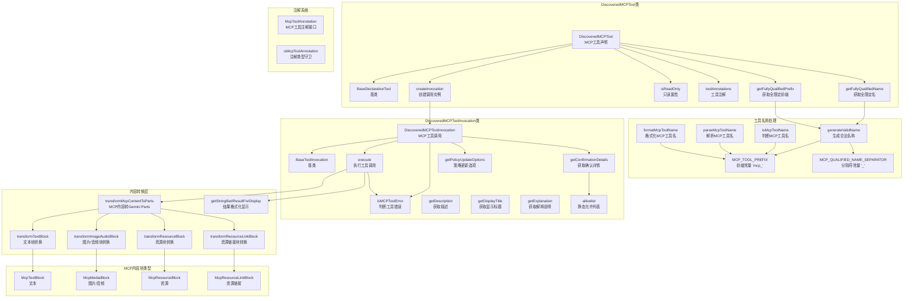

# mcp-tool.ts

## 概述

`mcp-tool.ts` 是 Gemini CLI 中 **MCP 工具的定义与执行层**。它将从 MCP 服务器发现的工具封装为 Gemini CLI 工具系统可识别的标准工具类，负责工具名称的生成与解析、工具调用的确认流程、MCP 响应内容的转换（文本、图片、音频、资源等），以及工具执行结果的格式化。

文件路径: `packages/core/src/tools/mcp-tool.ts`
代码行数: 约 616 行
许可证: Apache-2.0 (Google LLC 2025)

## 架构图（Mermaid）

## 核心组件

### 1. 工具名称常量与函数

#### 常量

| 常量 | 值 | 说明 |
|------|---|------|
| `MCP_QUALIFIED_NAME_SEPARATOR` | `'_'` | MCP 工具限定名分隔符 |
| `MCP_TOOL_PREFIX` | `'mcp_'` | MCP 工具必须的前缀 |
| `MAX_FUNCTION_NAME_LENGTH` | `64` | Gemini API 函数名最大长度 |

#### 名称处理函数

| 函数 | 签名 | 说明 |
|------|------|------|
| `isMcpToolName(name)` | `string -> boolean` | 判断名称是否以 `mcp_` 开头 |
| `parseMcpToolName(name)` | `string -> { serverName?, toolName? }` | 从 `mcp_{server}_{tool}` 格式解析服务器名和工具名 |
| `formatMcpToolName(serverName, toolName?)` | `(string, string?) -> string` | 组装全限定 MCP 工具名，支持通配符 `*` |
| `generateValidName(name)` | `string -> string` | 生成符合 Gemini API 规范的工具名称 |

#### `generateValidName()` 的处理逻辑

1. 确保名称以 `mcp_` 前缀开头
2. 替换非法字符（不符合 `^[a-zA-Z_][a-zA-Z0-9_\-.:]{0,63}$` 的字符）为下划线
3. 确保名称以字母或下划线开头
4. 如果超过 63 个字符（安全限制），取前 30 + `...` + 后 30 进行截断

#### `formatMcpToolName()` 的通配符支持

| serverName | toolName | 输出 |
|-----------|----------|------|
| `*` | `undefined` 或 `*` | `mcp_*` |
| `*` | `"read"` | `mcp_*_read` |
| `"myServer"` | `undefined` 或 `*` | `mcp_myServer_*` |
| `"myServer"` | `"read"` | `mcp_myServer_read` |

### 2. DiscoveredMCPTool 类

继承自 `BaseDeclarativeTool<ToolParams, ToolResult>`，是 MCP 工具的**声明层**（描述工具的元数据）。

**构造函数参数：**

| 参数 | 类型 | 说明 |
|------|------|------|
| `mcpTool` | `CallableTool` | 底层可调用工具适配器 |
| `serverName` | `string` | MCP 服务器名称 |
| `serverToolName` | `string` | 工具在 MCP 服务器上的原始名称 |
| `description` | `string` | 工具描述 |
| `parameterSchema` | `unknown` | 参数 JSON Schema |
| `messageBus` | `MessageBus` | 消息总线 |
| `trust` | `boolean?` | 是否信任该工具 |
| `isReadOnly` | `boolean?` | 是否为只读工具 |
| `nameOverride` | `string?` | 名称覆盖 |
| `cliConfig` | `McpContext?` | CLI 配置上下文 |
| `extensionName` | `string?` | 扩展名称 |
| `extensionId` | `string?` | 扩展ID |
| `_toolAnnotations` | `Record<string, unknown>?` | 工具注解数据 |

**关键方法：**

- **`createInvocation(params, messageBus)`**: 创建 `DiscoveredMCPToolInvocation` 实例，用于实际执行工具调用
- **`isReadOnly`**: 如果 MCP 工具注解包含 `readOnlyHint: true`，则返回 `true`
- **`toolAnnotations`**: 返回 MCP 工具注解数据
- **`getFullyQualifiedName()`**: 返回 `mcp_{serverName}_{toolName}` 格式的全限定名
- **`getFullyQualifiedPrefix()`**: 返回 `mcp_{serverName}_` 格式的前缀

**注册时的显示名格式:** `{serverToolName} ({serverName} MCP Server)`

### 3. DiscoveredMCPToolInvocation 类

继承自 `BaseToolInvocation<ToolParams, ToolResult>`，是 MCP 工具的**执行层**（处理确认、执行、结果）。

**静态属性：**
- `allowlist: Set<string>` — 静态允许列表，记录用户已批准的服务器或工具

**核心方法：**

#### `getConfirmationDetails()`
确认机制的核心逻辑：

1. **信任文件夹 + 信任服务器**: 直接跳过确认（返回 `false`）
2. **允许列表检查**: 检查服务器级别 (`serverName`) 或工具级别 (`serverName.toolName`) 是否已在允许列表中
3. **需要确认**: 返回 `ToolMcpConfirmationDetails` 对象，包含：
   - 服务器名称、工具名称、显示名称、参数、描述、参数 Schema
   - `onConfirm` 回调处理三种确认结果：
     - `ProceedAlwaysServer`: 将服务器加入允许列表
     - `ProceedAlwaysTool`: 将具体工具加入允许列表
     - `ProceedAlwaysAndSave`: 工具加入允许列表（持久化由调度器处理）

#### `getPolicyUpdateOptions()`
返回策略更新选项，包含 `mcpName` 和 `toolName`，用于策略引擎记录。

#### `execute(signal)`
工具执行的核心流程：

1. 标记用户与 MCP 交互 (`setUserInteractedWithMcp`)
2. 构建 `FunctionCall` 数组
3. 通过 Promise 竞赛实现 abort 信号支持
4. 调用 `mcpTool.callTool()` 获取原始响应
5. 检查响应是否包含错误 (`isMCPToolError`)
6. 如果有错误，返回包含错误信息的 `ToolResult`
7. 如果成功，转换 MCP 内容为 Gemini Parts (`transformMcpContentToParts`)
8. 返回包含 `llmContent` 和 `returnDisplay` 的 `ToolResult`

#### `isMCPToolError(rawResponseParts)`
判断 MCP 工具响应是否为错误：
- 检查顶层 `isError` 字段（MCP 规范兼容）
- 检查嵌套 `error.isError` 字段（向后兼容）
- 支持布尔值和字符串 `'true'`

#### `getDisplayTitle()`
智能显示标题：如果参数中有 `command` 字段（如 JetBrains 终端工具），直接显示命令字符串。

#### `getExplanation()`
截断超长参数：如果 JSON 序列化后超过 500 字符，仅显示前 5 个参数键名。

### 4. MCP 内容块类型系统

使用判别联合（Discriminated Union）定义 MCP 响应内容块：

| 类型 | 字段 | 说明 |
|------|------|------|
| `McpTextBlock` | `type: 'text'`, `text` | 纯文本 |
| `McpMediaBlock` | `type: 'image'\|'audio'`, `mimeType`, `data` | 图片或音频的 base64 数据 |
| `McpResourceBlock` | `type: 'resource'`, `resource: { text?, blob?, mimeType? }` | 嵌入式资源 |
| `McpResourceLinkBlock` | `type: 'resource_link'`, `uri`, `title?`, `name?` | 资源链接 |

### 5. 内容转换函数

#### `transformMcpContentToParts(sdkResponse)`
将 MCP 原始响应转换为 Gemini `Part[]` 数组：
- 从 `functionResponse.response.content` 提取 MCP 内容块
- 逐块调用对应的转换函数
- 过滤掉 `null` 结果

各内容块的转换逻辑：

| 转换函数 | 输入 | 输出 |
|---------|------|------|
| `transformTextBlock` | `McpTextBlock` | `{ text }` |
| `transformImageAudioBlock` | `McpMediaBlock` | `[{ text: 描述 }, { inlineData }]` |
| `transformResourceBlock` | `McpResourceBlock` | 文本返回 `{ text }`，blob 返回 `[{ text: 描述 }, { inlineData }]` |
| `transformResourceLinkBlock` | `McpResourceLinkBlock` | `{ text: "Resource Link: ..." }` |

#### `getStringifiedResultForDisplay(rawResponse)`
生成人类可读的显示字符串：
- 文本块直接显示
- 图片/音频显示 `[Image: mime]` / `[Audio: mime]`
- 资源链接显示 `[Link to title: uri]`
- 非 MCP 格式响应回退为 JSON 代码块

### 6. 注解接口

#### `McpToolAnnotation`
扩展 `Record<string, unknown>`，要求包含 `_serverName: string` 字段。

#### `isMcpToolAnnotation(annotation)`
类型守卫函数，验证对象是否实现了 `McpToolAnnotation` 接口。

## 依赖关系

### 内部依赖

| 模块 | 导入内容 | 用途 |
|------|---------|------|
| `../utils/safeJsonStringify.js` | `safeJsonStringify` | 安全 JSON 序列化（防循环引用） |
| `../utils/debugLogger.js` | `debugLogger` | 调试日志 |
| `./tools.js` | `BaseDeclarativeTool`, `BaseToolInvocation`, `Kind`, `ToolConfirmationOutcome` 等 | 工具基类和类型 |
| `./tool-error.js` | `ToolErrorType` | 工具错误类型枚举 |
| `../confirmation-bus/message-bus.js` | `MessageBus` | 确认流程的消息总线 |
| `./mcp-client.js` | `McpContext` | MCP 配置上下文接口 |

### 外部依赖

| 包名 | 导入内容 | 用途 |
|------|---------|------|
| `@google/genai` | `CallableTool`, `FunctionCall`, `Part` | Gemini SDK 类型 |

## 关键实现细节

### 1. 工具命名架构

MCP 工具在 Gemini CLI 中的名称遵循 `mcp_{serverName}_{toolName}` 格式。这个命名方案有以下设计考量：
- **唯一性**: 不同服务器的同名工具不会冲突
- **策略匹配**: 格式化名称支持通配符（`mcp_*`, `mcp_server_*`），使策略引擎能按服务器或全局级别匹配
- **API 兼容**: 自动替换非法字符、确保前缀和长度限制，符合 Gemini API 的函数名规范 `^[a-zA-Z_][a-zA-Z0-9_\-.:]{0,63}$`
- **截断策略**: 超长名称采用 `前30字符...后30字符` 的方式保留首尾信息

### 2. 确认流程的三层跳过机制

1. **信任层**: `isTrustedFolder() && trust` — 管理员级信任
2. **允许列表层**: 静态 `allowlist` — 会话级用户批准
3. **策略层**: 通过 `getPolicyUpdateOptions` 与策略引擎交互

允许列表使用两种粒度的 key：
- 服务器级: `serverName`
- 工具级: `serverName.toolName`

### 3. 执行时的 Abort 支持

`execute()` 方法通过手动 Promise 竞赛实现 abort 信号支持，而非依赖 MCP SDK 的内置 abort。这确保了取消操作的即时响应，即使底层 MCP 调用不支持取消。

### 4. 错误处理策略

MCP 工具错误不抛出异常，而是返回包含错误信息的 `ToolResult`：
- `llmContent` 包含完整错误消息（供 LLM 理解）
- `returnDisplay` 包含简化错误消息（供用户查看）
- `error.type` 设为 `ToolErrorType.MCP_TOOL_ERROR`

这与 MCP 规范一致：`CallToolResult` 应在响应体内返回错误而非抛出。

### 5. 多媒体内容处理

MCP 响应的图片和音频内容被转换为 Gemini 的 `inlineData` 格式，前面加上描述性文本 Part，帮助 LLM 理解内容类型。资源块（resource）同时支持文本和二进制（blob）两种嵌入方式。

### 6. 智能显示标题

`getDisplayTitle()` 特殊处理了终端执行类工具（如 JetBrains IDE 的终端工具），如果参数包含 `command` 字段，则直接显示命令字符串，提供更直观的用户体验。
