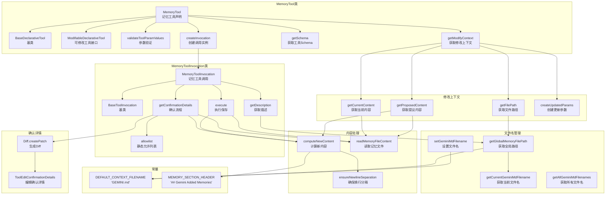

# memoryTool.ts

## 概述

`memoryTool.ts` 实现了 Gemini CLI 的 **记忆工具（Memory Tool）**，允许 AI 助手将重要信息持久化保存到全局的 `GEMINI.md` 文件中。该工具管理一个专门的 `## Gemini Added Memories` 区域，支持用户确认、编辑修改、Diff 预览，以及通过 `ModifiableDeclarativeTool` 接口进行内容修改。记忆存储为 Markdown 列表项，具有防注入安全处理。

文件路径: `packages/core/src/tools/memoryTool.ts`
代码行数: 约 346 行
许可证: Apache-2.0 (Google LLC 2025)

## 架构图（Mermaid）



## 核心组件

### 1. 常量与文件名管理

#### 常量

| 常量 | 值 | 说明 |
|------|---|------|
| `DEFAULT_CONTEXT_FILENAME` | `'GEMINI.md'` | 默认记忆文件名 |
| `MEMORY_SECTION_HEADER` | `'## Gemini Added Memories'` | 记忆区域的 Markdown 标题 |

#### 文件名管理函数

模块维护一个内部变量 `currentGeminiMdFilename`，支持单个文件名或文件名数组。

| 函数 | 说明 |
|------|------|
| `setGeminiMdFilename(newFilename)` | 设置当前记忆文件名，支持字符串或字符串数组，自动 trim |
| `getCurrentGeminiMdFilename()` | 获取当前文件名（如果是数组则取第一个） |
| `getAllGeminiMdFilenames()` | 获取所有文件名（单个值时包装为数组） |
| `getGlobalMemoryFilePath()` | 获取全局记忆文件的完整路径（`~/.gemini/GEMINI.md`） |

### 2. SaveMemoryParams 接口

```typescript
interface SaveMemoryParams {
  fact: string;              // 要记忆的内容
  modified_by_user?: boolean;   // 用户是否修改了内容
  modified_content?: string;    // 用户修改后的完整文件内容
}
```

`modified_by_user` 和 `modified_content` 用于支持用户在确认阶段编辑记忆内容后的回写流程。

### 3. 内容处理函数

#### `readMemoryFileContent()`
读取全局记忆文件内容。如果文件不存在（`ENOENT`），返回空字符串。其他错误会抛出。

#### `computeNewContent(currentContent, fact)`
计算添加新记忆后的文件完整内容：

1. **输入净化**:
   - 将换行符替换为空格，防止 Markdown 注入
   - 移除行首的 `-` 前缀（防止破坏列表格式）
   - 包装为 Markdown 列表项 `- {fact}`

2. **插入逻辑**:
   - **无标题**: 在文件末尾追加 `## Gemini Added Memories` 标题和新条目
   - **有标题**: 在 `## Gemini Added Memories` 区域末尾追加新条目（在下一个 `## ` 标题之前）

#### `ensureNewlineSeparation(currentContent)`
确保内容追加时有正确的换行分隔：
- 空内容: 无需分隔
- 已有双换行: 无需分隔
- 已有单换行: 追加一个换行
- 其他: 追加双换行

### 4. MemoryToolInvocation 类

继承自 `BaseToolInvocation<SaveMemoryParams, ToolResult>`，处理记忆保存的确认和执行。

**静态属性：**
- `allowlist: Set<string>` — 用文件路径作为 key 的允许列表

**属性：**
- `proposedNewContent: string | undefined` — 确认阶段计算的提议内容，执行阶段使用

#### `getConfirmationDetails()`
确认流程：

1. 检查允许列表，如果已通过则跳过确认
2. 读取当前文件内容
3. 确定提议内容：
   - 如果 `modified_by_user && modified_content` 存在，使用修改后的内容
   - 否则，使用 `computeNewContent()` 计算
4. 使用 `Diff.createPatch()` 生成 unified diff
5. 返回 `ToolEditConfirmationDetails`，包含文件路径、diff、原始内容和新内容
6. `onConfirm` 回调中，如果选择 `ProceedAlways`，将文件路径加入允许列表

#### `execute(signal)`
执行流程：

1. 确定写入内容：
   - 用户修改内容: 使用 `modified_content`
   - 用户批准原始提议: 使用 `proposedNewContent`
   - 无确认步骤（如 `--auto-confirm`）: 重新计算内容
2. 创建目录（递归 `mkdir`）
3. 写入文件
4. 返回成功或错误的 `ToolResult`

#### `getDescription()`
返回 `in ~/.gemini/GEMINI.md` 格式的描述（使用 `tildeifyPath` 将绝对路径转为 `~` 前缀）。

### 5. MemoryTool 类

继承自 `BaseDeclarativeTool<SaveMemoryParams, ToolResult>`，同时实现 `ModifiableDeclarativeTool<SaveMemoryParams>` 接口。

**静态属性：**
- `Name = MEMORY_TOOL_NAME` — 工具名称常量

**构造函数行为：**
- 工具名: `MEMORY_TOOL_NAME`
- 显示名: `'SaveMemory'`
- 描述: 从 `MEMORY_DEFINITION.base.description` 获取
- 分类: `Kind.Think`
- 输出为 Markdown: `true`
- 可更新输出: `false`

#### `validateToolParamValues(params)`
验证 `fact` 参数不能为空字符串。

#### `createInvocation(params, messageBus)`
创建 `MemoryToolInvocation` 实例。

#### `getSchema(modelId?)`
通过 `resolveToolDeclaration(MEMORY_DEFINITION, modelId)` 获取可能因模型不同而变化的 Schema。

#### `getModifyContext()`
实现 `ModifiableDeclarativeTool` 接口，返回 `ModifyContext<SaveMemoryParams>` 对象：

| 方法 | 说明 |
|------|------|
| `getFilePath(params)` | 返回全局记忆文件路径 |
| `getCurrentContent(params)` | 异步读取当前文件内容 |
| `getProposedContent(params)` | 计算提议内容（与确认逻辑一致） |
| `createUpdatedParams(old, modified, original)` | 创建包含用户修改内容的新参数 |

## 依赖关系

### 内部依赖

| 模块 | 导入内容 | 用途 |
|------|---------|------|
| `./tools.js` | `BaseDeclarativeTool`, `BaseToolInvocation`, `Kind`, `ToolConfirmationOutcome`, `ToolEditConfirmationDetails`, `ToolResult` | 工具基类和类型 |
| `../config/storage.js` | `Storage` | 全局配置目录管理 |
| `./diffOptions.js` | `DEFAULT_DIFF_OPTIONS` | Diff 生成选项 |
| `../utils/paths.js` | `tildeifyPath` | 路径 `~` 化 |
| `./modifiable-tool.js` | `ModifiableDeclarativeTool`, `ModifyContext` | 可修改工具接口 |
| `./tool-error.js` | `ToolErrorType` | 工具错误类型 |
| `./tool-names.js` | `MEMORY_TOOL_NAME` | 工具名称常量 |
| `../confirmation-bus/message-bus.js` | `MessageBus` | 消息总线 |
| `./definitions/coreTools.js` | `MEMORY_DEFINITION` | 工具定义 |
| `./definitions/resolver.js` | `resolveToolDeclaration` | 工具声明解析器 |

### 外部依赖

| 包名 | 导入内容 | 用途 |
|------|---------|------|
| `node:fs/promises` | `fs` | 文件系统异步操作 |
| `node:path` | `path` | 路径处理 |
| `diff` | `Diff` | 生成 unified diff |

## 关键实现细节

### 1. Markdown 注入防护

`computeNewContent()` 对用户输入的 `fact` 进行安全处理：
- 将所有换行符 (`\r`, `\n`) 替换为空格，防止注入新的 Markdown 段落或标题
- 移除行首的连字符序列，防止破坏列表结构
- 最终包装为单行列表项 `- {sanitized_fact}`

### 2. 确认与执行的一致性保证

确认阶段和执行阶段使用同一份 `proposedNewContent`：
- 确认阶段计算并缓存 `this.proposedNewContent`
- 执行阶段直接使用缓存的内容，确保"所见即所得"
- 对于无确认流程（如 `--auto-confirm`），执行阶段会重新计算内容作为回退

### 3. 用户修改流程

当用户在确认阶段编辑了提议内容时：
1. `modified_by_user` 设为 `true`
2. `modified_content` 包含用户编辑后的完整文件内容
3. 确认阶段的 diff 展示用户修改后的版本
4. 执行阶段直接写入用户修改的内容

### 4. 记忆区域定位策略

文件中可能包含用户自定义内容和记忆区域。记忆工具通过以下方式定位记忆区域：
- 查找 `## Gemini Added Memories` 标题
- 在该标题和下一个 `## ` 标题之间为记忆区域
- 新记忆追加到区域末尾
- 如果标题不存在，在文件末尾创建新的记忆区域

### 5. ModifiableDeclarativeTool 接口实现

通过 `getModifyContext()` 方法，MemoryTool 支持外部编辑器修改提议内容。这个接口为工具提供了一种标准化的方式来支持 "编辑后再确认" 的用户交互模式。

### 6. 文件名多值支持

`currentGeminiMdFilename` 支持字符串数组，允许多个记忆文件名配置。但写入操作始终使用第一个文件名（`getCurrentGeminiMdFilename()` 返回数组的第一个元素）。数组模式可能用于读取多个上下文文件的场景。

### 7. 错误处理

- 文件不存在: 静默创建（读取时返回空字符串，写入时自动 `mkdir`）
- 写入失败: 返回 `ToolResult` 包含错误信息和 `ToolErrorType.MEMORY_TOOL_EXECUTION_ERROR`
- 参数无效: `validateToolParamValues` 返回错误消息字符串
