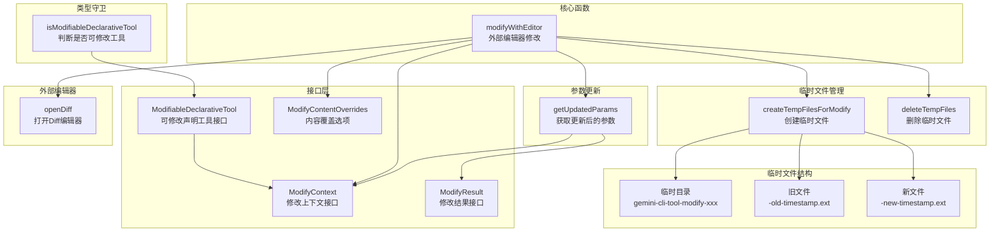

# modifiable-tool.ts

## 概述

`modifiable-tool.ts` 定义了 Gemini CLI 的 **可修改工具（Modifiable Tool）** 抽象层。它提供了一套接口和函数，使得工具（如记忆工具、文件编辑工具等）能够支持"在外部编辑器中修改提议内容后再执行"的用户交互模式。核心流程是：创建临时文件 -> 在外部 Diff 编辑器中打开 -> 读取用户修改 -> 生成新参数和 Diff。

文件路径: `packages/core/src/tools/modifiable-tool.ts`
代码行数: 约 213 行
许可证: Apache-2.0 (Google LLC 2025)

## 架构图（Mermaid）



## 核心组件

### 1. 接口定义

#### ModifiableDeclarativeTool\<TParams\>

```typescript
interface ModifiableDeclarativeTool<TParams extends object>
  extends DeclarativeTool<TParams, ToolResult> {
  getModifyContext(abortSignal: AbortSignal): ModifyContext<TParams>;
}
```

扩展了 `DeclarativeTool` 接口，添加 `getModifyContext()` 方法。实现该接口的工具支持用户在确认阶段通过外部编辑器修改提议内容。

#### ModifyContext\<ToolParams\>

```typescript
interface ModifyContext<ToolParams> {
  getFilePath: (params: ToolParams) => string;
  getCurrentContent: (params: ToolParams) => Promise<string>;
  getProposedContent: (params: ToolParams) => Promise<string>;
  createUpdatedParams: (
    oldContent: string,
    modifiedProposedContent: string,
    originalParams: ToolParams,
  ) => ToolParams;
}
```

修改上下文，定义了工具如何提供和处理修改内容：

| 方法 | 说明 |
|------|------|
| `getFilePath(params)` | 获取目标文件路径（用于临时文件命名和 Diff 标题） |
| `getCurrentContent(params)` | 异步获取当前文件的内容（Diff 左侧） |
| `getProposedContent(params)` | 异步获取 AI 提议的内容（Diff 右侧） |
| `createUpdatedParams(old, modified, original)` | 根据用户在编辑器中的修改，创建新的工具参数 |

#### ModifyResult\<ToolParams\>

```typescript
interface ModifyResult<ToolParams> {
  updatedParams: ToolParams;  // 更新后的工具参数
  updatedDiff: string;         // 更新后的 Diff 字符串
}
```

#### ModifyContentOverrides

```typescript
interface ModifyContentOverrides {
  currentContent?: string | null;  // 覆盖当前内容
  proposedContent?: string;         // 覆盖提议内容
}
```

允许调用方覆盖默认的内容获取逻辑，直接提供内容。

### 2. 类型守卫函数

#### `isModifiableDeclarativeTool(tool)`

```typescript
function isModifiableDeclarativeTool(
  tool: AnyDeclarativeTool,
): tool is ModifiableDeclarativeTool<object>
```

通过检查 `'getModifyContext' in tool` 判断工具是否实现了 `ModifiableDeclarativeTool` 接口。

### 3. 核心函数 `modifyWithEditor()`

```typescript
async function modifyWithEditor<ToolParams>(
  originalParams: ToolParams,
  modifyContext: ModifyContext<ToolParams>,
  editorType: EditorType,
  _abortSignal: AbortSignal,
  overrides?: ModifyContentOverrides,
): Promise<ModifyResult<ToolParams>>
```

这是模块的核心入口函数，完整流程如下：

1. **获取内容**: 从 `modifyContext` 或 `overrides` 获取当前内容和提议内容
2. **创建临时文件**: 调用 `createTempFilesForModify()` 创建临时目录和文件
3. **打开编辑器**: 调用 `openDiff()` 在外部 Diff 编辑器中打开两个临时文件
4. **等待用户编辑**: 阻塞等待编辑器关闭
5. **读取修改**: 调用 `getUpdatedParams()` 读取用户修改后的文件内容
6. **生成结果**: 创建更新后的参数和新的 Diff
7. **清理**: 在 `finally` 块中删除临时文件

### 4. 临时文件管理

#### `createTempFilesForModify(currentContent, proposedContent, file_path)`

创建临时文件用于 Diff 编辑：

1. 在系统临时目录创建以 `gemini-cli-tool-modify-` 为前缀的唯一目录
2. 设置目录权限为 `0o700`（仅所有者可访问）
3. 创建两个临时文件：
   - `gemini-cli-modify-{filename}-old-{timestamp}{ext}` — 旧内容
   - `gemini-cli-modify-{filename}-new-{timestamp}{ext}` — 新内容（提议）
4. 文件权限为 `0o600`（仅所有者可读写）
5. 保留原始文件扩展名，确保编辑器语法高亮正确

返回 `{ oldPath, newPath, dirPath }` 供后续使用。

#### `deleteTempFiles(oldPath, newPath, dirPath)`

清理临时文件：
1. 删除旧文件
2. 删除新文件
3. 删除临时目录
4. 每一步的错误都被静默捕获并记录日志

### 5. 参数更新函数

#### `getUpdatedParams(tmpOldPath, tempNewPath, originalParams, modifyContext)`

1. 读取编辑器关闭后的旧文件和新文件内容（如果文件已被编辑器删除，默认为空字符串）
2. 调用 `modifyContext.createUpdatedParams()` 生成新的工具参数
3. 使用 `Diff.createPatch()` 生成新的 unified diff
4. 返回 `{ updatedParams, updatedDiff }`

## 依赖关系

### 内部依赖

| 模块 | 导入内容 | 用途 |
|------|---------|------|
| `../utils/editor.js` | `openDiff`, `EditorType` | 外部 Diff 编辑器操作 |
| `./diffOptions.js` | `DEFAULT_DIFF_OPTIONS` | Diff 生成选项 |
| `../utils/errors.js` | `isNodeError` | Node 错误类型判断 |
| `./tools.js` | `AnyDeclarativeTool`, `DeclarativeTool`, `ToolResult` | 工具基类和类型 |
| `../utils/debugLogger.js` | `debugLogger` | 调试日志 |

### 外部依赖

| 包名 | 导入内容 | 用途 |
|------|---------|------|
| `node:os` | `os` | 获取系统临时目录 |
| `node:path` | `path` | 路径处理 |
| `node:fs` | `fs` | 同步文件操作 |
| `diff` | `Diff` | 生成 unified diff |

## 关键实现细节

### 1. 安全性设计

临时文件和目录采用严格的权限控制：
- **临时目录**: `0o700` 权限，仅创建者可读写执行
- **临时文件**: `0o600` 权限，仅创建者可读写
- 这防止了其他用户或进程读取或篡改正在编辑的文件内容

### 2. 临时文件命名策略

文件命名格式: `gemini-cli-modify-{原始文件名}-{old|new}-{时间戳}.{扩展名}`

设计考量：
- **保留扩展名**: 确保外部编辑器能正确识别文件类型并提供语法高亮
- **包含时间戳**: 防止并发操作时的文件名冲突
- **包含 old/new 标识**: 帮助用户在编辑器中区分当前内容和提议内容

### 3. 内容覆盖机制

`ModifyContentOverrides` 允许调用方跳过 `ModifyContext` 的内容获取逻辑：
- 使用 `'currentContent' in overrides` 检查（而非 truthy 检查），因此 `null` 值也被视为有效覆盖
- 这在已有缓存内容的场景下避免了重复的异步 I/O 操作

### 4. 资源清理保证

`modifyWithEditor()` 使用 `try...finally` 确保无论编辑器操作成功或失败，临时文件都会被清理。`deleteTempFiles()` 内部也对每个删除操作独立 try-catch，确保单个文件删除失败不影响其他文件的清理。

### 5. 编辑器阻塞模式

`openDiff()` 是一个阻塞式异步调用——它等待用户关闭外部编辑器后才返回。这确保了读取用户修改时文件已经是最终状态。

### 6. 泛型设计

整个模块使用 `ToolParams` 泛型参数，使得不同工具可以使用自己的参数类型。例如：
- `MemoryTool` 使用 `SaveMemoryParams { fact, modified_by_user, modified_content }`
- 文件编辑工具可以使用自己的参数结构

`ModifyContext` 的 `createUpdatedParams()` 方法是关键的适配点，它定义了如何将编辑器中的修改映射回工具特定的参数格式。

### 7. 容错处理

`getUpdatedParams()` 在读取临时文件时处理了文件不存在（`ENOENT`）的情况，默认返回空字符串。这对应于用户在编辑器中删除了临时文件的极端场景。
