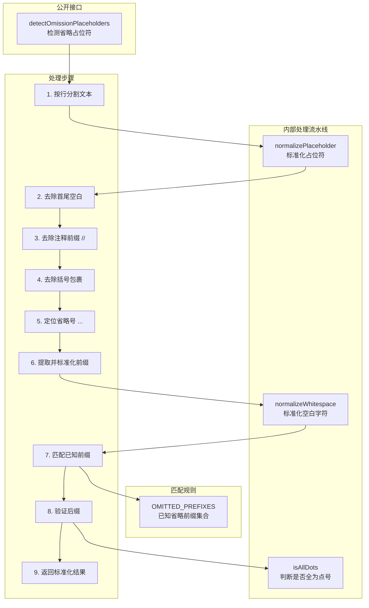

# omissionPlaceholderDetector.ts

## 概述

`omissionPlaceholderDetector.ts` 是一个轻量级的 **省略占位符检测器**，用于识别代码或文本中 AI 模型常用的"省略"标记（如 `// rest of code ...`、`(unchanged methods ...)` 等）。当 AI 生成的代码包含这些占位符时，表示模型偷懒省略了部分内容，系统可据此提示用户或要求模型补全。该模块是纯函数式的，无副作用，无外部依赖。

文件路径: `packages/core/src/tools/omissionPlaceholderDetector.ts`
代码行数: 约 107 行
许可证: Apache-2.0 (Google LLC 2025)

## 架构图（Mermaid）



## 核心组件

### 1. 常量

#### `OMITTED_PREFIXES`

```typescript
const OMITTED_PREFIXES = new Set([
  'rest of',
  'rest of method',
  'rest of methods',
  'rest of code',
  'unchanged code',
  'unchanged method',
  'unchanged methods',
]);
```

预定义的省略占位符前缀集合，包含 7 种常见的 AI 省略表达方式。使用 `Set` 保证 O(1) 查找性能。这些前缀覆盖了两种主要的省略语义：
- **"rest of ..."**: 表示"剩余部分"
- **"unchanged ..."**: 表示"未修改的部分"

### 2. 公开函数

#### `detectOmissionPlaceholders(text)`

```typescript
function detectOmissionPlaceholders(text: string): string[]
```

**入口函数**，接收一段文本（通常是 AI 生成的代码），返回所有检测到的省略占位符的标准化表示数组。

处理流程：
1. 统一换行符（`\r\n` -> `\n`）
2. 按行分割
3. 对每一行调用 `normalizePlaceholder()`
4. 收集所有非 `null` 的结果

**返回值示例：** `["rest of code ...", "unchanged methods ..."]`

### 3. 内部函数

#### `normalizePlaceholder(line)`

```typescript
function normalizePlaceholder(line: string): string | null
```

单行占位符检测与标准化的核心逻辑，处理步骤：

1. **去除首尾空白**: `trim()`
2. **去除注释前缀**: 如果以 `//` 开头，去除并 trim
3. **去除括号包裹**: 如果以 `(` 开头且以 `)` 结尾，去除并 trim
4. **定位省略号**: 查找 `...` 的位置，未找到则返回 `null`
5. **提取前缀**: 取 `...` 之前的文本，转小写并标准化空白
6. **匹配前缀**: 检查是否在 `OMITTED_PREFIXES` 中，不在则返回 `null`
7. **验证后缀**: `...` 之后的内容必须为空或全为 `.`（如 `......`），否则返回 `null`
8. **返回标准化结果**: 格式为 `"{prefix} ..."`

**支持的格式示例：**

| 输入 | 输出 |
|------|------|
| `// rest of code ...` | `"rest of code ..."` |
| `(unchanged methods ...)` | `"unchanged methods ..."` |
| `  rest of method ...  ` | `"rest of method ..."` |
| `// (rest of code ...)` | `"rest of code ..."` |
| `rest of code ......` | `"rest of code ..."` |
| `rest of  code  ...` | `"rest of code ..."` |

**不匹配的示例：**

| 输入 | 原因 |
|------|------|
| `some other text ...` | 前缀不在 OMITTED_PREFIXES 中 |
| `rest of code` | 没有省略号 `...` |
| `rest of code ... more text` | 后缀不是全点号 |

#### `normalizeWhitespace(input)`

```typescript
function normalizeWhitespace(input: string): string
```

将连续的空白字符（空格、制表符、换行符）压缩为单个空格。手动逐字符处理，未使用正则表达式。

**示例：** `"rest   of\t\tcode"` -> `"rest of code"`

#### `isAllDots(str)`

```typescript
function isAllDots(str: string): boolean
```

检查字符串是否只由 `.` 字符组成。空字符串返回 `false`。手动逐字符检查，无正则。

**用途：** 验证 `...` 后面的后缀部分（如 `......`）是否有效。

## 依赖关系

### 内部依赖

无内部依赖。

### 外部依赖

无外部依赖。

这是一个完全自包含的纯函数模块。

## 关键实现细节

### 1. 纯函数式设计

整个模块不依赖任何外部状态、不产生副作用、不导入任何模块。所有函数都是纯函数，输入确定则输出确定。这使得模块非常易于测试和维护。

### 2. 性能优化

- **`OMITTED_PREFIXES` 使用 `Set`**: O(1) 的查找时间复杂度
- **手动字符遍历而非正则**: `isAllDots()` 和 `normalizeWhitespace()` 都使用逐字符遍历而非正则表达式，避免了正则引擎的开销
- **逐行处理**: 文本按行处理而非全文正则匹配，减少回溯风险

### 3. 多格式兼容

检测器能处理 AI 模型输出的多种占位符格式变体：
- **注释风格**: `// rest of code ...`
- **括号风格**: `(rest of code ...)`
- **组合风格**: `// (rest of code ...)`
- **额外点号**: `rest of code ......`
- **多余空白**: `rest  of   code  ...`
- **带缩进**: `    rest of code ...`

### 4. 标准化输出

所有匹配结果都被标准化为统一格式 `"{lowercase_prefix} ..."`，方便下游代码进行精确比较或计数。

### 5. 防误报策略

严格的匹配规则降低了误报率：
- 必须包含 `...`（精确三个点）
- 前缀必须精确匹配预定义集合中的某一项
- 后缀只允许额外的点号字符，不允许其他文本
- 这意味着 `"rest of the implementation ..."` 不会被匹配（`"rest of the implementation"` 不在前缀集合中）

### 6. 使用场景

该检测器主要用于 Gemini CLI 的文件写入/编辑工具中，在 AI 模型生成代码后检测是否存在省略占位符。如果检测到，系统可以：
- 警告用户代码不完整
- 要求模型重新生成完整代码
- 拒绝写入包含占位符的内容
