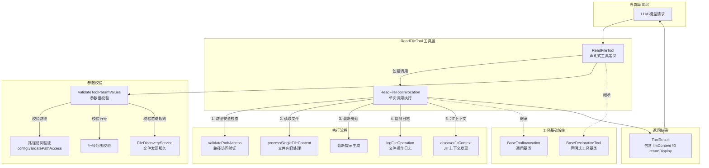

# read-file.ts

## 概述

`read-file.ts` 是 Gemini CLI 核心工具包中的**单文件读取工具**，负责根据 LLM（大语言模型）的请求读取指定路径的文件内容并返回给模型。它支持全文读取和按行范围读取，具备路径安全校验、文件过滤、内容截断提示、遥测日志记录以及 JIT（Just-In-Time）上下文注入等能力。

该文件导出两个核心类：
- **`ReadFileToolInvocation`**：单次读取调用的执行逻辑（内部类）。
- **`ReadFileTool`**：工具的声明式定义与生命周期管理（对外导出类）。

此外还导出了参数接口 `ReadFileToolParams`。

## 架构图（Mermaid）

## 核心组件

### 1. `ReadFileToolParams` 接口

参数接口，定义了工具调用所需的输入参数：

| 参数名 | 类型 | 必填 | 说明 |
|--------|------|------|------|
| `file_path` | `string` | 是 | 要读取的文件路径（相对于目标目录） |
| `start_line` | `number` | 否 | 起始行号（1-based） |
| `end_line` | `number` | 否 | 结束行号（1-based，包含） |

### 2. `ReadFileToolInvocation` 类（内部类）

继承自 `BaseToolInvocation<ReadFileToolParams, ToolResult>`，封装了一次文件读取的完整执行逻辑。

#### 构造函数
- 接收 `Config`、`ReadFileToolParams`、`MessageBus` 等参数。
- 通过 `path.resolve(config.getTargetDir(), params.file_path)` 将相对路径解析为绝对路径，存储在 `resolvedPath` 中。

#### 关键方法

| 方法 | 说明 |
|------|------|
| `getDescription()` | 返回文件的缩短相对路径，用于 UI 展示 |
| `toolLocations()` | 返回工具操作的位置信息（文件路径 + 起始行号），用于定位 |
| `getPolicyUpdateOptions()` | 返回策略更新选项，基于文件路径生成 args 模式 |
| `execute()` | **核心执行方法**，完成整个读取流程 |

#### `execute()` 方法详细流程

1. **路径访问验证**：调用 `config.validatePathAccess(resolvedPath, 'read')` 检查路径是否在工作区内。若不合法，返回 `PATH_NOT_IN_WORKSPACE` 错误。
2. **文件内容处理**：调用 `processSingleFileContent()` 读取文件，支持行范围裁切。
3. **错误处理**：如果读取结果中包含 `error`，直接封装返回。
4. **截断处理**：如果内容被截断（`isTruncated` 为 `true`），在内容前添加提示信息，告诉 LLM 当前显示的行范围和总行数，并建议使用 `start_line` 参数继续读取。
5. **遥测日志**：构造 `FileOperationEvent`，记录操作类型（READ）、行数、MIME 类型、文件扩展名和编程语言。
6. **JIT 上下文注入**：调用 `discoverJitContext()` 发现与文件路径关联的上下文信息。如果存在 JIT 上下文，根据 `llmContent` 的类型（字符串或 Part 列表），分别调用 `appendJitContext()` 或 `appendJitContextToParts()` 进行追加。
7. **返回结果**：返回包含 `llmContent` 和 `returnDisplay` 的 `ToolResult`。

### 3. `ReadFileTool` 类（对外导出）

继承自 `BaseDeclarativeTool<ReadFileToolParams, ToolResult>`，是文件读取工具的声明式定义类。

#### 静态属性
- `Name`：工具名称，取自 `READ_FILE_TOOL_NAME` 常量。

#### 构造函数
- 接收 `Config` 和 `MessageBus`。
- 调用父类构造，传入工具名、显示名、描述、Kind（`Kind.Read`）、参数 JSON Schema 等。
- 初始化 `FileDiscoveryService` 实例，用于文件过滤。

#### 关键方法

| 方法 | 说明 |
|------|------|
| `validateToolParamValues()` | 校验参数合法性（路径非空、路径访问权限、行号范围、忽略规则） |
| `createInvocation()` | 工厂方法，创建 `ReadFileToolInvocation` 实例 |
| `getSchema()` | 根据模型 ID 解析并返回工具声明 |

#### `validateToolParamValues()` 校验规则

1. `file_path` 不能为空字符串。
2. 解析后的路径必须通过 `validatePathAccess` 的读取权限校验。
3. `start_line` 必须 >= 1（如果提供）。
4. `end_line` 必须 >= 1（如果提供）。
5. `start_line` 不能大于 `end_line`。
6. 文件不能被配置的忽略规则所忽略（通过 `FileDiscoveryService.shouldIgnoreFile()` 检查）。

## 依赖关系

### 内部依赖

| 模块路径 | 导入内容 | 用途 |
|----------|----------|------|
| `../confirmation-bus/message-bus.js` | `MessageBus` 类型 | 消息总线，用于工具确认流程 |
| `../utils/paths.js` | `makeRelative`, `shortenPath` | 路径处理工具函数 |
| `./tools.js` | `BaseDeclarativeTool`, `BaseToolInvocation`, `Kind`, 以及多个类型 | 工具基类与核心类型定义 |
| `./tool-error.js` | `ToolErrorType` | 错误类型枚举 |
| `../policy/utils.js` | `buildFilePathArgsPattern` | 策略更新参数模式构建 |
| `../utils/fileUtils.js` | `processSingleFileContent`, `getSpecificMimeType` | 文件内容读取与 MIME 类型检测 |
| `../config/config.js` | `Config` 类型 | 全局配置对象 |
| `../telemetry/metrics.js` | `FileOperation` | 文件操作枚举（READ/WRITE 等） |
| `../telemetry/telemetry-utils.js` | `getProgrammingLanguage` | 根据文件路径推断编程语言 |
| `../telemetry/loggers.js` | `logFileOperation` | 记录文件操作遥测日志 |
| `../telemetry/types.js` | `FileOperationEvent` | 文件操作事件类 |
| `./tool-names.js` | `READ_FILE_TOOL_NAME`, `READ_FILE_DISPLAY_NAME` | 工具名称常量 |
| `../services/fileDiscoveryService.js` | `FileDiscoveryService` | 文件发现服务，检查文件是否应被忽略 |
| `./definitions/coreTools.js` | `READ_FILE_DEFINITION` | 工具声明定义 |
| `./definitions/resolver.js` | `resolveToolDeclaration` | 根据模型 ID 解析工具声明 |
| `./jit-context.js` | `discoverJitContext`, `appendJitContext`, `appendJitContextToParts` | JIT 上下文发现与追加 |

### 外部依赖

| 包名 | 导入内容 | 用途 |
|------|----------|------|
| `node:path` | `path` | Node.js 路径处理模块 |
| `@google/genai` | `PartListUnion` 类型 | Google GenAI SDK 的内容部分联合类型 |

## 关键实现细节

### 1. 路径解析与安全机制

文件路径经过两层安全校验：
- **`validateToolParamValues`**（工具层）：在创建调用之前校验参数合法性，包括路径访问权限和忽略规则。
- **`execute`**（执行层）：在实际执行时再次校验路径访问权限，作为双重保障。

路径始终通过 `path.resolve(config.getTargetDir(), params.file_path)` 解析，确保以目标目录为基准。

### 2. 内容截断与续读指引

当文件内容过长被截断时（`result.isTruncated === true`），工具会在返回内容头部插入一段指引信息，包含：
- 当前展示的行范围（如 "Showing lines 1-500 of 2000 total lines"）。
- 明确的续读建议（如 "use start_line: 501"），引导 LLM 在后续请求中继续读取剩余内容。

### 3. JIT（Just-In-Time）上下文注入

读取文件后，工具会尝试发现与该文件路径关联的 JIT 上下文（例如子目录级别的上下文信息）。这些上下文信息会被追加到返回给 LLM 的内容中，为模型提供额外的背景知识，帮助其更好地理解代码上下文。

JIT 上下文的追加方式取决于 `llmContent` 的类型：
- 如果是字符串，调用 `appendJitContext()` 直接拼接。
- 如果是 `PartListUnion`（多模态内容），调用 `appendJitContextToParts()` 以 Part 形式追加。

### 4. 遥测数据采集

每次成功读取文件后，都会通过 `logFileOperation()` 记录以下信息：
- 工具名称（`READ_FILE_TOOL_NAME`）
- 操作类型（`FileOperation.READ`）
- 读取的行数
- 文件 MIME 类型
- 文件扩展名
- 编程语言

### 5. 策略模式支持

通过 `getPolicyUpdateOptions()` 方法，工具支持策略系统的自动更新。当用户对某个文件的读取请求做出确认/拒绝后，系统可以基于生成的 `argsPattern` 自动应用到相似路径的后续请求中。

### 6. 工具声明的模型适配

`getSchema()` 方法接收可选的 `modelId` 参数，通过 `resolveToolDeclaration()` 返回与特定模型兼容的工具声明。这使得同一个工具可以根据不同模型的能力调整其声明。
