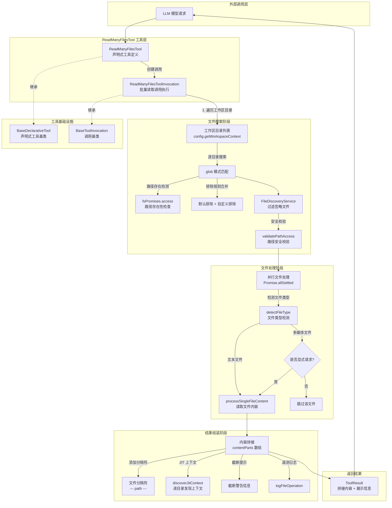

# read-many-files.ts

## 概述

`read-many-files.ts` 是 Gemini CLI 核心工具包中的**批量文件读取工具**，允许 LLM 通过 glob 模式一次性搜索并读取多个文件的内容。它将所有匹配文件的内容拼接后返回给模型，支持包含/排除模式、默认排除规则、`.gitignore`/`.geminiignore` 过滤、多工作区目录扫描、多媒体文件智能跳过以及 JIT 上下文注入。

该文件导出两个核心类：
- **`ReadManyFilesToolInvocation`**（内部类）：单次批量读取调用的完整执行逻辑。
- **`ReadManyFilesTool`**（对外导出类）：工具的声明式定义与生命周期管理。

此外还导出了参数接口 `ReadManyFilesParams` 和内部类型 `FileProcessingResult`。

## 架构图（Mermaid）

## 核心组件

### 1. `ReadManyFilesParams` 接口

参数接口，定义了批量文件读取的输入参数：

| 参数名 | 类型 | 必填 | 默认值 | 说明 |
|--------|------|------|--------|------|
| `include` | `string[]` | 是 | - | glob 包含模式列表，如 `["*.ts", "src/**/*.md"]` |
| `exclude` | `string[]` | 否 | `[]` | glob 排除模式列表，如 `["*.log", "dist/**"]` |
| `recursive` | `boolean` | 否 | - | 是否递归搜索（实际由 glob 的 `**` 模式控制） |
| `useDefaultExcludes` | `boolean` | 否 | `true` | 是否应用默认排除模式 |
| `file_filtering_options` | `object` | 否 | - | 文件过滤选项：是否尊重 `.gitignore` 和 `.geminiignore` |

### 2. `FileProcessingResult` 联合类型

用于表示单个文件处理结果的判别联合类型（Discriminated Union）：

- **成功时**：`{ success: true, filePath, relativePathForDisplay, fileReadResult }`
- **失败时**：`{ success: false, filePath, relativePathForDisplay, reason }`

### 3. `getDefaultExcludes()` 函数

获取默认排除模式列表。通过 `config.getFileExclusions().getReadManyFilesExcludes()` 获取，如果 config 不可用则返回空数组。

### 4. 常量

| 常量名 | 值 | 说明 |
|--------|-----|------|
| `DEFAULT_OUTPUT_SEPARATOR_FORMAT` | `"--- {filePath} ---"` | 文件内容间的分隔符模板 |
| `DEFAULT_OUTPUT_TERMINATOR` | `"\n" + REFERENCE_CONTENT_END` | 输出终止符 |

### 5. `ReadManyFilesToolInvocation` 类（内部类）

继承自 `BaseToolInvocation<ReadManyFilesParams, ToolResult>`，封装一次批量文件读取的完整执行逻辑。

#### 关键方法

| 方法 | 说明 |
|------|------|
| `getDescription()` | 生成可读的操作描述，包括搜索模式、排除模式和编码信息 |
| `getPolicyUpdateOptions()` | 基于 `include` 参数构建策略更新的 args 模式 |
| `execute(signal)` | **核心执行方法**，完成整个批量读取流程 |

#### `execute()` 方法详细流程

**第一阶段：文件搜索**

1. **合并排除规则**：根据 `useDefaultExcludes` 参数，将默认排除模式与用户自定义排除模式合并。
2. **遍历工作区目录**：通过 `config.getWorkspaceContext().getDirectories()` 获取所有工作区目录。
3. **路径存在性检测**：对每个 include 模式，先通过 `fsPromises.access()` 检查是否为实际存在的路径。如果存在，使用 `escape()` 转义；如果不存在，当作 glob 模式处理。
4. **执行 glob 匹配**：在每个工作区目录中执行 glob 搜索，使用参数 `{ nodir: true, dot: true, absolute: true, nocase: true, signal }` 并传入排除规则。
5. **文件过滤**：通过 `FileDiscoveryService.filterFilesWithReport()` 进行 `.gitignore` 和 `.geminiignore` 过滤，获取过滤后的路径列表和被忽略的文件数量。
6. **安全校验**：对每个过滤后的文件路径执行 `validatePathAccess()` 检查，确保在工作区范围内。

**第二阶段：并行文件处理**

7. **排序文件列表**：将待处理文件路径排序。
8. **并行读取**：使用 `Promise.allSettled()` 并行处理所有文件：
   - 先通过 `detectFileType()` 检测文件类型。
   - 如果是多媒体文件（image/pdf/audio）且未被显式请求（include 模式中不包含该文件扩展名或文件名），则跳过。
   - 调用 `processSingleFileContent()` 读取文件内容。
   - 如果读取出错，记录到跳过列表。

**第三阶段：结果组装**

9. **遍历处理结果**：
   - 成功的文本文件：添加分隔符 `--- {filePath} ---`，如果被截断则添加警告信息。
   - 成功的多模态文件（非字符串 llmContent）：直接添加到 contentParts。
   - 失败或被拒绝的文件：添加到 skippedFiles 列表。
10. **遥测日志**：每个成功读取的文件都记录 `FileOperationEvent`。
11. **JIT 上下文注入**：收集所有处理过的文件的唯一父目录，逐个（顺序执行，避免重复注入共享父目录的 GEMINI.md）调用 `discoverJitContext()`，将发现的上下文拼接到 contentParts。
12. **生成展示信息**：构建 Markdown 格式的展示消息，包含处理成功的文件列表（最多展示 10 个）和跳过的文件列表（最多展示 5 个）。
13. **添加终止符**：如果有内容，添加 `DEFAULT_OUTPUT_TERMINATOR`；如果没有内容，添加"未找到匹配文件"的提示。

### 6. `ReadManyFilesTool` 类（对外导出）

继承自 `BaseDeclarativeTool<ReadManyFilesParams, ToolResult>`，是批量文件读取工具的声明式定义类。

#### 静态属性
- `Name`：工具名称，取自 `READ_MANY_FILES_TOOL_NAME` 常量。

#### 构造函数
- 接收 `Config` 和 `MessageBus`。
- 调用父类构造，传入工具名（`ReadManyFiles`）、Kind（`Kind.Read`）、参数 Schema 等。
- `isOutputMarkdown` 为 `true`，`canUpdateOutput` 为 `false`。

#### 关键方法

| 方法 | 说明 |
|------|------|
| `createInvocation()` | 工厂方法，创建 `ReadManyFilesToolInvocation` 实例 |
| `getSchema()` | 根据模型 ID 解析并返回工具声明 |

注意：与 `ReadFileTool` 不同，`ReadManyFilesTool` **没有覆写 `validateToolParamValues()`**，参数校验完全由 `execute()` 内部逻辑处理。

## 依赖关系

### 内部依赖

| 模块路径 | 导入内容 | 用途 |
|----------|----------|------|
| `../confirmation-bus/message-bus.js` | `MessageBus` 类型 | 消息总线，用于工具确认流程 |
| `./tools.js` | `BaseDeclarativeTool`, `BaseToolInvocation`, `Kind`, 以及多个类型 | 工具基类与核心类型定义 |
| `../utils/errors.js` | `getErrorMessage` | 错误信息提取工具 |
| `../policy/utils.js` | `buildParamArgsPattern` | 策略更新参数模式构建 |
| `../utils/fileUtils.js` | `detectFileType`, `processSingleFileContent`, `DEFAULT_ENCODING`, `getSpecificMimeType`, `ProcessedFileReadResult` | 文件读取与类型检测工具 |
| `../config/config.js` | `Config`, `DEFAULT_FILE_FILTERING_OPTIONS` | 全局配置对象与默认过滤选项 |
| `../telemetry/metrics.js` | `FileOperation` | 文件操作枚举 |
| `../telemetry/telemetry-utils.js` | `getProgrammingLanguage` | 根据文件路径推断编程语言 |
| `../telemetry/loggers.js` | `logFileOperation` | 记录文件操作遥测日志 |
| `../telemetry/types.js` | `FileOperationEvent` | 文件操作事件类 |
| `./tool-error.js` | `ToolErrorType` | 错误类型枚举 |
| `./tool-names.js` | `READ_MANY_FILES_TOOL_NAME` | 工具名称常量 |
| `./definitions/coreTools.js` | `READ_MANY_FILES_DEFINITION` | 工具声明定义 |
| `./definitions/resolver.js` | `resolveToolDeclaration` | 根据模型 ID 解析工具声明 |
| `../utils/constants.js` | `REFERENCE_CONTENT_END` | 引用内容结束标记 |
| `./jit-context.js` | `discoverJitContext`, `JIT_CONTEXT_PREFIX`, `JIT_CONTEXT_SUFFIX` | JIT 上下文发现与标记常量 |

### 外部依赖

| 包名 | 导入内容 | 用途 |
|------|----------|------|
| `node:fs/promises` | `fsPromises` | Node.js 异步文件系统操作 |
| `node:path` | `path` | Node.js 路径处理模块 |
| `glob` | `glob`, `escape` | 文件 glob 模式匹配库 |
| `@google/genai` | `PartListUnion` 类型 | Google GenAI SDK 的内容部分联合类型 |

## 关键实现细节

### 1. 多工作区目录支持

与 `ReadFileTool` 只处理单个文件不同，`ReadManyFilesTool` 通过 `config.getWorkspaceContext().getDirectories()` 获取所有工作区目录，在每个目录中分别执行 glob 搜索，然后将结果合并到 `allEntries` Set 中去重。这使得工具能够跨多个工作区目录搜索文件。

### 2. 智能路径与 glob 模式区分

对于每个 include 模式，工具会先通过 `fsPromises.access()` 检查它是否指向一个实际存在的文件路径：
- **如果存在**：使用 `escape()` 将路径转义为字面量匹配模式，避免特殊字符被 glob 解释。
- **如果不存在**：将其作为标准 glob 模式处理。

这种设计允许用户同时传入具体文件路径和 glob 模式。

### 3. 多媒体文件的智能过滤

当检测到文件类型为 `image`、`pdf` 或 `audio` 时，工具会检查 include 模式中是否显式包含该文件的扩展名或文件名：
- 如果 include 模式中包含（说明用户明确请求），则正常读取。
- 如果不包含（说明是 glob 模式偶然匹配到的），则跳过该文件。

这避免了 LLM 意外获取大量无关的二进制文件内容。

### 4. 并行读取与 Promise.allSettled

文件读取使用 `Promise.allSettled()` 而非 `Promise.all()`，确保即使某些文件读取失败也不会影响其他文件的处理。每个失败的 Promise 会被记录到 skippedFiles 列表中。

### 5. JIT 上下文的去重注入

JIT 上下文发现是**顺序执行**的（使用 `for...of` 循环而非 `Promise.all`），原因是每次调用 `discoverJitContext()` 会标记已加载的路径，顺序执行可以确保共享父目录的 `GEMINI.md` 文件不会被重复注入。

### 6. 文件分隔符格式

每个文件的内容使用 `--- /absolute/path/to/file ---` 格式的分隔符隔开，所有内容最后以 `REFERENCE_CONTENT_END` 终止符结束。这种结构化格式帮助 LLM 区分不同文件的内容边界。

### 7. 展示信息的截断策略

为避免过长的展示信息：
- 处理成功的文件列表最多展示 10 个，超出部分显示 "...and N more"。
- 跳过的文件列表最多展示 5 个，超出部分同样截断。

### 8. 可中断执行

`execute()` 方法接收 `AbortSignal` 参数，并将其传递给 `glob()` 调用，支持在文件搜索阶段取消操作。

### 9. 与 ReadFileTool 的互补关系

当批量读取中某个文件内容被截断时，工具会在该文件内容前添加警告信息："This file was truncated. To view the full content, use the 'read_file' tool on this specific file."，引导 LLM 使用 `ReadFileTool` 进行单文件精确读取。
