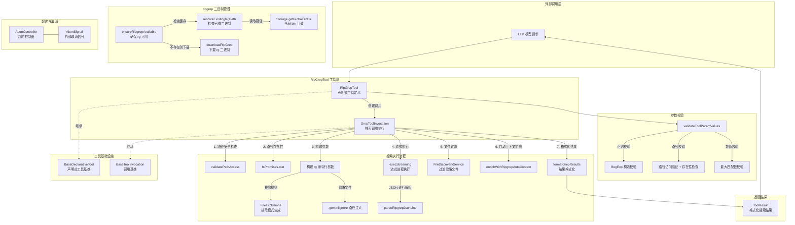

# ripGrep.ts

## 概述

`ripGrep.ts` 是 Gemini CLI 核心工具包中的**文本搜索工具**，基于高性能搜索工具 [ripgrep](https://github.com/BurntSushi/ripgrep)（`rg`）实现。它允许 LLM 在项目文件中执行正则表达式搜索，支持丰富的搜索选项（大小写、上下文行、文件过滤、最大匹配数等），并能自动管理 ripgrep 二进制文件的下载与缓存。

该文件包含以下主要组成部分：
- **ripgrep 二进制管理函数**：`resolveExistingRgPath()`、`ensureRipgrepAvailable()`、`canUseRipgrep()`、`ensureRgPath()`。
- **`GrepToolInvocation`**（内部类）：单次搜索调用的完整执行逻辑。
- **`RipGrepTool`**（对外导出类）：工具的声明式定义与生命周期管理。
- **`RipGrepToolParams`** 接口：搜索参数定义。

## 架构图（Mermaid）

## 核心组件

### 1. `RipGrepToolParams` 接口

搜索参数定义，包含丰富的搜索选项：

| 参数名 | 类型 | 必填 | 默认值 | 说明 |
|--------|------|------|--------|------|
| `pattern` | `string` | 是 | - | 搜索的正则表达式模式 |
| `dir_path` | `string` | 否 | `"."` | 搜索目录路径（相对于目标目录） |
| `include_pattern` | `string` | 否 | - | 文件包含模式，如 `"*.js"`, `"*.{ts,tsx}"` |
| `exclude_pattern` | `string` | 否 | - | 排除的正则表达式模式 |
| `names_only` | `boolean` | 否 | `false` | 是否只返回文件路径（不含匹配行内容） |
| `case_sensitive` | `boolean` | 否 | `false` | 是否区分大小写 |
| `fixed_strings` | `boolean` | 否 | `false` | 是否将 pattern 视为字面量字符串 |
| `context` | `number` | 否 | - | 匹配行前后各显示的上下文行数 |
| `after` | `number` | 否 | - | 匹配行后显示的上下文行数 |
| `before` | `number` | 否 | - | 匹配行前显示的上下文行数 |
| `no_ignore` | `boolean` | 否 | `false` | 是否忽略 .gitignore 和默认忽略规则 |
| `max_matches_per_file` | `number` | 否 | - | 每个文件的最大匹配数 |
| `total_max_matches` | `number` | 否 | `100`（来自 `DEFAULT_TOTAL_MAX_MATCHES`） | 总最大匹配数 |

### 2. ripgrep 二进制管理函数

#### `getRgCandidateFilenames()`
根据平台返回 ripgrep 二进制文件名候选列表。Windows 上返回 `['rg.exe', 'rg']`，其他平台返回 `['rg']`。

#### `resolveExistingRgPath()`
在全局 bin 目录中查找已存在的 ripgrep 二进制文件。遍历候选文件名列表，检查文件是否存在，返回第一个找到的路径或 `null`。

#### `ensureRipgrepAvailable()`
确保 ripgrep 二进制可用。逻辑如下：
1. 先调用 `resolveExistingRgPath()` 检查是否已有缓存。
2. 如果没有，使用单例 Promise（`ripgrepAcquisitionPromise`）调用 `downloadRipGrep()` 下载二进制到全局 bin 目录。
3. 下载完成后再次调用 `resolveExistingRgPath()` 验证。
4. 使用单例 Promise 确保并发调用时只下载一次。

**重要设计决策**：即使系统 PATH 中存在 ripgrep，当前也不使用系统版本，而是使用托管的下载版本。原因是系统版本缺少校验和验证机制。

#### `canUseRipgrep()`（导出）
检查 ripgrep 是否可用（已存在或可成功下载）。返回 `boolean`。

#### `ensureRgPath()`（导出）
确保 ripgrep 可用并返回二进制路径。如果不可用则抛出错误。

### 3. `GrepToolInvocation` 类（内部类）

继承自 `BaseToolInvocation<RipGrepToolParams, ToolResult>`，封装一次文本搜索的完整执行逻辑。

#### 关键方法

| 方法 | 说明 |
|------|------|
| `execute(signal)` | 核心执行方法 |
| `performRipgrepSearch(options)` | 执行底层 ripgrep 搜索 |
| `enrichWithRipgrepAutoContext(...)` | 自动扩充上下文 |
| `parseRipgrepJsonLine(line, basePath)` | 解析 ripgrep JSON 输出行 |
| `getDescription()` | 生成操作描述 |

#### `execute()` 方法详细流程

1. **路径解析与安全检查**：将 `dir_path`（默认 `"."`) 解析为绝对路径，执行 `validatePathAccess()` 检查。
2. **路径存在性检查**：通过 `fsPromises.stat()` 检查路径是否存在、是否为目录或文件。
3. **超时控制器创建**：创建 `AbortController`，设置 `DEFAULT_SEARCH_TIMEOUT_MS` 超时。同时将外部传入的 `signal` 关联到超时控制器，实现双重取消机制。
4. **执行搜索**：调用 `performRipgrepSearch()` 执行 ripgrep 搜索。
5. **文件过滤**：如果未设置 `no_ignore`，通过 `FileDiscoveryService.filterFiles()` 过滤掉被忽略的文件匹配结果。
6. **自动上下文扩充**：调用 `enrichWithRipgrepAutoContext()`，在匹配数较少时自动添加上下文。
7. **结果格式化**：调用 `formatGrepResults()` 将匹配结果格式化为 `ToolResult`。

#### `performRipgrepSearch()` 方法详细逻辑

该方法负责构建 ripgrep 命令行参数并执行搜索：

1. **构建参数列表**：
   - 始终使用 `--json` 格式输出。
   - 根据参数添加 `--ignore-case`、`--fixed-strings`、`--regexp`、`--context`、`--after-context`、`--before-context`、`--no-ignore`、`--max-count`、`--glob` 等选项。
   - 如果未设置 `no_ignore`：
     - 根据配置决定是否添加 `--no-ignore-vcs` 和 `--no-ignore-exclude`。
     - 通过 `FileExclusions` 生成排除 glob 模式（包含 `COMMON_DIRECTORY_EXCLUDES`、`*.log`、`*.tmp`），以 `!` 前缀传给 `--glob`。
     - 注入 `.geminiignore` 等自定义忽略文件路径到 `--ignore-file`。
   - 固定使用 `--threads 4`。
2. **流式执行**：通过 `execStreaming()` 流式执行 ripgrep 进程，使用 `allowedExitCodes: [0, 1]`（退出码 1 表示无匹配，非错误）。
3. **逐行解析**：遍历输出行，调用 `parseRipgrepJsonLine()` 解析每行 JSON。
4. **排除模式过滤**：如果设置了 `exclude_pattern`，用正则过滤掉匹配的行。
5. **匹配数限制**：达到 `maxMatches` 后立即停止读取。

#### `enrichWithRipgrepAutoContext()` 方法

当匹配数在 1-3 个之间且用户未指定上下文参数时，自动用更大的上下文窗口重新搜索：
- 1 个匹配：上下文扩展到 50 行。
- 2-3 个匹配：上下文扩展到 15 行。

这大幅提升了 LLM 对少量匹配结果的理解能力。

#### `parseRipgrepJsonLine()` 方法

解析 ripgrep 的 JSON 输出行：
- 只处理 `type === 'match'` 或 `type === 'context'` 的行。
- 进行防御性检查：确保 `data.path.text` 和 `data.lines.text` 存在。
- 安全性检查：确保解析出的路径不会超出 basePath 范围（检查相对路径是否以 `..` 开头或为绝对路径）。
- 返回 `GrepMatch` 对象，包含绝对路径、相对路径、行号、行内容和是否为上下文行。

### 4. `RipGrepTool` 类（对外导出）

继承自 `BaseDeclarativeTool<RipGrepToolParams, ToolResult>`，是文本搜索工具的声明式定义类。

#### 静态属性
- `Name`：工具名称，取自 `GREP_TOOL_NAME` 常量。

#### 构造函数
- 接收 `Config` 和 `MessageBus`。
- 显示名为 `'SearchText'`，Kind 为 `Kind.Search`。
- 初始化 `FileDiscoveryService` 实例。

#### `validateToolParamValues()` 校验规则

1. 如果不是 `fixed_strings` 模式，尝试用 `new RegExp(pattern)` 校验正则合法性。
2. 如果提供了 `exclude_pattern`，同样校验其正则合法性。
3. `max_matches_per_file` 必须 >= 1（如果提供）。
4. `total_max_matches` 必须 >= 1（如果提供）。
5. 如果提供了 `dir_path`，校验路径访问权限和路径存在性（同步 `fs.statSync`）。

## 依赖关系

### 内部依赖

| 模块路径 | 导入内容 | 用途 |
|----------|----------|------|
| `../confirmation-bus/message-bus.js` | `MessageBus` 类型 | 消息总线 |
| `./tools.js` | `BaseDeclarativeTool`, `BaseToolInvocation`, `Kind`, 以及多个类型 | 工具基类与核心类型定义 |
| `./tool-error.js` | `ToolErrorType` | 错误类型枚举 |
| `../utils/paths.js` | `makeRelative`, `shortenPath` | 路径处理工具 |
| `../utils/errors.js` | `getErrorMessage`, `isNodeError` | 错误处理工具 |
| `../config/config.js` | `Config` 类型 | 全局配置对象 |
| `../utils/fileUtils.js` | `fileExists` | 文件存在性检查 |
| `../config/storage.js` | `Storage` | 存储配置（全局 bin 目录） |
| `./tool-names.js` | `GREP_TOOL_NAME` | 工具名称常量 |
| `../utils/debugLogger.js` | `debugLogger` | 调试日志 |
| `../utils/ignorePatterns.js` | `FileExclusions`, `COMMON_DIRECTORY_EXCLUDES` | 文件排除模式 |
| `../services/fileDiscoveryService.js` | `FileDiscoveryService` | 文件发现服务 |
| `../utils/shell-utils.js` | `execStreaming` | 流式进程执行 |
| `./constants.js` | `DEFAULT_TOTAL_MAX_MATCHES`, `DEFAULT_SEARCH_TIMEOUT_MS` | 默认常量 |
| `./definitions/coreTools.js` | `RIP_GREP_DEFINITION` | 工具声明定义 |
| `./definitions/resolver.js` | `resolveToolDeclaration` | 工具声明解析 |
| `./grep-utils.js` | `GrepMatch`, `formatGrepResults` | 搜索匹配类型与结果格式化 |

### 外部依赖

| 包名 | 导入内容 | 用途 |
|------|----------|------|
| `node:fs` | `fs` | Node.js 同步文件系统操作（仅在参数校验中使用） |
| `node:fs/promises` | `fsPromises` | Node.js 异步文件系统操作 |
| `node:path` | `path` | Node.js 路径处理模块 |
| `@joshua.litt/get-ripgrep` | `downloadRipGrep` | ripgrep 二进制下载库 |

## 关键实现细节

### 1. ripgrep 二进制的托管管理

工具不依赖系统 PATH 中的 ripgrep，而是自行管理二进制的下载和缓存。原因包括：
- 需要对外部二进制进行校验和验证。
- 需要内部化 `get-ripgrep` 依赖。

下载通过 `@joshua.litt/get-ripgrep` 包完成，二进制存储在 `Storage.getGlobalBinDir()` 指定的全局目录中。使用单例 Promise 模式确保并发调用时只执行一次下载。

### 2. 流式 JSON 解析

ripgrep 使用 `--json` 参数输出结构化 JSON，每行一个 JSON 对象。工具通过 `execStreaming()` 流式读取输出，逐行解析，避免将整个搜索结果加载到内存中。这对于大型项目中的搜索尤其重要。

### 3. 双重取消机制

`execute()` 方法同时支持两种取消场景：
- **超时取消**：通过内部 `AbortController` 和 `setTimeout(DEFAULT_SEARCH_TIMEOUT_MS)` 实现，防止搜索无限期挂起。
- **外部取消**：通过传入的 `signal` 参数，支持上层调用者主动取消。

两个信号通过事件监听器链接在一起：外部 signal 的 abort 事件会触发超时控制器的 abort。

### 4. 自动上下文扩充（Auto-Context Enrichment）

这是一个智能优化特性：当搜索结果只有 1-3 个匹配时，工具会自动使用更大的上下文窗口（50 或 15 行）重新对匹配文件执行搜索，让 LLM 能看到更多周围的代码上下文。条件是用户未手动指定 `context`、`before` 或 `after` 参数，且不是 `names_only` 模式。

### 5. 多层文件过滤

搜索结果经过多层过滤：
1. **ripgrep 内置过滤**：通过 `--glob` 排除模式和 `--ignore-file` 注入。
2. **排除正则过滤**：通过 `exclude_pattern` 参数的正则表达式过滤匹配行。
3. **FileDiscoveryService 过滤**：对匹配结果中的文件路径执行项目级忽略规则过滤。

### 6. 路径安全防护

`parseRipgrepJsonLine()` 中包含路径安全检查：解析后的文件路径必须在 basePath 范围内（相对路径不能以 `..` 开头且不能为绝对路径），防止 ripgrep 输出包含恶意路径。

### 7. 线程控制

搜索固定使用 `--threads 4`，在性能和资源消耗之间取得平衡，避免在用户机器上消耗过多 CPU 资源。
