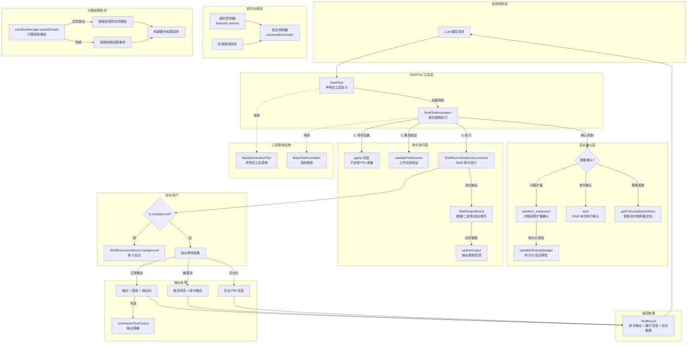

# shell.ts

## 概述

`shell.ts` 是 Gemini CLI 核心工具包中的**Shell 命令执行工具**，允许 LLM 在用户的本地环境中执行任意 Shell 命令。这是所有工具中权限最高、功能最强大的一个，因此具备完善的安全确认机制、沙箱权限管理、超时控制、后台执行、输出流式更新和输出摘要等能力。

该文件导出以下核心组件：
- **`ShellToolInvocation`**（导出类）：单次 Shell 命令调用的完整执行逻辑，包含确认、执行、输出处理和沙箱检测。
- **`ShellTool`**（导出类）：工具的声明式定义与生命周期管理。
- **`ShellToolParams`** 接口：命令参数定义。
- **`OUTPUT_UPDATE_INTERVAL_MS`** 常量：输出更新间隔。

## 架构图（Mermaid）



## 核心组件

### 1. 常量

| 常量名 | 值 | 说明 |
|--------|-----|------|
| `OUTPUT_UPDATE_INTERVAL_MS` | `1000` | 输出更新的最小间隔（毫秒），防止过于频繁的 UI 更新 |
| `BACKGROUND_DELAY_MS` | `200` | 后台化延迟（毫秒），确保用户在进程移入后台前不会看到输出 |

### 2. `ShellToolParams` 接口

| 参数名 | 类型 | 必填 | 说明 |
|--------|------|------|------|
| `command` | `string` | 是 | 要执行的 Shell 命令 |
| `description` | `string` | 否 | 命令的描述说明 |
| `dir_path` | `string` | 否 | 命令执行的工作目录（相对于目标目录） |
| `is_background` | `boolean` | 否 | 是否在后台执行 |
| `[PARAM_ADDITIONAL_PERMISSIONS]` | `SandboxPermissions` | 否 | 额外的沙箱权限请求（文件系统和网络） |

### 3. `ShellToolInvocation` 类（导出）

继承自 `BaseToolInvocation<ShellToolParams, ToolResult>`，封装一次 Shell 命令执行的完整逻辑。

#### 构造函数
接收 `AgentLoopContext`（包含 config 和 geminiClient）、`ShellToolParams`、`MessageBus` 等参数。

#### 描述与展示方法

| 方法 | 说明 |
|------|------|
| `getContextualDetails()` | 生成上下文描述：工作目录 + 描述 + 后台标记 |
| `getDescription()` | 返回命令 + 上下文详情 |
| `getDisplayTitle()` | 返回原始命令字符串 |
| `getExplanation()` | 返回上下文详情（去除前后空白） |

#### `getPolicyUpdateOptions()` 方法

当用户选择"始终允许"（`ProceedAlwaysAndSave` 或 `ProceedAlways`）时：
1. 使用 `stripShellWrapper()` 去除命令包装。
2. 使用 `getCommandRoots()` 提取命令根（如 `git`、`npm` 等）。
3. 使用 `hasRedirection()` 检测是否包含重定向。
4. 返回 `{ commandPrefix, allowRedirection }` 供策略系统记录。

#### `shouldConfirmExecute()` 方法

如果参数中包含 `PARAM_ADDITIONAL_PERMISSIONS`（沙箱权限扩展请求），直接调用 `getConfirmationDetails()` 进入确认流程。否则走父类默认逻辑。

#### `getConfirmationDetails()` 方法

生成确认对话框的详细信息，分两种场景：

**场景一：沙箱权限扩展（`sandbox_expansion`）**
- 类型为 `sandbox_expansion`。
- 标题为 "Sandbox Expansion Request"。
- 确认回调会根据用户选择调用 `sandboxPolicyManager.addPersistentApproval()` 或 `addSessionApproval()` 记录权限审批。

**场景二：普通命令确认（`exec`）**
- 类型为 `exec`。
- 标题为 "Confirm Shell Command"。
- 包含解析出的命令根列表（`rootCommands`）。

命令根的显示通过 `parseCommandDetails()` 解析，如果解析失败则回退到简单的空格分割取第一个 token。

#### `execute()` 方法详细流程

这是整个文件最核心、最复杂的方法：

**1. 前置处理**
- 使用 `stripShellWrapper()` 去除命令包装。
- 检查 `signal.aborted`，如果已取消则立即返回。
- 在非 Windows 平台，创建临时文件路径用于收集子进程 PID（通过 `pgrep`）。

**2. 超时与取消机制**
- 创建超时控制器（`timeoutController`），基于 `config.getShellToolInactivityTimeout()` 配置的超时时间。
- 创建组合控制器（`combinedController`），将外部 signal 和超时控制器链接在一起。
- 超时计时器在每次收到输出事件时重置（`resetTimeout()`），实现的是**不活动超时**而非总时间超时。

**3. 命令包装（非 Windows）**
将用户命令包装为：
```bash
{ <command>; }; __code=$?; pgrep -g 0 ><tempFile> 2>&1; exit $__code;
```
这样命令执行完后，通过 `pgrep -g 0` 收集同进程组内所有 PID，写入临时文件，用于后续检测后台进程。

**4. 工作目录验证**
解析 `dir_path`（默认为目标目录），执行 `validatePathAccess()` 检查。

**5. Shell 命令执行**
通过 `ShellExecutionService.execute()` 执行命令，传入：
- 包装后的命令
- 工作目录
- 输出回调函数（处理 `data`、`binary_detected`、`binary_progress`、`exit` 事件）
- 组合的 AbortSignal
- 交互式 Shell 配置
- 执行配置（pager、sanitization、sandbox、额外权限）

**6. 输出流式更新**
输出回调处理四种事件类型：
- `data`：正常文本输出，直接更新累积输出。
- `binary_detected`：检测到二进制输出，标记并停止流式展示。
- `binary_progress`：二进制输出的进度更新，显示已接收字节数，按 `OUTPUT_UPDATE_INTERVAL_MS` 节流。
- `exit`：进程退出，不做处理。

非后台命令通过 `updateOutput()` 回调实时更新 UI。

**7. 后台进程处理**
- 如果 `is_background` 为 true，在 `BACKGROUND_DELAY_MS` 毫秒后调用 `ShellExecutionService.background()` 将进程移入后台。
- 等待命令执行完成后，读取临时文件获取 `pgrep` 输出，解析出后台进程 PID 列表。
- 过滤掉已知的 sysmond 错误信息。

**8. 结果组装**

根据执行状态分三种情况组装 `llmContent`：
- **被取消**：区分超时取消和用户取消，附加部分输出（如果有）。
- **后台执行**：返回 PID 信息和初始输出。
- **正常完成**：组装 Output、Error、Exit Code、Signal、Background PIDs、Process Group PGID。

**9. 沙箱拒绝检测（启发式）**

当命令执行出错时（有 error、signal、非零退出码或被 abort），通过 `sandboxManager.parseDenials()` 检测是否是沙箱拒绝导致的失败：
- 提取被拒绝的文件路径，逐级向上找到存在的父目录。
- 提取网络权限需求。
- 与当前已有的额外权限比较，如果发现新的权限需求，返回 `SANDBOX_EXPANSION_REQUIRED` 错误，附带确认详情，提示 LLM 重新请求并附上所需权限。

**10. 输出摘要**

如果配置了 Shell 工具的输出摘要（`getSummarizeToolOutputConfig()`），调用 `summarizeToolOutput()` 使用 `summarizer-shell` 模型对输出进行压缩摘要。

**11. 清理**
- 清除超时计时器。
- 移除事件监听器。
- 删除临时文件（忽略错误）。

### 4. `ShellTool` 类（导出）

继承自 `BaseDeclarativeTool<ShellToolParams, ToolResult>`。

#### 静态属性
- `Name`：取自 `SHELL_TOOL_NAME` 常量。

#### 构造函数
- 接收 `AgentLoopContext` 和 `MessageBus`。
- 在构造时异步初始化 Shell 解析器（`initializeShellParsers()`），错误被静默忽略。
- 根据配置动态获取 Shell 工具定义（`getShellDefinition()`），传入交互式 Shell、输出效率和沙箱启用标志。
- Kind 为 `Kind.Execute`，输出不是 Markdown（`isOutputMarkdown: false`），但输出可更新（`canUpdateOutput: true`）。

#### `validateToolParamValues()` 校验规则
1. `command` 不能为空字符串。
2. 如果提供了 `dir_path`，校验路径访问权限。

#### `createInvocation()` 方法

注意：这里将 `this.context.config`（而非 `this.context`）传给 `ShellToolInvocation`。

#### `getSchema()` 方法

动态获取 Shell 定义并解析，每次都会根据当前配置重新生成，因为 Shell 工具的声明依赖于运行时配置（交互式模式、输出效率、沙箱状态）。

## 依赖关系

### 内部依赖

| 模块路径 | 导入内容 | 用途 |
|----------|----------|------|
| `../index.js` | `debugLogger` | 调试日志记录 |
| `../services/sandboxManager.js` | `SandboxPermissions` 类型 | 沙箱权限类型定义 |
| `./tool-error.js` | `ToolErrorType` | 错误类型枚举 |
| `./tools.js` | `BaseDeclarativeTool`, `BaseToolInvocation`, `ToolConfirmationOutcome`, `Kind`, 以及多个类型 | 工具基类与核心类型定义 |
| `../utils/errors.js` | `getErrorMessage` | 错误信息提取 |
| `../utils/summarizer.js` | `summarizeToolOutput` | LLM 输出摘要 |
| `../services/shellExecutionService.js` | `ShellExecutionService`, `ShellOutputEvent` | Shell 命令执行服务 |
| `../utils/formatters.js` | `formatBytes` | 字节数格式化 |
| `../utils/terminalSerializer.js` | `AnsiOutput` 类型 | ANSI 终端输出类型 |
| `../utils/shell-utils.js` | `getCommandRoots`, `initializeShellParsers`, `stripShellWrapper`, `parseCommandDetails`, `hasRedirection` | Shell 命令解析工具 |
| `./tool-names.js` | `SHELL_TOOL_NAME` | 工具名称常量 |
| `./definitions/base-declarations.js` | `PARAM_ADDITIONAL_PERMISSIONS` | 额外权限参数名常量 |
| `../confirmation-bus/message-bus.js` | `MessageBus` 类型 | 消息总线 |
| `./definitions/coreTools.js` | `getShellDefinition` | Shell 工具定义生成函数 |
| `./definitions/resolver.js` | `resolveToolDeclaration` | 工具声明解析 |
| `../config/agent-loop-context.js` | `AgentLoopContext` 类型 | Agent 循环上下文 |

### 外部依赖

| 包名 | 导入内容 | 用途 |
|------|----------|------|
| `node:fs/promises` | `fsPromises` | 异步文件操作（临时文件读写与删除） |
| `node:fs` | `fs` | 同步文件操作（沙箱拒绝路径检测） |
| `node:path` | `path` | 路径处理 |
| `node:os` | `os` | 操作系统信息（平台检测、临时目录、行尾符） |
| `node:crypto` | `crypto` | 加密随机字节（临时文件名生成） |

## 关键实现细节

### 1. 命令包装与子进程 PID 收集

在非 Windows 平台，用户命令被包装为一个复合命令，在执行完毕后通过 `pgrep -g 0` 收集同进程组的所有 PID。这些 PID 被写入临时文件，执行完成后读取解析，用于：
- 向 LLM 报告仍在运行的后台进程 PID。
- 在结果中提供进程组 PGID 信息。

临时文件名使用 `crypto.randomBytes(6)` 生成随机后缀，避免冲突。

### 2. 不活动超时机制

与 ripGrep 的固定超时不同，Shell 工具实现的是**不活动超时**（inactivity timeout）：
- 每次收到输出事件（`data`、`binary_detected`、`binary_progress`）时重置计时器。
- 只有在指定时间内没有任何输出时才触发超时取消。
- 超时时间通过 `config.getShellToolInactivityTimeout()` 配置。
- 如果超时时间 <= 0，则不启用超时。

这种设计更适合 Shell 命令的场景：长时间运行但持续产出输出的命令（如构建过程）不会被误取消。

### 3. 沙箱拒绝检测与自动重试

这是一个精巧的启发式机制：当命令因沙箱限制失败时，工具会：
1. 通过 `sandboxManager.parseDenials()` 解析出被拒绝的资源（文件路径、网络）。
2. 对文件路径进行智能处理：如果路径指向不存在的文件，向上查找存在的父目录。
3. 将新发现的权限需求与已有的额外权限比较。
4. 如果发现新权限需求，返回 `SANDBOX_EXPANSION_REQUIRED` 错误。
5. LLM 可以据此重新调用工具并附带所需的额外权限，触发用户确认。

### 4. 后台执行支持

当 `is_background` 为 true 或进程自行进入后台（`result.backgrounded`）时：
- 在 200ms 延迟后调用 `ShellExecutionService.background()` 转入后台。
- 返回 PID 信息和初始输出。
- 用户可通过 Ctrl+B 查看后台进程的输出。
- 后台进程不进行流式输出更新。

### 5. 二进制输出处理

Shell 工具能检测二进制输出：
- 检测到二进制时标记 `isBinaryStream = true` 并停止正常的流式文本更新。
- 改为显示二进制接收进度（字节数），并按 `OUTPUT_UPDATE_INTERVAL_MS` 节流更新。

### 6. 输出摘要能力

如果配置启用了 Shell 工具的输出摘要，会调用专门的 `summarizer-shell` 模型对冗长的命令输出进行压缩。这在命令产出大量日志输出时尤其有用，可以减少发送给主 LLM 的 token 数量。

### 7. 动态工具定义

Shell 工具的定义不是静态的，而是通过 `getShellDefinition()` 动态生成，依赖三个运行时配置：
- `enableInteractiveShell`：是否启用交互式 Shell。
- `enableShellOutputEfficiency`：是否启用输出效率优化。
- `sandboxEnabled`：是否启用沙箱。

这使得工具的参数 Schema 和描述能够适应不同的运行环境。

### 8. 策略系统集成

通过 `getPolicyUpdateOptions()`，Shell 工具深度集成了策略系统：
- 提取命令的根命令（如 `git`、`npm`、`python`）。
- 检测命令是否包含重定向（`>`、`>>`、`|` 等）。
- 当用户选择"始终允许"时，策略系统可以基于命令前缀自动批准后续类似命令。
