# tool-error.ts

## 概述

`tool-error.ts` 是 Gemini CLI 核心工具包中的**错误类型定义文件**，提供了一套类型安全的工具错误枚举和致命错误判定函数。它是整个工具系统的错误分类基础设施，被所有工具文件引用，用于标准化错误类型的报告和处理。

该文件导出两个核心成员：
- **`ToolErrorType`** 枚举：定义了所有工具相关的错误类型，按功能域分类。
- **`isFatalToolError()`** 函数：判定某个错误类型是否为致命错误（应导致 CLI 退出）。

## 架构图（Mermaid）

```mermaid
flowchart TB
    subgraph 错误类型枚举 ToolErrorType
        subgraph 通用错误
            PV[POLICY_VIOLATION<br/>策略违规]
            ITP[INVALID_TOOL_PARAMS<br/>无效工具参数]
            UNK[UNKNOWN<br/>未知错误]
            UE[UNHANDLED_EXCEPTION<br/>未处理异常]
            TNR[TOOL_NOT_REGISTERED<br/>工具未注册]
            EF[EXECUTION_FAILED<br/>执行失败]
        end

        subgraph 文件系统错误
            FNF[FILE_NOT_FOUND<br/>文件不存在]
            FWF[FILE_WRITE_FAILURE<br/>文件写入失败]
            RCF[READ_CONTENT_FAILURE<br/>读取内容失败]
            ACE[ATTEMPT_TO_CREATE_EXISTING_FILE<br/>尝试创建已存在文件]
            FTL[FILE_TOO_LARGE<br/>文件过大]
            PD[PERMISSION_DENIED<br/>权限拒绝]
            NSL[NO_SPACE_LEFT<br/>磁盘空间不足]
            TID[TARGET_IS_DIRECTORY<br/>目标是目录]
            PNIW[PATH_NOT_IN_WORKSPACE<br/>路径不在工作区]
            SPNF[SEARCH_PATH_NOT_FOUND<br/>搜索路径不存在]
            SPNAD[SEARCH_PATH_NOT_A_DIRECTORY<br/>搜索路径不是目录]
        end

        subgraph 编辑相关错误
            EPF[EDIT_PREPARATION_FAILURE<br/>编辑准备失败]
            ENOF[EDIT_NO_OCCURRENCE_FOUND<br/>未找到匹配项]
            EEOM[EDIT_EXPECTED_OCCURRENCE_MISMATCH<br/>匹配项数量不符]
            ENC[EDIT_NO_CHANGE<br/>无变更]
            ENCLJ[EDIT_NO_CHANGE_LLM_JUDGEMENT<br/>LLM判定无变更]
        end

        subgraph 搜索相关错误
            GEE[GLOB_EXECUTION_ERROR<br/>Glob执行错误]
            GREE[GREP_EXECUTION_ERROR<br/>Grep执行错误]
        end

        subgraph 其他工具错误
            LEE[LS_EXECUTION_ERROR<br/>Ls执行错误]
            PINAD[PATH_IS_NOT_A_DIRECTORY<br/>路径不是目录]
            MTE[MCP_TOOL_ERROR<br/>MCP工具错误]
            MTEE[MEMORY_TOOL_EXECUTION_ERROR<br/>记忆工具错误]
            RMFSE[READ_MANY_FILES_SEARCH_ERROR<br/>批量读取搜索错误]
            SEE[SHELL_EXECUTE_ERROR<br/>Shell执行错误]
            SER[SANDBOX_EXPANSION_REQUIRED<br/>需要沙箱扩展]
            DTEE[DISCOVERED_TOOL_EXECUTION_ERROR<br/>发现工具执行错误]
        end

        subgraph Web相关错误
            WFNUIP[WEB_FETCH_NO_URL_IN_PROMPT<br/>提示中无URL]
            WFFF[WEB_FETCH_FALLBACK_FAILED<br/>Web回退失败]
            WFPE[WEB_FETCH_PROCESSING_ERROR<br/>Web处理错误]
            WSF[WEB_SEARCH_FAILED<br/>Web搜索失败]
        end

        subgraph Hook相关错误
            STOP[STOP_EXECUTION<br/>停止执行]
        end
    end

    subgraph 致命错误判定
        IFT[isFatalToolError 函数]
        IFT -->|仅此一个| NSL
        IFT -.其他均为可恢复.-> 通用错误
        IFT -.其他均为可恢复.-> 文件系统错误
        IFT -.其他均为可恢复.-> 编辑相关错误
    end

    subgraph 使用方
        RF[read-file.ts]
        RMF[read-many-files.ts]
        RG[ripGrep.ts]
        SH[shell.ts]
        OTHER[其他工具...]
    end

    RF --> ToolErrorType
    RMF --> ToolErrorType
    RG --> ToolErrorType
    SH --> ToolErrorType
    OTHER --> ToolErrorType
```



## 核心组件

### 1. `ToolErrorType` 枚举

类型安全的工具错误分类枚举，使用字符串值以便序列化和日志记录。按功能域组织为以下几大类：

#### 通用错误（General Errors）

| 枚举值 | 字符串值 | 说明 |
|--------|----------|------|
| `POLICY_VIOLATION` | `'policy_violation'` | 策略违规，工具调用被策略引擎拒绝 |
| `INVALID_TOOL_PARAMS` | `'invalid_tool_params'` | 工具参数无效 |
| `UNKNOWN` | `'unknown'` | 未知错误 |
| `UNHANDLED_EXCEPTION` | `'unhandled_exception'` | 未处理的异常 |
| `TOOL_NOT_REGISTERED` | `'tool_not_registered'` | 工具未注册 |
| `EXECUTION_FAILED` | `'execution_failed'` | 执行失败 |

#### 文件系统错误（File System Errors）

| 枚举值 | 字符串值 | 说明 |
|--------|----------|------|
| `FILE_NOT_FOUND` | `'file_not_found'` | 文件不存在 |
| `FILE_WRITE_FAILURE` | `'file_write_failure'` | 文件写入失败 |
| `READ_CONTENT_FAILURE` | `'read_content_failure'` | 读取内容失败 |
| `ATTEMPT_TO_CREATE_EXISTING_FILE` | `'attempt_to_create_existing_file'` | 尝试创建已存在的文件 |
| `FILE_TOO_LARGE` | `'file_too_large'` | 文件过大，无法处理 |
| `PERMISSION_DENIED` | `'permission_denied'` | 操作系统级权限拒绝 |
| `NO_SPACE_LEFT` | `'no_space_left'` | 磁盘空间不足（**致命错误**） |
| `TARGET_IS_DIRECTORY` | `'target_is_directory'` | 目标路径是目录而非文件 |
| `PATH_NOT_IN_WORKSPACE` | `'path_not_in_workspace'` | 路径不在允许的工作区范围内 |
| `SEARCH_PATH_NOT_FOUND` | `'search_path_not_found'` | 搜索路径不存在 |
| `SEARCH_PATH_NOT_A_DIRECTORY` | `'search_path_not_a_directory'` | 搜索路径不是目录 |

#### 编辑相关错误（Edit-specific Errors）

| 枚举值 | 字符串值 | 说明 |
|--------|----------|------|
| `EDIT_PREPARATION_FAILURE` | `'edit_preparation_failure'` | 编辑准备阶段失败 |
| `EDIT_NO_OCCURRENCE_FOUND` | `'edit_no_occurrence_found'` | 未找到要替换的文本 |
| `EDIT_EXPECTED_OCCURRENCE_MISMATCH` | `'edit_expected_occurrence_mismatch'` | 匹配项数量与预期不符 |
| `EDIT_NO_CHANGE` | `'edit_no_change'` | 编辑操作未产生实际变更 |
| `EDIT_NO_CHANGE_LLM_JUDGEMENT` | `'edit_no_change_llm_judgement'` | LLM 判定编辑未产生有意义的变更 |

#### Glob 相关错误

| 枚举值 | 字符串值 | 说明 |
|--------|----------|------|
| `GLOB_EXECUTION_ERROR` | `'glob_execution_error'` | Glob 模式匹配执行错误 |

#### Grep 相关错误

| 枚举值 | 字符串值 | 说明 |
|--------|----------|------|
| `GREP_EXECUTION_ERROR` | `'grep_execution_error'` | Grep 搜索执行错误 |

#### Ls 相关错误

| 枚举值 | 字符串值 | 说明 |
|--------|----------|------|
| `LS_EXECUTION_ERROR` | `'ls_execution_error'` | 目录列表执行错误 |
| `PATH_IS_NOT_A_DIRECTORY` | `'path_is_not_a_directory'` | 路径不是目录 |

#### MCP 相关错误

| 枚举值 | 字符串值 | 说明 |
|--------|----------|------|
| `MCP_TOOL_ERROR` | `'mcp_tool_error'` | MCP（Model Context Protocol）工具执行错误 |

#### 记忆工具相关错误

| 枚举值 | 字符串值 | 说明 |
|--------|----------|------|
| `MEMORY_TOOL_EXECUTION_ERROR` | `'memory_tool_execution_error'` | 记忆工具执行错误 |

#### 批量读取相关错误

| 枚举值 | 字符串值 | 说明 |
|--------|----------|------|
| `READ_MANY_FILES_SEARCH_ERROR` | `'read_many_files_search_error'` | 批量文件搜索阶段错误 |

#### Shell 相关错误

| 枚举值 | 字符串值 | 说明 |
|--------|----------|------|
| `SHELL_EXECUTE_ERROR` | `'shell_execute_error'` | Shell 命令执行错误 |
| `SANDBOX_EXPANSION_REQUIRED` | `'sandbox_expansion_required'` | 需要沙箱权限扩展 |

#### 发现工具相关错误

| 枚举值 | 字符串值 | 说明 |
|--------|----------|------|
| `DISCOVERED_TOOL_EXECUTION_ERROR` | `'discovered_tool_execution_error'` | 动态发现的工具执行错误 |

#### Web 相关错误

| 枚举值 | 字符串值 | 说明 |
|--------|----------|------|
| `WEB_FETCH_NO_URL_IN_PROMPT` | `'web_fetch_no_url_in_prompt'` | Web 提取提示中缺少 URL |
| `WEB_FETCH_FALLBACK_FAILED` | `'web_fetch_fallback_failed'` | Web 提取的回退策略失败 |
| `WEB_FETCH_PROCESSING_ERROR` | `'web_fetch_processing_error'` | Web 内容处理错误 |
| `WEB_SEARCH_FAILED` | `'web_search_failed'` | Web 搜索失败 |

#### Hook 相关错误

| 枚举值 | 字符串值 | 说明 |
|--------|----------|------|
| `STOP_EXECUTION` | `'stop_execution'` | Hook 请求停止执行 |

### 2. `isFatalToolError()` 函数

```typescript
export function isFatalToolError(errorType?: string): boolean
```

判定给定的错误类型是否为致命错误。

**参数**：
- `errorType`（可选 `string`）：要检查的错误类型字符串。

**返回值**：
- `true`：该错误应导致 CLI 退出。
- `false`：该错误是可恢复的，LLM 可以尝试自我纠正。

**致命错误列表**（当前仅一个）：
- `NO_SPACE_LEFT`：磁盘空间不足。

**设计原则**：
- 如果传入 `undefined` 或 `null`，返回 `false`（安全默认）。
- 使用 `Set` 存储致命错误类型，支持 O(1) 查找，便于未来扩展。

## 依赖关系

### 内部依赖

无。该文件是独立的错误类型定义模块，不依赖项目内其他模块。

### 外部依赖

无。该文件不依赖任何外部包。

## 关键实现细节

### 1. 错误分类哲学：可恢复 vs 致命

文件注释中明确阐述了错误分类的设计哲学：

- **可恢复错误（Recoverable）**：LLM 可以自我纠正的错误。例如：
  - 修正无效参数（`INVALID_TOOL_PARAMS`）
  - 尝试不同的文件（`FILE_NOT_FOUND`）
  - 尊重安全边界（`PATH_NOT_IN_WORKSPACE`、`PERMISSION_DENIED`）
  - 使用不同的工具或方法

- **致命错误（Fatal）**：系统级问题，表明环境处于不良状态，继续执行不太可能成功。目前仅包含：
  - 磁盘空间不足（`NO_SPACE_LEFT`）

这种保守的致命错误定义确保 CLI 在大多数错误情况下能继续运行，给 LLM 自我修复的机会。

### 2. 字符串枚举值设计

所有枚举成员使用 `snake_case` 格式的字符串值（如 `'file_not_found'`），而非数字值。这带来以下优势：
- **可读性**：在日志和调试信息中直接可读。
- **序列化友好**：JSON 序列化后保持语义清晰。
- **前向兼容**：新增错误类型不会影响已有值的含义。

### 3. 按功能域分组

枚举成员按功能域（文件系统、编辑、搜索、Shell、Web 等）分组，使用注释清晰标注分组边界。这种组织方式：
- 便于开发者快速定位特定域的错误类型。
- 为每个工具提供专属的错误类型，避免使用过于通用的错误分类。
- 使错误报告和遥测分析更精确。

### 4. 特殊错误类型说明

- **`SANDBOX_EXPANSION_REQUIRED`**：不是真正的"错误"，而是一个信号，表示 Shell 工具需要请求更多沙箱权限。Shell 工具在检测到沙箱拒绝时使用此类型触发权限扩展流程。
- **`EDIT_NO_CHANGE_LLM_JUDGEMENT`**：与 `EDIT_NO_CHANGE` 的区别在于，此类型由 LLM 判定编辑无实际意义，而非简单的文本比对。
- **`STOP_EXECUTION`**：由 Hook 系统使用，表示用户定义的 Hook 请求停止工具链的后续执行。

### 5. 零依赖设计

该文件有意设计为零依赖（无内部依赖、无外部依赖），使其可以被项目中任何模块安全引用，不会引入循环依赖风险。这是一个典型的"叶子模块"设计模式。
