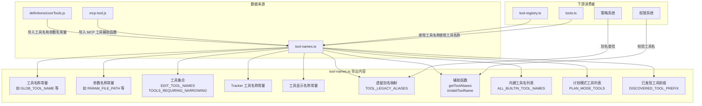

# tool-names.ts

## 概述

`tool-names.ts` 是 Gemini CLI 工具系统的**名称注册中心**，负责定义、导出和验证所有工具名称常量。该文件是整个工具体系的基础层，提供了统一的工具名称管理、参数名称管理、遗留别名映射、以及工具名称合法性校验等功能。

文件路径：`packages/core/src/tools/tool-names.ts`

## 架构图（Mermaid）



## 核心组件

### 1. 工具名称常量（从 `coreTools.js` 重导出）

这些常量定义了所有核心工具的唯一标识符，全部从 `./definitions/coreTools.js` 导入后重新导出：

| 常量名 | 用途 |
|--------|------|
| `GLOB_TOOL_NAME` | 文件 glob 搜索工具 |
| `GREP_TOOL_NAME` | 文本内容搜索工具 |
| `LS_TOOL_NAME` | 目录列表工具 |
| `READ_FILE_TOOL_NAME` | 单文件读取工具 |
| `SHELL_TOOL_NAME` | Shell 命令执行工具 |
| `WRITE_FILE_TOOL_NAME` | 文件写入工具 |
| `EDIT_TOOL_NAME` | 文件编辑工具 |
| `WEB_SEARCH_TOOL_NAME` | 网络搜索工具 |
| `WRITE_TODOS_TOOL_NAME` | TODO 列表写入工具 |
| `WEB_FETCH_TOOL_NAME` | 网页抓取工具 |
| `READ_MANY_FILES_TOOL_NAME` | 批量文件读取工具 |
| `MEMORY_TOOL_NAME` | 记忆/事实存储工具 |
| `GET_INTERNAL_DOCS_TOOL_NAME` | 内部文档获取工具 |
| `ACTIVATE_SKILL_TOOL_NAME` | 技能激活工具 |
| `ASK_USER_TOOL_NAME` | 用户询问工具 |
| `EXIT_PLAN_MODE_TOOL_NAME` | 退出计划模式工具 |
| `ENTER_PLAN_MODE_TOOL_NAME` | 进入计划模式工具 |

### 2. 参数名称常量（从 `coreTools.js` 重导出）

分为**共享参数名**和**工具专属参数名**两类：

#### 共享参数名
- `PARAM_FILE_PATH` — 文件路径
- `PARAM_DIR_PATH` — 目录路径
- `PARAM_PATTERN` — 匹配模式
- `PARAM_CASE_SENSITIVE` — 大小写敏感
- `PARAM_RESPECT_GIT_IGNORE` — 是否尊重 `.gitignore`
- `PARAM_RESPECT_GEMINI_IGNORE` — 是否尊重 `.geminiignore`
- `PARAM_FILE_FILTERING_OPTIONS` — 文件过滤选项
- `PARAM_DESCRIPTION` — 描述

#### 工具专属参数名（部分示例）
- **ReadFile**: `READ_FILE_PARAM_START_LINE`, `READ_FILE_PARAM_END_LINE`
- **WriteFile**: `WRITE_FILE_PARAM_CONTENT`
- **Grep**: `GREP_PARAM_INCLUDE_PATTERN`, `GREP_PARAM_EXCLUDE_PATTERN`, `GREP_PARAM_NAMES_ONLY`, `GREP_PARAM_MAX_MATCHES_PER_FILE`, `GREP_PARAM_TOTAL_MAX_MATCHES`, `GREP_PARAM_FIXED_STRINGS`, `GREP_PARAM_CONTEXT`, `GREP_PARAM_AFTER`, `GREP_PARAM_BEFORE`, `GREP_PARAM_NO_IGNORE`
- **Edit**: `EDIT_PARAM_INSTRUCTION`, `EDIT_PARAM_OLD_STRING`, `EDIT_PARAM_NEW_STRING`, `EDIT_PARAM_ALLOW_MULTIPLE`
- **Shell**: `SHELL_PARAM_COMMAND`, `SHELL_PARAM_IS_BACKGROUND`
- **AskUser**: `ASK_USER_PARAM_QUESTIONS` 及其嵌套参数（`QUESTION`, `HEADER`, `TYPE`, `OPTIONS`, `MULTI_SELECT`, `PLACEHOLDER`）
- **PlanMode**: `PLAN_MODE_PARAM_REASON`, `EXIT_PLAN_PARAM_PLAN_FILENAME`

### 3. 工具集合（Set）

#### `EDIT_TOOL_NAMES`
```typescript
export const EDIT_TOOL_NAMES = new Set([EDIT_TOOL_NAME, WRITE_FILE_TOOL_NAME]);
```
标识所有具有**编辑/写入**能力的工具，用于权限控制和安全检查。

#### `TOOLS_REQUIRING_NARROWING`
```typescript
export const TOOLS_REQUIRING_NARROWING = new Set([
  GLOB_TOOL_NAME, GREP_TOOL_NAME, READ_MANY_FILES_TOOL_NAME,
  READ_FILE_TOOL_NAME, LS_TOOL_NAME, WRITE_FILE_TOOL_NAME,
  EDIT_TOOL_NAME, SHELL_TOOL_NAME,
]);
```
这些工具在授予**持久或会话级审批**时，必须进行参数缩窄（如指定文件路径前缀、命令前缀等），以避免过于宽泛的权限授权。

### 4. Tracker 工具名称常量

本文件中**直接定义**（非从 `coreTools.js` 导入）了 6 个 Tracker 相关的工具名称：

| 常量名 | 值 |
|--------|------|
| `TRACKER_CREATE_TASK_TOOL_NAME` | `'tracker_create_task'` |
| `TRACKER_UPDATE_TASK_TOOL_NAME` | `'tracker_update_task'` |
| `TRACKER_GET_TASK_TOOL_NAME` | `'tracker_get_task'` |
| `TRACKER_LIST_TASKS_TOOL_NAME` | `'tracker_list_tasks'` |
| `TRACKER_ADD_DEPENDENCY_TOOL_NAME` | `'tracker_add_dependency'` |
| `TRACKER_VISUALIZE_TOOL_NAME` | `'tracker_visualize'` |

### 5. 工具显示名称常量

用于 UI 展示的人类友好名称：

| 常量名 | 值 |
|--------|------|
| `WRITE_FILE_DISPLAY_NAME` | `'WriteFile'` |
| `EDIT_DISPLAY_NAME` | `'Edit'` |
| `ASK_USER_DISPLAY_NAME` | `'Ask User'` |
| `READ_FILE_DISPLAY_NAME` | `'ReadFile'` |
| `GLOB_DISPLAY_NAME` | `'FindFiles'` |
| `LS_DISPLAY_NAME` | `'ReadFolder'` |
| `GREP_DISPLAY_NAME` | `'SearchText'` |
| `WEB_SEARCH_DISPLAY_NAME` | `'GoogleSearch'` |
| `WEB_FETCH_DISPLAY_NAME` | `'WebFetch'` |
| `READ_MANY_FILES_DISPLAY_NAME` | `'ReadManyFiles'` |

### 6. 遗留别名映射 `TOOL_LEGACY_ALIASES`

```typescript
export const TOOL_LEGACY_ALIASES: Record<string, string> = {
  search_file_content: GREP_TOOL_NAME,
};
```
用于向后兼容，将旧工具名映射到当前工具名。当用户在策略（policy）、技能（skill）或钩子（hook）配置中使用旧名称时，系统仍可正确识别。

### 7. 辅助函数 `getToolAliases(name: string): string[]`

给定一个工具名（可以是当前名或遗留名），返回该工具的所有关联名称（包括当前名和所有遗留别名）。实现逻辑：
1. 确定规范名称（canonical name）：如果输入名是遗留别名，则规范名为其映射目标；否则就是输入名本身。
2. 遍历 `TOOL_LEGACY_ALIASES`，找出所有指向同一规范名的遗留别名。
3. 返回去重后的名称数组。

### 8. 已发现工具前缀 `DISCOVERED_TOOL_PREFIX`

```typescript
export const DISCOVERED_TOOL_PREFIX = 'discovered_tool_';
```
通过工具发现命令（DiscoveryCommand）动态发现的工具使用此前缀。

### 9. 内建工具名列表 `ALL_BUILTIN_TOOL_NAMES`

一个 `as const` 只读数组，包含所有 25 个内建工具名称。用于工具名校验和枚举。

### 10. 计划模式工具列表 `PLAN_MODE_TOOLS`

```typescript
export const PLAN_MODE_TOOLS = [
  GLOB_TOOL_NAME, GREP_TOOL_NAME, READ_FILE_TOOL_NAME, LS_TOOL_NAME,
  WEB_SEARCH_TOOL_NAME, ASK_USER_TOOL_NAME, ACTIVATE_SKILL_TOOL_NAME,
  GET_INTERNAL_DOCS_TOOL_NAME, 'codebase_investigator', 'cli_help',
] as const;
```
计划模式下可用的**只读工具**列表。注意此列表不包含任何写入/编辑工具，还包含两个动态发现的工具名（`codebase_investigator`、`cli_help`）。

### 11. 工具名校验函数 `isValidToolName(name, options?)`

核心验证函数，判断给定字符串是否为合法的工具名。校验逻辑按优先级：

1. **内建工具**：检查是否在 `ALL_BUILTIN_TOOL_NAMES` 中。
2. **遗留别名**：检查是否在 `TOOL_LEGACY_ALIASES` 中有映射。
3. **已发现工具**：检查是否以 `discovered_tool_` 前缀开头。
4. **通配符**：当 `options.allowWildcards` 为 `true` 时，接受 `'*'`。
5. **MCP 工具**：调用 `isMcpToolName()` 判断，然后进一步解析：
   - 全局通配符 `mcp_*` 需要 `allowWildcards` 为 `true`。
   - 拒绝空 server 名（如 `mcp__tool`）。
   - 使用 `parseMcpToolName()` 拆分 server 名和工具名。
   - 对 server 名和 tool 名进行 slug 格式校验（`/^[a-z0-9_.:-]+$/i`）。
   - 拒绝纯下划线的工具名。
   - 支持 server 级通配符（如 `mcp_server_*`）。

## 依赖关系

### 内部依赖

| 模块 | 导入内容 | 说明 |
|------|---------|------|
| `./definitions/coreTools.js` | 全部工具名常量和参数名常量 | 核心工具的名称和参数定义的实际来源 |
| `./mcp-tool.js` | `isMcpToolName`, `parseMcpToolName`, `MCP_TOOL_PREFIX` | MCP（Model Context Protocol）工具名解析相关 |

### 外部依赖

无外部第三方依赖。

## 关键实现细节

1. **重导出模式**：该文件不直接定义核心工具名和参数名的值，而是从 `./definitions/coreTools.js` 导入后重导出。这是一种 **barrel export** 模式，提供了一个集中的导入入口。下游模块只需从 `tool-names.ts` 导入即可，无需了解底层定义位置。

2. **Tracker 工具名的例外**：与其他核心工具名不同，6 个 Tracker 工具名和 `DISCOVERED_TOOL_PREFIX` 直接在本文件中定义，而非从 `coreTools.js` 导入。这可能表明 Tracker 功能是后期添加的，或其定义结构与核心工具不同。

3. **`as const` 断言**：`ALL_BUILTIN_TOOL_NAMES` 和 `PLAN_MODE_TOOLS` 使用 `as const` 断言，使得 TypeScript 能够推断出字面量类型而非宽泛的 `string[]`，有助于类型安全。

4. **参数缩窄机制**：`TOOLS_REQUIRING_NARROWING` 集合配合权限系统使用，确保用户在授予永久审批权限时必须指定具体范围（如只允许读取某个目录下的文件），防止权限过于宽泛。

5. **MCP 工具名验证的复杂性**：`isValidToolName` 函数对 MCP 工具名的验证最为复杂，包括前缀检查、server/tool 名拆分、slug 格式校验、通配符支持等多个层次。允许的字符包括字母、数字、下划线、点号、冒号和连字符。

6. **向后兼容策略**：通过 `TOOL_LEGACY_ALIASES` 和 `getToolAliases()` 实现工具重命名时的平滑迁移。目前仅有一个别名映射（`search_file_content` -> `GREP_TOOL_NAME`），但架构支持未来扩展。
