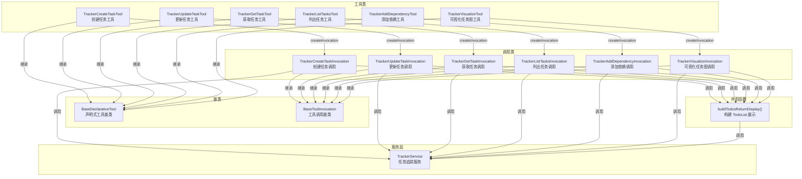

# trackerTools.ts

## 概述

`trackerTools.ts` 实现了 Gemini CLI 的**任务追踪器工具集**，提供了一套完整的任务管理工具，供 LLM 在会话中创建、查询、更新、可视化任务以及管理任务间依赖关系。该模块包含 6 个工具，每个工具都遵循"声明式工具 + 调用实例"的标准模式（继承 `BaseDeclarativeTool` 和 `BaseToolInvocation`）。

这些工具允许 LLM 将复杂任务分解为可追踪的子任务，建立任务间的依赖关系，并以树形结构可视化整个任务图。

文件路径：`packages/core/src/tools/trackerTools.ts`

## 架构图（Mermaid）



## 核心组件

### 1. `buildTodosReturnDisplay(service: TrackerService): Promise<TodoList>`

**公共辅助函数**，将 TrackerService 中的所有任务转换为 UI 可展示的 `TodoList` 格式。几乎所有工具的 `returnDisplay` 都使用此函数。

#### 实现逻辑

1. **获取所有任务**：调用 `service.listTasks()` 获取全部任务。
2. **构建父子关系映射**：
   - `childrenMap: Map<string, TrackerTask[]>` — 父任务 ID 到子任务列表的映射。
   - `roots: TrackerTask[]` — 无父任务的根任务列表。
3. **排序规则**（`sortTasks`）：
   - 首先按状态排序：`IN_PROGRESS(0)` > `OPEN(1)` > `BLOCKED(2)` > `CLOSED(3)`
   - 相同状态按任务 ID 字典序排序
4. **递归渲染**（`addTask`）：
   - 使用 `visited: Set<string>` 检测并处理循环引用（标记为 `[CYCLE DETECTED: id]`）。
   - 状态映射：`IN_PROGRESS` → `in_progress`, `CLOSED` → `completed`, `BLOCKED` → `blocked`, 其他 → `pending`。
   - 描述格式：`{缩进}{任务类型}: {标题} ({ID})`
   - 递归处理子任务，增加缩进深度。

### 2. `TrackerCreateTaskTool` — 创建任务

#### 参数（`CreateTaskParams`）

| 参数 | 类型 | 必填 | 说明 |
|------|------|------|------|
| `title` | `string` | 是 | 任务标题 |
| `description` | `string` | 是 | 任务描述 |
| `type` | `TaskType` | 是 | 任务类型 |
| `parentId` | `string` | 否 | 父任务 ID |
| `dependencies` | `string[]` | 否 | 依赖任务 ID 列表 |

#### 执行逻辑
- 调用 `service.createTask()` 创建任务，初始状态为 `TaskStatus.OPEN`。
- 成功返回：`Created task {id}: {title}` + 完整任务树视图。
- 失败返回：错误信息，类型 `EXECUTION_FAILED`。

#### 工具属性
- 名称：`tracker_create_task`
- 显示名：`Create Task`
- Kind：`Kind.Edit`（有副作用）

### 3. `TrackerUpdateTaskTool` — 更新任务

#### 参数（`UpdateTaskParams`）

| 参数 | 类型 | 必填 | 说明 |
|------|------|------|------|
| `id` | `string` | 是 | 任务 ID |
| `title` | `string` | 否 | 新标题 |
| `description` | `string` | 否 | 新描述 |
| `status` | `TaskStatus` | 否 | 新状态 |
| `dependencies` | `string[]` | 否 | 新依赖列表 |

#### 执行逻辑
- 使用解构 `const { id, ...updates } = this.params` 分离 ID 和更新字段。
- 调用 `service.updateTask(id, updates)` 更新任务。
- 成功返回：`Updated task {id}. Status: {status}` + 完整任务树视图。

#### 工具属性
- 名称：`tracker_update_task`
- 显示名：`Update Task`
- Kind：`Kind.Edit`

### 4. `TrackerGetTaskTool` — 获取任务详情

#### 参数（`GetTaskParams`）

| 参数 | 类型 | 必填 | 说明 |
|------|------|------|------|
| `id` | `string` | 是 | 任务 ID |

#### 执行逻辑
- 调用 `service.getTask(id)` 获取任务。
- 未找到：返回 `Task {id} not found.`。
- 找到：将任务对象序列化为格式化 JSON 字符串返回给 LLM。

#### 工具属性
- 名称：`tracker_get_task`
- 显示名：`Get Task`
- Kind：`Kind.Read`（只读）

### 5. `TrackerListTasksTool` — 列出任务

#### 参数（`ListTasksParams`）

| 参数 | 类型 | 必填 | 说明 |
|------|------|------|------|
| `status` | `TaskStatus` | 否 | 按状态过滤 |
| `type` | `TaskType` | 否 | 按类型过滤 |
| `parentId` | `string` | 否 | 按父任务 ID 过滤 |

#### 执行逻辑
- 获取所有任务后，依次按 `status`、`type`、`parentId` 进行链式过滤。
- 无匹配结果：返回 `No tasks found matching the criteria.`。
- 有结果：返回列表格式 `- [{id}] {title} ({status})`。

#### 工具属性
- 名称：`tracker_list_tasks`
- 显示名：`List Tasks`
- Kind：`Kind.Search`（搜索/查询类）

### 6. `TrackerAddDependencyTool` — 添加依赖关系

#### 参数（`AddDependencyParams`）

| 参数 | 类型 | 必填 | 说明 |
|------|------|------|------|
| `taskId` | `string` | 是 | 被依赖方的任务 ID |
| `dependencyId` | `string` | 是 | 依赖项的任务 ID |

#### 执行逻辑
1. **自引用检查**：如果 `taskId === dependencyId`，返回错误 `Task cannot depend on itself`。
2. **并行验证**：使用 `Promise.all` 同时获取两个任务，验证它们都存在。
3. **去重合并**：使用 `Set` 将新依赖合并到现有依赖列表中，避免重复。
4. **更新**：调用 `service.updateTask(task.id, { dependencies: newDeps })`。

#### 工具属性
- 名称：`tracker_add_dependency`
- 显示名：`Add Dependency`
- Kind：`Kind.Edit`

### 7. `TrackerVisualizeTool` — 可视化任务图

#### 参数
无参数（`Record<string, never>`）。

#### 执行逻辑
1. 获取所有任务，若为空返回 `No tasks to visualize.`。
2. 构建父子关系映射（与 `buildTodosReturnDisplay` 类似）。
3. 使用状态表情符号进行可视化渲染：
   - `open` → `⭕`
   - `in_progress` → `🚧`
   - `blocked` → `⛔`
   - `closed` → `✅`
4. 递归渲染任务树：
   - 格式：`{缩进}{状态表情} {ID} {类型标签} {标题}`
   - 如果有依赖：`{缩进}  └─ Depends on: {依赖ID列表}`
5. 同样使用 `visited` 集合检测循环引用。

#### 工具属性
- 名称：`tracker_visualize`
- 显示名：`Visualize Tracker`
- Kind：`Kind.Read`（只读）

### 8. 共同模式

所有 6 个工具都遵循相同的模式：

```
工具类（Tool）：
  - 继承 BaseDeclarativeTool
  - 静态属性 Name 引用 tool-names.ts 中的常量
  - 构造函数接收 Config 和 MessageBus
  - Schema 定义来自 definitions/trackerTools.js
  - override getSchema() 使用 resolveToolDeclaration()
  - createInvocation() 创建对应的 Invocation 实例

调用类（Invocation）：
  - 继承 BaseToolInvocation
  - 通过 config.getTrackerService() 延迟获取 TrackerService
  - getDescription() 返回操作描述
  - execute() 执行具体逻辑，返回 ToolResult
  - 成功时 returnDisplay 使用 buildTodosReturnDisplay() 展示完整任务树
  - 失败时返回包含 ToolErrorType.EXECUTION_FAILED 的错误
```

## 依赖关系

### 内部依赖

| 模块 | 导入内容 | 说明 |
|------|---------|------|
| `../config/config.js` | `Config` (类型) | 配置对象，提供 TrackerService 访问 |
| `../confirmation-bus/message-bus.js` | `MessageBus` (类型) | 消息总线 |
| `./definitions/trackerTools.js` | 6 个 `TRACKER_*_DEFINITION` | Tracker 工具的 Schema 定义 |
| `./definitions/resolver.js` | `resolveToolDeclaration` | 根据 modelId 解析工具声明 |
| `./tool-names.js` | 6 个 `TRACKER_*_TOOL_NAME` | Tracker 工具名称常量 |
| `./tools.js` | `ToolResult`, `TodoList`, `TodoStatus`, `BaseDeclarativeTool`, `BaseToolInvocation`, `Kind` | 工具基类和类型定义 |
| `./tool-error.js` | `ToolErrorType` | 工具错误类型枚举 |
| `../services/trackerTypes.js` | `TrackerTask`, `TaskType`, `TaskStatus`, `TASK_TYPE_LABELS` | 任务追踪器的类型和常量 |
| `../services/trackerService.js` | `TrackerService` (类型) | 任务追踪服务接口 |

### 外部依赖

无外部第三方依赖。

## 关键实现细节

1. **延迟获取 TrackerService**：每个 Invocation 类通过 `private get service()` getter 从 `config.getTrackerService()` 延迟获取服务实例，而非在构造时传入。这确保每次调用都获取最新的服务实例。

2. **循环引用检测**：`buildTodosReturnDisplay()` 和 `TrackerVisualizeInvocation.execute()` 都实现了基于 `visited` 集合的循环引用检测。使用回溯法（遍历完子树后删除 visited 标记），确保同一任务可以在不同路径上出现但不会导致无限递归。

3. **统一的任务树展示**：除了 LLM 内容（`llmContent`）外，所有工具的 `returnDisplay` 都使用 `buildTodosReturnDisplay()` 返回完整的 TodoList 视图。这意味着每次工具调用后，用户 UI 都能看到最新的完整任务状态。

4. **状态排序优先级**：任务排序将 `IN_PROGRESS` 放在最前，`CLOSED` 放在最后，这符合用户关注优先级——正在进行和待开始的任务比已完成的更需要关注。

5. **Kind 分类的语义准确性**：
   - 创建、更新、添加依赖 → `Kind.Edit`（有副作用）
   - 获取详情、可视化 → `Kind.Read`（只读）
   - 列出任务 → `Kind.Search`（搜索/查询）

6. **Schema 解析的多模型支持**：所有工具都 override 了 `getSchema(modelId?)` 方法，通过 `resolveToolDeclaration()` 支持根据不同模型 ID 返回不同的 schema 定义。这允许为不同 LLM 模型定制参数描述。

7. **依赖添加的去重处理**：`TrackerAddDependencyInvocation` 使用 `new Set([...task.dependencies, newDep])` 确保依赖列表不包含重复项。

8. **并行验证优化**：`TrackerAddDependencyInvocation` 使用 `Promise.all` 并行获取两个任务进行存在性验证，而非顺序获取，提高了执行效率。
