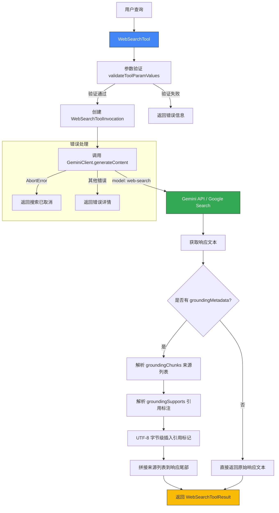

# web-search.ts

## 概述

`web-search.ts` 是 Gemini CLI 核心工具包中的 **网络搜索工具**，通过 Gemini API 调用 Google Search 进行网络搜索。该工具接收用户的搜索查询字符串，调用 Gemini 的 `web-search` 模型获取搜索结果，并将结果格式化为带有引用来源标注的文本返回给 LLM 使用。

该文件定义了三个核心类/接口：
- `WebSearchToolParams` — 工具参数接口
- `WebSearchToolInvocation` — 工具调用执行逻辑
- `WebSearchTool` — 工具的声明式定义入口

## 架构图（Mermaid）



## 核心组件

### 1. 接口定义

#### `GroundingChunkWeb`
网络来源的基本信息结构：
```typescript
interface GroundingChunkWeb {
  uri?: string;    // 来源 URL
  title?: string;  // 来源标题
}
```

#### `GroundingChunkItem`
单个来源条目，包裹 `GroundingChunkWeb`：
```typescript
interface GroundingChunkItem {
  web?: GroundingChunkWeb;
}
```

#### `GroundingSupportSegment`
标注引用在响应文本中的位置（基于 UTF-8 字节位置）：
```typescript
interface GroundingSupportSegment {
  startIndex: number;  // 起始字节索引
  endIndex: number;    // 结束字节索引
  text?: string;       // 可选的对应文本
}
```

#### `GroundingSupportItem`
将文本片段与具体来源关联起来：
```typescript
interface GroundingSupportItem {
  segment?: GroundingSupportSegment;       // 文本段位置
  groundingChunkIndices?: number[];        // 对应来源索引
  confidenceScores?: number[];             // 可选的置信度分数
}
```

#### `WebSearchToolParams`
工具输入参数：
```typescript
export interface WebSearchToolParams {
  query: string;  // 搜索查询字符串
}
```

#### `WebSearchToolResult`
扩展自 `ToolResult`，增加了 `sources` 字段：
```typescript
export interface WebSearchToolResult extends ToolResult {
  sources?: GroundingChunkItem[];  // 搜索来源列表
}
```

### 2. `WebSearchToolInvocation` 类

继承自 `BaseToolInvocation<WebSearchToolParams, WebSearchToolResult>`，负责实际执行搜索逻辑。

**核心方法 `execute(signal: AbortSignal)`：**

执行流程：
1. 通过 `geminiClient.generateContent` 调用 Gemini API，使用 `web-search` 模型
2. 提取响应文本和 `groundingMetadata`
3. 如果无响应文本，返回"未找到结果"
4. 如果存在来源信息（`groundingChunks`），格式化来源列表 `[序号] 标题 (URL)`
5. 如果存在引用支持（`groundingSupports`），在响应文本中插入引用标记 `[n]`
   - 使用 `TextEncoder/TextDecoder` 在 **UTF-8 字节级别** 精确插入标记（因为 segment indices 是 UTF-8 字节位置）
   - 按降序排列插入位置，避免索引偏移问题
6. 将来源列表追加到响应文本末尾
7. 返回包含 `llmContent`、`returnDisplay` 和 `sources` 的结果

**错误处理：**
- `AbortError`：返回"搜索已取消"
- 其他错误：记录警告日志，返回包含 `ToolErrorType.WEB_SEARCH_FAILED` 的错误结果

### 3. `WebSearchTool` 类

继承自 `BaseDeclarativeTool<WebSearchToolParams, WebSearchToolResult>`，是工具的声明式定义入口。

**静态属性：**
- `Name`：等于 `WEB_SEARCH_TOOL_NAME` 常量

**构造函数参数：**
- `context: AgentLoopContext` — Agent 循环上下文，提供 Gemini 客户端等依赖
- `messageBus: MessageBus` — 消息总线，用于工具确认/通知

**构造函数特性：**
- `isOutputMarkdown = true` — 输出为 Markdown 格式
- `canUpdateOutput = false` — 不支持输出更新（非流式）
- `Kind.Search` — 工具类别为搜索

**关键方法：**

| 方法 | 功能 |
|------|------|
| `validateToolParamValues(params)` | 验证 query 参数非空 |
| `createInvocation(params, messageBus, ...)` | 创建 `WebSearchToolInvocation` 实例 |
| `getSchema(modelId?)` | 通过 `resolveToolDeclaration` 获取工具声明 schema（可按模型定制） |

## 依赖关系

### 内部依赖

| 模块路径 | 导入内容 | 用途 |
|----------|----------|------|
| `../confirmation-bus/message-bus.js` | `MessageBus` | 消息总线类型，用于工具执行确认和通知 |
| `./tool-names.js` | `WEB_SEARCH_TOOL_NAME`, `WEB_SEARCH_DISPLAY_NAME` | 工具名称常量 |
| `./tools.js` | `BaseDeclarativeTool`, `BaseToolInvocation`, `Kind`, `ToolInvocation`, `ToolResult` | 工具基类和类型定义 |
| `./tool-error.js` | `ToolErrorType` | 工具错误类型枚举 |
| `../utils/errors.js` | `getErrorMessage`, `isAbortError` | 错误处理工具函数 |
| `../utils/partUtils.js` | `getResponseText` | 从 Gemini 响应中提取文本 |
| `../utils/debugLogger.js` | `debugLogger` | 调试日志记录器 |
| `./definitions/coreTools.js` | `WEB_SEARCH_DEFINITION` | 网络搜索工具的声明定义 |
| `./definitions/resolver.js` | `resolveToolDeclaration` | 工具声明解析器（按模型解析） |
| `../telemetry/llmRole.js` | `LlmRole` | LLM 角色枚举，标识调用场景 |
| `../config/agent-loop-context.js` | `AgentLoopContext` | Agent 循环上下文类型 |

### 外部依赖

| 包名 | 导入内容 | 用途 |
|------|----------|------|
| `@google/genai` | `GroundingMetadata` | Google GenAI SDK 的 Grounding 元数据类型 |

## 关键实现细节

### 1. UTF-8 字节级引用标记插入

Gemini API 返回的 `groundingSupports` 中的 `segment.startIndex` 和 `segment.endIndex` 是 **UTF-8 字节位置**（而非 JavaScript 字符串的 UTF-16 字符位置）。因此代码使用 `TextEncoder` 将响应文本编码为 UTF-8 字节数组，在字节级别进行切割和插入引用标记，最后再用 `TextDecoder` 解码回字符串。这确保了在包含多字节字符（如中文、emoji）的响应中引用标记被准确插入。

### 2. 降序插入策略

引用标记的插入按 `endIndex` 降序排列后逐一处理。这是一个经典的字符串插入优化策略：从后向前插入，前面的索引不会因为后面的插入而发生偏移。

### 3. 模型指定为 `web-search`

调用 `geminiClient.generateContent` 时 model 参数为字符串 `'web-search'`，这是 Gemini API 专门用于网络搜索的模型端点，不同于常规的文本生成模型。

### 4. LlmRole.UTILITY_TOOL

调用时使用 `LlmRole.UTILITY_TOOL` 角色标识，表明这是一个工具辅助调用而非主对话调用，用于遥测和计费区分。

### 5. 来源格式化

来源列表采用 `[序号] 标题 (URL)` 的格式，追加在搜索结果文本末尾，以 `\n\nSources:\n` 分隔。这使得 LLM 和最终用户都能清晰地看到信息来源。

### 6. 工具 Schema 按模型解析

`getSchema(modelId?)` 方法通过 `resolveToolDeclaration` 支持按不同模型返回不同的工具声明 schema，这允许针对不同 Gemini 模型版本提供定制化的参数定义。
