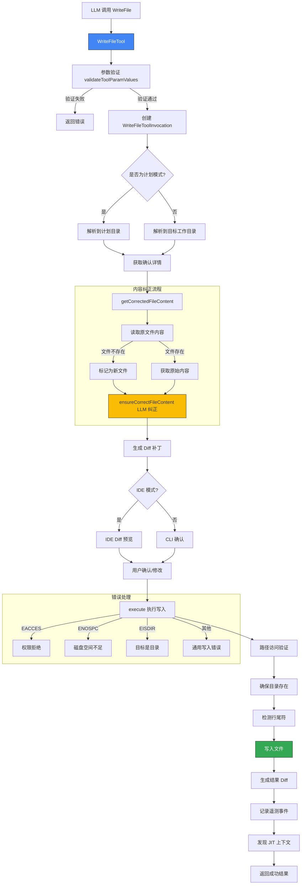

# write-file.ts

## 概述

`write-file.ts` 是 Gemini CLI 核心工具包中的 **文件写入工具**，负责将内容写入指定文件。该工具功能丰富，支持新建文件和覆写已有文件，包含以下核心能力：

- **路径安全验证**：确保目标路径在工作区范围内
- **内容自动纠正**：通过 LLM 修正内容中的转义/格式问题
- **省略占位符检测**：防止 AI 生成的内容包含"rest of methods..."等省略标记
- **行尾符自适应**：自动检测并匹配原文件的行尾符（LF/CRLF）
- **Diff 生成与确认**：在写入前生成差异对比供用户确认
- **IDE 集成**：支持通过 IDE 客户端进行 diff 预览和编辑
- **JIT 上下文发现**：写入文件后发现并附加即时上下文信息
- **遥测记录**：记录文件操作事件用于分析

该文件约 580 行，是工具集中实现最复杂的工具之一。

## 架构图（Mermaid）



## 核心组件

### 1. 接口定义

#### `WriteFileToolParams`
```typescript
export interface WriteFileToolParams {
  file_path: string;            // 目标文件的绝对路径
  content: string;              // 要写入的内容
  modified_by_user?: boolean;   // 用户是否修改了 AI 提议的内容
  ai_proposed_content?: string; // AI 最初提议的内容（用户修改前）
}
```

#### `GetCorrectedFileContentResult`
内容纠正结果的内部接口：
```typescript
interface GetCorrectedFileContentResult {
  originalContent: string;    // 原文件内容
  correctedContent: string;   // 纠正后的内容
  fileExists: boolean;        // 文件是否存在
  error?: { message: string; code?: string };  // 可选的错误信息
}
```

### 2. 类型守卫函数 `isWriteFileToolParams`

运行时检查参数是否满足 `WriteFileToolParams` 接口要求，验证 `file_path` 和 `content` 字段存在且为字符串类型。

### 3. `getCorrectedFileContent` 导出函数

独立于类的异步函数，负责内容纠正流程：

1. 通过 `FileSystemService.readTextFile` 读取目标文件原始内容
2. 处理 `ENOENT`（文件不存在）和其他读取错误
3. 根据模型判断是否使用激进反转义（非 Gemini 3 模型启用 `aggressiveUnescape`）
4. 调用 `ensureCorrectFileContent` 进行 LLM 驱动的内容纠正
5. 返回原始内容、纠正后内容和文件存在状态

### 4. `WriteFileToolInvocation` 类

继承自 `BaseToolInvocation<WriteFileToolParams, ToolResult>`，实现文件写入的完整执行逻辑。

#### 构造函数

- **计划模式**：文件路径解析到 `plansDir`（只取文件名，安全隔离）
- **正常模式**：文件路径解析到 `targetDir`（工作区根目录）

#### `getConfirmationDetails(abortSignal)` 方法

在实际写入前生成确认详情：
1. 调用 `getCorrectedFileContent` 获取纠正内容
2. 使用 `Diff.createPatch` 生成 unified diff
3. 如果处于 IDE 模式且支持 diff，通过 `IdeClient.openDiff` 打开 IDE diff 预览
4. 返回 `ToolEditConfirmationDetails` 对象，包含确认回调 `onConfirm`
5. `onConfirm` 回调中：如果 IDE 返回用户修改后的内容，更新 `params.content`

#### `execute(abortSignal)` 方法

核心执行流程：

| 步骤 | 操作 | 说明 |
|------|------|------|
| 1 | `validatePathAccess` | 验证路径在工作区范围内 |
| 2 | `getCorrectedFileContent` | 获取纠正后的内容 |
| 3 | `fsPromises.mkdir` | 确保目标目录存在（递归创建） |
| 4 | `detectLineEnding` | 检测原文件行尾符，新文件使用系统默认 |
| 5 | `writeTextFile` | 通过 FileSystemService 写入文件 |
| 6 | `Diff.createPatch` | 生成写入前后的 diff 用于展示 |
| 7 | `getDiffStat` | 计算 diff 统计信息 |
| 8 | `getDiffContextSnippet` | 生成 diff 上下文片段供 LLM 了解变更 |
| 9 | `logFileOperation` | 记录文件操作遥测事件 |
| 10 | `discoverJitContext` | 发现并附加 JIT 上下文 |

**错误处理**（Node.js 特定错误码）：

| 错误码 | 错误类型 | 说明 |
|--------|----------|------|
| `EACCES` | `PERMISSION_DENIED` | 权限不足 |
| `ENOSPC` | `NO_SPACE_LEFT` | 磁盘空间不足 |
| `EISDIR` | `TARGET_IS_DIRECTORY` | 目标是目录而非文件 |
| 其他 | `FILE_WRITE_FAILURE` | 通用写入失败 |

### 5. `WriteFileTool` 类

继承自 `BaseDeclarativeTool`，同时实现 `ModifiableDeclarativeTool` 接口。

**关键方法：**

#### `validateToolParamValues(params)`
多层验证：
1. 检查 `file_path` 非空
2. 路径解析后验证工作区访问权限
3. 检查目标路径不是目录
4. 调用 `detectOmissionPlaceholders` 检测省略占位符

#### `getModifyContext(abortSignal)`
实现 `ModifiableDeclarativeTool` 接口，返回 `ModifyContext<WriteFileToolParams>` 对象，提供：
- `getFilePath`：从参数中提取文件路径
- `getCurrentContent`：获取文件当前内容
- `getProposedContent`：获取纠正后的提议内容
- `createUpdatedParams`：创建带用户修改标记的更新参数

## 依赖关系

### 内部依赖

| 模块路径 | 导入内容 | 用途 |
|----------|----------|------|
| `./tool-names.js` | `WRITE_FILE_TOOL_NAME`, `WRITE_FILE_DISPLAY_NAME` | 工具名称常量 |
| `../config/config.js` | `Config` | 配置对象类型 |
| `./tools.js` | `BaseDeclarativeTool`, `BaseToolInvocation`, `Kind`, `FileDiff`, `ToolCallConfirmationDetails`, `ToolEditConfirmationDetails`, `ToolInvocation`, `ToolLocation`, `ToolResult`, `ToolConfirmationOutcome`, `PolicyUpdateOptions` | 工具基类和大量类型定义 |
| `../policy/utils.js` | `buildFilePathArgsPattern` | 构建基于文件路径的策略参数模式 |
| `./tool-error.js` | `ToolErrorType` | 工具错误类型枚举 |
| `../utils/paths.js` | `makeRelative`, `shortenPath` | 路径格式化工具函数 |
| `../utils/errors.js` | `getErrorMessage`, `isNodeError` | 错误处理工具函数 |
| `../utils/editCorrector.js` | `ensureCorrectFileContent` | LLM 驱动的内容纠正 |
| `../utils/textUtils.js` | `detectLineEnding` | 行尾符检测 |
| `./diffOptions.js` | `DEFAULT_DIFF_OPTIONS`, `getDiffStat` | Diff 配置和统计 |
| `./diff-utils.js` | `getDiffContextSnippet` | Diff 上下文片段生成 |
| `./modifiable-tool.js` | `ModifiableDeclarativeTool`, `ModifyContext` | 可修改工具接口 |
| `../ide/ide-client.js` | `IdeClient` | IDE 客户端集成 |
| `../telemetry/loggers.js` | `logFileOperation` | 文件操作遥测日志 |
| `../telemetry/types.js` | `FileOperationEvent` | 文件操作事件类型 |
| `../telemetry/metrics.js` | `FileOperation` | 文件操作枚举（CREATE/UPDATE） |
| `../utils/fileUtils.js` | `getSpecificMimeType` | 获取文件 MIME 类型 |
| `../utils/language-detection.js` | `getLanguageFromFilePath` | 从文件路径推断编程语言 |
| `../confirmation-bus/message-bus.js` | `MessageBus` | 消息总线类型 |
| `../utils/debugLogger.js` | `debugLogger` | 调试日志 |
| `./definitions/coreTools.js` | `WRITE_FILE_DEFINITION` | 写文件工具声明定义 |
| `./definitions/resolver.js` | `resolveToolDeclaration` | 工具声明解析器 |
| `./omissionPlaceholderDetector.js` | `detectOmissionPlaceholders` | 省略占位符检测 |
| `../config/models.js` | `isGemini3Model` | 判断是否为 Gemini 3 模型 |
| `./jit-context.js` | `discoverJitContext`, `appendJitContext` | JIT 上下文发现和附加 |

### 外部依赖

| 包名 | 导入内容 | 用途 |
|------|----------|------|
| `node:fs` | `fs` | 同步文件系统操作（existsSync, lstatSync） |
| `node:fs/promises` | `fsPromises` | 异步文件系统操作（access, mkdir） |
| `node:path` | `path` | 路径处理 |
| `node:os` | `os` | 操作系统信息（EOL 行尾符） |
| `diff` | `Diff` | diff 生成库（createPatch） |

## 关键实现细节

### 1. 计划模式路径隔离

当 `config.isPlanMode()` 为 true 时，文件写入被重定向到专用的计划目录。此时只取文件名（`path.basename`），丢弃目录路径，确保计划模式下不会修改实际项目文件。

### 2. LLM 内容纠正机制

`getCorrectedFileContent` 调用 `ensureCorrectFileContent`，使用 LLM 对 AI 生成的内容进行自动纠正。对于非 Gemini 3 模型，启用 `aggressiveUnescape` 进行更激进的反转义处理。这解决了 LLM 输出中常见的转义字符问题。

### 3. 省略占位符检测

`detectOmissionPlaceholders` 在参数验证阶段检测 AI 输出中的省略标记（如 "rest of methods..."、"... existing code ..." 等），如果检测到则拒绝写入，要求 AI 提供完整文件内容。这防止了 AI 因偷懒而破坏文件。

### 4. 行尾符保持策略

对于已有文件，检测其原始行尾符（LF 或 CRLF），并在写入时保持一致。对于新文件，使用操作系统默认行尾符（`os.EOL`）。这确保了跨平台的行尾符一致性。

### 5. IDE Diff 集成

在 IDE 模式下（`config.getIdeMode()`），如果 IDE 客户端支持 diff 功能，会通过 `IdeClient.openDiff` 在 IDE 中打开 diff 预览。用户可以在 IDE 中直接编辑修改内容，修改后的内容会通过 `ideConfirmation` 回传更新到 `params.content`。

### 6. ModifiableDeclarativeTool 接口实现

`WriteFileTool` 实现了 `ModifiableDeclarativeTool` 接口，这使得调度器可以在执行前允许用户修改工具参数。`getModifyContext` 方法返回的上下文对象让框架能够：
- 获取当前文件内容和 AI 提议的内容
- 让用户修改提议内容
- 创建带有 `modified_by_user` 标记的更新参数

### 7. Diff 上下文回传给 LLM

写入成功后，通过 `getDiffContextSnippet` 生成一个简短的 diff 上下文片段回传给 LLM（`llmSuccessMessageParts`），这样 LLM 可以直接看到变更结果，避免额外花费一个回合来读取验证文件。

### 8. 遥测记录

每次文件写入成功后记录 `FileOperationEvent`，包含工具名、操作类型（CREATE/UPDATE）、行数、MIME 类型、扩展名和编程语言，用于使用统计和分析。

### 9. JIT 上下文发现

写入文件后调用 `discoverJitContext` 发现与目标文件路径相关的即时上下文信息（如目录级别的 README、AGENTS.md 等），并通过 `appendJitContext` 附加到返回给 LLM 的内容中，帮助 LLM 更好地理解项目结构。
