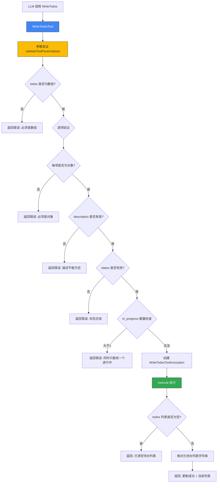

# write-todos.ts

## 概述

`write-todos.ts` 是 Gemini CLI 核心工具包中的 **待办事项管理工具**，允许 AI 助手创建、更新和管理待办事项列表。该工具采用 **全量覆写** 模式——每次调用都传入完整的待办事项列表，替换之前的列表。

这是一个相对轻量级的工具，不涉及文件系统操作或外部 API 调用，主要用于帮助 AI 在执行复杂多步任务时追踪进度。

**支持的待办状态：**
- `pending` — 待处理
- `in_progress` — 进行中（同一时间最多只能有一个）
- `completed` — 已完成
- `cancelled` — 已取消
- `blocked` — 被阻塞

## 架构图（Mermaid）



## 核心组件

### 1. 常量定义

#### `TODO_STATUSES`
所有有效的待办事项状态，使用 `as const` 定义为只读元组：
```typescript
const TODO_STATUSES = [
  'pending',
  'in_progress',
  'completed',
  'cancelled',
  'blocked',
] as const;
```

### 2. 接口定义

#### `WriteTodosToolParams`
```typescript
export interface WriteTodosToolParams {
  todos: Todo[];  // 完整的待办事项列表（全量覆写）
}
```

`Todo` 类型从 `./tools.js` 导入，包含 `description`（字符串）和 `status`（状态枚举）字段。

### 3. `WriteTodosToolInvocation` 类

继承自 `BaseToolInvocation<WriteTodosToolParams, ToolResult>`，实现待办事项列表的更新逻辑。

#### `getDescription()` 方法
根据待办数量返回描述：
- 0 个待办：`"Cleared todo list"`
- N 个待办：`"Set N todo(s)"`

#### `execute(signal, updateOutput?)` 方法

执行流程非常简洁：
1. 将每个待办格式化为 `序号. [状态] 描述` 的字符串
2. 拼接所有待办为换行分隔的列表
3. 返回 `ToolResult`：
   - `llmContent`：纯文本形式的待办列表（供 LLM 上下文使用）
   - `returnDisplay`：`{ todos }` 对象（供 UI 渲染使用）

**输出示例：**
```
Successfully updated the todo list. The current list is now:
1. [completed] 重构用户认证模块
2. [in_progress] 编写单元测试
3. [pending] 部署到预发布环境
```

### 4. `WriteTodosTool` 类

继承自 `BaseDeclarativeTool<WriteTodosToolParams, ToolResult>`，是工具的声明式定义入口。

**静态属性：**
- `Name`：等于 `WRITE_TODOS_TOOL_NAME` 常量

**构造函数特性：**
- 显示名称：`'WriteTodos'`
- `Kind.Other` — 工具类别为"其他"
- `isOutputMarkdown = true`
- `canUpdateOutput = false`
- 只需 `messageBus` 参数，不需要 `Config` 或 `AgentLoopContext`

#### `validateToolParamValues(params)` 方法

多层严格验证：

| 验证规则 | 错误信息 |
|----------|----------|
| `todos` 必须是数组 | `todos parameter must be an array` |
| 每项必须是非 null 对象 | `Each todo item must be an object` |
| `description` 必须是非空字符串 | `Each todo must have a non-empty description string` |
| `status` 必须是有效状态之一 | `Each todo must have a valid status (...)` |
| `in_progress` 状态最多只能有一个 | `Only one task can be "in_progress" at a time.` |

**关键业务规则**：`in_progress` 状态的唯一性约束确保 AI 在任意时刻只聚焦于一个任务，符合单线程任务执行的设计理念。

#### `getSchema(modelId?)` 方法
通过 `resolveToolDeclaration` 按模型解析工具声明 schema。

#### `createInvocation(params, messageBus, ...)` 方法
创建 `WriteTodosToolInvocation` 实例。

## 依赖关系

### 内部依赖

| 模块路径 | 导入内容 | 用途 |
|----------|----------|------|
| `./tools.js` | `BaseDeclarativeTool`, `BaseToolInvocation`, `Kind`, `ToolInvocation`, `Todo`, `ToolResult` | 工具基类和类型定义 |
| `../confirmation-bus/message-bus.js` | `MessageBus` | 消息总线类型 |
| `./tool-names.js` | `WRITE_TODOS_TOOL_NAME` | 工具名称常量 |
| `./definitions/coreTools.js` | `WRITE_TODOS_DEFINITION` | 待办工具的声明定义 |
| `./definitions/resolver.js` | `resolveToolDeclaration` | 工具声明解析器 |

### 外部依赖

无外部依赖。该工具完全依赖内部模块实现，是工具集中依赖最少的工具之一。

## 关键实现细节

### 1. 全量覆写模式

与增量更新不同，该工具采用全量覆写策略——每次调用都传入完整的待办列表。这简化了并发和状态一致性问题，AI 每次调用时都需要维护完整的列表状态。

### 2. in_progress 唯一性约束

验证逻辑中强制执行"同一时间最多只能有一个 `in_progress` 任务"的约束。这是一个有意义的业务规则，引导 AI 按顺序逐一处理任务，而不是同时标记多个任务为进行中。

### 3. 双通道输出

返回结果包含两个不同用途的输出：
- **`llmContent`**：纯文本格式的列表，用于注入 LLM 上下文，让 AI 了解当前任务状态
- **`returnDisplay`**：结构化 `{ todos }` 对象，供 UI 层（如终端或 Web 界面）自定义渲染

### 4. 无需确认

与 `WriteFileTool` 不同，`WriteTodosTool` 不需要用户确认即可执行。这是因为待办列表是纯内存状态，不涉及文件系统修改或不可逆操作。

### 5. 轻量级设计

该工具不依赖 `Config`、文件系统、网络或 LLM 调用，构造函数只需要 `MessageBus`。这使得它初始化快速、执行无副作用，是工具集中最简单的工具之一。
