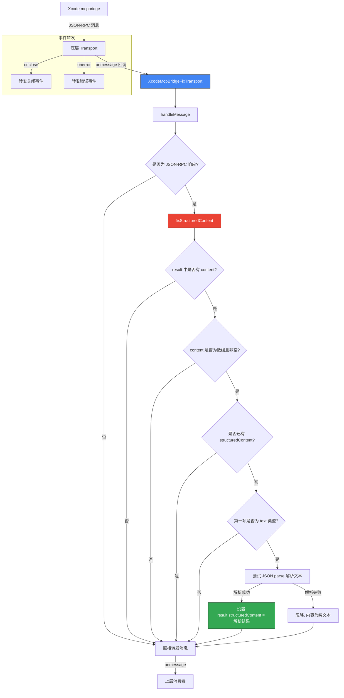

# xcode-mcp-fix-transport.ts

## 概述

`xcode-mcp-fix-transport.ts` 是一个 **MCP（Model Context Protocol）传输层包装器**，专门用于修复 **Xcode 26.3 的 mcpbridge** 返回的不合规响应。

**问题背景**：Xcode 26.3 的 mcpbridge 在处理具有输出 schema 的工具调用结果时，只在 `content` 字段中返回文本内容，但遗漏了 `structuredContent` 字段。这不符合 MCP 协议规范。

**修复策略**：拦截从底层传输层传入的消息，检测缺少 `structuredContent` 的响应，尝试将 `content` 中的文本解析为 JSON 并填充到 `structuredContent` 字段中。

该类采用 **装饰器模式（Decorator Pattern）**，包裹一个真实的 `Transport` 实例，在不修改原始传输层实现的情况下透明地修复消息。

## 架构图（Mermaid）



## 核心组件

### 1. `XcodeMcpBridgeFixTransport` 类

继承自 `EventEmitter`，实现 `Transport` 接口。

#### 构造函数
```typescript
constructor(private readonly transport: Transport)
```

接收一个底层 `Transport` 实例，并注册三个回调：
- `onmessage`：拦截消息，经过修复处理后再转发
- `onclose`：直接转发关闭事件
- `onerror`：直接转发错误事件

#### Transport 接口属性
```typescript
onclose?: () => void;         // 连接关闭回调
onerror?: (error: Error) => void;  // 错误回调
onmessage?: (message: JSONRPCMessage) => void;  // 消息接收回调
```

#### `start()` 方法
委托给底层 transport 启动连接。

#### `close()` 方法
委托给底层 transport 关闭连接。

#### `send(message)` 方法
委托给底层 transport 发送消息。发送方向不需要修复，只需透传。

#### `handleMessage(message)` 私有方法
消息处理的入口点：
1. 检查消息是否为 JSON-RPC 响应（通过 `isJsonResponse`）
2. 如果是响应，调用 `fixStructuredContent` 进行修复
3. 将（可能已修复的）消息转发给上层的 `onmessage` 回调

#### `isJsonResponse(message)` 私有方法
类型守卫函数，判断消息是否为 JSON-RPC 响应。判断依据：
- 消息中包含 `result` 字段（成功响应），或
- 消息中包含 `error` 字段（错误响应）

返回类型为 `message is JSONRPCResponse`，提供 TypeScript 类型收窄。

#### `fixStructuredContent(response)` 私有方法
核心修复逻辑，检查条件链：

| 步骤 | 检查条件 | 不满足时行为 |
|------|----------|-------------|
| 1 | `response` 中存在 `result` | 直接返回 |
| 2 | `result.content` 存在 | 继续执行不修改 |
| 3 | `result.content` 是非空数组 | 继续执行不修改 |
| 4 | `result.structuredContent` 不存在 | 继续执行不修改 |
| 5 | 第一项为 `type: 'text'` 且 `text` 为字符串 | 继续执行不修改 |
| 6 | `JSON.parse(firstItem.text)` 成功 | 设置 `result.structuredContent` |
| 6（异常） | JSON 解析失败 | 静默忽略 |

## 依赖关系

### 内部依赖

无内部依赖。该文件是独立的传输层修复模块，不依赖项目内其他代码。

### 外部依赖

| 包名 | 导入内容 | 用途 |
|------|----------|------|
| `@modelcontextprotocol/sdk/shared/transport.js` | `Transport` | MCP SDK 传输层接口 |
| `@modelcontextprotocol/sdk/types.js` | `JSONRPCMessage`, `JSONRPCResponse` | JSON-RPC 消息和响应类型 |
| `node:events` | `EventEmitter` | Node.js 事件发射器基类 |

## 关键实现细节

### 1. 装饰器模式（Decorator Pattern）

该类采用经典的装饰器设计模式：
- 包裹一个真实的 `Transport` 实例
- 对外实现相同的 `Transport` 接口
- 对 `send`、`start`、`close` 透明委托
- 仅在 `onmessage`（接收方向）进行拦截和修复
- 上层代码无需感知底层是否被包装

### 2. 仅修复接收方向

修复只作用于从 Xcode mcpbridge 接收到的消息（`onmessage`），不修改发送方向（`send`）。这是因为问题出在 Xcode 的响应格式不合规，而发送给 Xcode 的请求格式是正确的。

### 3. 安全的 JSON 解析

在 `fixStructuredContent` 中使用 `try-catch` 包裹 `JSON.parse`。如果 `content[0].text` 不是有效 JSON（即纯文本内容），解析会抛出异常，但被静默捕获忽略。这确保了非 JSON 内容不受影响，修复逻辑是"尽力而为"的。

### 4. 只处理第一个 content 项

修复逻辑只检查 `result.content[0]`（第一个内容项）。这是基于 Xcode mcpbridge 的实际行为——工具结果通常只包含一个文本内容项。

### 5. 不覆盖已有 structuredContent

检查 `!result.structuredContent` 确保只在缺失时填充，不会覆盖已经正确返回的结构化内容。这使得修复逻辑在 Xcode 未来修复此问题后仍能安全使用。

### 6. TypeScript 类型安全的妥协

由于 MCP SDK 的类型定义对 `result` 的结构使用了严格联合类型，代码中不得不使用 `as any` 类型断言来访问 `result.content` 和 `result.structuredContent`。相关的 ESLint 规则被显式禁用（`@typescript-eslint/no-explicit-any` 等），并附有注释说明原因。

### 7. Xcode 版本针对性

该修复专门针对 **Xcode 26.3** 的 mcpbridge。从类名和注释可以看出这是一个临时性的兼容层，预期 Apple 在后续版本中会修复此问题。
