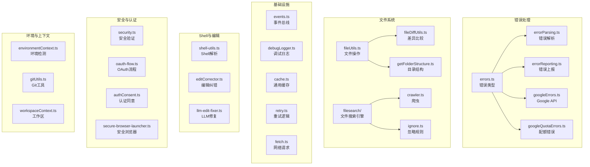

# utils (工具函数模块)

## 概述

`utils/` 目录是 Gemini CLI 核心包的通用工具库，提供了 80+ 个工具模块，涵盖错误处理、文件操作、Shell 工具、网络请求、安全验证、环境上下文、缓存、格式化、Git 操作等基础能力。该模块被项目中几乎所有其他模块广泛依赖。

## 目录结构

```
utils/
├── filesearch/                    # 文件搜索子模块
│   ├── crawlCache.ts             # 爬取缓存
│   ├── crawler.ts                # 文件系统爬虫
│   ├── fileSearch.ts             # 文件搜索引擎
│   ├── ignore.ts                 # 忽略规则处理
│   └── result-cache.ts           # 搜索结果缓存
│
├── errors.ts                     # 错误类型定义（FatalError, RetryableError 等）
├── errorParsing.ts               # 错误解析工具
├── errorReporting.ts             # 错误上报
├── googleErrors.ts               # Google API 错误处理
├── googleQuotaErrors.ts          # Google 配额错误处理
├── httpErrors.ts                 # HTTP 错误类型
├── exitCodes.ts                  # 进程退出码定义
│
├── fileUtils.ts                  # 文件操作工具（读写、大小、MIME 类型等）
├── fileDiffUtils.ts              # 文件差异比较
├── getFolderStructure.ts         # 目录结构获取
├── bfsFileSearch.ts              # 广度优先文件搜索
├── fsErrorMessages.ts            # 文件系统错误消息
│
├── shell-utils.ts                # Shell 命令解析（tree-sitter）
├── editCorrector.ts              # 编辑纠错器
├── llm-edit-fixer.ts             # LLM 编辑修复
├── editor.ts                     # 编辑器集成
│
├── fetch.ts                      # 网络请求工具（带重试）
├── retry.ts                      # 通用重试逻辑
├── cache.ts                      # 通用缓存
├── delay.ts                      # 延迟工具
├── deadlineTimer.ts              # 截止时间计时器
│
├── browser.ts                    # 浏览器操作
├── secure-browser-launcher.ts    # 安全浏览器启动器
├── browserConsent.ts             # 浏览器同意流程
├── authConsent.ts                # 认证同意流程
├── oauth-flow.ts                 # OAuth 流程共享工具
│
├── security.ts                   # 安全验证（目录安全检查等）
├── paths.ts                      # 路径常量与工具
├── channel.ts                    # 通道工具
├── constants.ts                  # 全局常量
│
├── debugLogger.ts                # 调试日志器
├── events.ts                     # 核心事件总线
├── formatters.ts                 # 格式化工具
├── markdownUtils.ts              # Markdown 处理
├── textUtils.ts                  # 文本工具
│
├── environmentContext.ts          # 环境上下文检测
├── envExpansion.ts               # 环境变量展开
├── headless.ts                   # 无头模式检测
├── terminal.ts                   # 终端工具
├── terminalSerializer.ts         # 终端序列化
├── stdio.ts                      # 标准 I/O
├── surface.ts                    # Surface 类型
│
├── gitUtils.ts                   # Git 工具函数
├── gitIgnoreParser.ts            # .gitignore 解析
├── ignoreFileParser.ts           # 忽略文件解析
├── ignorePatterns.ts             # 忽略模式处理
│
├── apiConversionUtils.ts          # API 转换工具
├── generateContentResponseUtilities.ts # 内容生成响应工具
├── partUtils.ts                  # Part 工具
├── tokenCalculation.ts           # Token 计算
│
├── approvalModeUtils.ts          # 审批模式工具
├── checkpointUtils.ts            # 检查点工具
├── checks.ts                     # 检查工具
├── compatibility.ts              # 兼容性检查
├── customHeaderUtils.ts          # 自定义头工具
├── extensionLoader.ts            # 扩展加载器
├── fastAckHelper.ts              # 快速确认助手
├── installationManager.ts        # 安装管理器
├── language-detection.ts         # 语言检测
├── memoryDiscovery.ts            # 记忆发现
├── memoryImportProcessor.ts      # 记忆导入处理
├── messageInspectors.ts          # 消息检查器
├── nextSpeakerChecker.ts         # 下一个发言者检查
├── package.ts                    # 包信息
├── pathCorrector.ts              # 路径纠正
├── pathReader.ts                 # 路径读取
├── planUtils.ts                  # 计划工具
├── process-utils.ts              # 进程工具
├── promptIdContext.ts             # Prompt ID 上下文
├── quotaErrorDetection.ts        # 配额错误检测
├── safeJsonStringify.ts          # 安全 JSON 序列化
├── schemaValidator.ts            # Schema 验证
├── session.ts                    # 会话管理
├── sessionOperations.ts          # 会话操作
├── sessionUtils.ts               # 会话工具
├── summarizer.ts                 # 摘要生成器
├── systemEncoding.ts             # 系统编码
├── thoughtUtils.ts               # 思考工具
├── tool-utils.ts                 # 工具工具
├── toolCallContext.ts            # 工具调用上下文
├── userAccountManager.ts         # 用户账户管理
├── version.ts                    # 版本信息
├── workspaceContext.ts           # 工作区上下文
├── agent-sanitization-utils.ts   # Agent 清理工具
├── getPty.ts                     # PTY 获取
└── *.test.ts                     # 对应的单元测试文件
```

## 架构图



## 核心组件

### 错误处理系统
- **errors.ts**: 定义项目统一的错误类层次（`FatalError`, `FatalConfigError`, `FatalCancellationError`, `RetryableError` 等），提供 `getErrorMessage()` 等通用错误处理函数
- **googleErrors.ts / googleQuotaErrors.ts**: 解析和处理 Google API 特定的错误与配额限制

### 事件总线 (events.ts)
- **职责**: 提供全局事件总线 `coreEvents`，支持反馈事件、遥测事件等的发射与监听
- **模式**: 基于 EventEmitter 的发布-订阅模式

### 调试日志 (debugLogger.ts)
- **职责**: 提供分级调试日志（debug, log, warn, error），支持环境变量控制

### 文件搜索引擎 (filesearch/)
- **职责**: 提供高性能的文件系统搜索能力
- **组件**: 文件爬虫（crawler）、忽略规则处理（ignore）、爬取缓存（crawlCache）、结果缓存（result-cache）

### Shell 工具 (shell-utils.ts)
- **职责**: 使用 tree-sitter 解析 Shell 命令，支持命令拆分、重定向检测、危险命令识别
- **用途**: 被策略引擎用于 Shell 命令安全检查

### OAuth 流程 (oauth-flow.ts)
- **职责**: OAuth 授权码流程的共享实现（PKCE 参数生成、回调服务器、授权 URL 构建、令牌交换）
- **用途**: 被 MCP OAuth 和其他 OAuth 提供者共享

### 安全工具 (security.ts)
- **职责**: 提供目录安全检查（权限验证）等安全相关功能

### Git 工具 (gitUtils.ts)
- **职责**: 提供 Git 仓库检测、操作等基础功能

### 缓存与重试
- **cache.ts**: 通用的内存缓存实现
- **retry.ts**: 带指数退避的通用重试逻辑
- **fetch.ts**: 带重试和超时的网络请求工具

## 依赖关系

### 外部依赖（主要）
- `tree-sitter` / `tree-sitter-bash` - Shell 命令解析
- `glob` - 文件模式匹配
- `mime-types` - MIME 类型检测
- `diff` - 文件差异比较
- `strip-ansi` - ANSI 转义序列去除
- `open` - 跨平台打开浏览器/文件

## 数据流

### 文件搜索流程
1. 用户发起搜索请求
2. `fileSearch.ts` 协调爬虫和缓存
3. `crawler.ts` 遍历文件系统，遵循 `ignore.ts` 定义的忽略规则
4. `crawlCache.ts` 缓存爬取结果，避免重复遍历
5. `result-cache.ts` 缓存搜索结果，加速后续查询
6. 返回匹配的文件列表
