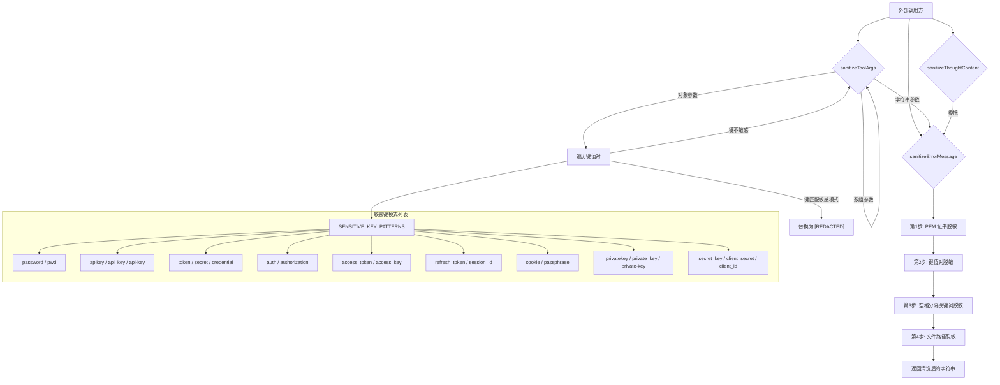

# agent-sanitization-utils.ts

## 概述

`agent-sanitization-utils.ts` 是 Gemini CLI 核心包中的安全清洗工具模块，负责对 Agent（智能代理）交互过程中可能出现的敏感数据进行识别与脱敏处理。该模块提供了三大核心功能：工具参数清洗（`sanitizeToolArgs`）、错误信息清洗（`sanitizeErrorMessage`）以及 LLM 思维内容清洗（`sanitizeThoughtContent`）。其目标是在日志记录、调试输出、错误报告等环节中，防止密码、API 密钥、令牌、PEM 证书等敏感信息被意外泄露。

**文件路径**: `packages/core/src/utils/agent-sanitization-utils.ts`

## 架构图（Mermaid）

## 核心组件

### 1. `SENSITIVE_KEY_PATTERNS` -- 敏感键模式常量

**类型**: `string[]`（导出常量）

定义了 26 个敏感键名模式字符串，涵盖以下类别：

| 类别 | 模式 |
|------|------|
| 密码相关 | `password`, `pwd`, `passphrase` |
| API 密钥 | `apikey`, `api_key`, `api-key` |
| 令牌相关 | `token`, `access_token`, `refresh_token` |
| 密钥相关 | `secret`, `secret_key`, `client_secret`, `privatekey`, `private_key`, `private-key` |
| 认证相关 | `credential`, `auth`, `authorization` |
| 访问控制 | `access_key`, `client_id` |
| 会话相关 | `session_id`, `cookie` |

这些模式在匹配时会经过归一化处理（移除 `-` 和 `_`，转小写），因此能匹配 `API_KEY`、`api-key`、`ApiKey` 等各种变体。

### 2. `sanitizeToolArgs(args: unknown): unknown` -- 工具参数清洗函数

**功能**: 递归清洗工具调用参数，识别并脱敏包含敏感键名的字段。

**处理逻辑**:

1. **字符串参数**: 委托给 `sanitizeErrorMessage` 进行文本级别的脱敏
2. **非对象/null**: 原样返回（数字、布尔值等基本类型无需清洗）
3. **数组参数**: 使用 `Array.map` 递归处理每个元素
4. **对象参数**: 遍历所有键值对：
   - 对键名进行 URL 解码（`decodeURIComponent`），处理如 `api%5fkey` 这类编码形式
   - 归一化键名：转小写 + 移除 `-` 和 `_`
   - 与 `SENSITIVE_KEY_PATTERNS` 列表逐一比较（同样归一化后比较）
   - 若匹配，值替换为 `'[REDACTED]'`
   - 若不匹配，对值递归调用 `sanitizeToolArgs`

**关键设计细节**:
- URL 解码使用 `try-catch` 包裹，解码失败时静默忽略，确保不会因畸形编码导致崩溃
- 归一化比较策略使得 `api_key`、`api-key`、`apikey`、`API_KEY` 等变体均能被正确识别

### 3. `sanitizeErrorMessage(message: string): string` -- 错误信息清洗函数

**功能**: 对错误信息字符串进行多层次的敏感数据脱敏。

**处理管线（4 个阶段顺序执行）**:

#### 阶段 1: PEM 证书内容脱敏
- 使用**迭代方式**（非正则）查找 `-----BEGIN ... -----` 到 `-----END ... -----` 之间的完整 PEM 块
- 替换为 `[REDACTED_PEM]`
- 设计上刻意避免使用正则表达式以防止 ReDoS（正则表达式拒绝服务攻击）
- 使用 `indexOf` 逐步定位 BEGIN 标记、END 标记及其闭合 `-----`

#### 阶段 2: 键值对脱敏（使用分隔符）
- 构造动态正则表达式，支持 `=`、`:`、`%3A`、`%3D` 等分隔符
- 支持 CLI 风格的 `--flag=value` 格式
- 支持键名被引号包裹的情况（`"password"` 或 `'password'`）
- 支持 URL 编码的分隔符（`%2D`、`%5F`）
- 值匹配模式支持：双引号字符串、单引号字符串、非引号的连续非空白字符

#### 阶段 3: 空格分隔关键词脱敏
- 处理 `password mypass`、`--api-key secret`、`bearer <token>` 等空格分隔的模式
- 额外加入 `bearer` 关键词（不在 `SENSITIVE_KEY_PATTERNS` 中）
- 令牌值模式匹配长度 >= 8 的由字母、数字、`.`、`-`、`/`、`+`、`=` 组成的字符串
- 支持 `Authorization: Bearer <token>` 的复合模式

#### 阶段 4: 文件路径脱敏
- 匹配以 `.key`、`.pem`、`.p12`、`.pfx` 结尾的文件路径
- 支持 Unix（`/`）和 Windows（`\`）路径分隔符
- 统一替换为 `/path/to/[REDACTED].key`

### 4. `sanitizeThoughtContent(text: string): string` -- LLM 思维内容清洗函数

**功能**: 清洗 LLM 的内部思维/推理内容中的敏感数据。

**实现**: 直接委托给 `sanitizeErrorMessage`，复用全部脱敏逻辑。这种设计保证了思维内容与错误信息使用完全一致的安全策略。

## 依赖关系

### 内部依赖

无。该模块是一个**纯工具函数模块**，不依赖项目中的其他模块，自包含所有逻辑。

### 外部依赖

无。该模块仅使用 JavaScript/TypeScript 原生 API：
- `Array.isArray`、`Array.map`、`Object.entries` -- 数据遍历
- `String.prototype.toLowerCase`、`String.prototype.replace`、`String.prototype.indexOf`、`String.prototype.substring` -- 字符串处理
- `decodeURIComponent` -- URL 解码
- `RegExp` -- 正则表达式构造

## 关键实现细节

### 1. ReDoS 防护
PEM 证书脱敏阶段（阶段 1）刻意**不使用正则表达式**，而是采用 `indexOf` + `substring` 的迭代方式。这是因为 PEM 内容可能很长且包含大量重复字符（Base64 编码），使用贪婪或回溯型正则可能导致指数级时间复杂度的 ReDoS 攻击。

### 2. URL 编码感知
键名匹配同时考虑了原始键名和 URL 解码后的键名。正则表达式中也将 `-` 和 `_` 替换为可选的 URL 编码形式（`%2D`、`%5F`），确保在 URL 查询字符串等场景中也能正确识别敏感字段。

### 3. 递归深度
`sanitizeToolArgs` 使用无限递归处理嵌套结构。对于正常的 API 参数，嵌套深度通常有限，不会造成栈溢出。但若传入极深嵌套或循环引用的对象，可能导致问题。

### 4. 非破坏性设计
清洗函数始终返回新对象/字符串，**不修改原始输入**。对于对象参数，会构造新的 `sanitized` 对象；对于字符串，`String.replace` 本身返回新字符串。

### 5. 正则表达式动态构造
阶段 2 和阶段 3 的正则表达式是基于 `SENSITIVE_KEY_PATTERNS` 动态构建的，使用 `join('|')` 拼接所有模式为或关系。这保证了新增敏感模式时只需修改常量数组，所有正则自动更新。

### 6. 多格式值匹配
阶段 2 中的 `valuePattern` 支持三种值格式：
- `"双引号包裹的值"` -- 匹配 `"[^"]*"`
- `'单引号包裹的值'` -- 匹配 `'[^']*'`
- `无引号的值` -- 匹配连续非空白字符，支持多个空格分隔的单词（前提是后续单词不像新的键值对）
