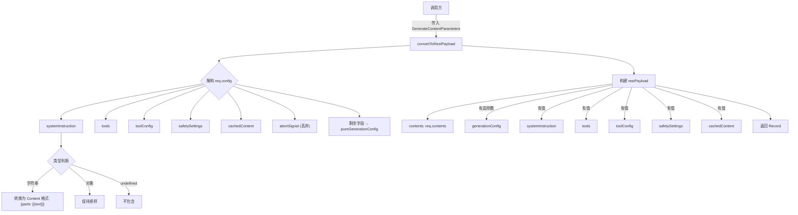

# apiConversionUtils.ts

## 概述

`apiConversionUtils.ts` 是 Gemini CLI 核心包中的 API 格式转换工具模块。其唯一职责是将 Google GenAI SDK 的 `GenerateContentParameters` 对象转换为等效的 REST API 负载格式（JSON 对象）。该转换主要用于**调试**和**请求导出**场景，使开发者能以标准 REST 格式查看和复现 SDK 发出的请求。

**文件路径**: `packages/core/src/utils/apiConversionUtils.ts`

## 架构图（Mermaid）

## 核心组件

### `convertToRestPayload(req: GenerateContentParameters): Record<string, unknown>`

**功能**: 将 SDK 格式的内容生成请求参数转换为 REST API 负载格式。

**参数**:
- `req: GenerateContentParameters` -- Google GenAI SDK 的标准请求参数对象，包含 `contents`（对话内容）和 `config`（配置选项）

**返回值**: `Record<string, unknown>` -- 符合 Gemini REST API 规范的 JSON 负载对象

**处理流程**:

#### 第 1 步: 解构 config 对象

从 `req.config`（若为 `undefined` 则使用空对象 `{}`）中解构出以下字段：

| 解构字段 | REST API 对应 | 处理方式 |
|----------|---------------|----------|
| `systemInstruction` | `systemInstruction` | 需要格式归一化 |
| `tools` | `tools` | 原样传递 |
| `toolConfig` | `toolConfig` | 原样传递 |
| `safetySettings` | `safetySettings` | 原样传递 |
| `cachedContent` | `cachedContent` | 原样传递 |
| `abortSignal` | **不包含** | JS 特有字段，REST API 无对应 |
| 其余字段 | `generationConfig` | 收集为超参数（如 temperature、topP 等） |

#### 第 2 步: 归一化 systemInstruction

SDK 允许 `systemInstruction` 为纯字符串或 Content 对象。REST API 需要统一的 Content 格式：

- **字符串**: 转换为 `{ parts: [{ text: systemInstruction }] }`
- **Content 对象**: 保持原样
- **undefined**: 不添加到负载中

#### 第 3 步: 构建 REST 负载

1. 始终包含 `contents` 字段（来自 `req.contents`）
2. 仅当 `pureGenerationConfig` 有实际键时才包含 `generationConfig`（避免空对象）
3. 各能力字段（tools、toolConfig 等）仅在有值时才添加到负载中

## 依赖关系

### 内部依赖

无。该模块不依赖项目中的其他模块。

### 外部依赖

| 依赖 | 导入内容 | 用途 |
|------|----------|------|
| `@google/genai` | `GenerateContentParameters`（仅类型） | 定义输入参数的 TypeScript 类型 |

注意：这是一个**仅类型导入**（`import type`），不会在运行时引入任何代码，仅在编译期用于类型检查。

## 关键实现细节

### 1. SDK 与 REST API 的结构差异

SDK 的 `GenerateContentParameters` 将所有配置放在 `config` 子对象中（包括生成超参数、工具、安全设置等），而 REST API 采用扁平结构，将 `systemInstruction`、`tools`、`toolConfig`、`safetySettings` 等字段放在顶层，超参数则归入 `generationConfig` 字段。该函数的核心工作就是完成这一结构映射。

### 2. abortSignal 的显式排除

`abortSignal` 是 JavaScript 的 `AbortController` 机制的一部分，用于取消异步操作。它是纯 JS 运行时概念，在 REST API 负载中没有对应字段。代码通过解构时使用 `_sdkAbortSignal` 前缀命名并丢弃来显式排除它，避免被收集到 `pureGenerationConfig` 中。

### 3. 剩余属性收集模式

使用 ES6 的对象剩余属性语法（`...pureGenerationConfig`）收集解构后剩余的所有字段。这意味着 SDK config 中的任何新增超参数（如 `temperature`、`topP`、`topK`、`maxOutputTokens` 等）**无需修改转换代码**即可自动被包含在 `generationConfig` 中，体现了良好的前向兼容设计。

### 4. 稀疏输出策略

负载中仅包含有实际值的字段，避免产生多余的 `null` 或空对象。这不仅使输出更简洁，也符合 REST API 对可选字段的处理惯例（省略即为默认值）。

### 5. 空 config 容错

`req.config || {}` 确保即使 `config` 为 `undefined` 或 `null`，解构操作也不会抛出异常，增强了函数的鲁棒性。
