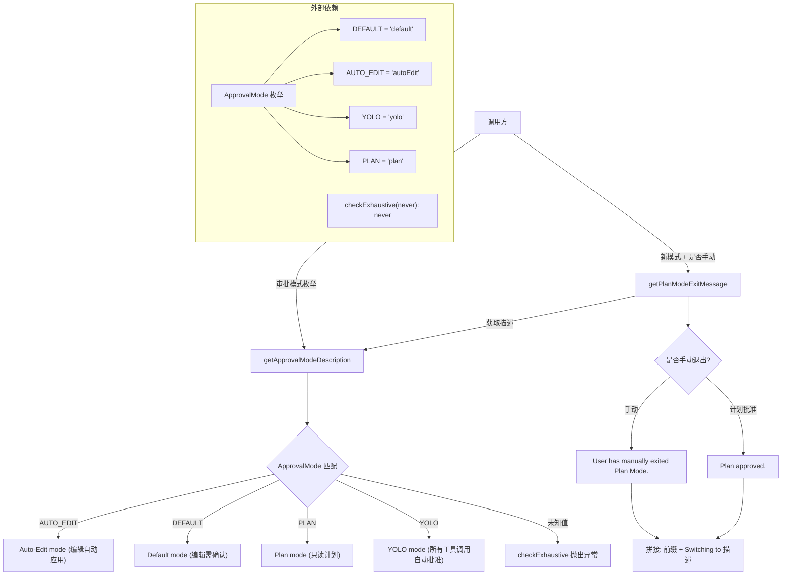

# approvalModeUtils.ts

## 概述

`approvalModeUtils.ts` 是 Gemini CLI 核心包中的审批模式工具模块，提供与 `ApprovalMode`（审批模式）枚举相关的辅助功能。该模块包含两个函数：一个将审批模式枚举值转换为人类可读的描述文本，另一个生成计划模式（Plan Mode）退出时的一致性消息。这些函数在用户界面展示、日志记录和模式切换提示中被广泛使用。

**文件路径**: `packages/core/src/utils/approvalModeUtils.ts`

## 架构图（Mermaid）



## 核心组件

### 1. `getApprovalModeDescription(mode: ApprovalMode): string` -- 审批模式描述函数

**功能**: 将 `ApprovalMode` 枚举值映射为人类可读的描述字符串。

**参数**:
- `mode: ApprovalMode` -- 审批模式枚举值

**返回值**: `string` -- 对应模式的描述文本

**映射表**:

| 枚举值 | 枚举字符串 | 描述文本 |
|--------|-----------|----------|
| `ApprovalMode.AUTO_EDIT` | `'autoEdit'` | `"Auto-Edit mode (edits will be applied automatically)"` |
| `ApprovalMode.DEFAULT` | `'default'` | `"Default mode (edits will require confirmation)"` |
| `ApprovalMode.PLAN` | `'plan'` | `"Plan mode (read-only planning)"` |
| `ApprovalMode.YOLO` | `'yolo'` | `"YOLO mode (all tool calls auto-approved)"` |

**穷尽性检查**: `default` 分支调用 `checkExhaustive(mode)`，该函数的参数类型为 `never`。如果 `ApprovalMode` 枚举新增了成员但此 switch 未更新，TypeScript 编译器会在编译期报类型错误，提醒开发者补充对应分支。在运行时，如果意外到达 default 分支，`checkExhaustive` 会抛出异常。

### 2. `getPlanModeExitMessage(newMode: ApprovalMode, isManual?: boolean): string` -- 计划模式退出消息函数

**功能**: 生成从计划模式切换到其他模式时的提示消息。

**参数**:
- `newMode: ApprovalMode` -- 要切换到的新审批模式
- `isManual: boolean`（可选，默认 `false`）-- 是否为用户手动退出

**返回值**: `string` -- 格式化的切换消息

**消息格式**:
- 手动退出（`isManual = true`）: `"User has manually exited Plan Mode. Switching to <描述>."`
- 计划批准（`isManual = false`）: `"Plan approved. Switching to <描述>."`

**示例输出**:
- `getPlanModeExitMessage(ApprovalMode.DEFAULT)` → `"Plan approved. Switching to Default mode (edits will require confirmation)."`
- `getPlanModeExitMessage(ApprovalMode.YOLO, true)` → `"User has manually exited Plan Mode. Switching to YOLO mode (all tool calls auto-approved)."`

## 依赖关系

### 内部依赖

| 依赖模块 | 导入内容 | 用途 |
|----------|----------|------|
| `../policy/types.js` | `ApprovalMode` | 审批模式枚举类型，定义了四种操作模式 |
| `./checks.js` | `checkExhaustive` | 穷尽性检查函数，用于 switch 语句的 default 分支，确保编译期和运行时的完备性 |

**`ApprovalMode` 枚举详情**（定义于 `packages/core/src/policy/types.ts`）:
```typescript
export enum ApprovalMode {
  DEFAULT = 'default',      // 默认模式: 编辑操作需要用户确认
  AUTO_EDIT = 'autoEdit',   // 自动编辑模式: 编辑自动应用，无需确认
  YOLO = 'yolo',            // YOLO 模式: 所有工具调用自动批准
  PLAN = 'plan',            // 计划模式: 只读规划，不执行任何修改
}
```

**`checkExhaustive` 函数详情**（定义于 `packages/core/src/utils/checks.ts`）:
```typescript
export function checkExhaustive(value: never, msg?): never {
  throw new Error(msg);
}
```
利用 TypeScript 的 `never` 类型，在编译期确保所有枚举分支都已处理；运行时到达此处则抛出异常。

### 外部依赖

无。该模块不依赖任何第三方库。

## 关键实现细节

### 1. 四种审批模式的安全层级

审批模式从严格到宽松排列：

```
PLAN（最严格）→ DEFAULT → AUTO_EDIT → YOLO（最宽松）
```

- **PLAN**: 只读模式，Agent 只能制定计划但不能执行任何工具调用，适合用户想先审查 Agent 策略的场景
- **DEFAULT**: 标准模式，编辑操作需要用户逐个确认
- **AUTO_EDIT**: 自动编辑模式，文件编辑会自动执行，但其他危险操作可能仍需确认
- **YOLO**: 完全自动模式，所有工具调用无需用户确认即可执行

### 2. 编译期安全保证

`checkExhaustive` 的 `never` 类型参数是一种 TypeScript 模式（exhaustive check pattern）。当所有枚举值都被 case 分支处理后，`mode` 的类型被收窄为 `never`，可以传入 `checkExhaustive`。如果未来有人向 `ApprovalMode` 新增值（如 `SEMI_AUTO`）但忘记在此 switch 中添加对应分支，TypeScript 编译器会报错，因为 `mode` 此时不再是 `never` 类型。

### 3. 消息一致性设计

`getPlanModeExitMessage` 函数确保所有计划模式退出场景使用统一的消息格式。无论是用户手动切换模式，还是 Agent 的计划被批准后自动切换，消息都遵循 `<前缀> Switching to <描述>.` 的固定模板，保证用户体验的一致性。

### 4. 模块职责单一

该模块仅处理审批模式的文本表示，不涉及模式切换的逻辑实现、权限检查或状态管理。这体现了单一职责原则（SRP），将展示层（消息文本）与业务层（模式切换逻辑）分离。
