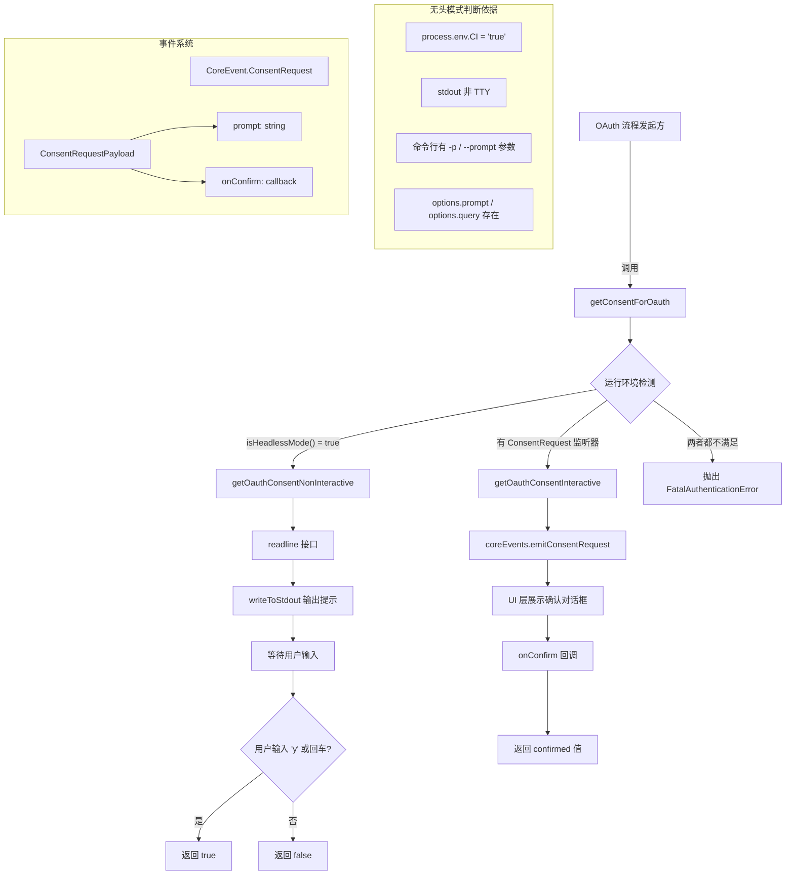

# authConsent.ts

## 概述

`authConsent.ts` 是 Gemini CLI 核心包中的 OAuth 认证同意模块，负责在 OAuth 登录流程启动前获取用户的授权同意。该模块支持两种运行环境：**交互式终端模式**（通过事件系统与 UI 层通信）和**非交互式/无头模式**（直接通过 `readline` 读取标准输入）。当两种模式都不可用时，会抛出致命认证错误。

**文件路径**: `packages/core/src/utils/authConsent.ts`

## 架构图（Mermaid）



## 核心组件

### 1. `getConsentForOauth(prompt: string): Promise<boolean>` -- OAuth 同意获取入口（导出）

**功能**: 根据运行环境选择合适的方式获取用户对 OAuth 登录的同意。

**参数**:
- `prompt: string` -- 向用户展示的提示信息前缀（可为空字符串）

**返回值**: `Promise<boolean>` -- 用户是否同意进行 OAuth 认证

**决策逻辑**（按优先级）:

1. **无头模式优先**: 若 `isHeadlessMode()` 返回 `true`，使用 `getOauthConsentNonInteractive`
2. **事件监听器模式**: 若 `CoreEvent.ConsentRequest` 事件有注册的监听器（`listenerCount > 0`），使用 `getOauthConsentInteractive`
3. **异常路径**: 若以上两个条件均不满足，抛出 `FatalAuthenticationError`，提示用户在交互式终端中运行，或设置 `NO_BROWSER=true` 进行手动认证

**提示消息构建**: 函数会在用户提供的 `prompt` 后附加 `"Opening authentication page in your browser. "`，形成最终提示文本。

### 2. `getOauthConsentNonInteractive(prompt: string): Promise<boolean>` -- 非交互式同意获取（私有）

**功能**: 在无头模式下通过标准输入/输出直接与用户交互获取同意。

**实现细节**:

1. 使用 Node.js `readline` 模块创建接口，输入来自 `process.stdin`，输出使用 `createWorkingStdio().stdout`（确保即使标准输出被重定向也能正常工作）
2. 通过 `writeToStdout` 输出完整提示：`"\n<prompt>Do you want to continue? [Y/n]: "`
3. 监听 `'line'` 事件等待用户输入
4. 用户输入 `'y'`（不区分大小写）或直接回车（空字符串）即视为同意
5. 读取到输入后立即关闭 readline 接口

**默认行为**: `[Y/n]` 格式表示大写 `Y` 为默认选项，即直接回车等同于同意。

### 3. `getOauthConsentInteractive(prompt: string): Promise<boolean>` -- 交互式同意获取（私有）

**功能**: 在交互式终端模式下通过事件系统获取用户同意。

**实现细节**:

1. 构建完整提示：`"<prompt>\n\nDo you want to continue?"`
2. 通过 `coreEvents.emitConsentRequest` 发射 `ConsentRequest` 事件
3. 事件负载包含 `prompt` 字符串和 `onConfirm` 回调函数
4. UI 层（如 Ink 终端界面）监听此事件，展示确认对话框
5. 用户确认或拒绝后，UI 层调用 `onConfirm(confirmed)` 回调
6. 回调通过 Promise resolve 返回结果

**与非交互式模式的差异**:
- 不直接操作 stdin/stdout，而是通过事件系统与 UI 层解耦
- 提示格式不同：交互式模式使用换行分隔，无 `[Y/n]` 后缀（由 UI 组件自行渲染确认按钮）

## 依赖关系

### 内部依赖

| 依赖模块 | 导入内容 | 用途 |
|----------|----------|------|
| `./events.js` | `CoreEvent`, `coreEvents` | 事件枚举和全局事件发射器，用于交互式模式下与 UI 层通信 |
| `./errors.js` | `FatalAuthenticationError` | 致命认证错误类（退出码 41），用于无法获取同意时的异常处理 |
| `./stdio.js` | `createWorkingStdio`, `writeToStdout` | 标准 I/O 工具函数，用于非交互式模式下安全地写入标准输出 |
| `./headless.js` | `isHeadlessMode` | 无头模式检测函数，判断是否运行在 CI 环境、非 TTY 终端等 |

**`isHeadlessMode` 判断逻辑**（定义于 `headless.ts`）:
- `process.env.CI === 'true'` 或 `process.env.GITHUB_ACTIONS === 'true'` → 无头
- `process.stdin` / `process.stdout` 非 TTY → 无头
- 命令行参数包含 `-p` 或 `--prompt` → 无头
- `options.prompt` 或 `options.query` 存在 → 无头

**`FatalAuthenticationError`** 继承自 `FatalError`，退出码为 `41`。

**`ConsentRequestPayload` 接口**（定义于 `events.ts`）:
```typescript
export interface ConsentRequestPayload {
  prompt: string;
  onConfirm: (confirmed: boolean) => void;
}
```

### 外部依赖

| 依赖 | 导入内容 | 用途 |
|------|----------|------|
| `node:readline` | `readline`（默认导入） | Node.js 内置模块，用于非交互式模式下读取标准输入的行数据 |

## 关键实现细节

### 1. 双模式架构

模块采用策略模式，根据运行环境选择不同的用户交互策略：

- **无头模式**: 直接操作 stdin/stdout，适用于 CI 管道、脚本调用等无 UI 框架的场景
- **交互式模式**: 通过事件系统委托 UI 层处理，适用于有 Ink 等终端 UI 框架的完整交互场景

这种设计使得核心认证逻辑与具体的 UI 实现解耦。

### 2. 事件监听器计数检测

`coreEvents.listenerCount(CoreEvent.ConsentRequest) > 0` 检查确保只在有 UI 层注册了同意请求处理器时才使用交互式模式。如果应用启动但 UI 层尚未就绪（或根本没有 UI 层），不会尝试发射无人处理的事件，而是回退到抛出异常。

### 3. Promise 包装回调模式

两个私有函数都使用 `new Promise<boolean>((resolve) => { ... })` 将基于回调/事件的异步操作包装为 Promise。这使得调用方可以使用 `await` 进行同步风格的异步编程。

### 4. 安全的标准输出

非交互式模式使用 `createWorkingStdio().stdout` 而非直接使用 `process.stdout`，以及使用 `writeToStdout` 而非 `console.log`。这确保了在标准输出被管道重定向等特殊情况下仍能正确输出提示信息。

### 5. 错误处理与用户引导

当无法获取同意时，错误消息不仅说明了问题（"Authentication consent could not be obtained"），还提供了两种解决方案：在交互式终端中运行，或使用 `NO_BROWSER=true` 环境变量进行手动认证。这种友好的错误提示有助于用户自助解决问题。

### 6. 回车默认同意

非交互式模式中，空输入（直接回车）被视为同意（`['y', ''].includes(answer)`），遵循 `[Y/n]` 的 Unix 惯例：大写选项表示默认值。
