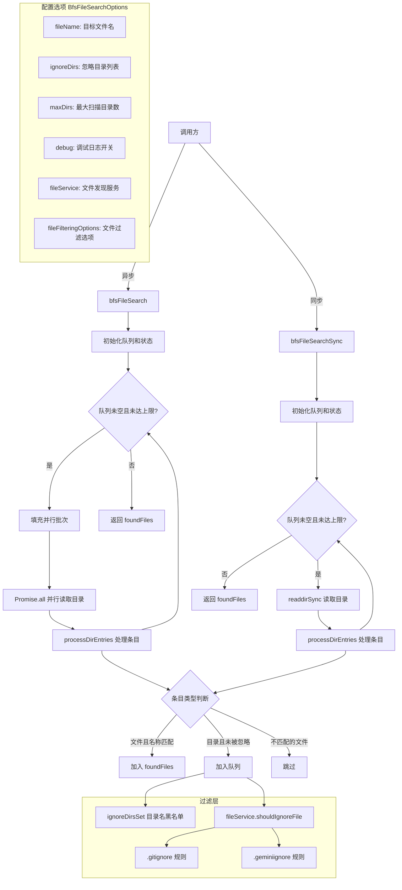

# bfsFileSearch.ts

## 概述

`bfsFileSearch.ts` 是 Gemini CLI 核心包中的文件搜索工具模块，实现了基于**广度优先搜索（BFS）**算法的文件查找功能。该模块提供两个主要函数：异步版本 `bfsFileSearch`（使用并行批量读取优化性能）和同步版本 `bfsFileSearchSync`（逐目录串行处理）。两者都支持目录忽略规则、最大扫描目录数限制、`.gitignore` / `.geminiignore` 规则集成等特性。

BFS 策略确保搜索从根目录开始，按层级由近到远扫描，优先找到距离根目录最近的匹配文件。这在查找项目配置文件（如 `package.json`、`.gemini` 等）时特别有用。

**文件路径**: `packages/core/src/utils/bfsFileSearch.ts`

## 架构图（Mermaid）



## 核心组件

### 1. `BfsFileSearchOptions` 接口（私有）

定义搜索配置选项：

| 字段 | 类型 | 默认值 | 说明 |
|------|------|--------|------|
| `fileName` | `string` | 必填 | 要搜索的目标文件名（精确匹配，如 `"package.json"`） |
| `ignoreDirs` | `string[]` | `[]` | 要忽略的目录名列表（如 `["node_modules", ".git"]`） |
| `maxDirs` | `number` | `Infinity` | 最大扫描目录数量上限，防止在超大目录树中无限搜索 |
| `debug` | `boolean` | `false` | 是否输出调试日志 |
| `fileService` | `FileDiscoveryService` | `undefined` | 可选的文件发现服务，用于集成 gitignore 等过滤规则 |
| `fileFilteringOptions` | `FileFilteringOptions` | `undefined` | 文件过滤选项，控制是否遵守 `.gitignore` 和 `.geminiignore` |

### 2. `bfsFileSearch(rootDir, options): Promise<string[]>` -- 异步 BFS 文件搜索（导出）

**功能**: 从指定根目录开始，使用异步并行 BFS 搜索匹配的文件。

**参数**:
- `rootDir: string` -- 搜索起始目录
- `options: BfsFileSearchOptions` -- 搜索配置

**返回值**: `Promise<string[]>` -- 所有匹配文件的完整路径数组

**算法流程**:

1. **初始化**: 创建队列（数组 + 头指针）、已访问集合、结果数组
2. **批次循环**: 当队列非空且未达 `maxDirs` 上限时：
   - 从队列头部取出最多 `PARALLEL_BATCH_SIZE`（15）个未访问目录
   - 标记为已访问并计入已扫描计数
   - 使用 `Promise.all` 并行调用 `fs.readdir` 读取所有批次目录
   - 对每个目录的结果调用 `processDirEntries` 处理
3. **返回**: 搜索完成后返回所有找到的文件路径

**性能优化**:
- **并行批量读取**: 每批最多 15 个目录同时并行读取，显著减少 I/O 等待时间
- **指针队列**: 使用 `queueHead` 指针而非 `Array.splice(0,1)` 出队，避免 O(n) 的数组重排开销
- **Set 查重**: 使用 `Set<string>` 存储已访问目录和忽略目录名，O(1) 查找

### 3. `bfsFileSearchSync(rootDir, options): string[]` -- 同步 BFS 文件搜索（导出）

**功能**: 与异步版本相同的 BFS 搜索，但使用同步文件系统 API。

**参数**: 同 `bfsFileSearch`

**返回值**: `string[]` -- 所有匹配文件的完整路径数组

**与异步版本的差异**:
- 使用 `fsSync.readdirSync` 代替 `fs.readdir`
- 无并行批量处理，逐目录串行扫描
- 适用于不能使用 async/await 的场景（如某些初始化流程）

### 4. `processDirEntries(...)` -- 目录条目处理函数（私有）

**功能**: 处理单个目录的所有文件系统条目，决定哪些文件加入结果、哪些子目录加入队列。

**参数**:
- `currentDir: string` -- 当前目录路径
- `entries: fsSync.Dirent[]` -- 目录条目数组
- `options: BfsFileSearchOptions` -- 搜索配置
- `ignoreDirsSet: Set<string>` -- 忽略目录名集合
- `queue: string[]` -- BFS 队列（会被修改）
- `foundFiles: string[]` -- 结果数组（会被修改）

**处理逻辑**（对每个条目）:

1. **快速跳过**: 如果既不是目录也不是匹配文件 → 跳过
2. **目录名黑名单**: 如果是目录且名称在 `ignoreDirsSet` 中 → 跳过
3. **文件服务过滤**: 如果 `fileService` 存在且 `shouldIgnoreFile` 返回 `true` → 跳过
4. **分类处理**:
   - 目录 → 推入队列
   - 匹配文件 → 推入结果数组

### 5. 日志记录器（私有）

模块内部定义了一个简单的 `logger` 对象，将调试日志委托给 `debugLogger.debug`，并添加 `[DEBUG] [BfsFileSearch]` 前缀标识。同时也使用 `debugLogger.warn` 记录不可读目录的警告。

## 依赖关系

### 内部依赖

| 依赖模块 | 导入内容 | 用途 |
|----------|----------|------|
| `../services/fileDiscoveryService.js` | `FileDiscoveryService`（仅类型） | 文件发现服务类，提供 `shouldIgnoreFile` 方法用于集成 gitignore/geminiignore 过滤规则 |
| `../config/constants.js` | `FileFilteringOptions`（仅类型） | 文件过滤选项接口，控制 `respectGitIgnore` 和 `respectGeminiIgnore` 等配置 |
| `./debugLogger.js` | `debugLogger` | 调试日志工具，用于输出搜索过程日志和不可读目录警告 |

**`FileFilteringOptions` 接口详情**（定义于 `config/constants.ts`）:
```typescript
export interface FileFilteringOptions {
  respectGitIgnore: boolean;       // 是否遵守 .gitignore 规则
  respectGeminiIgnore: boolean;    // 是否遵守 .geminiignore 规则
  maxFileCount?: number;           // 最大文件数量
  searchTimeout?: number;          // 搜索超时时间
  customIgnoreFilePaths: string[]; // 自定义忽略文件路径
}
```

**`FileDiscoveryService.shouldIgnoreFile` 方法**: 接受文件路径和过滤选项，通过组合 gitignore、geminiignore 和自定义忽略规则判断文件是否应被忽略。

### 外部依赖

| 依赖 | 导入内容 | 用途 |
|------|----------|------|
| `node:fs/promises` | `fs` | Node.js 异步文件系统 API，用于 `readdir` 异步读取目录 |
| `node:fs` | `fsSync` | Node.js 同步文件系统 API，用于 `readdirSync` 同步读取目录，以及 `Dirent` 类型 |
| `node:path` | `path` | Node.js 路径工具，用于 `path.join` 构建完整文件路径 |

## 关键实现细节

### 1. 指针队列 vs 数组 shift/splice

传统的 BFS 队列实现使用 `queue.shift()` 或 `queue.splice(0, 1)` 出队，但这些操作的时间复杂度为 O(n)（需要移动数组所有元素）。该模块使用 `queueHead` 指针实现逻辑出队，出队操作仅需 O(1)。

```typescript
const currentDir = queue[queueHead];
queueHead++;
```

代价是已出队元素仍占据数组内存，但对于文件搜索的典型规模，这是可接受的权衡。

### 2. 并行批量 I/O

异步版本将最多 15 个目录的 `readdir` 操作通过 `Promise.all` 并行执行。这利用了 Node.js 的异步 I/O 模型——文件系统读取主要是等待磁盘 I/O，并行发起多个请求可以充分利用操作系统的 I/O 调度能力，显著减少总等待时间。

批量大小 15 是一个经验值，平衡了并行度和文件描述符资源占用。

### 3. 错误容忍设计

目录读取失败（如权限不足、符号链接断裂等）不会导致整个搜索终止：
- 异步版本：`try-catch` 捕获错误，返回空条目数组 `{ entries: [] }`
- 同步版本：`try-catch` 捕获错误，跳过该目录
- 两种情况都会通过 `debugLogger.warn` 记录警告

### 4. 多层过滤机制

文件和目录的过滤经过三层：

```
第1层: 类型检查 → 不是目录也不是目标文件就跳过
第2层: ignoreDirsSet → 目录名在黑名单中就跳过
第3层: fileService.shouldIgnoreFile → 集成 gitignore/geminiignore 规则
```

这种分层设计既保证了性能（廉价检查在前），又提供了灵活的过滤能力。

### 5. 精确文件名匹配

搜索使用 `entry.name === options.fileName` 进行精确匹配，不支持通配符或正则。这是有意为之——该函数的使用场景是查找特定的配置文件（如 `package.json`、`.gemini`），精确匹配更高效且不会产生误匹配。

### 6. 符号链接与循环引用保护

`visited` 集合记录已扫描的目录路径，防止：
- 符号链接造成的目录循环遍历
- 同一目录从不同路径被多次扫描

注意：当前实现不对路径做 `realpath` 解析，因此指向同一物理目录的不同符号链接路径可能被重复扫描。

### 7. maxDirs 安全阀

`maxDirs` 参数为搜索设置了硬上限。在超大型 monorepo 或包含大量嵌套目录的项目中，这可以防止搜索耗时过长或消耗过多系统资源。默认值为 `Infinity`，即无限制。

### 8. 副作用参数设计

`processDirEntries` 函数通过引用修改传入的 `queue` 和 `foundFiles` 数组，而非返回新数组。这是一种性能优化——避免了频繁的数组创建和合并操作。但这也意味着调用方必须理解这些参数会被修改（即副作用）。
