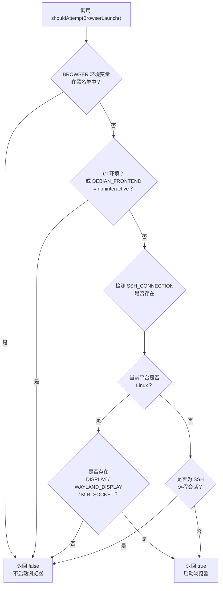

# browser.ts

## 概述

`browser.ts` 是一个浏览器启动检测工具模块，位于 `packages/core/src/utils/browser.ts`。其核心功能是判断当前运行环境是否适合自动打开浏览器（主要用于 OAuth 认证流程）。该模块借鉴了 Google Cloud SDK 的环境检测逻辑，通过读取多个环境变量来综合判断用户是否处于可交互的图形化桌面环境。

该文件仅导出一个纯函数 `shouldAttemptBrowserLaunch()`，返回布尔值，不依赖任何外部库，完全基于 Node.js 内置的 `process` 对象进行环境探测。

## 架构图（Mermaid）



## 核心组件

### `shouldAttemptBrowserLaunch(): boolean`

这是模块唯一导出的函数，用于判断当前环境是否应该尝试启动浏览器。

**判断逻辑按优先级从高到低依次为：**

| 优先级 | 检测条件 | 结果 | 说明 |
|--------|----------|------|------|
| 1 | `BROWSER` 环境变量在黑名单中（`www-browser`） | `false` | 某些系统的默认浏览器不适合打开认证页面 |
| 2 | `CI` 环境变量存在，或 `DEBIAN_FRONTEND === 'noninteractive'` | `false` | CI/CD 流水线或非交互式 shell 环境 |
| 3 | 平台为 Linux 且无图形显示服务器 | `false` | 无头 Linux 服务器无法显示浏览器 |
| 4 | 非 Linux 平台的 SSH 远程会话 | `false` | macOS 等系统通过 SSH 连接时通常无法打开本地浏览器 |
| 5 | 其他情况 | `true` | 默认认为有 GUI 可用 |

**浏览器黑名单：**

```typescript
const browserBlocklist = ['www-browser'];
```

`www-browser` 是 Debian/Ubuntu 系统的替代浏览器命令，通常指向命令行浏览器（如 `lynx`、`w3m`），不适合用于 OAuth 认证流程。

**Linux 图形显示服务器检测变量：**

```typescript
const displayVariables = ['DISPLAY', 'WAYLAND_DISPLAY', 'MIR_SOCKET'];
```

| 变量 | 说明 |
|------|------|
| `DISPLAY` | X11 显示服务器地址（如 `:0`），存在则表示 X Window 系统运行中 |
| `WAYLAND_DISPLAY` | Wayland 合成器的 socket 名称，存在则表示 Wayland 会话运行中 |
| `MIR_SOCKET` | Mir 显示服务器（Ubuntu Touch / Unity 8）的 socket 路径 |

**SSH 会话的特殊处理：**

- 在 **Linux** 上，即使通过 SSH 连接，只要有显示服务器变量（如 X11 转发设置了 `DISPLAY`），仍然允许启动浏览器。
- 在 **非 Linux** 平台（如 macOS），SSH 会话一律不尝试启动浏览器，因为这些平台通常没有类似 X11 转发的远程 GUI 机制。

## 依赖关系

### 内部依赖

无。该文件是一个独立的工具函数，不依赖项目中的其他模块。

### 外部依赖

无第三方库依赖。仅使用 Node.js 全局对象：

| 对象 | 用途 |
|------|------|
| `process.env` | 读取环境变量（`BROWSER`、`CI`、`DEBIAN_FRONTEND`、`SSH_CONNECTION`、`DISPLAY`、`WAYLAND_DISPLAY`、`MIR_SOCKET`） |
| `process.platform` | 获取当前操作系统平台标识（`linux`、`darwin`、`win32` 等） |

## 关键实现细节

1. **纯函数设计**：`shouldAttemptBrowserLaunch()` 不产生副作用，不修改任何状态，仅读取环境变量并返回布尔值。这使得该函数易于测试和在不同上下文中复用。

2. **防御性编程**：使用 `!!process.env['SSH_CONNECTION']` 双重取反将环境变量值转换为布尔值，避免 `undefined` 和空字符串的歧义。

3. **平台差异化处理**：对 Linux 和非 Linux 平台采用不同的判断策略。Linux 通过检测图形显示服务器变量来确认 GUI 可用性，而 macOS/Windows 默认假设 GUI 可用（除非检测到 SSH 连接）。

4. **兜底策略**：函数末尾默认返回 `true`，体现了"乐观假设"原则 —— 在无法确定环境特征时，倾向于尝试启动浏览器，由后续的 `open` 命令错误处理来捕获最终的边缘情况。

5. **Google Cloud SDK 兼容**：代码注释明确说明该逻辑改编自 Google Cloud SDK 的浏览器检测逻辑，保持了与 `gcloud auth login` 等命令一致的行为。

6. **黑名单机制的可扩展性**：`browserBlocklist` 使用数组存储，虽然当前仅包含 `www-browser`，但可以方便地扩展为支持更多不适合 OAuth 认证的浏览器名称。
