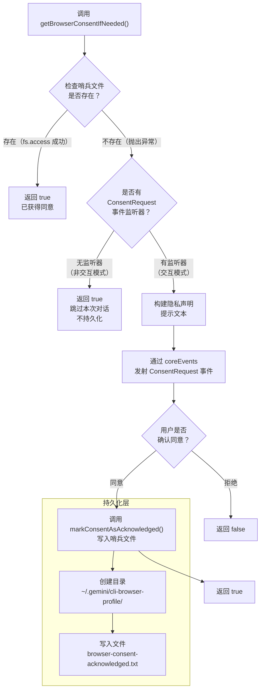

# browserConsent.ts

## 概述

`browserConsent.ts` 位于 `packages/core/src/utils/browserConsent.ts`，是浏览器代理（Browser Agent）的隐私同意管理模块。该模块负责在用户首次使用浏览器代理功能时，展示隐私声明并获取用户同意。

浏览器代理使用 `chrome-devtools-mcp` 来控制用户浏览器，涉及数据收集和 AI 模型对浏览器内容的访问。因此，在首次使用前需要获得用户的知情同意。同意状态通过哨兵文件（sentinel file）持久化到磁盘，避免重复弹出确认对话框。

## 架构图（Mermaid）

## 核心组件

### 常量

| 常量名 | 值 | 说明 |
|--------|----|------|
| `BROWSER_CONSENT_FLAG_FILE` | `'browser-consent-acknowledged.txt'` | 哨兵文件名，记录用户已确认同意 |
| `BROWSER_PROFILE_DIR` | `'cli-browser-profile'` | 浏览器配置目录名，位于 `~/.gemini/` 下 |

### `getBrowserConsentIfNeeded(): Promise<boolean>`

主函数，异步确保用户已确认浏览器代理的隐私声明。

**返回值：**
- `true`：同意已给出（之前持久化过，或用户刚刚确认，或处于非交互模式跳过）
- `false`：用户明确拒绝

**执行流程：**

1. **快速路径（Fast Path）**：构建哨兵文件路径 `~/.gemini/cli-browser-profile/browser-consent-acknowledged.txt`，使用 `fs.access()` 检查文件是否存在。如果存在，直接返回 `true`，无需再次询问。

2. **非交互模式检测**：检查 `coreEvents` 上是否有 `ConsentRequest` 事件的监听器。如果没有监听器（表示在非交互环境中运行，如自动化脚本或测试），则本次会话跳过同意对话框，返回 `true`，但**不持久化**哨兵文件。这意味着下次在交互模式下运行时，用户仍会看到同意对话框。

3. **交互式同意对话**：构建隐私声明文本，通过 `coreEvents.emitConsentRequest()` 发射同意请求事件，等待用户响应。

**隐私声明包含的关键信息：**
- Chrome DevTools MCP 默认收集使用统计数据（可通过隐私设置禁用）
- 性能工具可能向 Google CrUX API 发送跟踪 URL
- 浏览器内容将暴露给 AI 模型进行分析
- 所有数据按 Google 隐私政策处理

### `markConsentAsAcknowledged(consentFilePath: string): Promise<void>`

内部私有函数，负责将同意状态持久化到磁盘。

**实现细节：**
- 使用 `fs.mkdir()` 以 `{ recursive: true }` 选项递归创建目录，确保 `~/.gemini/cli-browser-profile/` 路径存在
- 写入包含 ISO 格式时间戳的文本内容，例如：`Browser privacy consent acknowledged at 2026-03-27T08:00:00.000Z`
- 采用"尽力而为"（best-effort）策略：如果写入失败（权限不足等），静默忽略错误，下次使用时会再次弹出同意对话框

## 依赖关系

### 内部依赖

| 模块 | 导入项 | 用途 |
|------|--------|------|
| `./events.js` | `CoreEvent`, `coreEvents` | 事件系统，用于发射同意请求事件（`ConsentRequest`），并检查是否有监听器 |
| `../config/storage.js` | `Storage` | 配置存储模块，通过 `Storage.getGlobalGeminiDir()` 获取全局 Gemini 配置目录路径（`~/.gemini/`） |

### 外部依赖

| 模块 | 用途 |
|------|------|
| `node:fs/promises` | 异步文件系统操作：`fs.access()`（检查文件存在性）、`fs.mkdir()`（创建目录）、`fs.writeFile()`（写入哨兵文件） |
| `node:path` | 路径拼接：`path.join()`（构建哨兵文件完整路径）、`path.dirname()`（获取目录部分） |

## 关键实现细节

1. **哨兵文件模式**：使用文件系统中的标记文件来持久化用户同意状态，而非数据库或配置文件。这是一种简洁、可靠的方式，便于用户手动管理（删除文件即可重置同意状态）。

2. **非交互模式的安全处理**：当没有 `ConsentRequest` 事件监听器时（非交互环境），函数返回 `true` 允许浏览器代理继续工作，但不写入哨兵文件。这个设计平衡了两个需求：
   - 自动化场景下不因缺少交互界面而阻塞
   - 确保真实用户在首次交互使用时仍能看到隐私声明

3. **事件驱动的 UI 解耦**：同意对话框不直接与任何 UI 框架耦合，而是通过 `coreEvents` 事件系统发射请求。这允许不同的前端（CLI、Web UI 等）以各自的方式实现同意对话框的展示逻辑。

4. **Promise 包装回调模式**：`getBrowserConsentIfNeeded()` 使用 `new Promise()` 将基于回调的事件模式转换为 `async/await` 友好的 Promise，使调用者可以直接 `await` 获取结果。

5. **静默错误处理**：`markConsentAsAcknowledged()` 中的 `try/catch` 使用 `void 0` 占位语句静默吞掉错误。这是有意为之的 —— 持久化失败不应阻止当前操作，最坏的情况只是用户下次会再看到同意对话框。

6. **时间戳记录**：哨兵文件内容包含 ISO 8601 格式的时间戳，便于审计和调试，可以追溯用户确认同意的具体时间。

7. **`void 0` 惯用法**：在空的 `catch` 块中使用 `void 0` 而非留空，这是一种 TypeScript/JavaScript 惯用写法，用于显式表明"此处故意不处理错误"，避免 linter 对空 catch 块的警告。
