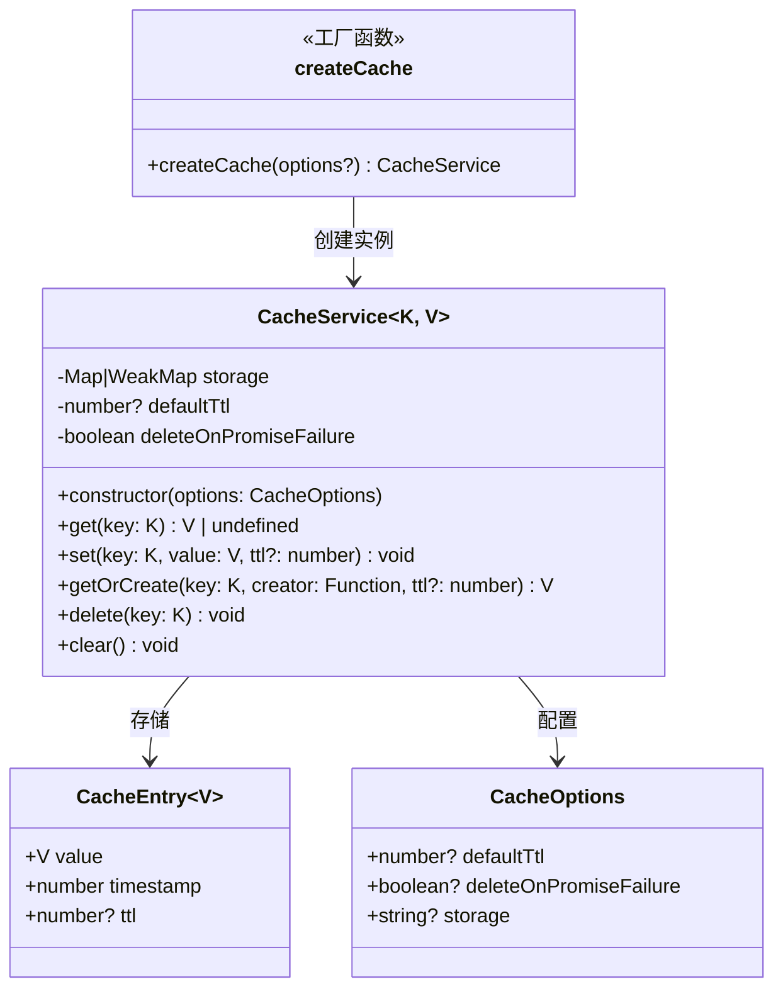
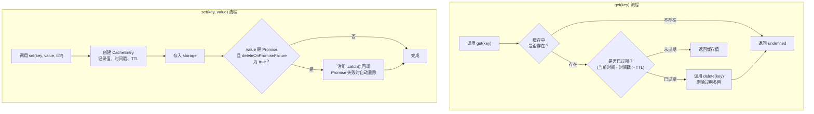

# cache.ts

## 概述

`cache.ts` 位于 `packages/core/src/utils/cache.ts`，是一个通用的、支持 TTL（Time To Live，生存时间）的缓存服务模块。该模块提供了 `CacheService` 类和 `createCache` 工厂函数，支持两种底层存储机制（`Map` 和 `WeakMap`），并具备 Promise 缓存失败自动清除等高级特性。

该缓存服务是类型安全的泛型实现，可以缓存任意类型的键值对，广泛用于项目中需要临时存储计算结果、API 响应或其他可复用数据的场景。

## 架构图（Mermaid）





## 核心组件

### 接口 `CacheEntry<V>`

缓存条目的数据结构，存储在底层 Map/WeakMap 中。

| 字段 | 类型 | 说明 |
|------|------|------|
| `value` | `V` | 缓存的值 |
| `timestamp` | `number` | 条目创建时的时间戳（`Date.now()` 毫秒） |
| `ttl` | `number?` | 可选的条目级 TTL（毫秒），覆盖默认 TTL |

### 接口 `CacheOptions`

缓存服务的配置选项。

| 字段 | 类型 | 默认值 | 说明 |
|------|------|--------|------|
| `defaultTtl` | `number?` | `undefined`（永不过期） | 默认 TTL（毫秒），应用于未指定 TTL 的条目 |
| `deleteOnPromiseFailure` | `boolean?` | `true` | 当缓存值为 Promise 且 reject 时，是否自动从缓存中删除该条目 |
| `storage` | `'map' \| 'weakmap'` | `'map'` | 底层存储机制。`map` 使用 `Map`，支持字符串键和 `clear()` 方法；`weakmap` 使用 `WeakMap`，仅支持对象键，允许垃圾回收 |

### 类 `CacheService<K, V>`

核心缓存服务类，泛型参数 `K` 为键类型（约束为 `object | string | undefined`），`V` 为值类型。

#### 构造函数

```typescript
constructor(options: CacheOptions = {})
```

根据 `options.storage` 初始化底层存储为 `Map` 或 `WeakMap`。默认使用 `Map`（代码注释说明"Default to map for safety"）。

#### `get(key: K): V | undefined`

从缓存中检索值。

- 如果键不存在，返回 `undefined`
- 如果条目存在但已过期（`Date.now() - timestamp > ttl`），先删除条目再返回 `undefined`
- TTL 优先级：条目级 TTL > 默认 TTL > 无 TTL（永不过期）

**惰性过期策略**：过期条目不会被主动清理，而是在被访问时（`get` 调用时）才检查并删除。这种方式简单高效，避免了定时器的开销。

#### `set(key: K, value: V, ttl?: number): void`

将值存入缓存。

- 创建包含值、当前时间戳和可选 TTL 的 `CacheEntry`
- 如果 `deleteOnPromiseFailure` 为 `true` 且值是 `Promise` 实例，则注册 `.catch()` 回调，在 Promise 被 reject 时自动删除该缓存条目
- Promise 失败清除时有竞态保护：只有当缓存中的条目仍然是同一个对象（`=== entry`）时才删除，避免清除后来设置的新值

#### `getOrCreate(key: K, creator: () => V, ttl?: number): V`

缓存穿透的便捷方法。先尝试 `get(key)`，如果未命中则调用 `creator()` 创建值并通过 `set()` 存入缓存。

这是经典的"Cache-Aside"（旁路缓存）模式的实现，保证了对同一个键只调用一次 `creator()`。

#### `delete(key: K): void`

从缓存中移除指定键的条目。内部根据存储类型分发到 `Map.delete()` 或 `WeakMap.delete()`。

#### `clear(): void`

清除所有缓存条目。**仅在使用 `Map` 存储时支持**，使用 `WeakMap` 时调用会抛出 `Error('clear() is not supported on WeakMap storage')`。这是因为 `WeakMap` 本身不支持枚举和批量清除操作。

### 工厂函数 `createCache<K, V>(options?): CacheService<K, V>`

提供类型安全的缓存实例创建方式，使用**函数重载**来根据 `storage` 选项推断键类型：

| 重载签名 | 键类型约束 | 说明 |
|----------|-----------|------|
| `createCache<K extends string \| undefined, V>(options: CacheOptions & { storage: 'map' })` | 字符串或 undefined | 使用 Map 存储时，键可以是字符串 |
| `createCache<K extends object, V>(options?: CacheOptions)` | 对象 | 使用 WeakMap 存储时（默认），键必须是对象 |

## 依赖关系

### 内部依赖

无。该模块是一个完全独立的工具类，不依赖项目中的其他模块。

### 外部依赖

无第三方库依赖。仅使用 JavaScript 内置对象：

| 对象/类 | 用途 |
|---------|------|
| `Map` | 当 `storage: 'map'` 时作为底层存储 |
| `WeakMap` | 当 `storage: 'weakmap'` 时作为底层存储，允许键被垃圾回收 |
| `Date.now()` | 获取当前时间戳，用于计算 TTL 过期 |
| `Promise` | 检测缓存值是否为 Promise 实例（`instanceof Promise`） |

## 关键实现细节

1. **双存储引擎**：支持 `Map` 和 `WeakMap` 两种底层存储，通过配置切换。`Map` 适用于字符串键场景，支持完整的 CRUD 操作；`WeakMap` 适用于对象键场景，当键对象不再被外部引用时，对应的缓存条目会被自动垃圾回收，防止内存泄漏。

2. **惰性过期（Lazy Expiration）**：缓存不使用定时器主动清理过期条目，而是在 `get()` 时检查 TTL 并按需删除。这种策略的优势是零额外开销，劣势是已过期但未被访问的条目会占用内存直到下次被访问。

3. **Promise 缓存的智能处理**：当缓存值为 Promise 时，如果该 Promise 最终被 reject，缓存条目会被自动清除。这在缓存异步 API 调用结果时非常有用 —— 避免将失败的请求结果持久留在缓存中。

4. **竞态条件保护**：在 Promise 的 `.catch()` 回调中，通过 `(this.storage as any).get(key) === entry` 严格比较引用来确保只删除当前条目。如果在 Promise 等待期间同一个键被重新设置了新值，旧 Promise 的失败不会误删新值。

5. **类型安全的 `any` 转换**：由于 `Map` 和 `WeakMap` 的 API 签名略有不同（`WeakMap` 要求键为 `WeakKey`），代码内部使用 `as any` 进行类型转换以统一调用方式。虽然牺牲了部分类型安全，但通过 ESLint disable 注释明确标注了这些位置，并在外部 API 层面保持了完整的类型推断。

6. **工厂函数的类型重载**：`createCache` 使用 TypeScript 函数重载，根据是否传入 `{ storage: 'map' }` 来自动放宽或收紧键类型约束，为调用者提供最佳的类型推断体验。

7. **默认安全策略**：
   - 存储默认使用 `Map`（更安全、功能更完整）
   - `deleteOnPromiseFailure` 默认为 `true`（防止缓存中存留失败的 Promise）
   - `defaultTtl` 默认为 `undefined`（条目永不过期，除非显式指定）
