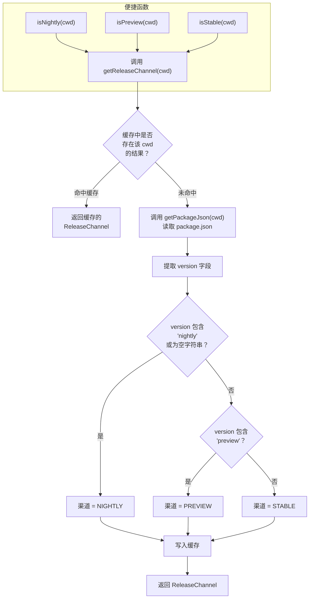

# channel.ts

## 概述

`channel.ts` 位于 `packages/core/src/utils/channel.ts`，是一个发布渠道（Release Channel）检测模块。该模块通过读取项目 `package.json` 中的 `version` 字段来判断当前运行的 Gemini CLI 属于哪个发布渠道：Nightly（每日构建）、Preview（预览版）或 Stable（稳定版）。

该模块使用内存缓存避免重复读取 `package.json`，并提供了便捷的布尔判断函数（`isNightly`、`isPreview`、`isStable`）供项目其他部分快速判断当前渠道。

## 架构图（Mermaid）



## 核心组件

### 枚举 `ReleaseChannel`

定义三种发布渠道。

| 枚举成员 | 值 | 说明 |
|----------|-----|------|
| `NIGHTLY` | `'nightly'` | 每日构建版本，版本号中包含 `nightly` 字样，或版本号为空/不存在 |
| `PREVIEW` | `'preview'` | 预览版本，版本号中包含 `preview` 字样 |
| `STABLE` | `'stable'` | 稳定版本，版本号中不包含上述关键词 |

### 模块级缓存

```typescript
const cache = new Map<string, ReleaseChannel>();
```

以工作目录（`cwd`）为键缓存已解析的发布渠道。由于 `package.json` 内容在进程运行期间不会改变，缓存可以避免重复的文件系统 I/O 操作。

### `_clearCache(): void`

清除模块级缓存的测试辅助函数。以下划线前缀命名并标记为 `@private`，表明仅供测试使用。

### `getReleaseChannel(cwd: string): Promise<ReleaseChannel>`

核心异步函数，根据工作目录检测当前的发布渠道。

**参数：**
- `cwd: string` — 当前工作目录路径，用于定位 `package.json`

**版本号判断逻辑：**

| 条件 | 判定结果 | 示例版本号 |
|------|----------|-----------|
| `version.includes('nightly')` 或 `version === ''` | `NIGHTLY` | `0.35.0-nightly.20260327`、`''` |
| `version.includes('preview')` | `PREVIEW` | `0.35.0-preview.1` |
| 其他 | `STABLE` | `0.35.2` |

注意：如果 `packageJson` 为 `null/undefined`（`getPackageJson` 未找到文件），`version` 会回退为空字符串 `''`，此时被归类为 `NIGHTLY`。

### 便捷判断函数

| 函数 | 返回类型 | 说明 |
|------|----------|------|
| `isNightly(cwd: string)` | `Promise<boolean>` | 判断是否为 Nightly 渠道 |
| `isPreview(cwd: string)` | `Promise<boolean>` | 判断是否为 Preview 渠道 |
| `isStable(cwd: string)` | `Promise<boolean>` | 判断是否为 Stable 渠道 |

这三个函数都是对 `getReleaseChannel()` 的薄包装，直接比较返回值是否等于对应枚举成员。

## 依赖关系

### 内部依赖

| 模块 | 导入项 | 用途 |
|------|--------|------|
| `./package.js` | `getPackageJson` | 读取并解析指定目录下的 `package.json` 文件，返回解析后的 JSON 对象 |

### 外部依赖

无第三方库依赖。仅使用 JavaScript 内置对象：

| 对象/类 | 用途 |
|---------|------|
| `Map` | 用于模块级缓存，以 `cwd` 字符串为键存储已解析的 `ReleaseChannel` |

## 关键实现细节

1. **基于版本号的渠道检测**：通过 `String.includes()` 检查版本号是否包含特定关键词来判断渠道。这种方式简单直接，与 npm 发布时的版本号命名约定（如 `0.35.0-nightly.20260327`）保持一致。

2. **空版本号的默认处理**：当 `package.json` 不存在或 `version` 字段为空时，默认归类为 `NIGHTLY`。这是一个合理的防御性设计 —— 在开发环境或未正式打包的代码中，版本号可能不存在，此时视为开发（Nightly）版本最为合理。

3. **基于 cwd 的缓存键**：使用工作目录作为缓存键意味着同一进程中如果操作多个不同的 Gemini CLI 安装目录，每个目录的渠道检测结果会独立缓存。虽然这在实际场景中很少发生，但体现了对多实例场景的考量。

4. **非空断言操作符**：`cache.get(cwd)!` 使用了 TypeScript 非空断言。这是安全的，因为前一行的 `cache.has(cwd)` 已经确保了键存在。

5. **异步 API 设计**：尽管渠道信息在首次解析后会被缓存，所有公开函数仍统一返回 `Promise`。这使得 API 签名稳定一致，调用者无需关心缓存是否命中，始终使用 `await` 调用即可。

6. **判断优先级**：`NIGHTLY` 的判断优先于 `PREVIEW`，`PREVIEW` 优先于 `STABLE`。这意味着如果一个版本号同时包含 `nightly` 和 `preview`（虽然不太可能），会被判定为 `NIGHTLY`。

7. **测试友好设计**：提供 `_clearCache()` 函数允许测试在每个用例之间重置模块状态，防止测试之间的缓存干扰。
