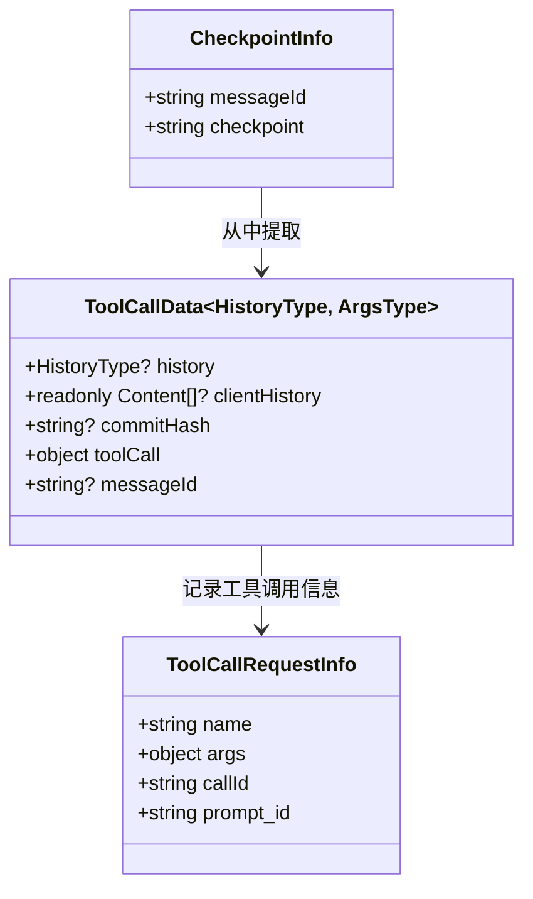

# checkpointUtils.ts

## 概述

`checkpointUtils.ts` 位于 `packages/core/src/utils/checkpointUtils.ts`，是 Gemini CLI 的**检查点（Checkpoint）系统**核心工具模块。该模块负责在 AI 工具调用（Tool Call）执行前创建可恢复的检查点快照，使用户能够在工具调用产生不期望的结果时回滚到之前的状态。

检查点系统基于 Git 实现：在执行文件修改类的工具调用前，通过 `GitService` 创建 Git 快照（commit），并将工具调用信息、对话历史、commit hash 等元数据序列化为 JSON 文件持久化存储。当需要回滚时，可以根据 JSON 文件中记录的 commit hash 恢复到之前的文件状态。

## 架构图（Mermaid）

```mermaid
flowchart TD
    subgraph 检查点创建流程
        A["工具调用列表\n(ToolCallRequestInfo[])"] --> B["processRestorableToolCalls()"]
        B --> C{"遍历每个\n工具调用"}
        C --> D["GitService\n创建文件快照"]
        D -- 成功 --> E["获取 commit hash"]
        D -- 失败 --> F["降级：获取\n当前 commit hash"]
        F --> E
        E --> G["generateCheckpointFileName()\n生成检查点文件名"]
        G -- "无 file_path" --> H["跳过，记录错误"]
        G -- "有 file_path" --> I["获取 GeminiClient\n对话历史"]
        I --> J["组装 ToolCallData\n检查点数据"]
        J --> K["序列化为 JSON"]
        K --> L["存入 checkpointsToWrite Map"]
    end

    subgraph 检查点读取流程
        M["检查点文件列表\nMap<文件名, 内容>"] --> N["getCheckpointInfoList()"]
        N --> O["解析 JSON\n提取 messageId"]
        O --> P["返回 CheckpointInfo[]"]
    end

    subgraph 辅助函数
        Q["formatCheckpointDisplayList()"] --> R["getTruncatedCheckpointNames()"]
        R --> S["移除文件扩展名\n用于显示"]
    end
```





## 核心组件

### 接口 `ToolCallData<HistoryType, ArgsType>`

检查点数据的核心数据结构，包含恢复所需的全部信息。

| 字段 | 类型 | 说明 |
|------|------|------|
| `history` | `HistoryType?` | 应用层对话历史（泛型，由调用者决定具体类型） |
| `clientHistory` | `readonly Content[]?` | Gemini API 客户端的对话历史（`@google/genai` 的 `Content` 类型） |
| `commitHash` | `string?` | Git commit hash，标识创建检查点时的文件系统状态 |
| `toolCall` | `{ name: string; args: ArgsType }` | 触发检查点的工具调用信息（工具名称和参数） |
| `messageId` | `string?` | 关联的消息 ID，用于将检查点与对话中的特定消息对应 |

### 接口 `CheckpointInfo`

精简的检查点信息，用于展示和选择。

| 字段 | 类型 | 说明 |
|------|------|------|
| `messageId` | `string` | 关联的消息 ID |
| `checkpoint` | `string` | 检查点名称（不含 `.json` 扩展名） |

### `getToolCallDataSchema(historyItemSchema?: z.ZodTypeAny)`

使用 Zod 构建 `ToolCallData` 的运行时验证 schema。

**参数：**
- `historyItemSchema`：可选的历史条目 Zod schema，默认为 `z.any()`

**返回的 Schema 结构：**

```typescript
z.object({
  history: z.array(schema).optional(),          // 历史记录数组
  clientHistory: z.array(ContentSchema).optional(), // API 客户端历史
  commitHash: z.string().optional(),            // Git commit hash
  toolCall: z.object({
    name: z.string(),                           // 工具名称
    args: z.record(z.unknown()),                // 工具参数
  }),
  messageId: z.string().optional(),             // 消息 ID
})
```

**`ContentSchema` 定义：**
```typescript
const ContentSchema = z.object({
  role: z.string().optional(),
  parts: z.array(z.record(z.unknown())),
}).passthrough();
```

使用 `.passthrough()` 允许 `Content` 对象包含额外的未知字段，确保与 `@google/genai` 的 `Content` 类型兼容。

### `generateCheckpointFileName(toolCall: ToolCallRequestInfo): string | null`

为检查点生成唯一的文件名。

**文件名格式：** `{ISO时间戳}-{文件名}-{工具名}`

**时间戳处理：**
- 冒号 `:` 替换为 `-`（文件系统兼容）
- 点号 `.` 替换为 `_`（避免与扩展名混淆）

**示例：** `2026-03-27T08-30-00_000Z-main.ts-edit_file`

**返回 `null` 的条件：** 工具调用参数中没有 `file_path` 字段。这意味着只有操作文件的工具调用才会创建检查点。

### `formatCheckpointDisplayList(filenames: string[]): string`

将检查点文件名列表格式化为用户可读的显示字符串，每个文件名占一行，去除扩展名。

### `getTruncatedCheckpointNames(filenames: string[]): string[]`

移除文件名中最后一个 `.` 后面的扩展名部分。例如 `checkpoint.json` 变为 `checkpoint`。如果文件名没有扩展名（不含 `.`），则保持原样。

### `processRestorableToolCalls<HistoryType>(...): Promise<{...}>`

核心处理函数，为一批工具调用创建检查点。

**参数：**

| 参数 | 类型 | 说明 |
|------|------|------|
| `toolCalls` | `ToolCallRequestInfo[]` | 待处理的工具调用列表 |
| `gitService` | `GitService` | Git 服务实例，用于创建快照 |
| `geminiClient` | `GeminiClient` | Gemini API 客户端，用于获取对话历史 |
| `history` | `HistoryType?` | 可选的应用层对话历史 |

**返回值：**

| 字段 | 类型 | 说明 |
|------|------|------|
| `checkpointsToWrite` | `Map<string, string>` | 待写入磁盘的检查点数据（文件名 -> JSON 内容） |
| `toolCallToCheckpointMap` | `Map<string, string>` | 工具调用 ID 到检查点名称的映射（callId -> 检查点名，不含 `.json`） |
| `errors` | `string[]` | 处理过程中收集的错误信息 |

**执行流程（对每个工具调用）：**

1. 调用 `gitService.createFileSnapshot()` 创建 Git 快照
2. 如果快照创建失败，降级为 `gitService.getCurrentCommitHash()` 获取当前 commit hash
3. 如果仍然无法获取 commit hash，记录错误并跳过该工具调用
4. 调用 `generateCheckpointFileName()` 生成文件名
5. 如果文件名为 `null`（无 `file_path` 参数），记录错误并跳过
6. 从 `geminiClient.getHistory()` 获取对话历史
7. 组装 `ToolCallData` 并序列化为格式化 JSON（2 空格缩进）
8. 将结果存入 `checkpointsToWrite` 和 `toolCallToCheckpointMap`

### `getCheckpointInfoList(checkpointFiles: Map<string, string>): CheckpointInfo[]`

从磁盘读取的检查点文件中提取精简信息列表。

**参数：**
- `checkpointFiles`：`Map<文件名, 文件内容>` 格式的检查点文件集合

**逻辑：**
- 遍历所有文件，尝试将内容解析为 JSON
- 只包含具有 `messageId` 的条目
- 无效 JSON 文件静默跳过

## 依赖关系

### 内部依赖

| 模块 | 导入项 | 用途 |
|------|--------|------|
| `../services/gitService.js` | `GitService`（类型） | Git 操作服务，提供 `createFileSnapshot()` 和 `getCurrentCommitHash()` 方法 |
| `../core/client.js` | `GeminiClient`（类型） | Gemini API 客户端，通过 `getHistory()` 获取对话历史 |
| `./errors.js` | `getErrorMessage` | 从错误对象中安全提取错误信息字符串 |
| `../scheduler/types.js` | `ToolCallRequestInfo`（类型） | 工具调用请求信息的类型定义，包含 `name`、`args`、`callId`、`prompt_id` 等字段 |

### 外部依赖

| 模块 | 用途 |
|------|------|
| `node:path` | `path.basename()` 从文件路径中提取文件名 |
| `zod` | 运行时 schema 验证库，用于构建 `ToolCallData` 的验证 schema |
| `@google/genai` | `Content` 类型（仅类型导入），Gemini API 的对话内容数据结构 |

## 关键实现细节

1. **优雅降级策略**：快照创建失败时不立即中止，而是降级为获取当前 commit hash。即使降级后仍然失败（无法获取任何 commit hash），也只是跳过该工具调用并记录错误，不影响其他工具调用的检查点创建。这种层层降级的容错设计保证了系统的健壮性。

2. **仅对文件操作创建检查点**：`generateCheckpointFileName()` 通过检查工具参数中是否包含 `file_path` 字段来判断该工具调用是否操作文件。只有文件操作类工具调用（如编辑文件、写入文件）才会创建检查点，非文件操作（如搜索、查询）不会产生检查点，避免了不必要的 Git 提交开销。

3. **时间戳文件名保证唯一性**：检查点文件名以 ISO 8601 时间戳开头（精确到毫秒），结合目标文件名和工具名称，几乎保证了全局唯一性。同时，时间戳的自然排序特性使检查点文件按时间顺序排列，便于管理和查找。

4. **文件名中的特殊字符处理**：ISO 时间戳中的 `:` 和 `.` 在某些文件系统（如 Windows 的 NTFS）中可能引起问题，因此分别替换为 `-` 和 `_`，确保跨平台兼容性。

5. **批量处理但不批量写入**：`processRestorableToolCalls()` 处理所有工具调用并收集结果，但只将待写入的数据放入 `Map` 中返回，实际的磁盘写入由调用者负责。这种**关注点分离**的设计使得写入策略可以灵活调整（如批量写入、异步写入等）。

6. **两种历史记录的保存**：检查点同时保存了 `history`（应用层历史）和 `clientHistory`（API 客户端历史）。这两层历史可能有不同的数据结构和用途：
   - `history`：泛型类型，由上层应用定义，可能包含 UI 渲染所需的额外信息
   - `clientHistory`：`Content[]` 类型，是 Gemini API 的原始对话格式，用于恢复后继续与 API 交互

7. **Zod Schema 的灵活性**：`getToolCallDataSchema()` 接受可选的 `historyItemSchema` 参数，允许不同的调用者根据自己的 `HistoryType` 提供相应的验证 schema。同时 `ContentSchema` 使用 `.passthrough()` 保持对 `@google/genai` 类型变化的兼容性。

8. **错误收集而非错误抛出**：`processRestorableToolCalls()` 将所有错误收集到 `errors` 数组中返回，而不是在遇到第一个错误时抛出异常。这使得调用者可以一次性了解所有问题，并决定如何处理（如展示给用户、记录日志等）。

9. **检查点名称映射的去扩展名处理**：`toolCallToCheckpointMap` 中存储的检查点名称移除了 `.json` 后缀（`fileName.replace('.json', '')`），而 `checkpointsToWrite` 中的键保留完整文件名。这种设计将存储层面的文件名与用户层面的检查点标识区分开来。
