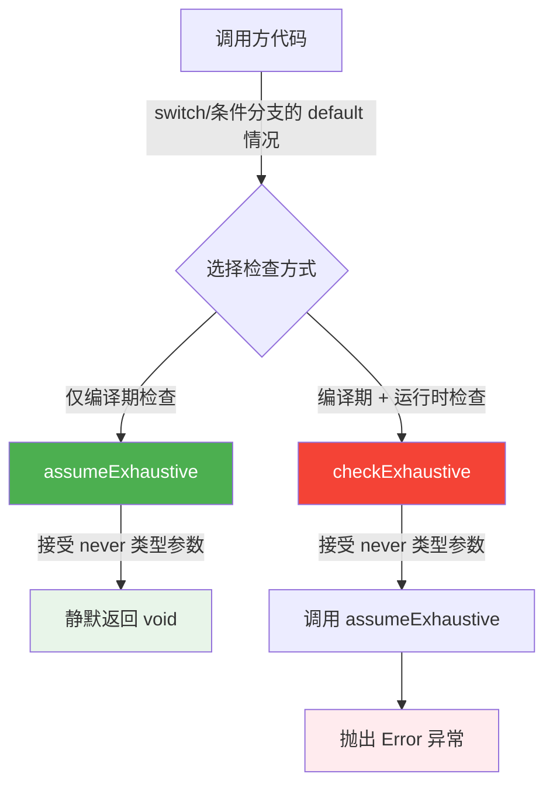

# checks.ts

## 概述

`checks.ts` 是一个轻量级的类型安全工具模块，提供 TypeScript 穷举检查（exhaustive check）功能。它利用 TypeScript 的 `never` 类型系统，确保在编译时和运行时都能捕获未处理的分支情况。该文件主要用于 `switch` 语句或条件分支中，保证所有可能的枚举值或联合类型分支都被正确处理。

## 架构图（Mermaid）



## 核心组件

### 1. `assumeExhaustive(_value: never): void`

**功能**：编译期穷举检查（静默版）。

- **参数**：`_value: never` — 只接受 `never` 类型的值。参数名以下划线开头，表示函数体内不使用该参数。
- **返回值**：`void` — 不返回任何有意义的值。
- **行为**：函数体为空，不执行任何操作。其核心价值完全体现在 TypeScript 编译期的类型检查上。
- **使用场景**：当开发者希望在编译期捕获未处理的分支，但在运行时不需要抛出异常时使用。例如，某些场景下未处理的值可以安全忽略，但开发者仍希望在添加新枚举成员时获得编译错误提示。

**工作原理**：
当 `switch` 语句覆盖了所有枚举成员后，`default` 分支中的变量类型会被 TypeScript 收窄为 `never`。如果后续有人新增了枚举成员但忘记在 `switch` 中处理，该变量的类型将不再是 `never`，从而导致编译错误。

### 2. `checkExhaustive(value: never, msg?: string): never`

**功能**：编译期 + 运行时穷举检查（抛异常版）。

- **参数**：
  - `value: never` — 只接受 `never` 类型的值。
  - `msg?: string` — 可选的错误消息，默认值为 `` `unexpected value ${value}!` ``。使用模板字符串将意外的值嵌入错误消息中，方便调试。
- **返回值**：`never` — 该函数永远不会正常返回（总是抛出异常）。
- **行为**：
  1. 先调用 `assumeExhaustive(value)` 进行编译期类型检查。
  2. 然后抛出 `Error` 异常，确保运行时也能捕获意外值。
- **使用场景**：当未处理的分支是严重的逻辑错误，必须在运行时立即暴露时使用。这是更安全的选择，因为它同时提供编译期和运行时的保护。

**典型用法**（来自 JSDoc 注释）：
```typescript
enum MyEnum {
  A = 'A',
  B = 'B',
}

function handleEnum(enumValue: MyEnum): void {
  switch (enumValue) {
    case MyEnum.A:
      // 处理 A
      break;
    case MyEnum.B:
      // 处理 B
      break;
    default:
      checkExhaustive(enumValue);
      // 如果后续新增 MyEnum.C 但未在此处理，
      // TypeScript 编译器将报错：
      // Argument of type 'MyEnum.C' is not assignable to parameter of type 'never'.
  }
}
```

## 依赖关系

### 内部依赖

- `checkExhaustive` 内部调用了 `assumeExhaustive`，两个函数存在调用关系。
- 除此之外，该文件不依赖项目内的任何其他模块。

### 外部依赖

- **无外部依赖**。该文件是纯 TypeScript 实现，不引入任何第三方库或 Node.js 内置模块。

## 关键实现细节

1. **`never` 类型的巧妙运用**：TypeScript 中 `never` 类型表示"不可能存在的值"。当一个变量经过所有可能的类型收窄后，其类型变为 `never`。利用这一特性，将函数参数类型设为 `never`，可以在编译期强制要求调用方覆盖所有分支。

2. **两级防护策略**：
   - `assumeExhaustive`：仅提供编译期检查，运行时无开销，适用于性能敏感或容错场景。
   - `checkExhaustive`：同时提供编译期和运行时检查，适用于必须严格保证分支完整性的场景。

3. **返回类型的差异**：
   - `assumeExhaustive` 返回 `void`，表示函数正常结束。
   - `checkExhaustive` 返回 `never`，向 TypeScript 编译器表明该函数永远不会正常返回，这有助于后续代码的类型推断（例如，编译器知道 `default` 分支之后的代码不可达）。

4. **默认错误消息**：`checkExhaustive` 使用模板字符串生成默认错误消息，将意外的运行时值直接嵌入消息中（`` `unexpected value ${value}!` ``），极大地方便了调试和日志追踪。

5. **零运行时开销设计**：`assumeExhaustive` 的函数体为空，经过 JavaScript 引擎优化后几乎不产生任何运行时开销，非常适合在热路径中使用。

6. **许可证信息**：文件头部声明了 Apache-2.0 许可证，版权归 Google LLC 2025 所有。
