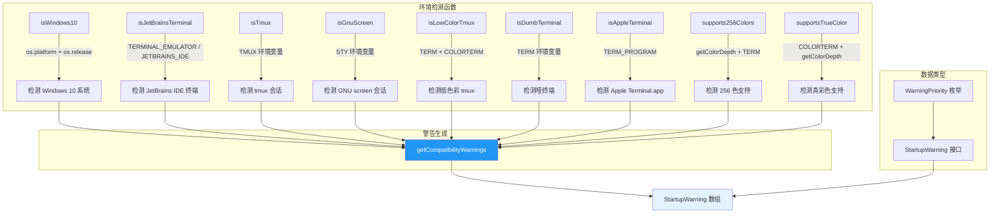

# compatibility.ts

## 概述

`compatibility.ts` 是一个终端环境兼容性检测模块，负责识别当前运行环境的操作系统类型、终端模拟器种类以及颜色支持能力。它提供了一系列布尔检测函数，并基于这些检测结果生成一组结构化的兼容性警告（`StartupWarning`），用于在应用启动时向用户提示潜在的兼容性问题和优化建议。

该模块是 Gemini CLI 用户体验保障的关键组件，确保在各种终端环境下都能给出合理的提示信息。

## 架构图（Mermaid）



## 核心组件

### 1. 操作系统检测

#### `isWindows10(): boolean`

检测当前操作系统是否为 Windows 10。

- **检测逻辑**：
  1. 先通过 `os.platform()` 判断是否为 `'win32'` 平台。
  2. 通过 `os.release()` 获取系统版本号（格式如 `10.0.19045`）。
  3. 将版本号按 `.` 分割，检查主版本号为 `10`、次版本号为 `0`。
  4. 关键区分：Windows 11 也报告为 `10.0.x`，但其构建号 >= 22000。因此通过 `build < 22000` 来区分 Windows 10 和 Windows 11。
- **返回**：仅在 Windows 10（构建号 < 22000）时返回 `true`。

### 2. 终端模拟器检测

#### `isJetBrainsTerminal(): boolean`

检测当前终端是否为 JetBrains IDE（如 IntelliJ IDEA、WebStorm 等）的内置终端。

- **检测依据**：
  - 环境变量 `TERMINAL_EMULATOR` 以 `'JetBrains'` 开头，或
  - 环境变量 `JETBRAINS_IDE` 存在。
- **使用双重检测的原因**：不同版本的 JetBrains IDE 设置的环境变量可能不同，双重检测提高了兼容性。

#### `isTmux(): boolean`

检测当前终端是否运行在 tmux 会话中。

- **检测依据**：环境变量 `TMUX` 是否存在（tmux 会自动设置该变量）。

#### `isGnuScreen(): boolean`

检测当前终端是否运行在 GNU screen 会话中。

- **检测依据**：环境变量 `STY`（screen tty name）是否存在。

#### `isDumbTerminal(): boolean`

检测当前终端是否为"哑终端"（功能极其有限的终端）。

- **检测依据**：环境变量 `TERM` 的值为 `'dumb'` 或 `'vt100'`。
- **说明**：`vt100` 虽然是历史上著名的终端类型，但其功能集在现代应用中被视为极其有限。

#### `isAppleTerminal(): boolean`

检测当前终端是否为 macOS 自带的 Terminal.app。

- **检测依据**：环境变量 `TERM_PROGRAM` 的值为 `'Apple_Terminal'`。
- **特殊用途**：Apple Terminal 不支持真彩色，但作为 macOS 默认终端非常常见，因此在真彩色警告中给予特殊豁免，避免对大量 macOS 用户产生不必要的警告。

### 3. 颜色能力检测

#### `isLowColorTmux(): boolean`

检测 tmux 是否运行在低色彩模式下。

- **检测逻辑**：同时满足以下三个条件时返回 `true`：
  1. 处于 tmux 会话中（`isTmux()` 为 `true`）。
  2. `TERM` 环境变量以 `'screen'` 开头（tmux 默认的 TERM 值）。
  3. `COLORTERM` 环境变量不存在（表示没有额外的颜色支持声明）。

#### `supports256Colors(): boolean`

检测终端是否支持 256 色（8 位色深）。

- **检测策略**（按优先级）：
  1. 优先通过 `process.stdout.getColorDepth()` API 检测，如果色深 >= 8 则支持。
  2. 回退检查 `TERM` 环境变量是否包含 `'256color'` 字符串。

#### `supportsTrueColor(): boolean`

检测终端是否支持真彩色（24 位色深）。

- **检测策略**（按优先级）：
  1. 优先检查 `COLORTERM` 环境变量是否为 `'truecolor'` 或 `'24bit'`。
  2. 回退通过 `process.stdout.getColorDepth()` API 检测，如果色深 >= 24 则支持。

### 4. 数据类型定义

#### `WarningPriority` 枚举

```typescript
enum WarningPriority {
  Low = 'low',
  High = 'high',
}
```

定义警告的优先级，分为低优先级和高优先级两个级别。

#### `StartupWarning` 接口

```typescript
interface StartupWarning {
  id: string;       // 警告的唯一标识符
  message: string;  // 面向用户的警告消息文本
  priority: WarningPriority; // 警告优先级
}
```

结构化的启动警告类型，包含唯一标识、消息内容和优先级。

### 5. 警告聚合函数

#### `getCompatibilityWarnings(options?): StartupWarning[]`

根据当前环境的检测结果，生成一组兼容性警告。

**参数**：
- `options?.isAlternateBuffer?: boolean` — 指示当前是否使用了备用屏幕缓冲区（alternate screen buffer）。某些警告仅在启用备用缓冲区时才相关。

**生成的警告列表**：

| 警告 ID | 触发条件 | 优先级 | 描述 |
|---------|---------|--------|------|
| `windows-10` | `isWindows10()` 为真 | High | Windows 10 环境下部分 UI 功能（如平滑滚动）可能降级 |
| `jetbrains-terminal` | `isJetBrainsTerminal()` 为真 且 `isAlternateBuffer` 为真 | High | JetBrains 终端的备用缓冲区模式可能导致滚轮问题和渲染异常 |
| `tmux-alternate-buffer` | `isTmux()` 为真 且 `isAlternateBuffer` 为真 | High | tmux 的备用缓冲区模式可能导致回滚丢失和闪烁 |
| `low-color-tmux` | `isLowColorTmux()` 为真 | High | tmux 色彩支持受限，并提供 tmux.conf 配置建议 |
| `gnu-screen` | `isGnuScreen()` 为真 | Low | GNU screen 下部分快捷键和视觉功能可能异常 |
| `dumb-terminal` | `isDumbTerminal()` 为真 | High | 基础终端下视觉渲染将受到严重限制 |
| `256-color` | `supports256Colors()` 为假 | High | 终端不支持 256 色 |
| `true-color` | `supports256Colors()` 为真 但 `supportsTrueColor()` 为假 且 不是 Apple Terminal | Low | 终端不支持真彩色 |

**颜色警告的层级逻辑**：
- 如果连 256 色都不支持，给出高优先级警告。
- 如果支持 256 色但不支持真彩色，给出低优先级警告（Apple Terminal 除外，因为它是 macOS 默认终端且不支持真彩色是已知限制）。

## 依赖关系

### 内部依赖

- 该模块的各检测函数之间存在内部调用关系：
  - `isLowColorTmux()` 内部调用了 `isTmux()`。
  - `getCompatibilityWarnings()` 调用了所有检测函数来生成警告列表。

### 外部依赖

| 依赖 | 类型 | 用途 |
|------|------|------|
| `node:os` | Node.js 内置模块 | 获取操作系统平台类型（`os.platform()`）和版本号（`os.release()`） |
| `process.env` | Node.js 全局对象 | 读取环境变量以检测终端类型和颜色能力 |
| `process.stdout.getColorDepth` | Node.js 全局对象方法 | 检测标准输出流的色深能力 |

## 关键实现细节

1. **Windows 10 vs Windows 11 的区分**：Windows 11 在 `os.release()` 中也报告为 `10.0.x` 格式，关键区分点在于构建号（build number）。Windows 11 的构建号从 22000 开始，因此通过 `build < 22000` 来精确区分两个系统版本。

2. **环境变量检测的防御性编程**：所有环境变量读取都使用了 `process.env['KEY']` 语法（而非 `process.env.KEY`），并通过 `||` 提供默认空字符串，或使用可选链 `?.` 来安全处理可能为 `undefined` 的情况。

3. **颜色检测的多策略回退**：颜色支持检测采用了多策略回退机制。首先尝试 Node.js 原生 API（`getColorDepth`），如果 API 不可用或不满足条件，则回退到环境变量检测。这提高了跨平台和跨 Node.js 版本的兼容性。

4. **Apple Terminal 的特殊豁免**：在真彩色警告中，Apple Terminal 被特殊豁免。因为 Apple Terminal 是 macOS 的默认终端，大量用户使用它但它不支持真彩色，对这些用户发出低优先级警告反而会造成不必要的困扰。

5. **备用屏幕缓冲区的条件警告**：JetBrains 终端和 tmux 的兼容性警告仅在 `isAlternateBuffer` 选项为 `true` 时触发。这是因为这些环境下的兼容性问题仅与备用屏幕缓冲区模式相关，如果未启用该模式则无需警告。

6. **警告消息的用户友好设计**：每条警告消息不仅说明了问题，还提供了具体的解决建议（如 tmux.conf 配置、设置入口路径等），降低了用户的排障成本。

7. **结构化警告设计**：使用 `id` 字段为每个警告分配唯一标识符，便于上层逻辑进行过滤、去重或持久化记录（例如"不再显示此警告"功能）。
