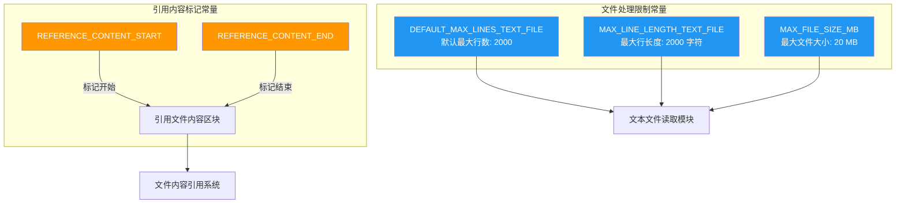

# constants.ts

## 概述

`constants.ts` 是一个集中管理常量定义的模块，存放了 Gemini CLI 核心包中与文件引用内容标记和文本文件处理限制相关的常量。这些常量为项目中的文件内容嵌入、文件读取和大小限制提供统一的配置值，避免了魔法数字和硬编码字符串散落在代码各处。

## 架构图（Mermaid）



## 核心组件

### 1. 引用内容标记常量

这一组常量用于在消息或提示文本中界定引用文件内容的边界，形成一个清晰的"内容区块"结构。

#### `REFERENCE_CONTENT_START`

```typescript
export const REFERENCE_CONTENT_START = '--- Content from referenced files ---';
```

- **类型**：`string`
- **值**：`'--- Content from referenced files ---'`
- **用途**：标记引用文件内容区块的起始位置。当系统需要将文件内容嵌入到对话上下文或提示词中时，使用此标记来明确标识引用内容的开始。
- **格式特征**：使用 `---` 作为视觉分隔符，使其在纯文本中也具有良好的可读性和辨识度。

#### `REFERENCE_CONTENT_END`

```typescript
export const REFERENCE_CONTENT_END = '--- End of content ---';
```

- **类型**：`string`
- **值**：`'--- End of content ---'`
- **用途**：标记引用文件内容区块的结束位置。与 `REFERENCE_CONTENT_START` 配对使用，共同界定引用内容的边界。
- **设计意图**：通过成对的起止标记，方便解析器或后续处理逻辑精确提取或跳过引用内容区域。

**配对使用示例**：
```
--- Content from referenced files ---
[此处为被引用文件的实际内容]
--- End of content ---
```

### 2. 文件处理限制常量

这一组常量定义了文本文件读取和处理时的各项上限，用于防止过大的文件内容耗尽内存或超出 API 的上下文窗口限制。

#### `DEFAULT_MAX_LINES_TEXT_FILE`

```typescript
export const DEFAULT_MAX_LINES_TEXT_FILE = 2000;
```

- **类型**：`number`
- **值**：`2000`
- **用途**：定义读取文本文件时的默认最大行数。当系统读取文件内容时，默认只读取前 2000 行，超出部分将被截断。
- **设计考量**：2000 行对于大多数源代码文件来说已经足够覆盖完整内容，同时避免了读取超大文件（如日志文件、数据文件）导致的性能问题。

#### `MAX_LINE_LENGTH_TEXT_FILE`

```typescript
export const MAX_LINE_LENGTH_TEXT_FILE = 2000;
```

- **类型**：`number`
- **值**：`2000`
- **用途**：定义文本文件中单行的最大字符长度。超过 2000 个字符的行将被截断。
- **设计考量**：某些文件（如压缩的 JSON、minified CSS/JS）可能包含极长的单行内容，此限制可防止这类内容占用过多的上下文空间。

#### `MAX_FILE_SIZE_MB`

```typescript
export const MAX_FILE_SIZE_MB = 20;
```

- **类型**：`number`
- **值**：`20`
- **用途**：定义允许处理的文件最大大小，单位为 MB。超过 20 MB 的文件将被拒绝处理。
- **设计考量**：20 MB 是一个合理的上限，足以涵盖绝大多数源代码文件和文档，同时避免处理二进制文件或超大数据文件。

## 依赖关系

### 内部依赖

- **无内部依赖**。该文件仅定义导出常量，不引用项目内其他模块。
- 但该文件**被项目内大量模块引用**，作为统一的常量来源。

### 外部依赖

- **无外部依赖**。该文件是纯常量定义，不引入任何第三方库或 Node.js 内置模块。

## 关键实现细节

1. **全部使用 `const` 声明**：所有常量都使用 `export const` 声明，确保值在运行时不可变，也便于 TypeScript 进行字面量类型推断。

2. **命名规范**：
   - 常量名称全部使用大写蛇形命名法（`UPPER_SNAKE_CASE`），这是 JavaScript/TypeScript 生态中常量命名的标准约定。
   - 名称具有自解释性，如 `DEFAULT_MAX_LINES_TEXT_FILE` 清晰地表达了"文本文件的默认最大行数"这一含义。

3. **数值常量的单位一致性**：
   - `DEFAULT_MAX_LINES_TEXT_FILE` 的单位是"行"。
   - `MAX_LINE_LENGTH_TEXT_FILE` 的单位是"字符"。
   - `MAX_FILE_SIZE_MB` 的单位在命名中明确标注为 `MB`，消除了歧义。

4. **行数与行长度的巧合一致**：`DEFAULT_MAX_LINES_TEXT_FILE` 和 `MAX_LINE_LENGTH_TEXT_FILE` 的值都是 2000，但它们控制的维度不同（一个是行数，一个是字符数），使用独立的常量使得未来可以独立调整。

5. **引用内容标记的对称设计**：起始标记和结束标记使用了一致的 `---` 前缀格式，风格类似 Markdown 的水平线（horizontal rule），在纯文本和 Markdown 环境中都具有良好的视觉辨识度。

6. **集中管理策略**：将常量集中定义在一个文件中，遵循了"单一事实来源"（Single Source of Truth）原则，当需要调整限制值时只需修改一处，所有引用该常量的模块都会自动获取新值。
