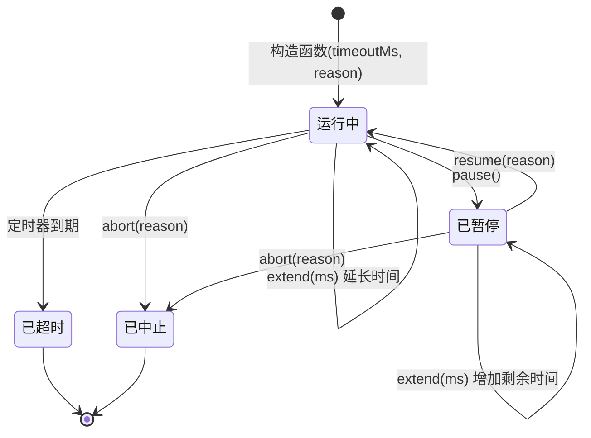
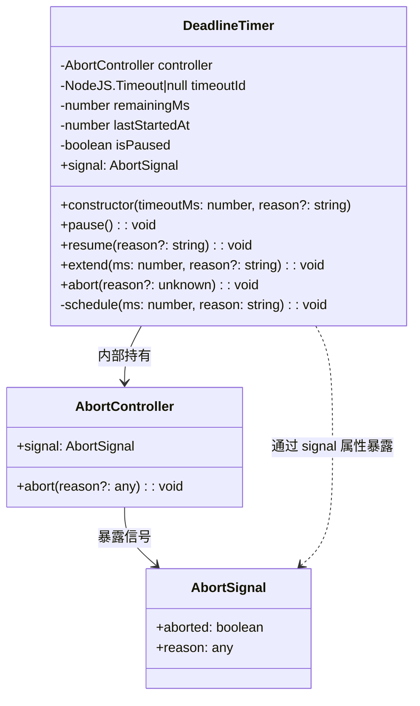

# deadlineTimer.ts

## 概述

`deadlineTimer.ts` 实现了一个功能丰富的截止时间定时器类 `DeadlineTimer`，它将 `setTimeout` 定时器与 `AbortController` 信号机制相结合，提供了可暂停、可恢复、可动态延长的超时管理能力。

在 Gemini CLI 中，该组件通常用于管理 API 请求、长时间运行的任务或用户交互的超时控制。通过 `AbortSignal`，它可以与任何支持信号中断的异步操作（如 `fetch` 请求、流式读取等）无缝集成。相比简单的 `setTimeout`，`DeadlineTimer` 提供了更灵活的生命周期控制，适用于需要根据运行时状态动态调整超时策略的场景。

## 架构图（Mermaid）





## 核心组件

### `DeadlineTimer` 类

一个管理超时和 AbortController 的工具类，支持暂停、恢复和动态延长超时时间。

#### 私有属性

| 属性 | 类型 | 说明 |
|------|------|------|
| `controller` | `AbortController` (readonly) | 内部的 AbortController 实例，用于在超时或手动中止时发出中止信号 |
| `timeoutId` | `NodeJS.Timeout \| null` | 当前活跃的定时器 ID。为 `null` 时表示没有活跃定时器（已暂停、已触发或已中止） |
| `remainingMs` | `number` | 剩余的超时毫秒数。在暂停时记录尚未消耗的时间预算 |
| `lastStartedAt` | `number` | 当前定时器阶段的启动时间戳（`Date.now()` 的返回值），用于计算已经过的时间 |
| `isPaused` | `boolean` | 标识定时器当前是否处于暂停状态，初始值为 `false` |

#### 构造函数

```typescript
constructor(timeoutMs: number, reason = 'Timeout exceeded.')
```

- **`timeoutMs`**：超时时间，单位为毫秒。
- **`reason`**：超时时的错误消息，默认为 `'Timeout exceeded.'`。
- **行为**：
  1. 创建一个新的 `AbortController` 实例。
  2. 将 `remainingMs` 初始化为 `timeoutMs`。
  3. 记录当前时间戳到 `lastStartedAt`。
  4. 调用 `schedule()` 启动定时器。

#### 公共属性

##### `signal: AbortSignal` (getter)

```typescript
get signal(): AbortSignal
```

暴露内部 `AbortController` 的 `AbortSignal`。外部消费者可以将此信号传递给支持中止的 API（如 `fetch`、`stream` 等），当定时器超时或被手动中止时，这些 API 会自动取消。

#### 公共方法

##### `pause(): void`

暂停定时器，保存剩余的时间预算。

**行为**：
1. **守卫条件**：如果已经暂停或信号已中止，直接返回（幂等操作）。
2. 清除当前活跃的 `setTimeout` 定时器。
3. 计算已经过的时间：`elapsed = Date.now() - lastStartedAt`。
4. 更新剩余时间：`remainingMs = Math.max(0, remainingMs - elapsed)`。使用 `Math.max(0, ...)` 防止由于定时器回调延迟（JavaScript 事件循环特性）导致的负值。
5. 设置 `isPaused = true`。

**典型场景**：用户正在进行交互操作（如编辑输入、查看帮助）时暂停超时计时，避免在用户活跃期间触发超时。

##### `resume(reason?: string): void`

恢复暂停的定时器，使用剩余的时间预算继续计时。

**参数**：
- `reason`：超时时的错误消息，默认为 `'Timeout exceeded.'`。

**行为**：
1. **守卫条件**：如果未暂停或信号已中止，直接返回。
2. 更新 `lastStartedAt` 为当前时间。
3. 使用 `remainingMs` 重新调度定时器。
4. 设置 `isPaused = false`。

##### `extend(ms: number, reason?: string): void`

动态延长超时时间预算。

**参数**：
- `ms`：要增加的毫秒数。
- `reason`：超时时的错误消息，默认为 `'Timeout exceeded.'`。

**行为**：
1. **守卫条件**：如果信号已中止，直接返回。
2. **暂停状态**：直接增加 `remainingMs`，不需要重新调度定时器。
3. **运行状态**：
   - 清除当前定时器。
   - 计算已经过的时间，更新剩余时间并加上新增的毫秒数。
   - 重置 `lastStartedAt` 为当前时间。
   - 用新的 `remainingMs` 重新调度定时器。

**典型场景**：当检测到任务仍在正常进行中（例如收到了新的流式数据块），动态延长超时以避免过早中断。

##### `abort(reason?: unknown): void`

立即中止定时器并触发中止信号。

**参数**：
- `reason`：可选的中止原因，将传递给 `AbortController.abort()`。

**行为**：
1. 清除所有挂起的定时器。
2. 设置 `isPaused = false`。
3. 调用 `controller.abort(reason)` 触发中止信号。

**注意**：该方法没有守卫条件检查 `signal.aborted`，即使信号已经中止也会执行清理操作。重复调用 `abort()` 是安全的，因为 `AbortController.abort()` 本身是幂等的。

#### 私有方法

##### `schedule(ms: number, reason: string): void`

内部辅助方法，负责设置实际的 `setTimeout` 定时器。

**行为**：
1. 使用 `setTimeout` 设置一个在 `ms` 毫秒后执行的回调。
2. 回调逻辑：
   - 将 `timeoutId` 设为 `null`（标记定时器已触发）。
   - 调用 `controller.abort(new Error(reason))` 触发中止信号，中止原因为一个 `Error` 对象。

**注意**：当定时器自然到期时，中止原因是 `new Error(reason)`（Error 对象），而手动调用 `abort()` 时，原因由调用方决定（可以是任何类型）。

## 依赖关系

### 内部依赖

- **无内部依赖**。该文件是完全独立的工具类，不引用项目内其他模块。

### 外部依赖

| 依赖 | 类型 | 用途 |
|------|------|------|
| `AbortController` / `AbortSignal` | Web API / Node.js 内置 | 提供可中止信号机制，用于与支持 `AbortSignal` 的异步操作集成 |
| `setTimeout` / `clearTimeout` | Node.js 全局函数 | 实际的定时器调度和取消 |
| `Date.now()` | JavaScript 内置方法 | 获取当前时间戳，用于计算已经过的时间 |
| `NodeJS.Timeout` | Node.js 类型定义 | `setTimeout` 返回值的类型标注 |

## 关键实现细节

1. **时间预算追踪机制**：该类的核心设计理念是"时间预算"（time budget）。`remainingMs` 始终记录着尚未消耗的超时时间。每次暂停时，通过 `Date.now() - lastStartedAt` 计算已消耗的时间并从预算中扣除。恢复时，使用剩余预算重新启动定时器。这种设计使得暂停/恢复操作可以多次进行而不丢失时间精度。

2. **防负值保护**：在 `pause()` 和 `extend()` 中使用 `Math.max(0, remainingMs - elapsed)` 防止剩余时间变为负值。在 JavaScript 的事件循环中，`setTimeout` 的回调可能会延迟执行，导致实际经过的时间超过设定的超时时间，此时 `elapsed > remainingMs` 会导致负值。

3. **状态守卫的一致性**：所有公共方法都在开头检查关键前置条件：
   - `pause()`：检查 `isPaused` 和 `signal.aborted`。
   - `resume()`：检查 `!isPaused` 和 `signal.aborted`。
   - `extend()`：检查 `signal.aborted`。
   - `abort()`：无守卫（总是执行），确保清理操作始终生效。

4. **`AbortController` 的不可重用性**：`controller` 被声明为 `readonly`，一旦 `abort()` 被调用，`AbortSignal` 将永久处于 `aborted` 状态。这意味着 `DeadlineTimer` 实例在中止后不能被"复活"——所有后续的 `pause()`、`resume()`、`extend()` 调用都会被守卫条件拦截，直接返回。如果需要新的超时控制，必须创建新的 `DeadlineTimer` 实例。

5. **超时中止 vs 手动中止的差异**：
   - 定时器自然到期时：`controller.abort(new Error(reason))` — 原因是一个 `Error` 实例。
   - 手动调用 `abort()` 时：`controller.abort(reason)` — 原因是调用方传入的任意值（默认为 `undefined`）。
   - 消费者可以通过 `signal.reason` 的类型来区分超时中止和手动中止。

6. **定时器清理的完备性**：在 `pause()`、`extend()`（运行状态）和 `abort()` 中都确保调用 `clearTimeout` 清除旧定时器，避免内存泄漏和重复触发。`schedule()` 中不会清除旧定时器，调用方负责在调用 `schedule()` 之前清理。

7. **暂停状态下 `extend()` 的优化**：当定时器处于暂停状态时，`extend()` 仅增加 `remainingMs`，不需要重新调度定时器（因为没有活跃的定时器需要清除和重建）。这是一个效率优化，减少了不必要的定时器操作。

8. **默认错误消息的统一性**：构造函数、`resume()` 和 `extend()` 都使用相同的默认错误消息 `'Timeout exceeded.'`，保持了超时提示的一致性。但每个方法都允许自定义消息，为不同阶段的超时提供具体的上下文信息。
