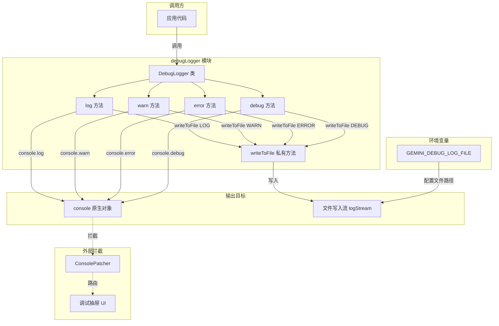

# debugLogger.ts

## 概述

`debugLogger.ts` 是 Gemini CLI 项目中一个集中式的调试日志工具模块。它提供了一个面向开发者的日志记录器，对原生 `console` 对象进行了轻量封装，使日志的意图更加明确（面向开发者而非最终用户），并提供了统一的调试日志行为控制点。

该模块的核心设计理念：
- **意图明确**：通过使用 `debugLogger` 替代直接的 `console.*` 调用，清晰表达日志是面向开发者的调试信息。
- **集中控制**：提供单一控制点管理调试日志行为。
- **可拦截**：`ConsolePatcher` 可以拦截这些调用并路由到调试抽屉 UI。
- **文件持久化**：支持通过环境变量将日志同时写入文件，便于离线分析。

## 架构图（Mermaid）



## 核心组件

### 1. `DebugLogger` 类

这是模块的核心类，封装了所有日志记录功能。

#### 属性

| 属性名 | 类型 | 可见性 | 说明 |
|--------|------|--------|------|
| `logStream` | `fs.WriteStream \| undefined` | `private` | 文件写入流，当环境变量 `GEMINI_DEBUG_LOG_FILE` 设置时创建 |

#### 构造函数 `constructor()`

```typescript
constructor() {
    this.logStream = process.env['GEMINI_DEBUG_LOG_FILE']
      ? fs.createWriteStream(process.env['GEMINI_DEBUG_LOG_FILE'], {
          flags: 'a',
        })
      : undefined;
    this.logStream?.on('error', (err) => {
      console.error('Error writing to debug log stream:', err);
    });
}
```

**行为说明**：
- 检查环境变量 `GEMINI_DEBUG_LOG_FILE` 是否已设置。
- 若设置，则以 **追加模式**（`flags: 'a'`）创建一个文件写入流。
- 为写入流注册 `error` 事件处理器，在流写入出错时通过 `console.error` 输出错误信息，但不会导致应用崩溃（容错设计）。

#### 私有方法 `writeToFile(level: string, args: unknown[])`

```typescript
private writeToFile(level: string, args: unknown[]) {
    if (this.logStream) {
      const message = util.format(...args);
      const timestamp = new Date().toISOString();
      const logEntry = `[${timestamp}] [${level}] ${message}\n`;
      this.logStream.write(logEntry);
    }
}
```

**行为说明**：
- 仅在 `logStream` 存在时执行写入。
- 使用 `util.format()` 将可变参数格式化为字符串（与 `console.log` 的格式化行为一致）。
- 生成 ISO 8601 格式的时间戳。
- 日志条目格式：`[时间戳] [级别] 消息内容\n`。
- 示例输出：`[2025-07-15T10:30:00.000Z] [LOG] 这是一条日志消息`。

#### 公开方法

| 方法名 | 日志级别 | 对应 console 方法 | 说明 |
|--------|---------|-------------------|------|
| `log(...args: unknown[])` | `LOG` | `console.log` | 通用日志输出 |
| `warn(...args: unknown[])` | `WARN` | `console.warn` | 警告级别日志 |
| `error(...args: unknown[])` | `ERROR` | `console.error` | 错误级别日志 |
| `debug(...args: unknown[])` | `DEBUG` | `console.debug` | 调试级别日志 |

每个公开方法的执行流程一致：
1. 调用 `writeToFile()` 将日志写入文件（如果文件流存在）。
2. 调用对应的 `console.*` 方法输出到标准输出/标准错误。

### 2. 导出的单例 `debugLogger`

```typescript
export const debugLogger = new DebugLogger();
```

模块导出一个 **单例实例**，整个应用共享同一个 `DebugLogger` 实例，确保：
- 所有日志统一路由。
- 文件写入流只创建一次。
- 全局一致的日志行为。

## 依赖关系

### 内部依赖

无内部依赖。`debugLogger.ts` 是一个基础工具模块，不依赖项目中的其他模块。

### 外部依赖

| 依赖 | 类型 | 说明 |
|------|------|------|
| `node:fs` | Node.js 内置模块 | 用于创建文件写入流 `fs.createWriteStream` |
| `node:util` | Node.js 内置模块 | 用于 `util.format()` 格式化日志消息 |

### 环境变量依赖

| 环境变量 | 必需 | 说明 |
|----------|------|------|
| `GEMINI_DEBUG_LOG_FILE` | 否 | 指定调试日志文件的路径。设置后，日志将同时写入该文件（追加模式）。未设置则仅输出到 console。 |

## 关键实现细节

1. **单例模式**：模块导出的是一个已实例化的对象 `debugLogger`，而非类本身。这确保全局只有一个日志实例，避免重复创建文件流。

2. **双通道输出**：每条日志同时输出到 console 和文件（如果配置了文件路径），确保开发者既能在终端实时看到日志，也能在文件中保留持久记录。

3. **追加模式写入**：文件流使用 `flags: 'a'`，即追加模式，不会覆盖已有的日志文件内容。这在多次启动应用时保留完整的日志历史。

4. **容错设计**：文件流的 `error` 事件被捕获并通过 `console.error` 输出，不会导致应用崩溃。这遵循了"日志系统不应影响主业务"的设计原则。

5. **ESLint 豁免**：文件顶部有 `/* eslint-disable no-console */` 注释，因为该模块是唯一被允许直接使用 `console.*` 的地方。项目中其他代码应通过 lint 规则强制使用 `debugLogger` 而非直接使用 `console`。

6. **与 ConsolePatcher 的协作**：文档注释提到 `ConsolePatcher` 会拦截 `console` 调用并路由到调试抽屉 UI。这意味着 `debugLogger` 的输出不仅出现在终端中，还可能被渲染到 CLI 的调试界面。

7. **日志格式标准化**：写入文件的日志遵循统一格式 `[ISO时间戳] [级别] 消息`，便于日后使用工具进行解析和过滤。

8. **util.format 格式化**：使用 `util.format()` 处理参数，支持 `%s`、`%d`、`%j` 等占位符格式化，与 `console.log` 的行为保持一致。
