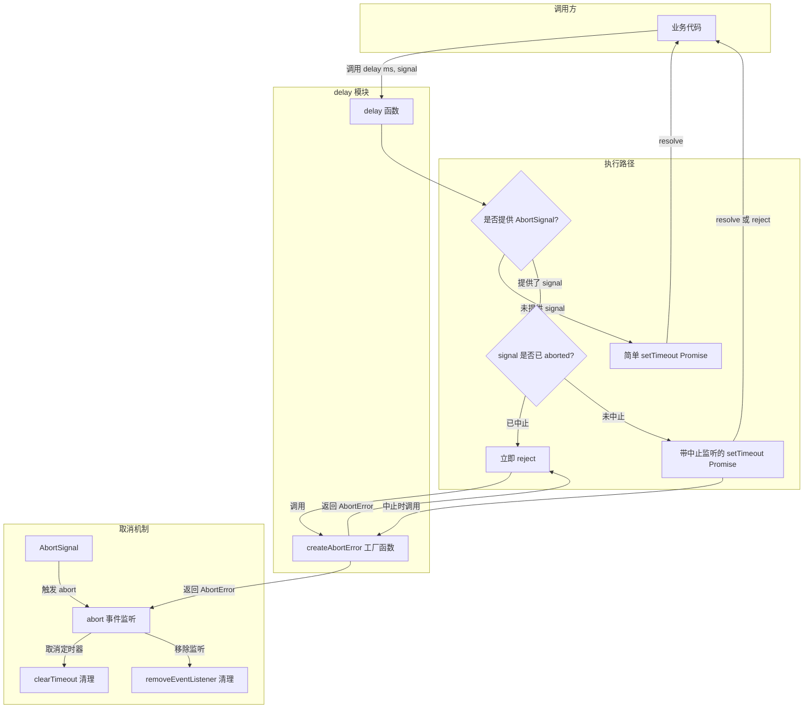
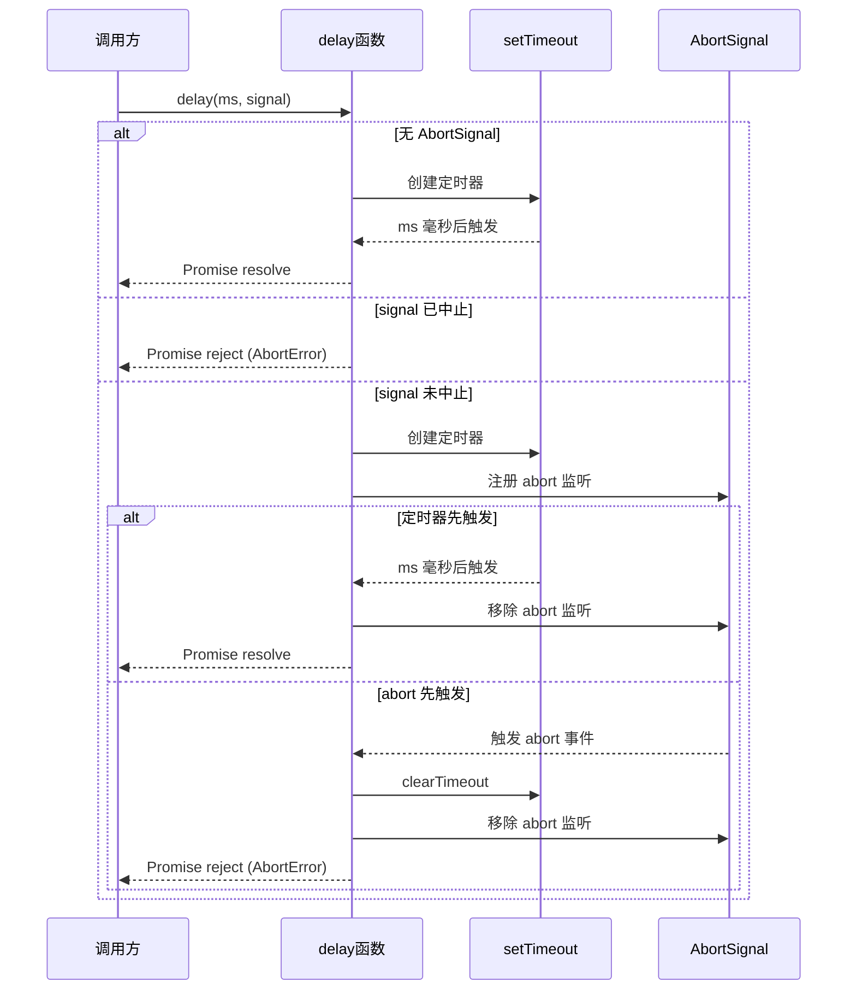

# delay.ts

## 概述

`delay.ts` 是一个轻量级的延迟/等待工具模块，提供了可中断的异步延迟功能。该模块导出两个函数：

- `delay()`：创建一个在指定毫秒后 resolve 的 Promise，支持通过 `AbortSignal` 提前取消。
- `createAbortError()`：创建标准化的中止错误对象的工厂函数。

这个模块常用于：
- API 请求之间的限流/退避等待。
- 可取消的定时操作。
- 需要超时控制的异步流程。

## 架构图（Mermaid）





## 核心组件

### 1. `createAbortError()` 函数

```typescript
export function createAbortError(): Error {
  const abortError = new Error('Aborted');
  abortError.name = 'AbortError';
  return abortError;
}
```

**功能**：标准化的中止错误工厂函数。

**返回值**：一个 `Error` 对象，其 `name` 属性被设置为 `'AbortError'`，`message` 为 `'Aborted'`。

**设计意图**：
- 提供统一的中止错误格式，方便调用方通过 `error.name === 'AbortError'` 来判断错误类型。
- 与 Web API 中 `AbortController` 的标准错误命名保持一致（浏览器 `fetch` 被中止时也会抛出 `name` 为 `'AbortError'` 的错误）。

### 2. `delay(ms, signal?)` 函数

```typescript
export function delay(ms: number, signal?: AbortSignal): Promise<void>
```

**参数**：

| 参数名 | 类型 | 必需 | 说明 |
|--------|------|------|------|
| `ms` | `number` | 是 | 延迟的毫秒数 |
| `signal` | `AbortSignal` | 否 | 用于提前取消延迟的中止信号 |

**返回值**：`Promise<void>` -- 在延迟完成后 resolve，或在被中止时 reject。

**三条执行路径**：

#### 路径一：无 AbortSignal（简单延迟）

```typescript
if (!signal) {
    return new Promise((resolve) => setTimeout(resolve, ms));
}
```

最简单的情况，直接用 `setTimeout` 包装为 Promise。不可取消。

#### 路径二：signal 已中止（立即拒绝）

```typescript
if (signal.aborted) {
    return Promise.reject(createAbortError());
}
```

如果传入的 `AbortSignal` 在调用 `delay` 时已经处于中止状态，则立即返回一个被拒绝的 Promise，不会创建任何定时器。这是一个重要的边界条件处理。

#### 路径三：带中止监听的延迟（完整功能）

```typescript
return new Promise((resolve, reject) => {
    const onAbort = () => {
      clearTimeout(timeoutId);
      signal.removeEventListener('abort', onAbort);
      reject(createAbortError());
    };

    const timeoutId = setTimeout(() => {
      signal.removeEventListener('abort', onAbort);
      resolve();
    }, ms);

    signal.addEventListener('abort', onAbort, { once: true });
});
```

这是最完整的执行路径，同时设置定时器和中止监听器，两者之间存在竞争关系：
- 如果定时器先触发：移除 abort 监听器，resolve Promise。
- 如果 abort 先触发：清除定时器，移除 abort 监听器，reject Promise。

## 依赖关系

### 内部依赖

无内部依赖。`delay.ts` 是一个完全独立的基础工具模块。

### 外部依赖

无外部第三方依赖。仅使用以下 JavaScript/Node.js 内置 API：

| API | 说明 |
|-----|------|
| `setTimeout` / `clearTimeout` | 全局定时器 API |
| `Promise` | ES6 Promise |
| `AbortSignal` | Web API，用于取消信号 |
| `Error` | JavaScript 内置错误对象 |

## 关键实现细节

1. **内存泄漏防护**：这是该模块最关键的设计考量。无论 Promise 以何种方式结束（正常 resolve 或被中止 reject），都会执行清理操作：
   - 定时器正常触发时：调用 `signal.removeEventListener('abort', onAbort)` 移除事件监听。
   - abort 触发时：调用 `clearTimeout(timeoutId)` 清除定时器，并调用 `signal.removeEventListener('abort', onAbort)` 移除自身监听。

   如果不做这些清理，长时间运行的应用中可能会积累大量未清理的事件监听器和定时器引用。

2. **`{ once: true }` 选项**：在 `addEventListener` 中使用了 `{ once: true }` 配置，这是一层额外的保险措施，确保 abort 回调最多只执行一次。虽然手动 `removeEventListener` 已经可以防止重复执行，但 `once` 提供了双重保障。

3. **已中止信号的快速路径**：在创建 Promise 之前先检查 `signal.aborted`，避免不必要的定时器和事件监听器创建。这是一种常见的优化和防御性编程实践。

4. **标准化的错误命名**：`AbortError` 遵循 Web API 的错误命名约定（与 `fetch` API 被中止时的错误一致），使得调用方可以用统一的方式处理中止错误：
   ```typescript
   try {
     await delay(5000, controller.signal);
   } catch (err) {
     if (err.name === 'AbortError') {
       // 被正常取消，不是真正的错误
     }
   }
   ```

5. **竞态安全**：定时器回调和 abort 回调之间的竞态条件被正确处理。由于 JavaScript 事件循环的单线程特性，不会出现两个回调同时执行的情况，因此不需要额外的锁机制。但每个回调在执行时都会先清理另一个，确保 Promise 只会被 resolve 或 reject 一次。

6. **工厂函数分离**：`createAbortError` 被导出为独立函数，而非 `delay` 的内部实现。这使得项目中其他需要创建标准 AbortError 的地方也能复用此工厂函数，保持错误格式的一致性。
