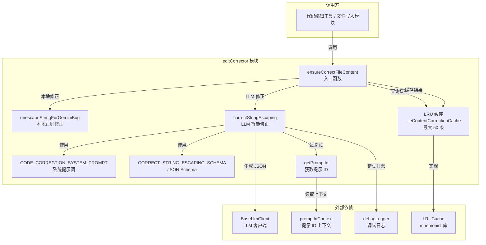
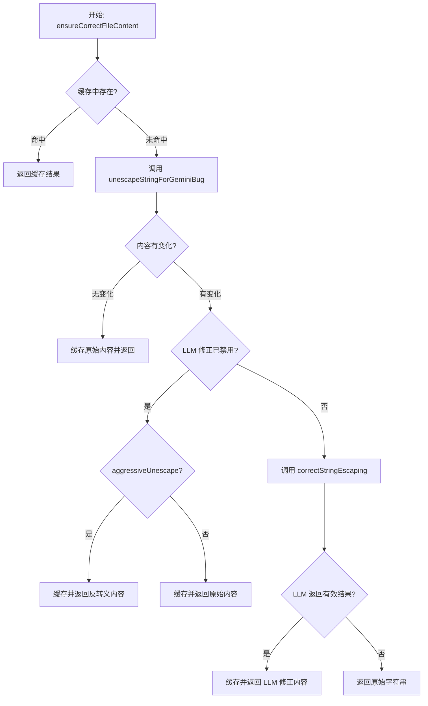

# editCorrector.ts

## 概述

`editCorrector.ts` 是一个专门用于修正 LLM（大语言模型）生成内容中转义错误的工具模块。在 Gemini CLI 的代码编辑流程中，LLM 生成的代码片段可能存在过度转义（over-escaping）的问题，例如将 `\n` 误写为 `\\n`，或将 `"Hello"` 误写为 `\"Hello\"`。本模块提供了两种修正策略：

1. **基于正则的本地修正**（`unescapeStringForGeminiBug`）：快速的纯本地字符串反转义处理，无需网络调用。
2. **基于 LLM 的智能修正**（`correctStringEscaping`）：调用另一个 LLM 来分析和修正转义错误，适用于更复杂的场景。

该模块还实现了 LRU 缓存机制，避免对相同内容进行重复的修正操作。

## 架构图（Mermaid）





## 核心组件

### 1. 常量定义

#### `CODE_CORRECTION_SYSTEM_PROMPT`

```typescript
const CODE_CORRECTION_SYSTEM_PROMPT = `
You are an expert code-editing assistant. Your task is to analyze a failed edit attempt and provide a corrected version of the text snippets.
The correction should be as minimal as possible, staying very close to the original.
Focus ONLY on fixing issues like whitespace, indentation, line endings, or incorrect escaping.
Do NOT invent a completely new edit. Your job is to fix the provided parameters to make the edit succeed.
Return ONLY the corrected snippet in the specified JSON format.
`.trim();
```

LLM 修正模式使用的系统指令。要求 LLM 扮演代码编辑专家，进行最小化的修正，仅关注空白、缩进、行尾和转义问题，不能发明全新的编辑内容。

#### `CORRECT_STRING_ESCAPING_SCHEMA`

```typescript
const CORRECT_STRING_ESCAPING_SCHEMA: Record<string, unknown> = {
  type: 'object',
  properties: {
    corrected_string_escaping: {
      type: 'string',
      description: '...',
    },
  },
  required: ['corrected_string_escaping'],
};
```

LLM 生成 JSON 时使用的 JSON Schema，要求返回包含 `corrected_string_escaping` 字段的对象。

#### `MAX_CACHE_SIZE`

```typescript
const MAX_CACHE_SIZE = 50;
```

LRU 缓存的最大容量，限制为 50 条记录。

### 2. `getPromptId()` 函数

```typescript
function getPromptId(): string {
  return promptIdContext.getStore() ?? `edit-corrector-${Date.now()}`;
}
```

获取当前上下文的 prompt ID，用于 LLM 请求的追踪和遥测。如果上下文中没有存储 ID，则生成一个基于时间戳的备用 ID。

### 3. `ensureCorrectFileContent()` 函数（核心入口）

```typescript
export async function ensureCorrectFileContent(
  content: string,
  baseLlmClient: BaseLlmClient,
  abortSignal: AbortSignal,
  disableLLMCorrection: boolean = true,
  aggressiveUnescape: boolean = false,
): Promise<string>
```

**参数**：

| 参数名 | 类型 | 默认值 | 说明 |
|--------|------|--------|------|
| `content` | `string` | - | 需要检查和修正的文件内容 |
| `baseLlmClient` | `BaseLlmClient` | - | LLM 客户端实例 |
| `abortSignal` | `AbortSignal` | - | 中止信号 |
| `disableLLMCorrection` | `boolean` | `true` | 是否禁用 LLM 修正（默认禁用） |
| `aggressiveUnescape` | `boolean` | `false` | 是否启用激进的反转义模式 |

**执行逻辑**：

1. **缓存查询**：先在 LRU 缓存中查找，命中则直接返回。
2. **本地反转义**：调用 `unescapeStringForGeminiBug(content)` 进行本地修正。
3. **无变化判断**：如果反转义后内容未变，说明不存在转义问题，缓存并返回原始内容。
4. **LLM 修正开关判断**：
   - 如果 `disableLLMCorrection = true`（默认）：
     - 若 `aggressiveUnescape = true`：直接返回本地反转义结果。
     - 否则：返回原始内容（保守策略，不做修改）。
   - 如果 `disableLLMCorrection = false`：调用 `correctStringEscaping()` 进行 LLM 智能修正。
5. **缓存结果**：无论走哪条路径，结果都会被缓存。

**注意**：默认配置 (`disableLLMCorrection=true, aggressiveUnescape=false`) 下，即使检测到转义问题也不会做任何修改，这是最保守的策略。

### 4. `correctStringEscaping()` 函数（LLM 修正）

```typescript
export async function correctStringEscaping(
  potentiallyProblematicString: string,
  baseLlmClient: BaseLlmClient,
  abortSignal: AbortSignal,
): Promise<string>
```

**功能**：通过调用 LLM 来修正可能存在转义问题的字符串。

**执行流程**：
1. 构造包含问题字符串的 prompt。
2. 使用 `baseLlmClient.generateJson()` 调用 LLM，配置模型为 `edit-corrector`，角色为 `UTILITY_EDIT_CORRECTOR`。
3. 验证 LLM 返回的 JSON 中 `corrected_string_escaping` 字段是否有效。
4. 有效则返回修正内容，无效则返回原始字符串。

**错误处理**：
- 如果错误是由 `abortSignal` 中止引起的，则直接抛出错误（不吞没中止错误）。
- 其他错误通过 `debugLogger.warn` 记录日志，并返回原始字符串（降级策略）。

### 5. `unescapeStringForGeminiBug()` 函数（本地正则修正）

```typescript
export function unescapeStringForGeminiBug(inputString: string): string
```

**功能**：通过正则表达式修正 Gemini 模型生成内容中的过度转义问题。

**正则表达式**：`/\\+(n|t|r|'|"|`|\\|\n)/g`

该正则匹配一个或多个反斜杠后跟特定字符的序列，然后根据捕获的字符进行替换：

| 匹配模式 | 捕获字符 | 替换结果 | 说明 |
|----------|----------|----------|------|
| `\\+n` | `n` | `\n` | 换行符 |
| `\\+t` | `t` | `\t` | 制表符 |
| `\\+r` | `r` | `\r` | 回车符 |
| `\\+'` | `'` | `'` | 单引号 |
| `\\+"` | `"` | `"` | 双引号 |
| `` \\+` `` | `` ` `` | `` ` `` | 反引号 |
| `\\+\\` | `\` | `\` | 反斜杠 |
| `\\+\n` | 实际换行 | `\n` | 反斜杠加实际换行 |

### 6. `resetEditCorrectorCaches_TEST_ONLY()` 函数

```typescript
export function resetEditCorrectorCaches_TEST_ONLY() {
  fileContentCorrectionCache.clear();
}
```

仅用于测试的辅助函数，清空 LRU 缓存。函数名后缀 `_TEST_ONLY` 明确表示其用途。

## 依赖关系

### 内部依赖

| 模块 | 导入内容 | 说明 |
|------|----------|------|
| `@google/genai` | `Content` 类型 | Gemini API 的内容类型定义 |
| `../core/baseLlmClient.js` | `BaseLlmClient` 类型 | LLM 客户端基类接口 |
| `./promptIdContext.js` | `promptIdContext` | 提示 ID 的 AsyncLocalStorage 上下文 |
| `./debugLogger.js` | `debugLogger` | 调试日志工具 |
| `../telemetry/types.js` | `LlmRole` | LLM 角色枚举（遥测用） |

### 外部依赖

| 依赖 | 类型 | 说明 |
|------|------|------|
| `mnemonist` | npm 第三方库 | 提供高性能的 `LRUCache` 数据结构 |
| `@google/genai` | npm 第三方库 | Google Generative AI SDK，提供 `Content` 类型 |

## 关键实现细节

1. **双层修正策略**：模块实现了本地正则修正和 LLM 智能修正两层策略。默认情况下 LLM 修正被禁用（`disableLLMCorrection=true`），这可能是出于性能和成本考虑。本地正则修正速度快但可能不够准确，LLM 修正更智能但需要额外的 API 调用。

2. **LRU 缓存优化**：使用 `mnemonist` 库的 `LRUCache` 实现缓存，最大容量 50 条。缓存以原始内容为 key、修正后内容为 value。这避免了对相同内容的重复处理，特别是在编辑操作频繁时能显著减少 LLM 调用。

3. **保守的默认策略**：默认参数组合 (`disableLLMCorrection=true, aggressiveUnescape=false`) 意味着即使检测到转义问题也不做修改。这体现了"首先不造成伤害"的原则 -- 错误的修正可能比不修正更具破坏性。

4. **Gemini Bug 命名**：函数名 `unescapeStringForGeminiBug` 直接指明这是针对 Gemini 模型的已知 bug 的解决方案。Gemini 模型在生成代码时有时会对字符串进行过度转义。

5. **正则中的 `\\+` 模式**：正则使用 `\\+` 匹配一个或多个反斜杠，这意味着无论过度转义了多少层（`\\n`、`\\\\n` 等），都会被修正为正确的单层转义。

6. **优雅降级**：LLM 调用失败时不会导致编辑操作失败，而是返回原始字符串并记录警告日志。中止信号被正确传播，不会被吞没。

7. **JSON Schema 约束**：使用 JSON Schema 约束 LLM 的输出格式，确保返回结构化的 JSON 而非自由文本，提高了解析的可靠性。

8. **角色追踪**：LLM 调用使用 `LlmRole.UTILITY_EDIT_CORRECTOR` 角色标识，便于遥测系统区分和追踪不同类型的 LLM 调用用途和开销。
