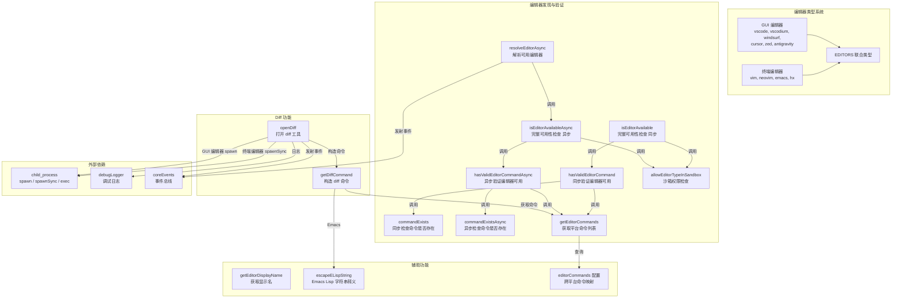
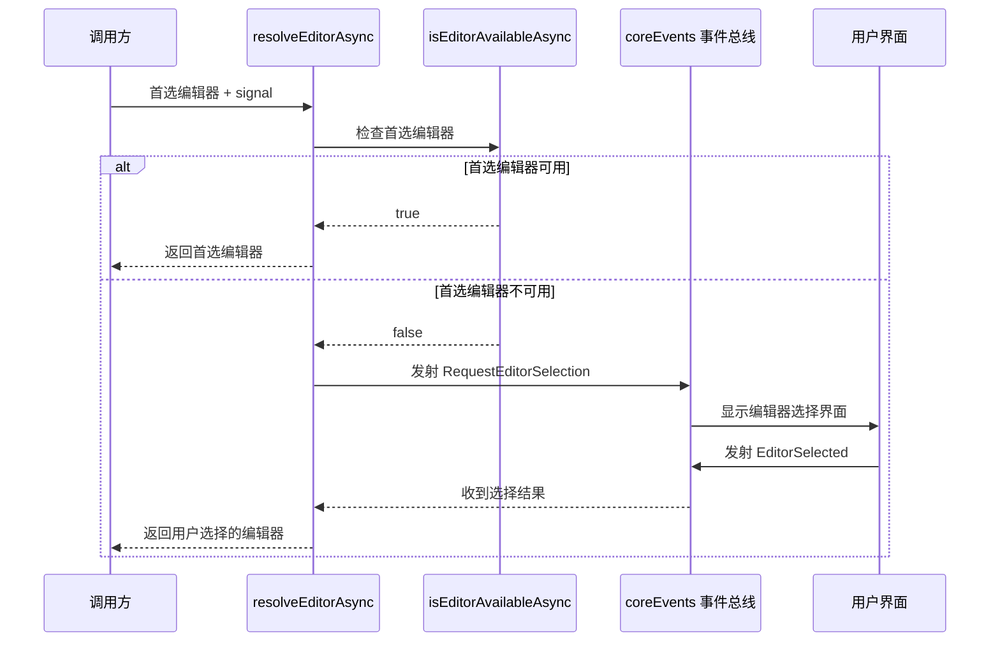
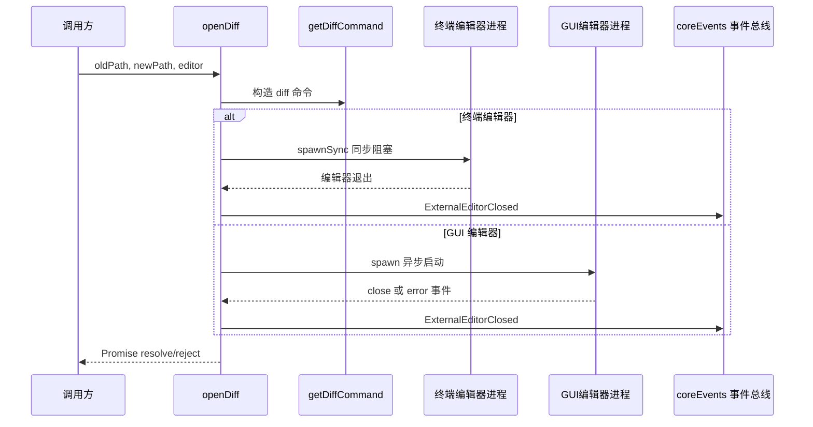

# editor.ts

## 概述

`editor.ts` 是 Gemini CLI 的外部编辑器集成模块，负责管理和调用外部代码编辑器来执行文件 diff 比较操作。该模块支持两大类编辑器：

- **GUI 编辑器**：VS Code、VSCodium、Windsurf、Cursor、Zed、Antigravity
- **终端编辑器**：Vim、Neovim、Emacs、Helix (hx)

模块提供了编辑器的发现、验证、命令解析和 diff 工具打开等完整功能链，并处理了跨平台（Windows/Unix）的差异以及沙箱环境下的编辑器限制。

## 架构图（Mermaid）







## 核心组件

### 1. 编辑器类型定义与常量

#### 编辑器分类

```typescript
const GUI_EDITORS = ['vscode', 'vscodium', 'windsurf', 'cursor', 'zed', 'antigravity'] as const;
const TERMINAL_EDITORS = ['vim', 'neovim', 'emacs', 'hx'] as const;
const EDITORS = [...GUI_EDITORS, ...TERMINAL_EDITORS] as const;
```

使用 `as const` 断言创建字面量元组类型，然后通过 `Set` 构造查找集合用于高效类型检查：

```typescript
const GUI_EDITORS_SET = new Set<string>(GUI_EDITORS);
const TERMINAL_EDITORS_SET = new Set<string>(TERMINAL_EDITORS);
const EDITORS_SET = new Set<string>(EDITORS);
```

#### 类型导出

| 类型名 | 说明 |
|--------|------|
| `GuiEditorType` | GUI 编辑器字面量联合类型 |
| `TerminalEditorType` | 终端编辑器字面量联合类型 |
| `EditorType` | 所有编辑器的字面量联合类型 |

#### 编辑器显示名映射

```typescript
export const EDITOR_DISPLAY_NAMES: Record<EditorType, string> = {
  vscode: 'VS Code',
  vscodium: 'VSCodium',
  windsurf: 'Windsurf',
  cursor: 'Cursor',
  vim: 'Vim',
  neovim: 'Neovim',
  zed: 'Zed',
  emacs: 'Emacs',
  antigravity: 'Antigravity',
  hx: 'Helix',
};
```

### 2. 类型守卫函数

| 函数 | 签名 | 说明 |
|------|------|------|
| `isGuiEditor()` | `(editor: EditorType) => editor is GuiEditorType` | 判断是否为 GUI 编辑器 |
| `isTerminalEditor()` | `(editor: EditorType) => editor is TerminalEditorType` | 判断是否为终端编辑器 |
| `isValidEditorType()` | `(editor: string) => editor is EditorType` | 判断字符串是否为有效编辑器类型 |

### 3. 命令发现系统

#### 跨平台命令配置 `editorCommands`

```typescript
const editorCommands: Record<EditorType, { win32: string[]; default: string[] }>
```

每个编辑器在不同平台下有不同的命令名。例如：
- VS Code：Windows 上为 `code.cmd`，其他平台为 `code`
- Zed：其他平台有 `zed` 和 `zeditor` 两个候选命令
- Antigravity：有 `agy` 短命令和 `antigravity` 长命令

#### `commandExists(cmd)` / `commandExistsAsync(cmd)`

```typescript
function commandExists(cmd: string): boolean
async function commandExistsAsync(cmd: string): Promise<boolean>
```

通过执行系统命令检测指定命令是否存在：
- Windows：使用 `where.exe cmd`
- Unix/macOS：使用 `command -v cmd`

#### `getEditorCommand(editor)`

```typescript
export function getEditorCommand(editor: EditorType): string
```

在候选命令列表中查找第一个存在的命令。如果都不存在，返回列表中的最后一个作为回退。

#### `hasValidEditorCommandAsync(editor)`

```typescript
export async function hasValidEditorCommandAsync(editor: EditorType): Promise<boolean>
```

使用 `Promise.any` 并行检查所有候选命令，只要任一命令存在即返回 `true`。这比串行检查更高效。

### 4. 编辑器可用性验证

#### `allowEditorTypeInSandbox(editor)`

```typescript
export function allowEditorTypeInSandbox(editor: EditorType): boolean
```

沙箱环境策略：
- **GUI 编辑器**：在沙箱中**不允许**使用（因为 GUI 编辑器可能访问沙箱外的文件系统）。
- **终端编辑器**：在沙箱中**允许**使用。

通过检查 `process.env['SANDBOX']` 环境变量判断是否在沙箱中运行。

#### `isEditorAvailable(editor)` / `isEditorAvailableAsync(editor)`

完整的编辑器可用性检查，包含三个条件：
1. 编辑器类型有效。
2. 沙箱中允许使用。
3. 对应的命令在系统中存在。

### 5. 编辑器解析 `resolveEditorAsync()`

```typescript
export async function resolveEditorAsync(
  preferredEditor: EditorType | undefined,
  signal?: AbortSignal,
): Promise<EditorType | undefined>
```

**解析逻辑**：
1. 如果提供了首选编辑器且可用，直接返回。
2. 否则，通过事件系统请求用户选择编辑器：
   - 发射 `CoreEvent.RequestEditorSelection` 事件通知 UI 层。
   - 等待 `CoreEvent.EditorSelected` 事件获取用户选择。
   - 支持通过 `AbortSignal` 取消等待。

### 6. Diff 命令系统

#### `getDiffCommand(oldPath, newPath, editor)`

```typescript
export function getDiffCommand(oldPath: string, newPath: string, editor: EditorType): DiffCommand | null
```

返回值接口：
```typescript
interface DiffCommand {
  command: string;
  args: string[];
}
```

各编辑器的 diff 命令配置：

| 编辑器 | 命令参数 | 特点 |
|--------|----------|------|
| VS Code / VSCodium / Windsurf / Cursor / Zed / Antigravity | `--wait --diff oldPath newPath` | `--wait` 阻塞直到编辑器关闭 |
| Vim / Neovim | `-d -i NONE` + 多个 `-c` 配置 | 完整的 diff 模式配置：颜色、状态栏、只读设置、自动退出 |
| Emacs | `--eval (ediff ...)` | 使用 ELisp 表达式调用 ediff |
| Helix | `--vsplit -- oldPath newPath` | 垂直分屏模式 |

**Vim/Neovim 的详细配置**：
- `-i NONE`：跳过 viminfo 文件，避免 E138 错误。
- 左窗口设为只读（旧文件），右窗口可编辑（新文件）。
- 自定义 diff 高亮颜色（绿色/蓝色/红色）。
- 状态栏显示操作提示。
- `autocmd BufWritePost * wqa`：保存后自动退出所有窗口。

#### `openDiff(oldPath, newPath, editor)`

```typescript
export async function openDiff(oldPath: string, newPath: string, editor: EditorType): Promise<void>
```

**终端编辑器**：使用 `spawnSync` 同步阻塞，`stdio: 'inherit'` 继承标准输入输出，让用户直接在当前终端操作编辑器。

**GUI 编辑器**：使用 `spawn` 异步启动，返回 Promise。Windows 上需要 `shell: true` 来正确执行 `.cmd` 文件。

**事件通知**：无论编辑器以何种方式关闭（正常退出、错误、非零退出码），都会发射 `CoreEvent.ExternalEditorClosed` 事件。

**防重复结算**：使用 `isSettled` 标志防止 `close` 和 `error` 事件同时触发导致 Promise 被结算两次和事件被发射两次。

### 7. 辅助函数

#### `escapeELispString(str)`

```typescript
function escapeELispString(str: string): string
```

为 Emacs Lisp 字符串字面量进行转义，处理反斜杠和双引号，并用双引号包裹。用于构造 `ediff` 命令的路径参数。

#### `getEditorDisplayName(editor)`

```typescript
export function getEditorDisplayName(editor: EditorType): string
```

返回编辑器的用户友好显示名称。

## 依赖关系

### 内部依赖

| 模块 | 导入内容 | 说明 |
|------|----------|------|
| `./debugLogger.js` | `debugLogger` | 调试日志输出 |
| `./events.js` | `coreEvents`, `CoreEvent`, `EditorSelectedPayload` | 事件总线和事件类型，用于编辑器选择的异步通信 |

### 外部依赖

| 依赖 | 类型 | 说明 |
|------|------|------|
| `node:child_process` | Node.js 内置模块 | `exec`、`execSync`、`spawn`、`spawnSync` -- 进程创建和管理 |
| `node:util` | Node.js 内置模块 | `promisify` -- 将 callback 风格的 `exec` 转为 Promise |
| `node:events` | Node.js 内置模块 | `once` -- 单次事件监听的 Promise 封装 |

### 环境变量依赖

| 环境变量 | 说明 |
|----------|------|
| `SANDBOX` | 沙箱模式标识。设置后，GUI 编辑器将被禁止使用 |

## 关键实现细节

1. **双模式编辑器处理**：终端编辑器和 GUI 编辑器有本质不同的进程管理方式。终端编辑器使用 `spawnSync` 同步阻塞（因为它们占据终端），GUI 编辑器使用 `spawn` 异步启动（因为它们在独立窗口运行）。

2. **`Promise.any` 优化**：`hasValidEditorCommandAsync` 使用 `Promise.any` 并行检查所有候选命令。只要任一命令存在就立即返回 `true`，比串行检查所有命令更快。

3. **事件驱动的编辑器选择**：`resolveEditorAsync` 通过事件总线与 UI 层解耦。核心模块不直接依赖任何 UI 框架，而是通过发射事件请求用户输入，这遵循了关注点分离原则。

4. **防重复结算保护**：`openDiff` 中的 GUI 编辑器路径使用 `isSettled` 标志位来防止 `close` 和 `error` 事件同时触发。这是处理 Node.js `child_process` 的常见防御措施，因为在某些错误场景下两个事件可能都会被触发。

5. **Vim/Neovim diff 的精心配置**：模块为 Vim/Neovim 提供了非常详细的 diff 配置，包括：自定义颜色方案、状态栏提示、左只读/右可编辑的分屏布局、保存后自动退出。这为不熟悉 Vim diff 模式的用户提供了良好的开箱即用体验。

6. **GUI 编辑器非零退出码的宽容处理**：GUI 编辑器（如 VS Code）在正常情况下也可能返回非零退出码（如窗口在加载时被关闭）。模块对此仅记录警告而非抛出错误，避免因编辑器的正常行为导致 CLI 崩溃。

7. **Windows 兼容性**：
   - 命令检测使用 `where.exe`（Windows）vs `command -v`（Unix）。
   - 编辑器命令配置区分 `win32` 和 `default` 平台。
   - GUI 编辑器在 Windows 上使用 `shell: true` 以正确执行 `.cmd` 文件。

8. **沙箱安全策略**：GUI 编辑器在沙箱中被禁用，因为它们可能绕过沙箱限制访问外部文件系统。终端编辑器在沙箱中被允许，因为它们继承了当前进程的文件系统约束。

9. **回退命令策略**：`getEditorCommand` 在找不到任何已安装命令时，返回候选列表的最后一项作为回退。这允许系统给出有意义的错误信息（"找不到 xxx 命令"），而非返回 undefined。
