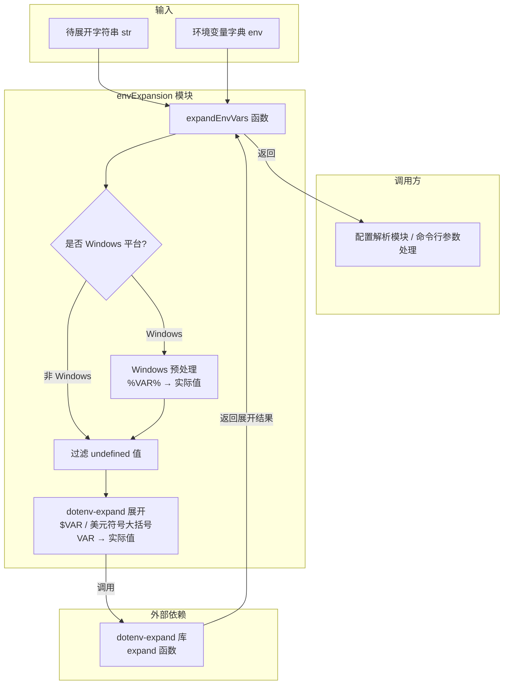
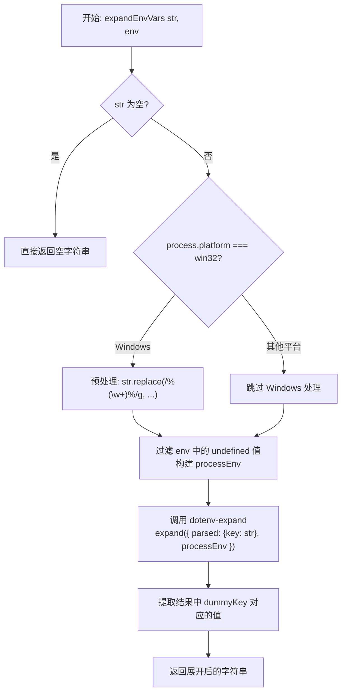

# envExpansion.ts

## 概述

`envExpansion.ts` 是一个环境变量展开工具模块，用于将字符串中的环境变量占位符替换为实际值。该模块基于 `dotenv-expand` 库实现，支持以下环境变量语法：

- **POSIX/Bash 语法**：`$VAR`、`${VAR}` -- 由 `dotenv-expand` 原生支持。
- **Windows 语法**：`%VAR%` -- 仅在 Windows 平台上通过预处理正则支持。

模块的核心设计理念是与生态系统中其他使用 `dotenv-expand` 的工具保持一致的展开行为，同时兼顾跨平台兼容性。

## 架构图（Mermaid）





## 核心组件

### 1. `expandEnvVars()` 函数

```typescript
export function expandEnvVars(
  str: string,
  env: Record<string, string | undefined>,
): string
```

**参数**：

| 参数名 | 类型 | 说明 |
|--------|------|------|
| `str` | `string` | 包含环境变量占位符的待展开字符串 |
| `env` | `Record<string, string \| undefined>` | 环境变量名到值的映射字典 |

**返回值**：`string` -- 环境变量被替换为实际值后的字符串。未找到的变量被替换为空字符串。

#### 处理步骤详解

##### 步骤 1：空值快速返回

```typescript
if (!str) return str;
```

如果输入字符串为空（`''`、`null`、`undefined`），直接返回，避免不必要的处理。

##### 步骤 2：Windows 风格变量预处理

```typescript
const isWindows = process.platform === 'win32';
const processedStr = isWindows
  ? str.replace(/%(\w+)%/g, (_, name) => env[name] ?? '')
  : str;
```

**仅在 Windows 平台**执行此步骤。原因是：
- `dotenv-expand` 原生不支持 `%VAR%` 语法。
- 在非 Windows 系统中，`%` 字符可能是字面量（如 URL 编码 `%20`、Shell 命令中的 `%`），盲目替换会导致误伤。

正则 `/%(\w+)%/g` 的解析：
- `%` -- 匹配字面量百分号。
- `(\w+)` -- 捕获组，匹配一个或多个单词字符（变量名）。
- `%` -- 匹配结尾百分号。
- `g` -- 全局替换。

未找到的变量通过 `?? ''` 替换为空字符串。

##### 步骤 3：过滤 undefined 值

```typescript
const processEnv: Record<string, string> = {};
for (const [key, value] of Object.entries(env)) {
  if (value !== undefined) {
    processEnv[key] = value;
  }
}
```

`dotenv-expand` 的 `processEnv` 要求 `Record<string, string>` 类型，而输入的 `env` 允许 `undefined` 值。此步骤过滤掉 `undefined`，构建一个干净的环境变量映射。

##### 步骤 4：使用 dotenv-expand 展开 POSIX 变量

```typescript
const dummyKey = '__GCLI_EXPAND_TARGET__';

const result: DotenvExpandOutput = expand({
  parsed: { [dummyKey]: processedStr },
  processEnv,
});

return result.parsed?.[dummyKey] ?? '';
```

**核心技巧**：`dotenv-expand` 设计为处理类似 `.env` 文件的键值对对象（`Record<string, string>`），而非单个字符串。为了展开单个字符串，模块将其包装在一个临时对象中：

- `parsed` -- 待展开的键值对，使用虚拟键 `__GCLI_EXPAND_TARGET__` 包装目标字符串。
- `processEnv` -- 提供环境变量的值。

`expand()` 函数会遍历 `parsed` 中的所有值，将其中的 `$VAR` 和 `${VAR}` 替换为 `processEnv` 中对应的值。

最后从结果中提取虚拟键对应的展开值。如果提取失败则返回空字符串。

## 依赖关系

### 内部依赖

无内部依赖。`envExpansion.ts` 是一个独立的工具模块。

### 外部依赖

| 依赖 | 类型 | 导入内容 | 说明 |
|------|------|----------|------|
| `dotenv-expand` | npm 第三方库 | `expand` 函数, `DotenvExpandOutput` 类型 | 环境变量展开引擎，是 `dotenv` 生态系统的标准展开库 |

## 关键实现细节

1. **巧妙的 dotenv-expand 适配**：`dotenv-expand` 的 API 设计为处理整个 `.env` 文件（键值对集合），不直接支持展开单个字符串。模块通过引入临时键 `__GCLI_EXPAND_TARGET__` 将单字符串展开需求适配到库的 API 接口。这个键名使用了长前缀 `__GCLI_` 避免与实际环境变量冲突。

2. **平台感知的 Windows 预处理**：Windows `%VAR%` 语法的处理被严格限制在 `process.platform === 'win32'` 条件下。注释明确解释了原因：在非 Windows 系统中 `%` 可能是字面量字符（如 URL 中的百分号编码），盲目替换会造成副作用。这种"限制爆炸半径"的设计思路值得学习。

3. **undefined 值的安全过滤**：`process.env` 中的值类型为 `string | undefined`，但 `dotenv-expand` 要求纯 `string`。模块通过显式过滤构建了一个类型安全的 `processEnv` 对象，而非使用类型断言强制转换。

4. **缺失变量处理**：
   - Windows 预处理阶段：缺失变量通过 `?? ''` 替换为空字符串。
   - POSIX 展开阶段：`dotenv-expand` 的默认行为也是将未定义的变量替换为空字符串。
   两个阶段保持一致的缺失值处理策略。

5. **展开顺序的重要性**：Windows 预处理在 `dotenv-expand` 之前执行。这意味着如果一个 Windows 变量的值中包含 POSIX 变量引用（如 `%PATH%` 展开后包含 `$HOME`），第二阶段的 `dotenv-expand` 仍然会处理它。这提供了嵌套展开的能力。

6. **不修改原始环境**：函数接收一个 `env` 参数而非直接读取 `process.env`。这使得函数：
   - 可测试性更好（可以传入自定义的环境变量字典）。
   - 更安全（不会意外读取或修改全局环境变量）。
   - 更灵活（调用方可以控制哪些变量可用于展开）。

7. **空值保护**：函数开头的 `if (!str) return str` 不仅处理空字符串，还处理了 falsy 值（虽然类型标注为 `string`，但运行时可能接收到其他类型），体现了防御性编程。
