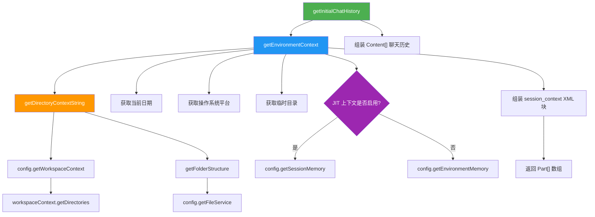

# environmentContext.ts

## 概述

`environmentContext.ts` 是 Gemini CLI 核心包中的环境上下文工具模块。该模块负责收集和组织当前运行环境的信息（如工作目录结构、日期、操作系统、临时目录、会话记忆等），并将这些信息格式化为 LLM 聊天会话的初始上下文内容。它是聊天初始化流程中的关键环节，确保模型在对话开始时就拥有充足的环境感知能力。

**文件路径**: `packages/core/src/utils/environmentContext.ts`

## 架构图（Mermaid）



## 核心组件

### 1. 常量 `INITIAL_HISTORY_LENGTH`

```typescript
export const INITIAL_HISTORY_LENGTH = 1;
```

定义初始聊天历史的长度为 1，表示初始聊天历史中包含 1 条消息（即环境上下文消息）。该常量可被外部模块引用，用于判断或跳过初始历史消息。

### 2. 函数 `getDirectoryContextString(config: Config): Promise<string>`

**功能**: 生成当前工作区目录结构的文本描述。

**执行流程**:
1. 通过 `config.getWorkspaceContext()` 获取工作区上下文对象。
2. 通过 `workspaceContext.getDirectories()` 获取所有工作区目录路径列表。
3. 对每个目录并行调用 `getFolderStructure(dir, { fileService })` 获取目录树结构字符串。
4. 将所有目录树结构用换行符拼接。
5. 返回格式化的 Markdown 字符串，包含：
   - **Workspace Directories**: 工作区目录列表
   - **Directory Structure**: 目录树结构

**返回值示例**:
```
- **Workspace Directories:**
  - /path/to/workspace1
  - /path/to/workspace2
- **Directory Structure:**

<目录树内容>
```

### 3. 函数 `getEnvironmentContext(config: Config): Promise<Part[]>`

**功能**: 收集环境相关信息并组装为 LLM 可理解的上下文内容。

**执行流程**:
1. **获取当前日期**: 使用 `Date.toLocaleDateString()` 按用户本地化设置格式化日期（包括星期、年、月、日）。
2. **获取操作系统**: 通过 `process.platform` 获取（如 `darwin`、`linux`、`win32`）。
3. **获取目录上下文**: 根据 `config.getIncludeDirectoryTree()` 判断是否包含目录树结构。若启用则调用 `getDirectoryContextString(config)`，否则为空字符串。
4. **获取临时目录**: 通过 `config.storage.getProjectTempDir()` 获取项目临时目录路径。
5. **获取环境记忆**: 实现了分层上下文模型（Tiered Context Model）：
   - **Tier 1（全局）**: 仅系统指令（system instruction）
   - **Tier 2（扩展+项目）**: 第一条用户消息（本函数负责）
   - **Tier 3（子目录）**: 工具输出（JIT 即时加载）
   - 当 JIT 上下文启用时，使用 `config.getSessionMemory()` 提供会话记忆。
   - 当 JIT 上下文未启用时，使用 `config.getEnvironmentMemory()` 提供项目记忆。
6. **组装 XML 标签包裹的上下文**: 将所有信息组合到 `<session_context>` XML 块中。
7. 返回包含单个文本 Part 的数组 `Part[]`。

**输出格式**:
```xml
<session_context>
This is the Gemini CLI. We are setting up the context for our chat.
Today's date is Friday, March 27, 2026 (formatted according to the user's locale).
My operating system is: darwin
The project's temporary directory is: /tmp/xxx
- **Workspace Directories:**
  ...
- **Directory Structure:**
  ...

<环境记忆内容>
</session_context>
```

### 4. 函数 `getInitialChatHistory(config: Config, extraHistory?: Content[]): Promise<Content[]>`

**功能**: 构建聊天会话的初始历史消息数组。

**执行流程**:
1. 调用 `getEnvironmentContext(config)` 获取环境上下文 Parts。
2. 将 Parts 中的文本内容用双换行符拼接为一个完整字符串。
3. 构造一条 `role: 'user'` 的消息，包含环境上下文文本。
4. 如果提供了 `extraHistory`，则追加到消息数组末尾。
5. 返回 `Content[]` 数组作为初始聊天历史。

**返回值结构**:
```typescript
[
  {
    role: 'user',
    parts: [{ text: '<环境上下文字符串>' }],
  },
  // ...extraHistory（可选）
]
```

## 依赖关系

### 内部依赖

| 依赖模块 | 导入内容 | 用途 |
|---------|---------|------|
| `../config/config.js` | `Config` (类型) | 运行时配置对象，提供工作区上下文、文件服务、存储、记忆等 |
| `./getFolderStructure.js` | `getFolderStructure` | 获取指定目录的文件夹结构树 |

### 外部依赖

| 依赖包 | 导入内容 | 用途 |
|-------|---------|------|
| `@google/genai` | `Part`, `Content` (类型) | Google GenAI SDK 的类型定义，用于构建聊天消息结构 |

## 关键实现细节

1. **分层上下文模型（Tiered Context Model）**: 该模块实现了参考 issue #11488 设计的三层上下文架构。Tier 2 层负责在首条用户消息中注入扩展和项目级别的上下文信息。JIT 模式和非 JIT 模式使用不同的记忆获取策略（`getSessionMemory` vs `getEnvironmentMemory`），这是上下文管理的核心设计决策。

2. **并行目录结构获取**: `getDirectoryContextString` 使用 `Promise.all` 对多个工作区目录并行获取文件夹结构，提高了多工作区场景下的性能。

3. **本地化日期格式**: 日期使用 `toLocaleDateString(undefined, ...)` 格式化，`undefined` 作为 locale 参数意味着使用运行环境的默认 locale，确保日期显示符合用户习惯。

4. **XML 标签包裹**: 环境上下文使用 `<session_context>` XML 标签包裹，这是 LLM prompt engineering 中常见的结构化输入模式，帮助模型识别上下文边界。

5. **可选目录树**: 通过 `config.getIncludeDirectoryTree()` 控制是否在上下文中包含目录树结构。对于大型项目，目录树可能会消耗大量 token，因此设计为可配置项。

6. **JIT 上下文的条件判断**: 使用可选链 `config.isJitContextEnabled?.()` 调用，说明该方法可能不存在于所有 Config 实现中，体现了良好的向后兼容设计。

7. **`INITIAL_HISTORY_LENGTH` 常量**: 虽然值为 1，但将其提取为常量便于外部模块引用和未来调整。在聊天流程中，其他模块可通过此常量判断哪些消息属于系统自动生成的初始上下文。
