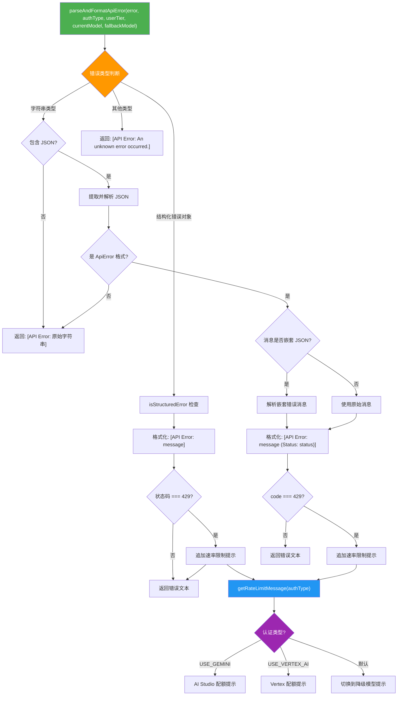

# errorParsing.ts

## 概述

`errorParsing.ts` 是 Gemini CLI 核心包中的 API 错误解析与格式化工具模块。该模块负责将各种形式的 API 错误（结构化错误对象、JSON 字符串错误、纯文本错误等）统一解析并格式化为用户可读的错误消息字符串。特别地，它对 HTTP 429 速率限制错误提供了特殊处理，根据不同的认证类型（Gemini、Vertex AI 或默认）给出针对性的提示信息。

**文件路径**: `packages/core/src/utils/errorParsing.ts`

## 架构图（Mermaid）



## 核心组件

### 1. 常量：速率限制错误消息

```typescript
const RATE_LIMIT_ERROR_MESSAGE_USE_GEMINI = '...';
const RATE_LIMIT_ERROR_MESSAGE_VERTEX = '...';
```

- **`RATE_LIMIT_ERROR_MESSAGE_USE_GEMINI`**: 针对 Gemini (AI Studio) 认证方式的 429 错误提示。建议用户等待后重试，或通过 AI Studio 申请配额提升，或切换认证方式。
- **`RATE_LIMIT_ERROR_MESSAGE_VERTEX`**: 针对 Vertex AI 认证方式的 429 错误提示。建议用户等待后重试，或通过 Vertex 申请配额提升，或切换认证方式。

### 2. 函数 `getRateLimitErrorMessageDefault(fallbackModel?: string): string`

**功能**: 生成默认的速率限制错误提示消息。

- 接受一个可选的 `fallbackModel` 参数（默认值为 `DEFAULT_GEMINI_FLASH_MODEL`）。
- 返回一条消息，告知用户检测到可能的配额限制或响应缓慢，系统将在当前会话中切换到指定的降级模型。

### 3. 函数 `getRateLimitMessage(authType?: AuthType, fallbackModel?: string): string`

**功能**: 根据认证类型返回对应的速率限制提示消息。

| 认证类型 | 返回消息 |
|---------|---------|
| `AuthType.USE_GEMINI` | AI Studio 配额提升提示 |
| `AuthType.USE_VERTEX_AI` | Vertex AI 配额提升提示 |
| 其他/未指定 | 自动切换降级模型提示 |

### 4. 函数 `parseAndFormatApiError(error, authType?, userTier?, currentModel?, fallbackModel?): string`

**功能**: 主函数，解析各种形式的 API 错误并格式化为统一的用户可读字符串。

**参数说明**:

| 参数 | 类型 | 说明 |
|-----|------|------|
| `error` | `unknown` | 待解析的错误对象，可以是任何类型 |
| `authType` | `AuthType` (可选) | 当前的认证类型 |
| `userTier` | `UserTierId` (可选) | 用户层级（当前未使用，预留参数） |
| `currentModel` | `string` (可选) | 当前使用的模型名称（当前未使用，预留参数） |
| `fallbackModel` | `string` (可选) | 降级回退模型名称 |

**处理逻辑**（按优先级排列）:

#### 路径 1：结构化错误对象
- 使用 `isStructuredError(error)` 类型守卫判断。
- 格式化为 `[API Error: <message>]`。
- 若 `error.status === 429`，追加速率限制提示。

#### 路径 2：字符串类型错误
- 查找字符串中第一个 `{` 的位置，尝试提取内嵌的 JSON 对象。
- 若无 JSON，直接返回 `[API Error: <原始字符串>]`。
- 若有 JSON：
  - 解析 JSON 并用 `isApiError()` 检查是否为标准 API 错误格式。
  - **嵌套 JSON 处理**: 尝试二次解析 `error.message` 字段，检查是否包含嵌套的 API 错误对象。若是，则提取最内层的错误消息。
  - 格式化为 `[API Error: <message> (Status: <status>)]`。
  - 若 `error.code === 429`，追加速率限制提示。
  - 若 JSON 解析失败，回退为 `[API Error: <原始字符串>]`。

#### 路径 3：其他类型
- 返回 `[API Error: An unknown error occurred.]`。

## 依赖关系

### 内部依赖

| 依赖模块 | 导入内容 | 用途 |
|---------|---------|------|
| `./quotaErrorDetection.js` | `isApiError`, `isStructuredError` | 类型守卫函数，判断错误是否为标准 API 错误格式或结构化错误 |
| `../config/models.js` | `DEFAULT_GEMINI_FLASH_MODEL` | 默认的 Gemini Flash 模型名称，用作降级回退模型 |
| `../code_assist/types.js` | `UserTierId` (类型) | 用户层级类型定义 |
| `../core/contentGenerator.js` | `AuthType` | 认证类型枚举，区分 Gemini、Vertex AI 等不同认证方式 |

### 外部依赖

无外部第三方依赖。

## 关键实现细节

1. **多层错误解析**: 该模块实现了一个鲁棒的多层错误解析策略。首先检查是否为结构化错误对象，然后尝试从字符串中提取 JSON，最后处理嵌套 JSON 的情况。这种设计能够应对 API 返回的各种不规范错误格式。

2. **嵌套 JSON 错误处理**: 一些 API 错误的 `message` 字段本身可能又是一个 JSON 字符串化的错误对象（嵌套错误）。模块通过二次 `JSON.parse` 和 `isApiError` 检查来处理这种情况，确保最终提取到最内层的有意义错误消息。

3. **渐进式降级（Graceful Degradation）**: 在默认认证模式下，429 错误不仅提示用户等待，还告知系统将自动切换到降级模型（如 Gemini Flash），保证用户在配额受限时仍能继续使用。

4. **预留参数设计**: `userTier` 和 `currentModel` 参数当前未被使用，但已作为函数签名的一部分预留。这表明未来可能会根据用户层级或当前模型提供差异化的错误提示。

5. **安全的 JSON 提取**: 从字符串中提取 JSON 时使用 `indexOf('{')` 定位起始位置，然后截取子串进行解析。这种方法可以处理 JSON 前缀有其他文本的情况（如 HTTP 响应头或错误前缀信息），但需注意只截取了从 `{` 到字符串末尾的部分，假设 JSON 位于字符串末尾。

6. **静默异常处理**: 所有 `JSON.parse` 调用都包裹在 `try-catch` 中，解析失败时静默忽略异常并回退到更简单的格式化逻辑，避免错误解析过程本身抛出异常。
